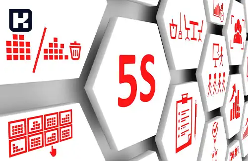

<blockquote class="faq-block">

  
آنچه در این مطلب خواهید خواند:

  <ul>
    <li>تعریف فایو اس (5S)</li>
    <li>5s مخفف چیست؟</li>
    <ul>
      <li>سورت (Sort)</li>
      <li>سیستم بندی (Set in Order)</li>
      <li>تمیز کردن (Shine)</li>
      <li>استاندارد (Standardize)</li>
      <li>پیوسته سازی یا انضباط (Sustain)</li>
    </ul>
    <li>پیاده سازی سیستم 5S</li>
    <li>چرا باید از متدولوژی ۵S استفاده کنیم؟</li>
  </ul>

</blockquote>

آیا دنبال راهی برای کاهش هدر رفت و بهینه‌سازی فرایندها هستید؟ نگران نباشید، روش معروف 5S می‌تواند پاسخ شما باشد. در این مقاله به معرفی این روش معروف می پردازیم.

<blockquote class="faq-block">

<strong>بیشتر بخوانید: <a href="https://www.hooshkar.com/Wiki/Financial/TheBestInventorySoftware" target="_blank">بهترین نرم افزار انبارداری چه ویژگی هایی دارد؟
</a>
</strong></blockquote>

## 5s چیست؟ (نظام آراستگی)
فایو اس (5S) یک روش مدیریت و بهبود کیفیت است که در سازمان‌ها و کارخانه‌ها برای بهبود بهره‌وری، کاهش هدر رفت‌ها و بهینه‌سازی فرایندها استفاده می‌شود. 

### 5s مخفف چیست؟

فایو اس مخفف عبارات انگلیسی زیر است:

#### 1. سورت (Sort)
در این مرحله، ابزارها، تجهیزات و مواد مورد استفاده در فعالیت‌های مختلف جمع‌آوری و مرتب شده و اقلام غیرضروری حذف می‌شوند. هدف اصلی این مرحله، حذف اشیا غیرضروری و غیراستفاده‌شده و ایجاد فضایی پاک و منظم برای کارکنان است.

#### 2. سیستم بندی (Set in Order)
در این مرحله، ابزارها و تجهیزاتی که در مرحله اول سورت شده‌اند، در مکان‌های مناسب و مرتب قرار می‌گیرند. هدف این مرحله، ایجاد چیدمانی مناسب برای ابزارها و تجهیزات به گونه‌ای که در طول فعالیت‌ها بتوان به راحتی از آن‌ها استفاده کرد.

#### 3. تمیز کردن (Shine)
 در این مرحله، محیط کار و ابزارها به طور دوره‌ای و دقیق تمیز شده و از آلودگی‌ها، آثار زباله‌ها، گرد و غبارها پاک‌سازی می‌شود. هدف اصلی این مرحله، ایجاد یک محیط کار تمیز و پاک با افزایش ایمنی و بهبود شرایط کاری است.

#### 4. استاندارد (Standardize)
این مرحله، جهت ایجاد روش هایی به منظور حفظ سه مرحله قبل است. استانداردها، روش‌ها و فرایندها به صورت کتبی و شفاف تعریف و مستند می‌شوند. هدف این مرحله، ایجاد یک سیستم استاندارد و قواعدی برای انجام فعالیت‌ها و بهبود پایدار آن‌ها است.

#### 5. پیوسته سازی یا انضباط (Sustain)
در این مرحله، تلاش می‌شود تا فرایند‌ها و تغییرات بهبود یافته در مراحل قبلی به صورت پایدار پیگیری شوند. این شامل ارزیابی و بهبود مداوم فرایند‌ها، تعلیم و آموزش کارکنان و تحت نظر قرار دادن سیستم‌ها و استانداردها است. هدف اصلی این مرحله، تضمین کردن استمرار بهبود و بهره‌وری در طول زمان است.

#### پیاده سازی سیستم 5S

شروع استفاده از روش نظام آراستگی محیط کار برای همگان آسان است و نیاز به تحلیل فنی ندارد. سادگی، کاربرد عملی و جذابیت بصری این سیستم، آن را به ابزاری جذاب برای اپراتورها، مدیران و مشتریان تبدیل کرده است.

این سیستم می‌تواند در انواع مختلف کسب‌وکارها به کار گرفته شود. به‌عنوان مثال:

-	انواع شرکت‌ها  
-	کارخانه‌های تولیدی  
-	ادارات  
-	کسب‌وکارهای کوچک  
-	سازمان‌های بزرگ چندملیتی  
-	بخش‌های خصوصی و دولتی

### چرا باید از متدولوژی ۵S استفاده کنیم؟

تا اینجا با نظام آراستگی محیط کار، نحوه پیاده‌سازی و برخی از مزایای آن آشنا شدیم. در این بخش بررسی می‌کنیم که چگونه این سیستم می‌تواند برای کسب‌وکارها مفید باشد. در ادامه به برخی از مزایای پیاده‌سازی ۵S اشاره می‌کنیم:

-	ساماندهی محل کار باعث بهبود کارایی می‌شود  
-	کاهش ضایعات و کمک به شناسایی و رفع عیوب سیستم  
-	بهبود ارتباطات داخلی و همکاری با سایر سازمان‌ها  
-	افزایش ایمنی و بهداشت محیط کار  
-	تقویت روحیه و انگیزه کارکنان، منجر به افزایش کارایی و تعهد 
-	کاهش استرس و اضطراب کارکنان

**۵S در نهایت به بهبود فرآیندهای زیر منجر می‌شود**

-	کاهش زمان نصب و راه‌اندازی
-	کاهش زمان چرخه تولید
-	کاهش حوادث و نقص‌ها
-	کاهش ضایعات و هدررفت منابع
-	افزایش امنیت و بهداشت محیط کار
-	افزایش بهره‌وری فضای اداری