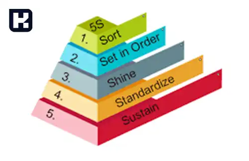

<blockquote style="background-color:#eeeefc; padding:0.5rem">
آنچه در این مطلب خواهید خواند:

- [تعریف فایو اس (5S)](#تعریف-فایو-اس-5s)
- [5s مخفف چیست؟](#5s-مخفف-چیست؟)
- [1. سورت (Sort)](#1-سورت-sort)
- [2. سیستم بندی (Set in Order)](#2-سیستم-بندی-set-in-order)
- [3. تمیز کردن (Shine)](#4-استاندارد-standardize)
- [4. استاندارد (Standardize)](#4-استاندارد-standardize)
- [5. پیوسته سازی یا انضباط (Sustain)](#5-پیوسته-سازی-یا-انضباط-sustain)

</blockquote>

## تعریف 5S (نظام آراستگی)
فایو اس (5S) یک روش مدیریت و بهبود کیفیت است که در سازمان‌ها و کارخانه‌ها برای بهبود بهره‌وری، کاهش هدر رفت‌ها و بهینه‌سازی فرایندها استفاده می‌شود. 

## 5s مخفف چیست؟

فایو اس مخفف عبارات انگلیسی زیر است:

<blockquote style="background-color:#f5f5f5; padding:0.5rem">

<strong>بیشتر بخوانید: <a href="https://www.hooshkar.com/Wiki/Financial/TheBestInventorySoftware" target="_blank">بهترین نرم افزار انبارداری چه ویژگی هایی دارد؟
</a>
</strong></blockquote>

## 1. سورت (Sort)
در این مرحله، ابزارها، تجهیزات و مواد مورد استفاده در فعالیت‌های مختلف جمع‌آوری و مرتب شده و اقلام غیرضروری حذف می‌شوند. هدف اصلی این مرحله، حذف اشیا غیرضروری و غیراستفاده‌شده و ایجاد فضایی پاک و منظم برای کارکنان است.

## 2. سیستم بندی (Set in Order)
در این مرحله، ابزارها و تجهیزاتی که در مرحله اول سورت شده‌اند، در مکان‌های مناسب و مرتب قرار می‌گیرند. هدف این مرحله، ایجاد چیدمانی مناسب برای ابزارها و تجهیزات به گونه‌ای که در طول فعالیت‌ها بتوان به راحتی از آن‌ها استفاده کرد.

## 3. تمیز کردن (Shine)
 در این مرحله، محیط کار و ابزارها به طور دوره‌ای و دقیق تمیز شده و از آلودگی‌ها و آثار زباله‌ها و گرد و غبارها پاک‌سازی می‌شود. هدف اصلی این مرحله، ایجاد یک محیط کار تمیز و پاک با افزایش ایمنی و بهبود شرایط کاری است.

## 4. استاندارد (Standardize)
این مرحله، جهت ایجاد روش هایی به منظور حفظ سه مرحله قبل است. استانداردها، روش‌ها و فرایندها به صورت کتبی و شفاف تعریف و مستند می‌شوند. هدف این مرحله، ایجاد یک سیستم استاندارد و قواعدی برای انجام فعالیت‌ها و بهبود پایدار آن‌ها است.

## 5. پیوسته سازی یا انضباط (Sustain)
در این مرحله، تلاش می‌شود تا فرایند‌ها و تغییرات بهبود یافته در مراحل قبلی به صورت پایدار پیگیری شوند. این شامل ارزیابی و بهبود مداوم فرایند‌ها، تعلیم و آموزش کارکنان و تحت نظر قرار دادن سیستم‌ها و استانداردها است. هدف اصلی این مرحله، تضمین کردن استمرار بهبود و بهره‌وری در طول زمان است.

[مقدمه]: #مقدمه
[1. سورت (Sort)]: #1-سورت-sort
[2. سیستم بندی (Set in Order)]: #2-سیستم-بندی-set-in-order
[3. تمیز کردن (Shine)]: #4-استاندارد-standardize
[4. استاندارد (Standardize)]: #4-استاندارد-standardize
[5. پیوسته سازی یا انضباط (Sustain)]: #5-پیوسته-سازی-یا-انضباط-sustain