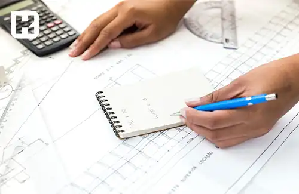

<blockquote style="background-color:#eeeefc; padding:0.5rem">

  
آنچه در این مطلب خواهید خواند

  <ul>
     <li>محاسبه طول کارتن یا جعبه</li>
    <li>محاسبه عرض کارتن یا جعبه</li>
    <li>تعیین ابعاد در بازار داخلی</li>
    <li>بازار صادراتی (خارجی)</li>
  </ul>

</blockquote>

**مقدمه**

در دنیای بسته‌بندی، محاسبه ابعاد کارتن یکی از مراحل اساسی و حیاتی است که تاثیر بسزایی بر کیفیت و کارایی بسته‌بندی دارد. این ابعاد به طور مستقیم وابسته به نیازها و مشخصات محصولات و همچنین نیازهای مشتریان است. در بازار داخلی، هر محصول با نوع و خصوصیات خود نیازمند بسته‌بندی منحصر به فردی است و هیچ استاندارد یکتا برای ابعاد کارتن‌ها وجود ندارد.

برای درک بهتر این موضوع، چند مثال می‌تواند کمک کننده باشد. به عنوان نمونه، ابعاد کارتنی که برای بسته‌بندی مواد غذایی استفاده می‌شود با کارتنی که برای بسته‌بندی لباس طراحی می‌شود، کاملاً متفاوت است. همچنین، در بازارهای صادراتی نیز استانداردهای خاصی برای ابعاد کارتن‌ها وجود دارد که باید رعایت شود.

در این مقاله، به معرفی روش‌های محاسبه ابعاد کارتن، نقش نرم افزار های کارتن سازی و اهمیت آن در ارتقای کیفیت بسته‌بندی خواهیم پرداخت.

### محاسبه طول کارتن یا جعبه

بنابراین، برای محاسبه طول یک کارتن یا جعبه، از یکی از فرمول‌های زیر استفاده می‌شود:

1.	طول کارتن = طول + عرض + طول + عرض + لبه چسب مورد نیاز

2.	طول کارتن = (طول × ۲) + (عرض × ۲) + لبه چسب مورد نیاز

### محاسبه عرض کارتن یا جعبه

برای محاسبه عرض کارتن یا جعبه، فقط کافی است عرض و ارتفاع جعبه را با هم جمع کنیم.

عرض + ارتفاع = عرض و ارتفاع کارتن 

### تعیین ابعاد در بازار داخلی

در بازار داخلی، ابعاد محصولات بسته‌بندی کارتنی به شدت وابسته به نوع، وزن و نیازهای مشتریان متفاوت است. بنابراین، هیچ استاندارد یکتا برای تمامی کارتن‌های بسته‌بندی وجود ندارد و ابعاد آنها با توجه به متغیرهای مختلف مشتریان و محصولات متفاوت است. به همین دلیل، امکان دسترسی عموم به ابعاد استاندارد برای تولید کارتن‌ها و جعبه‌های بسته‌بندی وجود ندارد.

برای روشن‌تر شدن این موضوع، می‌توان به یک مثال اشاره کرد. اگر محصولی نظیر مواد غذایی باید درون یک کارتن بسته‌بندی شود، ابعاد آن با کارتنی که برای بسته ‌بندی لباس استفاده می‌شود، متفاوت است. برای مواد غذایی، استفاده از مقواهای بهداشتی ضروری است، در حالی که برای بسته‌بندی لباس این نیاز وجود ندارد. همچنین، در کنار تفاوت ابعاد، جنس و نوع ورق مورد استفاده نیز برای هر دو نوع بسته‌بندی متفاوت است.

کارتن‌ هایی که سفارشی تولید می‌شوند، به این معناست که مشتری طرح و رنگ آنها را مشخص می‌کند و در نتیجه ابعاد خاصی دارند که از طریق کارشناسان فروش یا با توافق مشتریان تایید می‌شوند.

<blockquote style="background-color:#f5f5f5; padding:0.5rem">

<strong>آشنایی با <a href="https://www.hooshkar.com/Software/PrintingAndPackaging/Package/Carton" target="_blank"> نرم افزار کارتن سازی</a> سایان
</strong></blockquote>

### بازار صادراتی (خارجی)

اگر شما یک تولید کننده هستید که بخش قابل توجهی از محصولات خود را به خارج از کشور صادر می‌کنید، ضروری است که در مورد ابعاد کارتن‌های خود اطلاعات کاملی داشته باشید. این اطلاعات به شما کمک می‌کند تا محصولاتتان به درستی بسته بندی شده و از برگشت و مرجوعی آنها جلوگیری شود.

در بازارهای صادراتی، ابعاد استاندارد پالت‌ها معمولاً 120 در 80 یا 120 در 100 سانتی‌متر است. به همین دلیل، کارتن‌ها براساس اندازه این پالت‌ها و وزن و حجم محصولات، طراحی و تولید می‌شوند. بسیاری از محصولات صادراتی با استفاده از پالت حمل و جابجایی می‌شوند؛ بنابراین، بسته‌بندی محصولاتی که قرار است به خارج از کشور صادر شوند، باید به‌گونه‌ای طراحی و تولید شود که بتوان آنها را روی این پالت‌ها قرار داد.

نکته‌ی دیگری که بسیار حیاتی است، حمل و نقل محصولات درون کارتن ‌های بسته‌بندی شده در کانتینرها است. اندازه طولی این کانتینرها معمولاً حدود 2 متر و 40 سانتی‌متر است، اما بیشتر از 2 متر و 20 سانتی‌متر فضای داخلی آنها برای چیدن محصولات به کار نمی‌رود.

------
 برای اطلاعات بیشتر با کارشناسان <a href="https://www.hooshkar.com" target="_blank">هوشکار</a> در ارتباط باشید.