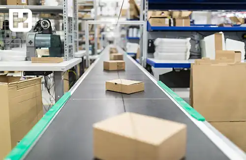

<blockquote style="background-color:#eeeefc; padding:0.5rem">

  
آنچه در این مطلب خواهید خواند:

  <ul>
  <li>سودآوری در صنعت کارتن‌سازی</li>
  <li>روش‌های بازاریابی در صنعت کارتن‌سازی</li>
  </ul>

</blockquote>

کارتن سازی یکی از صنایع مهم و پررونق در جهان است که نقش مهمی در <a href="https://www.hooshkar.com/Software/PrintingAndPackaging" target="_blank">صنعت بسته بندی</a> و حمل و نقل محصولات دارد. 

کارتن، به عنوان یک جعبه مقاوم و قابل حمل، از قدیمی‌ترین و محبوب‌ترین روش‌های بسته‌بندی در صنایع به حساب می‌آید.

استفاده از کارتن به دلیل ویژگی‌های برجسته‌ای مانند سبکی، قیمت مناسب، خواص حفاظتی و قابلیت بازیافت، به عنوان یک مدل محبوب در بسته‌بندی محصولات متنوع در صنایع مختلف شناخته شده است. از طرفی هم برای جلوگیری از آسیب و خرابی ممکن در حمل و نقل، محصولات را در برابر ضربه، رطوبت، حرارت و شرایط محیطی دیگر محافظت می‌کند.

<blockquote style="background-color:#f5f5f5; padding:0.5rem">

<strong>آشنایی با <a href="https://www.hooshkar.com/Software/PrintingAndPackaging/Package/Carton" target="_blank">نرم افزار کارتن سازی</a> سایان
</strong></blockquote>

## صنعت کارتن سازی

مزایای استفاده از کارتن به عنوان ابزار بسته‌بندی بدلیل قابلیت بازیافت، کاهش تولید زباله، آلاینده‌ها و حفظ محیط زیست است. برخلاف مواد بسته‌بندی دیگر مانند پلاستیک، کارتن می‌تواند به راحتی بازیافت شده و به تولید مجدد بپردازد. این خصوصیت زیست محیطی آن، موجب شده تا در دهه‌های اخیر، روند استفاده از کارتن به عنوان جایگزین مناسبی برای مواد بسته‌بندی غیربازیافت‌پذیر مورد توجه قرار گیرد.

صنعت کارتن، علاوه بر فراهم کردن بسته‌بندی مناسب، به عنوان منبعی از اشتغال و درآمد برای بسیاری از افراد محسوب می‌شود. از کارگران کارخانه تا تولیدکنندگان نیروگاه‌های کاغذ سازی و کشاورزان تامین کننده‌ی خمیر کاغذ، صنعت کارتن یک زنجیره تولید و تأمین مشترک است.

در نتیجه، صنعت کارتن با ارائه‌ی بسته‌بندی موثر و پایدار، حمایت از محیط زیست و ایجاد فرصت‌های اقتصادی، نقش بسیار مهمی را در جامعه و صنعت جهانی ایفا می‌کند. با رشد صنعت و پیشرفت تکنولوژی‌های مرتبط، انتظار می‌رود که این صنعت در آینده نیز به سرعت گسترش و توسعه خود ادامه دهد و نقش کلیدی خود را در بسته‌بندی و حمل و نقل محصولات حفظ کند.

### سودآوری در صنعت کارتن‌سازی

سودآوری در صنعت کارتن‌سازی به عوامل متعددی نظیر محل فروش، بازاریابی، کیفیت محصولات، تبلیغات، قیمت رقابتی و غیره وابسته است و به‌طور دقیق نمی‌توان آن را مشخص کرد. در واقع، میزان سود یک کارخانه کارتن‌سازی به عواملی همچون حجم تولید، قیمت فروش، هزینه‌های تولید و شرایط اقتصادی و بازار بستگی دارد.

**برخی از عوامل مؤثر بر سودآوری در صنعت کارتن‌سازی:**

- مدیریت کارآمد و بهینه‌سازی
- کاهش هزینه‌های تولید  
- تضمین کیفیت محصولات  
- رقابت در قیمت‌گذاری  
- بازاریابی مؤثر و مناسب

صنعت بسته‌بندی و کارتن‌سازی به دلیل افزایش نیاز به بسته‌بندی محصولات، بهره‌مندی از جدیدترین تکنولوژی‌ها و رشد پایدار در صنعت، دارای پتانسیل بالایی برای سودآوری است.
به منظور دستیابی به سود قابل توجه در صنعت کارتن‌سازی، ضروری است به برنامه‌ریزی مالی دقیق، مدیریت کارآمد هزینه‌ها، بهبود عملکرد عملیاتی و تلاش برای ارائه ارزش افزوده به مشتریان توجه کرد

<blockquote style="background-color:#f5f5f5; padding:0.5rem">

<strong>بیشتر بخوانید: <a href="https://www.hooshkar.com/Wiki/Business/FlutedVsDuplexCarton" target="_blank">تفاوت کارتن فلکسویی و لمینتی چیست؟</a>
</strong></blockquote>

### روش‌های بازاریابی در صنعت کارتن‌سازی

بازاریابی در این صنعت مجموعه‌ای از روش‌ها و استراتژی‌هایی است که به تولیدکنندگان کارتن کمک می‌کند تا محصولات خود را به مشتریان و بازار هدفشان معرفی کرده و فروش خود را افزایش دهند. در ادامه، تعدادی از روش‌های موثر بازاریابی در این صنعت را بررسی خواهیم کرد.

1. انجام تحقیقات دقیق و جامع درباره بازار کارتن‌سازی می‌تواند به شما کمک کند تا نیازها و ترجیحات مشتریان را به‌درستی شناسایی کنید. با بررسی رقبا، جوانب اقتصادی، روند صنعت و مشتریان هدف خود، می‌توانید استراتژی‌های بازاریابی خود را بر اساس داده‌های قابل اعتماد تدوین کنید.

2. تعیین بازار هدف: شناختن بازار هدف بسیار اساسی است. با تعیین گروه هدف خود، می‌توانید روش‌های بازاریابی را به طور موثر‌تر انتخاب کنید. این بازار می‌تواند بسته به نوع محصولات کارتنی شما، از شرکت‌های بزرگ و صنایع متنوع تا کسب‌وکارهای کوچک و خانگی باشد.

3. تبلیغات آنلاین: استفاده از تبلیغات در رسانه‌های مختلف مانند رادیو، تلویزیون، روزنامه‌ها و مجلات، می‌تواند به شما کمک کند تا ارتباط بیشتری با مشتریان هدف خود برقرار کنید. همچنین، استفاده از تبلیغات آنلاین از جمله تبلیغات در گوگل، شبکه‌های اجتماعی و وبسایت‌های مرتبط، به شما این امکان را می‌دهد که به طور مستقیم با مشتریان هدف در تعامل باشید و شناخت برند خود را افزایش دهید.

4. بازاریابی محتوا: ایجاد و انتشار محتوای مرتبط با صنعت کارتن‌سازی می‌تواند به شما کمک کند تا خبرگی خود را نمایان سازید و مشتریان را به سمت خود جذب کنید. می‌توانید مقالات، وبلاگ ‌ها، ویدئوها و مطالب آموزشی متناسب با صنعت کارتن‌سازی را ایجاد و آن‌ها را در وبسایت شرکت، بلاگ شرکت، شبکه‌های اجتماعی و دیگر منابع آنلاین منتشر کنید.

5. روابط عمومی: برقراری ارتباط موثر با رسانه‌ها و توسعه روابط عمومی می‌تواند به شما کمک کند تا به عنوان یک منبع معتبر در صنعت کارتن‌سازی شناخته شوید. شرکت در رویدادهای مرتبط، حضور در رویدادهای صنعتی می‌تواند به ارتقای شناخت شما در صنعت کمک کند.

6. بازاریابی تجربی: ایجاد تجربه مثبت برای مشتریان از طریق خدمات مشتریان، ارسال سریع و دقیق، کیفیت بالا و طراحی جذاب می‌تواند به شما کمک کند تا وفاداری مشتریان را افزایش و کسب و کار خود را گسترش دهید.

7. تبلیغات مستقیم: استفاده از روش‌های تبلیغات مستقیم مانند پست‌های مستقیم، بروشورها و نمونه‌های رایگان محصولات کارتنی می‌تواند به شما کمک کند تا با مشتریان هدف در ارتباط باشید و محصولات خود را به آنها معرفی کنید.