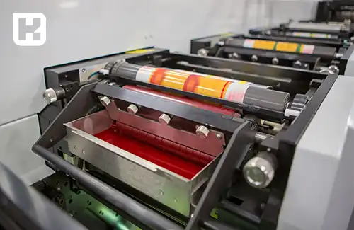
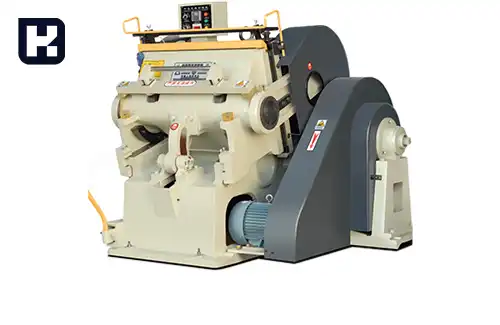
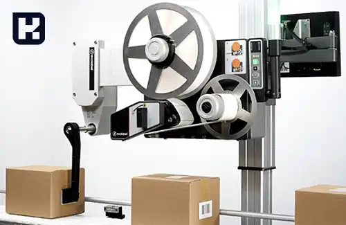

**راهنمای مطالب**
- [چه تجهیزاتی در صنعت کارتن سازی مورد نیاز است؟](#چه-تجهیزاتی-در-صنعت-کارتن-سازی-مورد-نیاز-است؟)
    - [دستگاه دایکات (Die-cutting Machine)](#دستگاه-دایکات-die-cutting-machine)
    - [دستگاه چاپ فلکسو (Flexo Printing Machine)](#دستگاه-چاپ-فلکسو-flexo-printing-machine)
    - [دستگاه خط و تیغ و برش (Creasing and Cutting Machine)](#دستگاه-خط-و-تیغ-و-برش-creasing-and-cutting-machine)
    - [تسمه کش (Strapping Machine)](#تسمه-کش-strapping-machine)
    - [منگنه کوب (Stapler Carton)](#منگنه-کوب-stapler-carton)
    - [دستگاه لمینت ساز (Laminating Machine)](#دستگاه-لمینت-ساز-laminating-machine)
    - [دستگاه لب چسب](#دستگاه-لب-چسب)
    - [دستگاه چاپ سیلک نیمه اتومات یا تمام اتومات](#دستگاه-چاپ-سیلک-نیمه-اتومات-یا-تمام-اتومات)
    - [دستگاه شیتر](#دستگاه-شیتر)
    - [دستگاه بسته بندی جعبه](#دستگاه-بسته-بندی-جعبه)
    - [دستگاه لیبل ‌زن (Labeling Machine)](#دستگاه-لیبل-‌زن-labeling-machine)
    - [دستگاه یونیورسال](#دستگاه-یونیورسال)
- [انواع چاپ بر روی کارتن](#انواع-چاپ-بر-روی-کارتن)
    - [چاپ تک رنگ](#چاپ-تک-رنگ)
    - [چاپ دو رنگ و سه رنگ (چاپ فلکسو)](#چاپ-دو-رنگ-و-سه-رنگ-چاپ-فلکسو)
    - [چاپ چهار رنگ (افست) لمینتی](#چاپ-چهار-رنگ-افست-لمینتی)
- [انواع کارتن](#انواع-کارتن)
    - [کارتن های تاشو](#کارتن-های-تاشو)
    - [کارتن های تخم مرغ](#کارتن-های-تخم-مرغ)
    - [کارتن های دایکاتی](#کارتن-های-دایکاتی)
    - [کارتن های اسپتیک](#کارتن-های-اسپتیک)
    - [کارتن چند لایه](#کارتن-چند-لایه)

## چه تجهیزاتی در صنعت کارتن سازی مورد نیاز است؟

<blockquote style="background-color:#f5f5f5; padding:0.5rem">
مطلب پیشنهادی: <a href="https://www.hooshkar.com/Software/PrintingAndPackaging/Package/Box" target="_blank"> آشنایی با امکانات نرم افزار جعبه سازی
</a></blockquote>

### دستگاه دایکات (Die-cutting Machine)

دستگاه دایکات برای برش، خمیر کاغذ را با الگوهای مورد نظر برش می‌دهد تا قالب‌ها و شکل‌های مختلف بر روی کارتن ایجاد شود. دستگاه‌های دایکات ممکن است به صورت پینگ پنگی (Flatbed)، فکی (Platen) و روتاری (Rotary) باشند.

### دستگاه چاپ فلکسو (Flexo Printing Machine)

این دستگاه برای چاپ روی کارتن استفاده می‌شود. دستگاه چاپ فلکسو از یک سیلندر روتاری برای انتقال جوهر به سطح کارتن استفاده می‌کند و می‌تواند چاپ رنگ‌های مختلف و الگوها را بر روی کارتن انجام دهد.

### دستگاه خط و تیغ و برش (Creasing and Cutting Machine)

این دستگاه برای ایجاد خطوط و جاهای برش در کارتن به منظور تسهیل در انعطاف‌پذیری و بسته‌بندی استفاده می‌شود. با استفاده از دستگاه خط و تیغ و برش، می‌توان به راحتی کارتن را خمیر کاغذ کرده و قالب‌های مختلف بر روی آن را ایجاد کرد.

<blockquote style="background-color:#f5f5f5; padding:0.5rem">
مطلب پیشنهادی: <a href="https://www.hooshkar.com/Wiki/Business/CartonIndustry" target="_blank"> صنعت کارتن سازی و راهنمای کامل برای ورود به آن
</a></blockquote>

### تسمه کش (Strapping Machine)

این دستگاه برای بسته‌بندی و استحکام‌ بخشی به جعبه‌ها و بسته‌ها استفاده می‌شود. تسمه کش از تسمه‌های پلاستیکی استفاده می‌کند و آن‌ها را به دور بسته می‌کشد تا محتوای داخلی را در حالت بسته و محکم نگه دارد.

### منگنه کوب (Stapler Carton)
قطعات کارتن را به یکدیگر متصل کند

### دستگاه لمینت ساز (Laminating Machine)

این دستگاه برای ایجاد لمینت روی کارتن استفاده می‌شود. لمینت ساز از لایه‌هایی از فیلم پلاستیکی یا کاغذ روی کارتن استفاده می‌کند تا ضدآبی، محکمی و جلوگیری از خراشیدگی را به بسته‌بندی اضافه کند.

<blockquote style="background-color:#f5f5f5; padding:0.5rem">
مطلب پیشنهادی: <a href="https://www.hooshkar.com/Software/PrintingAndPackaging/Package/Sheet" target="_blank"> آشنایی با امکانات نرم افزار ورق سازی
</a></blockquote>

### دستگاه لب چسب
این دستگاه برای اعمال چسب به لبه‌های کارتن و ایجاد اتصالات محکم بین قطعات کارتن استفاده می‌شود.

### دستگاه چاپ سیلک نیمه اتومات یا تمام اتومات
این دستگاه‌ها برای چاپ روی کارتن به صورت اتوماتیک و با استفاده از فناوری‌های پیشرفته استفاده می‌شوند.

### دستگاه شیتر
این دستگاه برای برش و جدا کردن کارتن به اندازه‌ها و اشکال مختلف استفاده می‌شود. دستگاه شیتر به صورت اتوماتیک و با دقت بالا عمل می‌کند.

### دستگاه بسته بندی جعبه
این دستگاه برای بسته‌بندی نهایی کارتن‌ها به شکل جعبه استفاده می‌شود. با استفاده از این دستگاه، کارتن‌ها به صورت خودکار و با سرعت بالا بسته‌بندی می‌شوند.

### دستگاه لیبل ‌زن (Labeling Machine)
این دستگاه برای چسباندن برچسب‌ها روی کارتن‌ها استفاده می‌شود. 

<blockquote style="background-color:#f5f5f5; padding:0.5rem">
مطلب پیشنهادی: <a href="https://www.hooshkar.com/Wiki/Business/CartonManufacturingProcess
" target="_blank">نکات راه اندازی کارخانه کارتن سازی</a></blockquote>

### دستگاه یونیورسال

(تست لهیدگی، فشار عمودی، انبارداری، تست دینامیک، کنترل کیفیت جعبه مقوایی و کارتن)

این دستگاه‌ها برای اندازه‌گیری و بررسی کیفیت محصولات کارتن استفاده می‌شوند. با استفاده از دستگاه‌های اندازه‌گیری و کنترل کیفیت، ابعاد، وزن، قوس و فشار کارتن‌ها بررسی می‌شود تا از تطابق با استانداردهای مورد نظر اطمینان حاصل شود.

همچنین، در خط تولید کارتن به عناصر دیگری مانند سیستم‌های حمل و نقل داخلی (نوارهای نقاله و ریل‌ها)، سیستم‌های برقی و الکترونیکی و سیستم‌های خنک‌کننده نیز نیازمندیم.
لیستی که ارائه شد، به تعدادی از دستگاه‌های اصلی و مهم در خط تولید کارتن اشاره می‌کند. بسته به مقیاس تولید و نیازهای خاص شما، ممکن است برخی از این دستگاه‌ها را در خط تولید خود استفاده کنید یا به دستگاه‌های دیگری نیز نیاز داشته باشید.

<blockquote style="background-color:#f5f5f5; padding:0.5rem">
<a href="https://www.hooshkar.com/Software/PrintingAndPackaging/Package/Carton" target="_blank">نرم افزار کارتن سازی سایان</a>: 

با نرم افزار سایان، تمام فرآیندهای کارتن سازی را از آغاز تا انتها به صورت یکپارچه و دقیق مدیریت کنید. 

این نرم افزار قدرتمند از دریافت سفارش، تهیه قرارداد، برنامه ریزی تولید، مدیریت انبار، تحویل کالا به مشتری و صدور صورتحساب پشتیبانی می‌کند. 

با اعتماد به این نرم افزار پیشرو، مطمئن باشید که هیچ جزئی از فرآیند کارتن سازی به فراموشی سپرده نمی‌شود و کسب و کار شما همیشه به بهترین شکل مدیریت خواهد شد.

</blockquote>

## انواع چاپ بر روی کارتن

چاپ بر روی کارتن به صورت تک رنگ، دو رنگ، سه رنگ (چاپ فلکسو) و چهار رنگ (افست) لمینتی می‌تواند به صورت درخواستی انجام شود.

در زیر به توضیحات کوتاهی درباره هر یک از این روش‌های چاپ می‌پردازم:

### چاپ تک رنگ

در این روش، از یک رنگ واحد برای چاپ بر روی کارتن استفاده می‌شود. این روش از هزینه‌ی کمتری نسبت به سایر روش‌ها برخوردار است و برای چاپ بر روی کارتن‌های ساده و با طرح‌های کمپلکس مناسب است.

### چاپ دو رنگ و سه رنگ (چاپ فلکسو)

در این روش، از دو یا سه رنگ مختلف برای چاپ بر روی کارتن استفاده می‌شود. برای این نوع چاپ، از دستگاه چاپ فلکسو استفاده می‌شود که قادر به چاپ روی سطوح مختلف کارتن است. این روش می‌تواند امکان چاپ طرح‌های پیچیده‌تر و با رنگ‌های متنوع را فراهم کند.

### چاپ چهار رنگ (افست) لمینتی

این روش چاپ، بر اساس مدل استاندارد چاپ افست است که از چهار رنگ اصلی (CMYK) برای ایجاد طیف رنگ وسیع در چاپ استفاده می‌کند. برای ایجاد لمینت روی کارتن، پس از چاپ چهار رنگ، از فیلم پلاستیکی یا کاغذی استفاده می‌شود که با حرارت و فشار به سطح کارتن متصل می‌شود. این روش، علاوه بر چاپ رنگی، قابلیت ایجاد لمینت محافظ را نیز فراهم می‌کند.

در هر یک از این روش‌ها، می‌توان با استفاده از طرح‌ها، نوشته‌ها و رنگ‌های مختلف، کارتن‌هایی با ظاهر جذاب و حرفه‌ای تولید کرد. همچنین، می‌توان با اضافه کردن لمینت روی کارتن، آن را در برابر رطوبت، خراشیدگی و آسیب‌های دیگر محافظت کرد.

برای انتخاب روش مناسب چاپ بر روی کارتن، باید نیازها و بودجه خود را مدنظر قرار داده و با تولیدکنندگان و چاپخانه‌های مربوطه مشورت کنید.

<blockquote style="background-color:#f5f5f5; padding:0.5rem">
مطلب پیشنهادی: <a href="https://www.hooshkar.com/Wiki/Business/FlutedVsDuplexCarton
" target="_blank">تفاوت کارتن فلکسویی و لمینتی
</a></blockquote>

## انواع کارتن

### کارتن های تاشو

کارتن‌هایی که به راحتی قابل تا شدن هستند و برای بسته‌بندی محصولات مختلف مانند غلات، خشکبار، حبوبات و غیره استفاده می‌شوند.

### کارتن های تخم مرغ

کارتن‌هایی که برای محافظت از تخم‌مرغ‌ها در زمان حمل و نقل طراحی شده‌اند و معمولاً از خمیر قالب و روزنامه بازیافتی ساخته می‌شوند.

### کارتن های دایکاتی

کارتن‌هایی که با استفاده از قالب‌برش خاص شکل داده می‌شوند و برای بسته‌بندی محصولات با شکل و سایز خاص مناسب هستند.

### کارتن های اسپتیک

کارتن‌هایی که برای بسته‌بندی مواد غذایی مایع یا نیمه جامد مانند شیر، آبمیوه، سس و غیره استفاده می‌شوند و دارای لایه‌های پلاستیک یا فلزی هستند.

### کارتن چند لایه

کارتن‌های سفت و سخت که دارای چندین لایه مقوا و فلوت هستند و برای حمل و نقل اجسام سخت یا تیز مناسب هستند
و...

در کل، کارخانه‌های کارتن سازی قادر به تولید انواع محصولات کارتنی براساس نیازها و مشتریان خود هستند. این محصولات به طور گسترده در صنایع مختلف بسته‌بندی، حمل و نقل و صنایع مرتبط دیگر استفاده می‌شوند.

