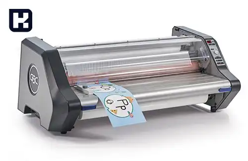

<blockquote style="background-color:#eeeefc; padding:0.5rem">

  
آنچه در این مطلب خواهید خواند:

  <ul>
    <li>معرفی ماشین آلات صنعت کارتن سازی</li>
    <ul>
      <li>دستگاه دایکات کارتن (Die-cutting Machine)</li>
      <li>دستگاه چاپ فلکسو (Flexo Printing Machine)</li>
      <li>دستگاه خط و تیغ و برش (Creasing and Cutting Machine)</li>
      <li>تسمه کش (Strapping Machine)</li>
      <li>منگنه کوب (Stapler Carton)</li>
      <li>دستگاه لمینت ساز (Laminating Machine)</li>
      <li>دستگاه لب چسب</li>
      <li>دستگاه چاپ سیلک نیمه اتومات یا تمام اتومات</li>
      <li>دستگاه شیتر</li>
      <li>دستگاه بسته بندی جعبه</li>
      <li>دستگاه لیبل ‌زن (Labeling Machine)</li>
      <li>دستگاه یونیورسال</li>
    </ul>
    <li>انواع چاپ بر روی کارتن</li>
    <ul>
      <li>چاپ تک رنگ</li>
      <li>چاپ دو رنگ و سه رنگ (چاپ فلکسو)</li>
      <li>چاپ چهار رنگ (افست) لمینتی</li>
    </ul>
      <li>قیمت برخی از ماشین آلات کارتن سازی</li>
    </ul>

</blockquote>

در دنیای بازاریابی و تجارت، بسته بندی مناسب و زیبا نقش بسیار مهمی در جلب توجه مشتریان و جذابیت محصول ایفا می کند. در این میان، <a href="https://www.hooshkar.com/Wiki/Business/CartonIndustry" target="_blank">صنعت کارتن سازی</a> از اهمیت ویژه ای برخوردار است؛ زیرا بسیاری از محصولات در کارتن های مقوایی بسته بندی و به مشتریان عرضه می شوند.

ماشین آلات پیشرفته صنعت کارتن سازی، با قابلیت های منحصر به فرد خود، توانسته اند انقلابی در این حوزه ایجاد کنند. از دستگاه های برش و چاپ دیجیتال مقوا گرفته تا خطوط تولید کارتن های چند لایه، همگی در راستای تولید بسته بندی های با کیفیت و جذاب طراحی شده اند.

در این مقاله قصد داریم به معرفی انواع ماشین آلات مدرن صنعت کارتن سازی بپردازیم. پیشرفت روزافزون تکنولوژی، این صنعت را نیز متحول ساخته است؛ بنابراین آشنایی با جدیدترین دستگاه ها می تواند برای فعالان این حوزه بسیار مفید و سودمند باشد.

<blockquote style="background-color:#f5f5f5; padding:0.5rem">

<strong>آشنایی با <a href="https://www.hooshkar.com/Software/PrintingAndPackaging/Package/Box" target="_blank">نرم افزار حسابداری جعبه سازی</a>
</strong></blockquote>

## معرفی ماشین آلات صنعت کارتن سازی

### دستگاه دایکات کارتن (Die-cutting Machine)

دستگاه دایکات، ورق را با الگوهای مورد نظر برش می‌دهد تا قالب‌ها و شکل‌های مختلف بر روی کارتن ایجاد شود. دستگاه های دایکات کارتن ممکن است به صورت پینگ پنگی (Flatbed)، فکی (Platen) و روتاری (Rotary) باشند.

### دستگاه چاپ فلکسو (Flexo Printing Machine)

این دستگاه برای چاپ روی کارتن استفاده می‌شود. دستگاه چاپ فلکسو از یک سیلندر روتاری برای انتقال جوهر به سطح کارتن استفاده می‌کند و می‌تواند چاپ رنگ‌های مختلف و الگوها را بر روی کارتن انجام دهد.

### دستگاه خط تیغ و برش (Creasing and Cutting Machine)

این دستگاه برای ایجاد خطوط و جاهای برش در کارتن به منظور تسهیل در انعطاف‌پذیری و بسته‌بندی استفاده می‌شود. با استفاده از دستگاه خط تیغ و برش، می‌توان به راحتی قالب‌های مختلف بر روی کارتن ایجاد کرد.

### تسمه کش (Strapping Machine)

این دستگاه برای بسته‌بندی و استحکام‌ بخشیدن به جعبه‌ها و بسته‌ها استفاده می‌شود. تسمه کش از تسمه‌های پلاستیکی استفاده می‌کند و آن‌ها را به دور بسته می‌کشد تا محتوای داخلی را در حالت محکم نگه دارد.

<blockquote style="background-color:#f5f5f5; padding:0.5rem">

<strong>آشنایی با <a href="https://www.hooshkar.com/Software/PrintingAndPackaging/Package/Sheet" target="_blank">نرم افزار حسابداری ورق سازی</a>
</strong></blockquote>

### منگنه کوب (Stapler Carton)

### دستگاه لمینت ساز (Laminating Machine)

این دستگاه برای ایجاد لمینت روی کارتن استفاده می‌شود. لمینت ساز از لایه‌هایی از فیلم پلاستیکی یا کاغذ روی کارتن استفاده می‌کند تا ضدآبی، محکمی و جلوگیری از خراشیدگی را به بسته‌بندی اضافه کند.

### دستگاه لب چسب
این دستگاه برای اعمال چسب به لبه‌های کارتن و ایجاد اتصالات محکم بین قطعات کارتن استفاده می‌شود.

### دستگاه چاپ سیلک نیمه اتومات یا تمام اتومات
این دستگاه‌ها برای چاپ روی کارتن به صورت اتوماتیک و با استفاده از فناوری‌های پیشرفته استفاده می‌شوند.

### دستگاه شیتر
این دستگاه برای برش و جدا کردن مقوا به اندازه‌ها و اشکال مختلف استفاده می‌شود. دستگاه شیتر به صورت اتوماتیک و با دقت بالا عمل می‌کند.

### دستگاه بسته بندی جعبه
این دستگاه برای بسته‌بندی نهایی مقواها به شکل جعبه استفاده می‌شود. با استفاده از این دستگاه، مقواها به صورت خودکار و با سرعت بالا بسته‌بندی می‌شوند.

### دستگاه لیبل ‌زن (Labeling Machine)
این دستگاه برای چسباندن برچسب‌ها روی جعبه و کارتن‌ها استفاده می‌شود. 

### دستگاه یونیورسال

این دستگاه‌ها برای اندازه‌گیری و بررسی کیفیت محصولات کارتن استفاده می‌شوند. با استفاده از این دستگاه‌ها کیفیت، ابعاد، وزن، قوس و فشار کارتن‌ها بررسی می‌شود تا از تطابق با استانداردهای مورد نظر اطمینان حاصل شود (تست لهیدگی، فشار عمودی، انبارداری، تست دینامیک، کنترل کیفیت جعبه مقوایی و کارتن).

همچنین، در خط تولید کارتن به عناصر دیگری مانند سیستم‌های حمل و نقل داخلی (نوارهای نقاله و ریل‌ها)، سیستم‌های برقی و الکترونیکی و سیستم‌های خنک‌کننده نیز نیازمندیم.
لیستی که ارائه شد، به تعدادی از دستگاه‌های اصلی و مهم در خط تولید کارتن اشاره می‌کند. بسته به مقیاس تولید و نیازهای خاص شما، ممکن است برخی از این دستگاه‌ها را در خط تولید خود استفاده کنید یا به دستگاه‌های دیگری نیز نیاز داشته باشید.

## انواع چاپ بر روی کارتن

چاپ بر روی کارتن به صورت تک رنگ، دو رنگ، سه رنگ (چاپ فلکسو) و چهار رنگ (افست) لمینتی می‌تواند به صورت درخواستی انجام شود.

در ادامه به توضیحات کوتاهی درباره هر یک از این روش‌های چاپ می‌پردازم:

### 1. چاپ تک رنگ

در این روش، از یک رنگ واحد برای چاپ بر روی کارتن استفاده می‌شود. این روش از هزینه‌ی کمتری نسبت به سایر روش‌ها برخوردار است و برای چاپ بر روی کارتن‌های ساده و با طرح‌های کمپلکس مناسب است.

### 2. چاپ دو رنگ و سه رنگ (چاپ فلکسو)

در این روش، از دو یا سه رنگ مختلف برای چاپ بر روی کارتن استفاده می‌شود. برای این نوع چاپ، از دستگاه چاپ فلکسو استفاده می‌شود که قادر به چاپ روی سطوح مختلف کارتن است. این روش می‌تواند امکان چاپ طرح‌های پیچیده‌تر و با رنگ‌های متنوع را فراهم کند.

### 3. چاپ چهار رنگ (افست) لمینتی

این روش چاپ، بر اساس مدل استاندارد چاپ افست است که از چهار رنگ اصلی (CMYK) برای ایجاد طیف رنگ وسیع در چاپ استفاده می‌کند. برای ایجاد لمینت روی کارتن، پس از چاپ چهار رنگ، از فیلم پلاستیکی یا کاغذی استفاده می‌شود که با حرارت و فشار به سطح کارتن متصل می‌شود. این روش، علاوه بر چاپ رنگی، قابلیت ایجاد لمینت محافظ را نیز فراهم می‌کند.

در هر یک از این روش‌ها، می‌توان با استفاده از طرح‌ها، نوشته‌ها و رنگ‌های مختلف، کارتن‌هایی با ظاهر جذاب و حرفه‌ای تولید کرد. همچنین، می‌توان با اضافه کردن لمینت روی کارتن، آن را در برابر رطوبت، خراشیدگی و آسیب‌های دیگر محافظت کرد.

برای انتخاب روش مناسب چاپ بر روی کارتن، باید نیازها و بودجه خود را مدنظر قرار داده و با تولیدکنندگان و چاپخانه‌های مربوطه مشورت کنید.

<blockquote style="background-color:#f5f5f5; padding:0.5rem">

<strong>بیشتر بخوانید: <a href="https://www.hooshkar.com/Wiki/Business/FlutedVsDuplexCarton" target="_blank">تفاوت کارتن فلکسویی و لمینتی چیست؟</a>
</strong></blockquote>

###  قیمت برخی از ماشین آلات کارتن سازی

اسامی ماشین آلات      | قیمت (تومان)
---------------|---------------
دستگاه دایکات پینگ پنگی  | حدودا از 40 میلیون به بالا
دستگاه لمینت  | حدودا 21 میلیون
دستگاه تسمه کش  | 30 میلیون تا 50 میلیون
دستگاه لب چسب اتومات  | 30 میلیون تا 100 میلیون
دستگاه چاپ فلکسو  | 400 میلیون تا 1.5 میلیارد
دستگاه منگنه کوب  | حدودا 10 میلیون
دستکاه لمینت ساز  | حدودا 120 میلیون
دستگاه لب چسب  | حدودا 50 میلیون
دستگاه چاپ سیلک   | حدودا 150 میلیون
دستگاه لیبل ‌زن | 50 تا 100 میلیون