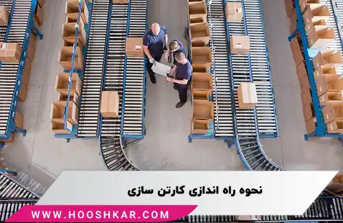

<blockquote style="background-color:#eeeefc; padding:0.5rem">

  
آنچه در این مطلب خواهید خواند

  <ul>
     <li>سرمایه‌ لازم جهت راه اندازی کارخانه تولید کارتن</li>
     <li>راهنمای شرایط و مراحل اخذ مجوز</li>
     <li>بهترین مکان برای راه اندازی کارخانه کارتن سازی</li>
     <li>چگونگی تامین برق برای کارگاه کارتن‌سازی</li>
     <li>انتخاب مکان مناسب برای انبار کارتن‌های تولیدی</li>
    <li>بازار کار کارتن سازی</li>
    <li>مزایا و چالش‌های راه‌اندازی کارخانه‌ کارتن سازی</li>
  </ul>

</blockquote>

با افزایش نیاز به بسته بندی محصولات و اجناس مختلف، کارتن سازی به عنوان یک شغل پرسود و مهم در سطح جهان شناخته شده است. 

در حال حاضر، تعداد زیادی کارخانه کارتن‌سازی در سراسر کشور در حال فعالیت هستند. این صنعت به طور مداوم در حال پیشرفت بوده و توجه بسیاری از افراد را به خود جلب کرده است. به گونه‌ای که امروزه در بسته‌بندی محصولات و مواد غذایی کارتن و مقوا جایگزین نایلون شده است.

در این مقاله به بررسی راه کسب درآمد از کارتن سازی و معرفی این حرفه، مزایا و چالش‌های راه اندازی کارخانه کارتن سازی، می‌پردازیم و نکات مهمی را برای شروع این کسب و کار به اشتراک می‌گذاریم.

<blockquote style="background-color:#f5f5f5; padding:0.5rem">

<strong>آشنایی با <a href="https://www.hooshkar.com/Software/PrintingAndPackaging/Package/Carton" target="_blank"> نرم افزار کارتن سازی</a> سایان
</strong></blockquote>

### سرمایه‌ لازم برای راه اندازی کارخانه تولید کارتن

مقدار سرمایه جهت راه اندازی کارگاه کارتن سازی، بسته به میزان سرمایه شما متغیر است. در ابتدا، می‌توان با یک هزینه کم، کار را آغاز سپس با افزایش درآمد و تعداد مشتریان، تجهیزات را گسترش داد. 

حدوداً 700 میلیون تومان سرمایه برای شروع فعالیت و خرید دستگاه های اولیه مورد نیاز است؛ اما این مقدار ممکن است به دلیل نوسانات قیمت‌ تغییر کند.

### راهنمای شرایط و مراحل اخذ مجوز

برای راه‌اندازی کارگاه کارتن‌سازی، نیاز به دریافت پروانه بهره‌برداری، موافقت اصولی از وزارت صنایع و پروانه احداث دارید. برای گرفتن مجوز تاسیس، باید به وبسایت بهینه‌یاب مراجعه کرده و فرم مربوطه را تکمیل کنید. پس از تأیید اطلاعات توسط کارشناسان و واریز مبلغ کارشناسی، تأیید نهایی توسط ریاست مربوطه انجام خواهد شد.

### بهترین مکان برای راه اندازی کارخانه کارتن سازی

برای راه‌اندازی کارگاه کارتن‌سازی، باید مکانی مناسب انتخاب کنید. به طور کلی، مکانی را در نظر بگیرید که دسترسی آسان به مواد خام داشته باشد. انتقال محصولات معمولاً با تریلی و کانتینر انجام می‌شود، بنابراین باید فضایی مناسب برای تخلیه ورق‌های خام و انبار کردن تولیدات فراهم کنید. برای تولید 5000 کارتن، به فضایی بین 500 تا 600 متر مربع نیاز خواهید داشت.

<blockquote style="background-color:#f5f5f5; padding:0.5rem">

<strong>بیشتر بخوانید: <a href="https://www.hooshkar.com/Wiki/Business/CartonIndustryMachinery" target="_blank">آشنایی با ماشین الات کارتن سازی</a>
</strong></blockquote>

### چگونگی تامین برق برای کارگاه کارتن‌سازی

برای شروع خط تولید کارتن‌سازی، به برق سه فاز نیاز دارید؛ زیرا این نوع برق به لحاظ اقتصادی مفیدتر است و با هزینه کمتری همراه است. به همین دلیل، در صنایع گوناگون از برق سه فاز استفاده می‌شود.

### انتخاب مکان مناسب برای انبار کارتن‌های تولیدی

با توجه به فضای مورد نیاز برای انبار کردن تولیدات خود، باید محلی مناسب را به‌عنوان انبار انتخاب کنید. توجه کنید که انبار باید عایق مناسبی برای جلوگیری از نفوذ رطوبت داشته باشد و از تهویه خوبی برخوردار باشد. حتی مقدار کمی رطوبت می‌تواند به محصولات شما آسیب برساند.

### بازار کار کارتن سازی

این روزها توجه بسیاری معطوف به صنعت بسته‌بندی است که باعث شده است این بازار رشد چشمگیری را تجربه نماید. استفاده از کارتن برای بسته‌بندی در صنایع مختلف به‌طور قابل توجهی افزایش یافته است.
اگرچه بازار کار در این حوزه در حال رشد است، اما باید به یاد داشت که این رشد باعث رقابت شدید در این بازار شده است. در یک بازار رقابتی، تنها با حرفه‌ای بودن می‌توانید موفق به جذب مشتری شوید.

بنابراین، برای جایگاه مناسب در بازار کارتن‌سازی در ایران، باید تمرکز خود را بر روی تولید کارتن با کیفیت و استاندارد قرار دهید.

برای جلب سفارشات از مشتریان، باید ابتدا یک استراتژی بازاریابی قوی و حرفه‌ای داشته باشید. مشتریان پس از خرید کارتن بسته‌بندی از شما، در صورت رضایت از کیفیت و قیمت محصول، به شما وفادار خواهند بود و برای سفارشات بعدی به شما مراجعه می‌کنند. این امر به شما کمک می‌کند تا به عنوان یک تولید کننده حرفه‌ای و با کیفیت در بازار شناخته شوید.

### راه‌اندازی کارخانه‌ کارتن سازی چه مزایا و چالش‌هایی دارد؟

همانطور که می دانید راه اندازی هر کسب و کاری چالش ها و مزایای مربوط به خودش را دارد. در حال حاضر، به دلیل ضرورت و الزام بسته‌بندی محصولات، این حوزه به عنوان یک گزینه ایده‌آل برای سرمایه‌گذاری محسوب می‌شود. اکثر بسته‌بندی‌ها از موادی مانند کارتن و مقوا استفاده می‌کنند، بنابراین، شغل کارتن‌سازی بازار کار پرفراز و نشیبی دارد و می‌تواند به سودآوری مناسبی منجر شود.

همواره باید در نظر داشته باشید که در این حرفه رقبای بسیاری وجود دارند و هر گونه اشتباه می‌تواند به عواقب جدی منجر شود.