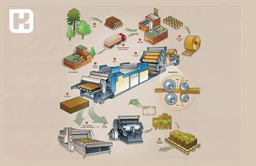
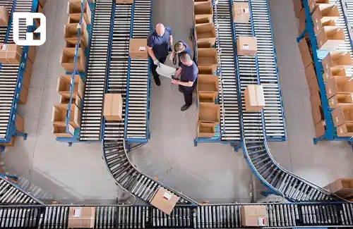

<blockquote style="background-color:#eeeefc; padding:0.5rem">

  
آنچه در این مطلب خواهید خواند:

  <ul>
     <li>مراحل راه اندازی کارخانه کارتن سازی</li>
     <li>سرمایه‌ لازم برای راه اندازی خط تولید کارتن سازی</li>
     <li>راهنمای شرایط و مراحل اخذ مجوز</li>
     <li>بهترین مکان برای تأسیس کارخانه کارتن سازی</li>
     <li>انتخاب مکان مناسب برای انبار کارتن‌ های تولیدی</li>
     <li>چگونگی تامین برق</li>
     <li>بازار کار کارتن سازی</li>
     <li>راه‌اندازی کارخانه‌ کارتن سازی چه مزایا و چالش‌هایی دارد؟</li>
    <ul>
     <li>مزایای راه اندازی کارخانه کارتن سازی</li>
     <li>معایب راه اندازی کارخانه کارتن سازی</li>
  </ul>

</blockquote>

راه‌اندازی یک کارخانه کارتن‌سازی از جمله فرآیندهایی است که نیازمند برنامه‌ریزی دقیق و اجرای صحیح می‌باشد. در این مقاله، به بررسی عوامل مورد نیاز جهت راه‌اندازی کارخانه کارتن‌سازی می‌پردازیم:

<blockquote style="background-color:#f5f5f5; padding:0.5rem">

<strong>آشنایی با <a href="https://www.hooshkar.com/Software/PrintingAndPackaging/Package/Carton" target="_blank">نرم افزار مدیریت و حسابداری چاپخانه</a>
</strong></blockquote>

## مراحل راه اندازی کارخانه کارتن سازی

**1. تحقیقات و بررسی بازار:** قبل از هر چیز، باید بازار محلی و جهانی را برای تقاضای کارتن بررسی کنید. اطمینان حاصل کنید در منطقه‌ای که قصد راه اندازی کارخانه را دارید، تقاضا برای محصولات کارتن وجود دارد. همچنین، بررسی رقبا و تحلیل این حوزه می‌تواند به شما در درک بهتر شرایط و چالش‌های احتمالی کمک کند.

**2. برنامه ریزی مالی:** بررسی هزینه‌های احتمالی برای راه اندازی و عملکرد کارخانه بسیار مهم است. شامل هزینه‌های ساخت و تجهیزات، خرید ماشین آلات، هزینه‌های نیروی کار، هزینه‌های مربوط به انبار و حمل و نقل، هزینه‌های بازاریابی و تبلیغات، هزینه‌های مربوط به مواد اولیه و امکانات می‌شود. همچنین، باید به تأمین مالی کارخانه و منابع مالی برای پشتیبانی از عملیات روزمره توجه کنید.

**3. انتخاب مکان:** انتخاب مکان مناسب برای راه اندازی خط تولید کارتن سازی بسیار اهمیت دارد. باید به عواملی مانند دسترسی به مواد اولیه (نظیر خمیر کاغذ)، نیروی کار، حمل و نقل و بازار دقت کنید. همچنین، باید مطمئن شوید که مکان انتخابی دارای زیرساخت‌های لازم مانند برق، آب و فاضلاب، اینترنت و سایر امکانات است.

**4. تهیه تجهیزات و ماشین‌ آلات:** برای تولید کارتن، نیاز به تجهیزات و <a href="https://www.hooshkar.com/Wiki/Business/CartonIndustryMachinery" target="_blank">ماشین آلات</a> خاصی دارید. بررسی بازار برای خرید تجهیزات، انجام مذاکرات با تولیدکنندگان و انتخاب ماشین‌آلاتی که به نیازهای شما پاسخ می‌دهند، ضروری است.

**5. استخدام نیروی کار:** برنامه‌ریزی برای استخدام نیروی کار ماهر و نیمه‌ماهر برای کارخانه بسیار مهم است. بررسی نیازهای نیروی کار، ایجاد فرآیند استخدام و آموزش کارکنان و ارتقای مهارت‌ها برای بهره‌وری بیشتر از کارکنان موجود، از اقداماتی هستند که باید انجام شود.

**6. برنامه ریزی تولید و کنترل کیفیت:** برنامه ریزی صحیح تولید، از تأمین مواد اولیه تا تولید و بسته‌بندی محصولات نهایی، اساس موفقیت کارخانه کارتن سازی است. همچنین، ایجاد سیستم کنترل کیفیت برای اطمینان از کیفیت بالای محصولات و پاسخ به نیازهای مشتریان بسیار مهم است.

<blockquote style="background-color:#f5f5f5; padding:0.5rem">

<strong>آشنایی با <a href="https://www.hooshkar.com/Software/Fennec/Module/ProductionPlanning" target="_blank">نرم افزار برنامه ریزی و کنترل تولید  </a>
</strong></blockquote>

**7. بازاریابی و فروش:** برنامه ریزی برای بازاریابی و فروش محصولات نیز باید در نظر گرفته شود. برنامه ریزی برای جذب مشتریان، ارتباط با تامین کنندگان و مشتریان، تبلیغات و بازاریابی موثر می‌تواند به رشد کسب و کار شما کمک کند.

<blockquote style="background-color:#f5f5f5; padding:0.5rem">

<strong>آشنایی با <a href="https://www.hooshkar.com/Software/Fennec/Module/Sale" target="_blank">نرم افزار فروش و بازاریابی  </a>
</strong></blockquote>

**8. رعایت قوانین و مقررات:** بررسی و رعایت قوانین و مقررات مربوط به <a href="https://www.hooshkar.com/Wiki/Business/CartonIndustry" target="_blank">صنعت کارتن سازی</a> و بسته‌بندی بسیار اهمیت دارد. اطمینان حاصل کنید که به تمام قوانین محلی و بین‌المللی مربوط به بهداشت و ایمنی کارکنان، حمل و نقل محصولات و سایر موارد احترام بگذارید.

**9. ارتباط با تامین کنندگان:** ایجاد روابط قوی با تامین کنندگان خمیر کاغذ و سایر مواد اولیه مورد نیاز برای تولید کارتن بسیار اساسی است. اطمینان حاصل کنید که تامین کنندگان قادر به تأمین مواد با کیفیت و به موقع هستند.

**10. مدیریت عملیات:** یک سیستم مدیریت کارآمد و موثر برای کنترل و نظارت بر عملیات روزانه کارخانه لازم است. باید روال‌های تولید، <a href="https://www.hooshkar.com/Software/Sayan/Module/Inventory" target="_blank">مدیریت انبار</a>، برنامه ریزی تولید و سایر فعالیت‌های مربوط به عملیات را به صورت دقیق در جهت دستیابی به بهره‌وری بالا طراحی کنید.

**11. پیشرفت تکنولوژی:** صنعت کارتن سازی با پیشرفت تکنولوژی همراه است. رصد و استفاده از آخرین دستاوردهای تکنولوژیک در فرآیندها و ماشین‌آلات می‌تواند کیفیت تولید را بهبود بخشد و به شما کمک کند که با رقبا رقابت کنید.

**12. بازبینی و بهبود مستمر:** همواره باید فرآیندها و عملکرد کارخانه
 را مورد بازبینی قرار داده و بهبودهای لازم را اعمال کنید. مطمئن شوید که از بازخورد مشتریان و کارکنان استفاده کرده و به مشکلات و نیازهای آن‌ها پاسخ دهید.

<blockquote style="background-color:#f5f5f5; padding:0.5rem">

<strong>آشنایی با <a href="https://www.hooshkar.com/Software/Fennec/Module/Dashboard" target="_blank"> نرم افزار داشبورد مدیریت</a> فنک
</strong></blockquote>

### سرمایه‌ لازم برای راه اندازی خط تولید کارتن سازی

مقدار سرمایه، بسته به میزان بودجه و میازن انتظارات شما متغیر است. در ابتدا، می‌توان با یک هزینه کم حدودا 700 میلیون تومان (به دلیل نوسانات متغیر است)، کار را آغاز سپس با افزایش درآمد و تعداد مشتریان، تجهیزات را گسترش داد. 

### راهنمای شرایط و مراحل اخذ مجوز

برای راه‌اندازی کارگاه کارتن‌سازی، نیاز به دریافت پروانه بهره‌برداری و موافقت اصولی از وزارت صنایع و پروانه احداث دارید. برای گرفتن مجوز تاسیس، باید به **<a href="https://behinyab.ir/auth/sso/login" target="_blank">وبسایت بهینه‌یاب</a>**
 مراجعه کرده و فرم مربوطه را تکمیل کنید. پس از تأیید اطلاعات توسط کارشناسان و واریز مبلغ کارشناسی، تأیید نهایی توسط ریاست مربوطه انجام خواهد شد.

### بهترین مکان برای تأسیس کارخانه کارتن سازی

به طور کلی، مکانی را در نظر بگیرید که دسترسی آسان به مواد خام داشته باشد. انتقال محصولات معمولاً با تریلی و کانتینر انجام می‌شود، بنابراین باید فضایی مناسب برای تخلیه ورق‌های خام و انبار کردن تولیدات فراهم کنید. برای تولید 5000 کارتن، به فضایی بین 500 تا 600 متر مربع نیاز خواهید داشت.
### انتخاب مکان مناسب برای انبار کارتن‌ های تولیدی

با توجه به فضای مورد نیاز برای انبار کردن تولیدات خود، باید محلی مناسب را به‌عنوان انبار انتخاب کنید. توجه کنید که انبار باید عایق مناسبی برای جلوگیری از نفوذ رطوبت داشته باشد و از تهویه خوبی برخوردار باشد. حتی مقدار کمی رطوبت می‌تواند به محصولات شما آسیب برساند.

### چگونگی تامین برق

برای شروع خط تولید کارتن‌سازی، به برق سه فاز نیاز دارید؛ زیرا این نوع برق به لحاظ اقتصادی مفیدتر است و با هزینه کمتری همراه است. به همین دلیل، در صنایع گوناگون از برق سه فاز استفاده می‌شود.

### بازار کار کارتن سازی

این روزها توجه بسیاری معطوف به صنعت بسته‌بندی است که باعث شده است این بازار رشد چشمگیری را تجربه نماید. استفاده از کارتن برای بسته‌بندی در صنایع مختلف به‌طور قابل توجهی افزایش یافته است.
اگرچه بازار کار در این حوزه در حال رشد است، اما باید به یاد داشت که این رشد باعث رقابت شدید در این بازار شده است. در یک بازار رقابتی، تنها با حرفه‌ای بودن می‌توانید موفق به جذب مشتری شوید.

بنابراین، برای جایگاه مناسب در بازار کارتن‌سازی در ایران، باید تمرکز خود را بر روی تولید کارتن با کیفیت و استاندارد قرار دهید.

برای جلب سفارشات از مشتریان، باید ابتدا یک استراتژی بازاریابی قوی و حرفه‌ای داشته باشید. مشتریان پس از خرید کارتن بسته‌بندی از شما، در صورت رضایت از کیفیت و قیمت محصول، به شما وفادار خواهند بود و برای سفارشات بعدی به شما مراجعه می‌کنند. این امر به شما کمک می‌کند تا به عنوان یک تولید کننده حرفه‌ای و با کیفیت در بازار شناخته شوید.

<blockquote style="background-color:#f5f5f5; padding:0.5rem">

<strong>آشنایی با <a href="https://www.hooshkar.com/Software/Sayan/Module/CustomerOrders" target="_blank">نرم افزار ثبت سفارش مشتری
</a> سایان
</strong></blockquote>

### راه‌اندازی کارخانه‌ کارتن سازی چه مزایا و چالش‌هایی دارد؟

همانطور که می دانید راه اندازی هر کسب و کاری چالش ها و مزایای مربوط به خودش را دارد.

#### مزایای راه اندازی کارخانه کارتن سازی

**1. تقاضای بالا:** تقاضا برای کارتن همیشه بالاست، زیرا برای بسته‌بندی انواع مختلف محصولات از جمله مواد غذایی، لوازم آرایشی، دارویی و غیره استفاده می‌شود.
   
**2. سرمایه‌گذاری نسبتاً کم:** در مقایسه با دیگر کسب‌وکارهای تولیدی، راه‌اندازی کارخانه کارتن‌سازی به سرمایه‌گذاری اولیه نسبتاً کمی نیاز دارد.
   
**3. بازگشت سرمایه سریع:** با توجه به تقاضای پایدار برای کارتن، انتظار می‌رود که سرمایه‌گذاری در این صنعت به سرعت بازگشت داده شود.
   
**4. پتانسیل رشد:** با افزایش تجارت الکترونیکی و تقاضای ثابت برای بسته‌بندی‌های پایدار، صنعت کارتن‌سازی در آینده پتانسیل رشد بالایی دارد.
   
**5. ایجاد اشتغال:** راه‌اندازی کارخانه کارتن‌سازی می‌تواند اشتغال‌زایی قابل توجهی را برای جامعه فراهم کند.

#### معایب راه اندازی کارخانه کارتن سازی 

**1. رقابت:** صنعت کارتن‌سازی در برابر رقبا فشرده است و برای موفقیت نیاز به استراتژی بازاریابی قوی و ارائه قیمت‌های رقابتی دارد.

**2. نوسانات قیمت مواد اولیه:** قیمت‌های مواد اولیه مانند مقوا ممکن است نوسانات داشته باشند که می‌تواند بر سودآوری کارخانه کارتن‌سازی تأثیر گذار باشد.

**3. مسائل زیست‌ محیطی:** تولید کارتن ممکن است منجر به آثار منفی بر محیط زیست شود، بنابراین کارخانه‌های کارتن‌سازی باید برای کاهش این تأثیرات اقداماتی انجام دهند.

**4. نیاز به فضای بزرگ:** برای راه‌اندازی کارخانه کارتن‌سازی نیاز به فضای قابل توجهی برای ذخیره مواد اولیه و محصولات نهایی وجود دارد.

**5. مقررات دولتی:** صنعت کارتن‌سازی تحت مقررات دولتی قرار دارد و کارخانه‌های کارتن‌سازی ملزم به پیروی از این مقررات هستند.