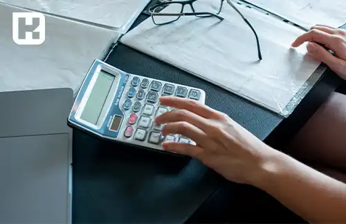
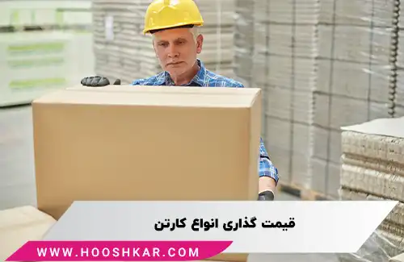

<blockquote style="background-color:#eeeefc; padding:0.5rem">

  
آنچه در این مطلب خواهید خواند:

  <ul>
    <li>چگونگی محاسبه قیمت ورق و کارتن</li>
    <li>عوامل تأثیرگذار در محاسبه قیمت کارتن چیست؟</li>
    <li>قیمت گذاری انواع کارتن</li>
    <ul>
     <li>قیمت کارتن ساده</li>
     <li>قیمت کارتن لمینتی</li>
     <li>قیمت کارتن هارد باکس یا تاشو</li>
    </ul>
  </ul>

</blockquote>

در <a href="https://www.hooshkar.com/Wiki/Business/HistoryPackagingIndustryIran
" target="_blank">صنعت بسته بندی</a>، محاسبه قیمت کارتن از اهمیت ویژه‌ای برخوردار است. این مقاله به بررسی فاکتورهای موثر بر قیمت گذاری محصولات کاغذی (ورق و کارتن) می پردازد.

## چگونگی محاسبه قیمت ورق و کارتن

برای محاسبه قیمت ورق کارتن بعد از به دست آوردن طول، عرض و ارتفاع کارتن، از فرمول زیر استفاده می‌شود:

**محاسبه قیمت ورق کارتن = طول × عرض × قیمت ورق خام**

با استفاده از این فرمول، ما تنها قیمت ورق کارتن را داریم. برای **محاسبه هزینه کل کارتن، باید حدود 5 تا 15 درصد به این مبلغ اضافه کنیم**، که شامل هزینه‌های مربوط به کار، چاپ و سایر عوامل در تولید کارتن می‌شود.

<blockquote style="background-color:#f5f5f5; padding:0.5rem">

<strong>آشنایی با <a href="https://www.hooshkar.com/Software/PrintingAndPackaging/Package/Carton" target="_blank">نرم افزار کارتن سازی</a> سایان
</strong></blockquote>

### عوامل تأثیرگذار در محاسبه قیمت کارتن چیست؟

مشخصات محصول و شکنندگی، هرچه نیازمندی‌های بسته‌بندی محصول پیچیده‌تر باشند، هزینه بیشتری باید برای بسته‌بندی آن مدنظر گرفته شود. همچنین، کارتن‌های بزرگتر به طور کلی نیاز به هزینه بیشتری دارند.

-	نوع چاپ
-	سادگی یا پیچیدگی کارتن
-	تعداد رنگ‌های چاپ
-	نوع کاغذ رویه
-	نوع کاغذ فلوت
-	نوع کاغذ زیره
-	هزینه کلیشه
-	هزینه قالب
-	هزینه طراحی
-	هزینه ارسال

### قیمت گذاری انواع کارتن

در روش محاسبه قیمت کارتن، هر نوع کارتن بر اساس تعداد لایه‌ها و نوع کاغذ استفاده شده در هر لایه قیمت‌گذاری می‌شود. اشتباه است که تصور کنیم کارتن با تعداد لایه‌های کمتر هزینه کمتری دارد؛ زیرا قیمت هر ورق کارتن بر اساس نوع کاغذ آن تعیین می‌شود و این قیمت‌ها با هم متفاوت است.

#### 1. قیمت کارتن ساده

در فرآیند محاسبه قیمت کارتن، توجه به تعداد عملیاتی که بر روی آن انجام شده است بسیار حیاتی است. کارتن‌های ساده یا معمولی، به دلیل داشتن قالب استاندارد و ویژه، کمترین حجم دور ریز را دارند. این امر باعث می‌شود قیمت آن‌ها نسبت به سایر انواع کارتن‌ها کمتر باشد و بیشترین انعطاف را برای استفاده در موارد مختلف فراهم کند.

<blockquote style="background-color:#f5f5f5; padding:0.5rem">

<strong>بیشتر بخوانید: <a href="https://www.hooshkar.com/Wiki/Business/CartonManufacturingProcess" target="_blank"> راه اندازی خط تولید کارخانه کارتن سازی</a>
</strong></blockquote>

#### 2. قیمت کارتن لمینتی

استفاده از کارتن لمینتی نسبت به کارتن معمولی، برای افزایش مقاومت و زیبایی محصول، بسیار رایج است. این نوع کارتن از چند لایه تشکیل شده است که توسط چسب سلیکاتی به هم متصل می‌شوند. این ویژگی‌ها باعث افزایش مقاومت کارتن می‌شود، اما همزمان قیمت آن نیز افزایش می‌یابد. از طرفی، زیبایی بیشتر این نوع کارتن در بازاریابی محصولات نقش مهمی ایفا می‌کند و می‌تواند جذابیت ویژه‌ای به محصولات ببخشد.

#### 3. قیمت کارتن هارد باکس یا تاشو

بسیاری از شرکت‌ها تمایل دارند محصولات خود را در جعبه‌های هارد باکس بسته بندی کنند؛ زیرا این عمل اغلب بازاریابی محصول را تقویت می‌کند اما زمانی که مشتریان فاکتور خرید جعبه‌های هارد باکس را مشاهده می‌کنند، ممکن است شگفت‌زده شوند. جعبه‌های هارد باکس، به عنوان جعبه‌های مقاوم و با کیفیت شناخته می‌شوند که ارزش محصول را در نظر مشتریان افزایش می‌دهند و جذابیت آن را دو چندان می‌کنند. این موضوع می‌تواند به افزایش فروش منجر شود.

اما در عین حال، هزینه‌های بالای تولید یا خرید جعبه‌های هارد باکس گاهی غیرقابل پرداخت به نظر می‌رسد. این هزینه‌های بالا ممکن است باعث شود که مشتریان کمتری به دنبال جعبه‌های هارد باکس بروند.

---
محاسبه دقیق کارتن را می توانید با نرم‌افزار سایان تجربه کنید. جهت دریافت مشاوره تخصصی و رایگان همین حالا با <a href="https://www.hooshkar.com" target="_blank">هوشکار</a> تماس بگیرید.