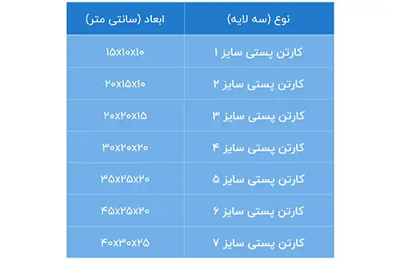

<blockquote style="background-color:#eeeefc; padding:0.5rem">

  
آنچه در این مطلب خواهید خواند:

  <ul>
  <li>بررسی عوامل موثر در قیمت‌گذاری ورق و کارتن</li>
  <ul>
    <li>تأثیر نرخ ارز و واردات مواد اولیه</li>
    <li>انواع فلوت و تاثیر آن بر هزینه</li>
    <li>تعداد لایه های ورق</li>
    <li>نوع کاغذ</li>
    <li>تعداد سفارش و تیراژ تولید</li>
    <li>هزینه‌های بسته‌بندی و حمل و نقل</li>
    <li>تأثیر استانداردها و مقررات زیست‌محیطی</li>
    <li>فصلی بودن تقاضا و تأثیر بر قیمت‌ها</li>
    <li>تأثیر تکنولوژی و تجهیزات مورد استفاده</li>
  </ul>
  <li>ابعاد کارتن را چگونه محاسبه کنیم؟</li>
  <ul>
    <li>تعیین ابعاد کارتن</li>
    <ul>
      <li>فرمول محاسبه طول کارتن یا جعبه</li>
      <li>فرمول محاسبه عرض کارتن یا جعبه</li>
    </ul>
    <li>انواع کارتن بر اساس ابعاد</li>
    <ul>
      <li>1. ابعاد استاندارد (کارتن پستی)</li>
      <li>2. کارتن مخصوص صادرات</li>
      <li>3. ابعاد سفارشی</li>
    </ul>
  </ul>
  </ul>

</blockquote>

قیمت‌گذاری ورق و کارتن به عنوان یکی از ارکان کلیدی در **<a href="https://www.hooshkar.com/Wiki/Business/HistoryPackagingIndustryIran
" target="_blank">صنعت بسته بندی</a>**، تأثیر چشمگیری بر هزینه‌های تولید و در نهایت بر قیمت تمام‌شده محصولات دارد. 
با توجه به تقاضای رو به رشد برای بسته‌بندی‌های باکیفیت و افزایش اهمیت صادرات، عوامل متعددی همچون نوع مواد اولیه، تعداد لایه‌ها، نوع چاپ و نوسانات بازار در تعیین قیمت نهایی این محصولات نقش ایفا می‌کنند. 

شناخت دقیق این فاکتورها می‌تواند به کسب‌وکارها کمک کند تا در محاسبه هزینه‌ها و انتخاب نوع بسته‌بندی، تصمیمات آگاهانه‌تری بگیرند و هزینه‌ها را به شکل بهینه مدیریت کنند. در این مقاله به بررسی جامع عواملی که در قیمت‌گذاری ورق و کارتن مؤثرند، پرداخته و نحوه تأثیرگذاری هر یک بر هزینه‌ها را توضیح خواهیم داد.

در فرآیند تولید کارتن، بهره‌گیری از فناوری‌های روز و نرم‌افزارهای تخصصی نقش بسزایی در بهبود کارایی و دقت دارد. یکی از این نرم‌افزارها، **<a href="https://www.hooshkar.com/Software/PrintingAndPackaging/Package/Carton" target="_blank">نرم افزار کارتن سازی سایان</a>** است که به تولیدکنندگان این امکان را می‌دهد تا فرآیندهای طراحی و تولید کارتن را به‌طور مؤثر مدیریت کنند. با استفاده از این نرم‌افزار، شما می‌توانید از ویژگی‌های پیشرفته آن برای بهینه‌سازی هزینه‌ها و زمان تولید بهره‌برداری کنید.

## بررسی عوامل موثر در قیمت‌گذاری ورق و کارتن

### تأثیر نرخ ارز و واردات مواد اولیه

یکی از مهم‌ترین عوامل مؤثر بر قیمت تمام‌شده، نوسانات نرخ ارز است، چرا که بسیاری از مواد اولیه (مانند کاغذ و مواد شیمیایی خاص) وارداتی هستند. این موضوع می‌تواند تاثیر مستقیمی بر قیمت‌گذاری ورق و کارتن داشته باشد.

### انواع فلوت و تاثیر آن بر هزینه

نوع فلوت به کار رفته در کارتن (مانند A, B, C, E, F) تأثیر مستقیم بر میزان مصرف مواد اولیه و استحکام کارتن دارد و می‌تواند باعث تغییر قیمت نهایی شود.

### تعداد لایه های ورق

کارتن‌ها معمولاً در انواع 3 لایه، 5 لایه و... تولید می‌شوند که هر یک تأثیر متفاوتی بر هزینه دارند.

### نوع کاغذ

نوع کاغذ مورد استفاده در تولید کارتن نیز عامل مهمی در تعیین هزینه نهایی است.

### تعداد سفارش و تیراژ تولید

قیمت کارتن‌ها به شدت تحت تأثیر تعداد تولید است. در سفارشات عمده و با تیراژ بالا، هزینه‌ها به‌دلیل صرفه‌جویی مقیاسی کاهش می‌یابد.

برای آشنایی بیشتر با فرآیندهای تولید و بهینه‌سازی کارتن‌ها، مقاله **<a href="https://www.hooshkar.com/Wiki/Business/CartonManufacturingProcess" target="_blank"> راه اندازی خط تولید کارخانه کارتن سازی</a>** می‌تواند به شما کمک کند. این مقاله به بررسی مراحل و نکات کلیدی در این حوزه پرداخته و به شما این امکان را می‌دهد تا درک عمیق‌تری از صنعت بسته‌بندی پیدا کنید.

### هزینه‌های بسته‌بندی و حمل و نقل

برخی شرکت‌ها هزینه‌های بسته‌بندی و حمل‌ونقل را به قیمت نهایی اضافه می‌کنند.

### تأثیر استانداردها و مقررات زیست‌محیطی

استفاده از کاغذهای بازیافتی و رعایت مقررات زیست‌محیطی به دلیل افزایش تقاضای مصرف‌کنندگان برای محصولات سازگار با محیط زیست، هزینه تولید را افزایش می‌دهد.

### فصلی بودن تقاضا و تأثیر بر قیمت‌ها

در برخی مواقع، به‌ویژه در فصل‌های خاص یا با نزدیکی به تعطیلات، تقاضا برای بسته‌بندی افزایش می‌یابد که می‌تواند منجر به تغییرات قیمتی شود.

### تأثیر تکنولوژی و تجهیزات مورد استفاده

شرکت‌هایی که از تجهیزات و تکنولوژی‌های پیشرفته برای تولید ورق و کارتن استفاده می‌کنند، ممکن است محصولاتی با کیفیت بالاتر و قیمت رقابتی‌تر ارائه دهند.

## ابعاد کارتن را چگونه محاسبه کنیم؟

محاسبه ابعاد کارتن یکی از مراحل اساسی است که تاثیر بسزایی بر کیفیت و کارایی بسته‌بندی دارد. این ابعاد به طور مستقیم وابسته به نیازها و مشخصات محصولات و همچنین نیازهای مشتریان است.

### تعیین ابعاد کارتن

در بازار داخلی، ابعاد محصولات بسته‌بندی کارتنی به شدت وابسته به نوع، وزن و نیازهای مشتریان متفاوت است. بنابراین، هیچ استاندارد یکتا برای تمامی کارتن‌های بسته‌بندی وجود ندارد و ابعاد آنها با توجه به متغیرهای مختلف مشتریان و محصولات متفاوت است. به همین دلیل، امکان دسترسی عموم به ابعاد استاندارد برای تولید کارتن‌ها و جعبه‌های بسته‌بندی وجود ندارد.

برای روشن‌تر شدن این موضوع، می‌توان به یک مثال اشاره کرد. اگر محصولی نظیر مواد غذایی باید درون یک کارتن بسته‌بندی شود، ابعاد آن با کارتنی که برای بسته ‌بندی لوازم استفاده می‌شود، متفاوت است. برای مواد غذایی، استفاده از مقواهای بهداشتی ضروری است، در حالی که برای بسته‌بندی لوازم این نیاز وجود ندارد.

**فرمول محاسبه طول کارتن یا جعبه**

طول کارتن = (طول × 2) + (عرض × 2) + لبه چسب مورد نیاز

**فرمول محاسبه عرض کارتن یا جعبه**

عرض کارتن = عرض + ارتفاع 

### انواع کارتن بر اساس ابعاد

#### 1. ابعاد استاندارد (کارتن پستی)

#### 2. کارتن مخصوص صادرات

اگر شما یک تولید کننده هستید که بخش قابل توجهی از محصولات خود را به خارج از کشور صادر می‌کنید، ضروری است که در مورد ابعاد کارتن‌های خود اطلاعات کاملی داشته باشید. این اطلاعات به شما کمک می‌کند تا محصولاتتان به درستی بسته بندی شده و از برگشت و مرجوعی آنها جلوگیری شود.

در بازارهای صادراتی، ابعاد استاندارد پالت‌ها معمولاً 120 در 80 یا 120 در 100 سانتی‌متر است. به همین دلیل، کارتن‌ها براساس اندازه این پالت‌ها و وزن و حجم محصولات، طراحی و تولید می‌شوند. بسیاری از محصولات صادراتی با استفاده از پالت حمل و جابجا می‌شوند؛ بنابراین، بسته‌بندی محصولاتی که قرار است به خارج از کشور صادر شوند، باید به‌گونه‌ای طراحی و تولید شود که بتوان آنها را روی این پالت‌ها قرار داد.

نکته‌ی دیگری که بسیار حیاتی است، حمل و نقل محصولات درون کارتن ‌های بسته‌بندی شده در کانتینرها است. اندازه طولی این کانتینرها معمولاً حدود 2 متر و 40 سانتی‌متر است، اما بیشتر از 2 متر و 20 سانتی‌متر فضای داخلی آنها برای چیدن محصولات به کار نمی‌رود.

#### 3. ابعاد سفارشی

کارتن‌ هایی که سفارشی تولید می‌شوند، به این معناست که مشتری طرح و رنگ آنها را مشخص می‌کند و ابعاد سفارشی از طریق کارشناسان فروش با توافق مشتریان تایید می‌شود.

---
محاسبه دقیق کارتن را می توانید با نرم‌افزار سایان تجربه کنید. جهت دریافت مشاوره تخصصی و رایگان همین حالا با <a href="https://www.hooshkar.com" target="_blank">هوشکار</a> تماس بگیرید.