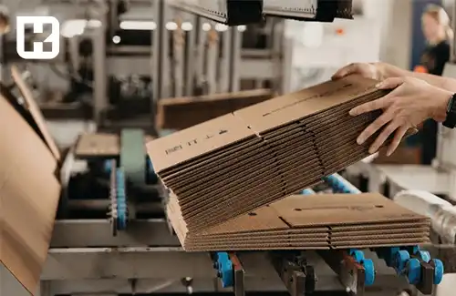
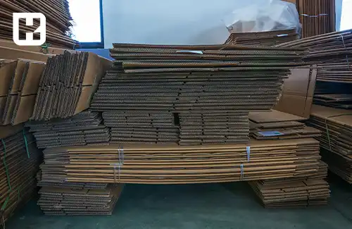

<blockquote style="background-color:#eeeefc; padding:0.5rem">

  
آنچه در این مطلب خواهید خواند:

  <ul>
    <li>تنوع مواد اولیه در صنعت تولید کارتن</li>
    <ul>
     <li>کاغذ رویی کارتن</li>
     <li>کاغذ داخلی کارتن</li>
    </ul>
    <li>اهمیت انتخاب مواد اولیه</li>
    <li>هزینه‌های مواد اولیه برای تولید کارتن</li>
    <li>اهمیت کیفیت در صنعت تولید کارتن</li>
    <li>تأثیر کیفیت مواد اولیه بر عمر مفید کارتن</li>
    <li>دلایل اصلی کاهش کیفیت کارتن</li>
  </ul>

</blockquote> 

این مقاله به بررسی موادی می‌پردازد که برای بخش‌های مختلف کارتن‌سازی به کار می‌روند، از جمله کاغذ رویی، کاغذ داخلی و لایه‌های موج دار. همچنین، اهمیت انتخاب مواد اولیه و هزینه‌های مرتبط با آن در فرآیند تولید کارتن و در ادامه چگونگی انتخاب مناسب مواد اولیه که بتواند به بهبود کیفیت و عملکرد نهایی محصول کمک کند می‌پردازیم و تأثیرات محیط زیستی مرتبط با انتخاب مواد اولیه نیز مورد بررسی قرار می‌گیرد.

<blockquote style="background-color:#f5f5f5; padding:0.5rem">

<strong>آشنایی با <a href="https://www.hooshkar.com/Software/PrintingAndPackaging/Package/Carton" target="_blank">نرم افزار کارتن سازی</a> سایان
</strong></blockquote>

## تنوع مواد اولیه در صنعت تولید کارتن

### کاغذ رویی کارتن:

در <a href="https://www.hooshkar.com/Wiki/Business/CartonIndustry" target="_blank">صنعت کارتن سازی</a>، انتخاب کاغذ برای بخش رویه بسیار حائز اهمیت است. معمولاً کاغذ رویه از دو لایه تشکیل شده است، شامل لایه رویی و لایه پایه. این نوع کاغذها معمولاً از روش‌های تولید کرافت یا شبه کرافت بهره می‌برند، که در آن از دو نوع الیاف تازه و الیاف بازیافتی استفاده می‌شود.
مزایای استفاده از این نوع کاغذها شامل مقاومت در برابر ترک‌خوردگی، سختی بالا، هزینه مناسب و قابلیت چاپ بالا می‌باشد.

بخش کنگره‌ای کارتن، یا همان لایه موج دار، که بین دو لایه کارتن است، وزنی بالغ بر ۱۱۲ تا ۱۸۰ گرم بر متر مربع دارد. برای تولید این کاغذ از مخلوطی از سولفیت خنثی نیمه شیمیایی، پهن‌برگان و الیاف بازیافتی استفاده می‌شود.

برخی موارد در تولید لایه میانی کارتن از خمیر نیمه شیمیایی به نام کاغذ فلوتینگ بهره می‌برند. اما در برخی نمونه‌ها، از روش فلوتینگ استفاده نمی‌شود و کاغذ مورد استفاده ۱۰۰ درصد از الیاف بازیافتی تشکیل شده که از اهار سطحی به عنوان عامل تقویتی استفاده می‌کند.
این روش‌ها در کارتن سازی برای افزایش مقاومت در برابر له شدن و شکستگی استفاده می‌شوند و به تقویت استحکام مکانیکی محصول کمک می‌کنند.

### کاغذ داخلی کارتن:
انتخاب مواد اولیه برای هر بخش کارتن، براساس نوع محصول و کاربرد نهایی آن صورت می‌گیرد. همانطور که بیان شد، ویژگی‌های مطلوب برای مواد اولیه بسته به کاربرد بسته‌بندی متفاوت خواهد بود. برای بخش داخلی کارتن، در برخی ویژگی‌ها، مشابه کاغذ رویی عمل می‌کند. 

کاغذهای استفاده شده برای این بخش نیازی به چاپ، صافی مناسب و... ندارند. به‌طور کلی، می‌توان تمام کاغذ داخلی کارتن را با استفاده از الیاف بازیافتی تولید کرد، به شرط رعایت اصول بهداشتی.
### اهمیت انتخاب مواد اولیه

با توجه به رشد روزافزون بازار مصرف کارتن و نقش برجسته‌ای که کارتن‌ها در صنایع بسته‌بندی دارند، انتخاب مواد اولیه برای خط تولید کارتن سازی به مرحله‌ای حیاتی مبدل شده است. در این فرآیند، ابتدا باید مشخص شود که کارتن برای بسته‌بندی کدام نوع محصول مورد استفاده قرار می‌گیرد. 

به طور معمول، برای بسته‌بندی مواد غذایی، دارو، لوازم الکترونیکی و سایر محصولات، از کارتن‌هایی با مواد اولیه درجه یک استفاده می‌شود تا به کیفیت نهایی محصول بسته‌بندی شده آسیبی نزند و اثرات غیرمطلوبی روی آن ایجاد نشود.

<blockquote style="background-color:#f5f5f5; padding:0.5rem">

<strong>بیشتر بخوانید: <a href="https://www.hooshkar.com/Wiki/Business/FlutedVsDuplexCarton" target="_blank">تفاوت کارتن فلکسویی و لمینتی چیست؟</a>
</strong></blockquote>

### هزینه‌های مواد اولیه برای تولید کارتن

مواد اولیه مورد استفاده برای تولید کارتن سازی از جنس‌های سازگار با محیط زیست و قابل بازیافت استفاده می‌شود. این مواد عمدتا به دو دسته بازیافتی و شیمیایی تقسیم می‌شوند. مواد بازیافتی، که قیمت کمتری نسبت به مواد شیمیایی دارند، معمولا در تولید کارتن‌هایی استفاده می‌شوند که برای محصولاتی مانند لوازم خانگی یا تخم مرغ و غیره که ظاهر و جنس کارتن بر روی محصول تأثیر زیادی ندارد، مناسب هستند. 

اما در برخی موارد، از خمیر چوب برای تولید مقوای کارتن‌ها استفاده می‌شود که این مواد قیمتی بالاتر دارند. با این حال، آنها دارای کیفیت بالا، رعایت اصول بهداشتی، مقاومت بالا، قابلیت چاپ و شکل‌دهی آسان و ویژگی‌های مثبت دیگری هستند. 

در گذشته، توجه کافی به فرآیند تولید و بازیافت کارتن وجود نداشت، اما امروزه این صنعت به بازیافت در سطح جهانی توجه می‌کند و به این وسیله، تلاش می‌شود تا ضایعات را دوباره به چرخه تولید برگردانده و تهدیدات محیط زیست را کاهش دهد.

### اهمیت کیفیت در صنعت تولید کارتن

- **رضایت مشتریان:** کیفیت بالا باعث رضایت مشتریان می‌شود و آنها را به مشتریان وفادار تبدیل می‌کند.
- **کاهش ضایعات:** تولید محصولات با کیفیت، ضایعات را به حداقل می‌رساند و به حفظ منابع و صرفه‌جویی در هزینه‌ها کمک می‌کند.
- **افزایش طول عمر:** محصولات با کیفیت، طول عمر بیشتری دارند و نیاز به تعویض یا تعمیر زودهنگام آنها کمتر است.
- **حفظ سلامت محیط زیست:** فرآیند تولید با کیفیت، ضایعات و آلاینده‌های کمتری به محیط زیست وارد می‌کند.
- **ارتقای برند:** ارائه محصولات با کیفیت، به ارتقای برند و افزایش اعتبار شرکت در بازار کمک می‌کند.

### تأثیر کیفیت مواد اولیه بر عمر مفید کارتن

**1. الیاف چوبی:** الیاف بلندتر و قوی‌تر، استحکام و انعطاف‌پذیری کارتن را افزایش 
می‌دهد.

**2. مواد افزودنی و پوشش‌ها:** استفاده از آهار و مواد ضد رطوبت، پوشش‌های نایلونی یا لمینت، مقاومت کارتن را در برابر رطوبت، روغن‌ها و مواد شیمیایی بهبود می‌بخشد.

**3. فرآیند تولید:** تولید دقیق و کنترل کیفیت مناسب، استحکام و پایداری کارتن را افزایش می‌دهد.

**4. شرایط نگهداری:** نگهداری مناسب مواد اولیه از تخریب و کاهش کیفیت آنها جلوگیری می‌کند.

**5. یکپارچگی مواد:** مواد اولیه یکنواخت و همگن، کیفیت یکنواخت کارتن‌ها را تضمین می‌کنند.

**6. مقاومت محیطی:** مواد اولیه با کیفیت بالا، مقاومت بیشتری در برابر عوامل محیطی دارند.

<blockquote style="background-color:#f5f5f5; padding:0.5rem">

<strong>بیشتر بخوانید: <a href="https://www.hooshkar.com/Wiki/Business/CartonIndustryMachinery" target="_blank">راهنمای خرید ماشین آلات کارتن سازی</a>
</strong></blockquote>

### دلایل اصلی کاهش کیفیت کارتن

**رطوبت:**

مواد اولیه مورد استفاده در ساخت کاغذ و مقوا از الیاف چوبی تهیه می‌شوند که خاصیت جذب رطوبت دارند. به همین دلیل، محصولات صنایع کارتن‌سازی نیز این ویژگی را دارا هستند. در صورتی که از آهار و مواد افزودنی ضد رطوبت در تولید این محصولات استفاده نشود، الیاف رطوبت را جذب کرده و پیوند بین آنها ضعیف می‌شود.

در شرایط رطوبت بالا، لبه‌های کاغذ و مقوا از هم جدا شده و متلاشی می‌شوند. بنابراین، رطوبت یکی از مهم‌ترین عوامل تخریب کارتن‌های مقوایی است، به‌ویژه کارتن‌ هایی که از کاغذهای معمولی و بدون آهار ساخته شده‌اند. 

**دما:**

تغییرات دما تاثیر قابل توجهی بر چسب و مقاومت مقوای کارتن بسته‌بندی ندارد و تنها موجب خشکی الیاف می‌شود. با این حال، دمای زیاد می‌تواند باعث تغییر رنگ، خمیدگی و سوختن مقوا گردد. ترکیب دما و رطوبت می‌تواند شرایط رشد عوامل بیولوژیکی و مخرب را فراهم کند. 

**نور:**

نور به تنهایی و بدون افزایش دما تاثیر چندانی بر مقوا ندارد. با این حال، قرار گرفتن مقوا در معرض نور می‌تواند باعث تغییر رنگ ظاهری و سطحی آن شود، علایم چاپی را کم‌رنگ کند و در صورت استفاده از چسب، اتصالات را تضعیف نماید.

**گرد و غبار:**

گرد و غبار می‌تواند چسب بین لبه‌ها را تضعیف کرده و باعث فرسایش سطحی مقوا شود. با این حال، به طور کلی تاثیر چشمگیری بر محصولات و کیفیت کارتن ندارد.

**روغن‌ها و مواد چرب:**

روغن‌ها و مواد چرب می‌توانند باعث کاهش مقاومت و استحکام اولیه مقوا و کاغذ شوند، مگر اینکه مقوا مقاوم به چربی باشد یا در فرآیند تولید کارتن مقوایی از پوشش نایلونی یا لمینت استفاده شده‌باشد. 

این عوامل، در صنعت کارتن‌سازی، بر کیفیت کارتن اثر می‌گذارند.