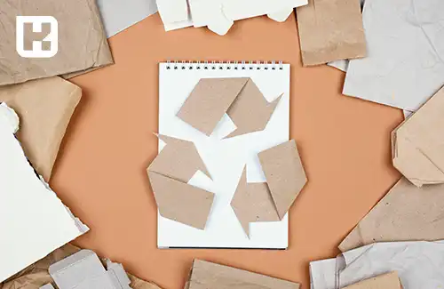

<blockquote style="background-color:#eeeefc; padding:0.5rem">

  
آنچه در این مطلب خواهید خواند

  <ul>
     <li>تنوع مواد اولیه در صنعت تولید کارتن</li>
    <li>اهمیت انتخاب مواد اولیه در خط تولید کارتن سازی</li>
    <li>هزینه‌های مواد اولیه برای تولید کارتن در خط تولید</li>
    <li>جمع بندی</li>
  </ul>

</blockquote> 

**مقدمه**

این مقاله به بررسی موادی می‌پردازد که برای بخش‌های مختلف کارتن‌سازی به کار می‌روند، از جمله کاغذ رویی، کاغذ داخلی و لایه‌های موج دار. همچنین، اهمیت انتخاب مواد اولیه و هزینه‌های مرتبط با آن در فرآیند تولید کارتن و در ادامه چگونگی انتخاب مناسب مواد اولیه که بتواند به بهبود کیفیت و عملکرد نهایی محصول کمک کند می‌پردازیم و تأثیرات محیط زیستی مرتبط با انتخاب مواد اولیه نیز مورد بررسی قرار می‌گیرد.

<blockquote style="background-color:#f5f5f5; padding:0.5rem">

<strong>آشنایی با <a href="https://www.hooshkar.com/Software/PrintingAndPackaging/Package/Carton" target="_blank">نرم افزار کارتن سازی</a> سایان
</strong></blockquote>

## تنوع مواد اولیه در صنعت تولید کارتن:

### کاغذ رویی کارتن:

در صنعت کارتن سازی، انتخاب کاغذ برای بخش رویه بسیار حائز اهمیت است. معمولاً کاغذ رویه از دو لایه تشکیل شده است، شامل لایه رویی و لایه پایه. این نوع کاغذها معمولاً از روش‌های تولید کرافت یا شبه کرافت بهره می‌برند، که در آن از دو نوع الیاف تازه و الیاف بازیافتی استفاده می‌شود.

مزایای استفاده از این نوع کاغذها شامل مقاومت در برابر ترک‌خوردگی، سختی بالا، هزینه مناسب و قابلیت چاپ بالا می‌باشد.

بخش کنگره‌ای کارتن، یا همان لایه موج دار، که بین دو لایه کارتن است، وزنی بالغ بر ۱۱۲ تا ۱۸۰ گرم بر متر مربع دارد. برای تولید این کاغذ از مخلوطی از سولفیت خنثی نیمه شیمیایی، پهن‌برگان و الیاف بازیافتی استفاده می‌شود.
برخی موارد در تولید لایه میانی کارتن از خمیر نیمه شیمیایی به نام کاغذ فلوتینگ بهره می‌برند. اما در برخی نمونه‌ها، از روش فلوتینگ استفاده نمی‌شود و کاغذ مورد استفاده ۱۰۰ درصد از الیاف بازیافتی تشکیل شده که از اهار سطحی به عنوان عامل تقویتی استفاده می‌کند.

این روش‌ها در کارتن سازی برای افزایش مقاومت در برابر له شدن و شکستگی استفاده می‌شوند و به تقویت استحکام مکانیکی محصول کمک می‌کنند.

### کاغذ داخلی کارتن:
انتخاب مواد اولیه برای هر بخش کارتن، براساس نوع محصول و کاربرد نهایی آن صورت می‌گیرد. همانطور که بیان شد، ویژگی‌های مطلوب برای مواد اولیه بسته به کاربرد بسته‌بندی متفاوت خواهد بود. برای بخش داخلی کارتن، در برخی ویژگی‌ها، مشابه کاغذ رویی عمل می‌کند. 

کاغذهای استفاده شده برای این بخش نیازی به چاپ، صافی مناسب برای چاپ و ... ندارند. به طور کلی، می‌توان کل کاغذ داخلی کارتن را از الیاف بازیافتی تولید کرد، با شرطی که نکات بهداشتی و اصول بهداشتی در آن رعایت شده باشد.

### اهمیت انتخاب مواد اولیه در خط تولید کارتن سازی

با توجه به رشد روزافزون بازار مصرف کارتن و نقش برجسته‌ای که کارتن‌ها در صنایع بسته‌بندی دارند، انتخاب مواد اولیه برای خط تولید کارتن سازی به مرحله‌ای حیاتی مبدل شده است. در این فرآیند، ابتدا باید مشخص شود که کارتن برای بسته‌بندی کدام نوع محصول مورد استفاده قرار می‌گیرد. به طور معمول، برای بسته‌بندی مواد غذایی، دارو، لوازم الکترونیکی و سایر محصولات، از کارتن‌هایی با مواد اولیه درجه یک استفاده می‌شود تا به کیفیت نهایی محصول بسته‌بندی شده آسیبی نزند و اثرات غیرمطلوبی روی آن ایجاد نشود.

### هزینه‌های مواد اولیه برای تولید کارتن در خط تولید

مواد اولیه مورد استفاده برای تولید کارتن سازی از جنس‌های سازگار با محیط زیست و قابل بازیافت استفاده می‌شود. این مواد عمدتا به دو دسته بازیافتی و شیمیایی تقسیم می‌شوند. مواد بازیافتی، که قیمت کمتری نسبت به مواد شیمیایی دارند، معمولا در تولید کارتن‌هایی استفاده می‌شوند که برای محصولاتی مانند لوازم خانگی یا تخم مرغ و غیره که ظاهر و جنس کارتن بر روی محصول تأثیر زیادی ندارد، مناسب هستند. 

اما در برخی موارد، از خمیر چوب برای تولید مقوای کارتن‌ها استفاده می‌شود که این مواد قیمتی بالاتر دارند. با این حال، آنها دارای کیفیت بالا، رعایت اصول بهداشتی، مقاومت بالا، قابلیت چاپ و شکل‌دهی آسان و دیگر ویژگی‌های مثبت دیگری هستند. 

در گذشته، توجه کافی به فرآیند تولید و بازیافت کارتن وجود نداشت، اما امروزه این صنعت به بازیافت در سطح جهانی توجه می‌کند و به این وسیله، تلاش می‌شود تا ضایعات را دوباره به چرخه تولید برگردانده و تهدیدات محیط زیست را کاهش دهد.

#### جمع بندی: 
در این مقاله، مواد اولیه مورد نیاز برای تولید کارتن مانند کاغذ رویی، لایه موج دار میانی و کاغذ داخلی بررسی شده است. اهمیت انتخاب مناسب این مواد اولیه برای کیفیت نهایی، عملکرد و اثرات زیست محیطی محصول کارتن مورد تأکید قرار گرفته است. همچنین به هزینه های مرتبط با مواد اولیه اشاره شده و نقش بازیافت در کاهش ضایعات و آلودگی محیط زیست در این صنعت بیان شده است.

