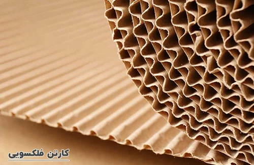
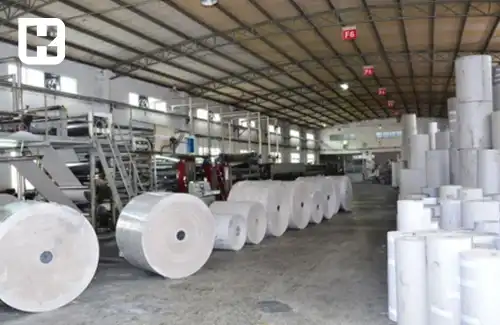

<blockquote style="background-color:#eeeefc; padding:0.5rem">

  
آنچه در این مطلب خواهید خواند:

  <ul> 
  <li>کارتن فلکسویی (Fluted Carton)</li>
  <li>کارتن لمینتی (Duplex Carton)</li>
  <li>انتخاب مناسب برای بسته‌بندی شما</li>
  </ul>

</blockquote>

در <a href="https://www.hooshkar.com/Wiki/Business/CartonIndustry" target="_blank">صنعت کارتن سازی</a>، دو نوع کارتن رایج است که شامل کارتن فلکسویی و کارتن لمینتی می‌شود. این دو نوع کارتن دارای ویژگی‌ها و کاربردهای مختلفی هستند. 

### 1. کارتن فلکسویی (Fluted Carton):

کارتن فلکسویی، به کارتن هایی گفته می شود که از کاغذ قهوه ای (کرافت) یا سفید طی فرایندی به نام فلکسو تولید می شوند.
کارتن فلکسویی برای بسته بندی محصولات ساده استفاده می‌شود.

**مزایا:**

- هزینه کمتر: کارتن فلکسویی اغلب ارزان‌تر از کارتن لمینتی است، به ویژه در زمینه هزینه تولید و قیمت نهایی.
-    قابلیت بازیافت: این نوع کارتن قابلیت بازیافت بالایی دارد، که از لحاظ محیط زیستی مزیتی بزرگ است.
- چاپ فلکسوگرافی: قابلیت چاپ روی سطح آن با استفاده از تکنولوژی فلکسو، که امکان چاپ با کیفیت و چند رنگ را فراهم می‌کند.

**معایب:**

-  مقاومت کم در برابر آب و رطوبت: نسبت به کارتن لمینتی، کمترین مقاومت در برابر آب و رطوبت را دارد.
- استحکام کمتر: به خصوص در برابر ضربه و فشار نسبت به کارتن لمینتی.

<blockquote style="background-color:#f5f5f5; padding:0.5rem">

<strong>آشنایی با <a href="https://www.hooshkar.com/Software/PrintingAndPackaging/Package/Carton" target="_blank">نرم افزار حسابداری چاپخانه</a> سایان
</strong></blockquote>

### 2. کارتن لمینتی (Duplex Carton):

کارتن لمینتی دارای دو لایه کاغذی متصل به یکدیگر است. این نوع کارتن معمولاً دارای لایه‌هایی از کاغذ سفید در بالا و پایین است که به صورت لمینیت (پوشش) روی کارتن قرار می‌گیرند.

 کارتن لمینتی به دلیل ظاهر زیبا و قابلیت چاپ بالا، در بسته‌بندی محصولات با ارزش مانند لوازم آرایشی، الکترونیکی، کتاب‌ها، جواهرات و سایر محصولات لوکس استفاده می‌شود.

همچنین، علاوه بر این دو نوع کارتن، نوع‌های دیگری نیز در صنعت کارتن سازی وجود دارند، از جمله کارتن همراه با روکش پلاستیکی (به عنوان مثال کارتن پلاست)، کارتن میکروفلوت (Microflute) که برای بسته‌بندی محصولات حساس استفاده می‌شود.

**مزایا:**

-	مقاومت بالا در برابر آب و رطوبت: کارتن لمینتی با مقاومت بالای خود در برابر آب و رطوبت، گزینه‌ای ایده‌آل برای بسته‌بندی محصولاتی است که نیاز به حفظ خواص در شرایط مرطوب و طولانی‌مدت دارند.
-	استحکام بالا: دارای استحکام بیشتر در برابر ضربه و فشار نسبت به کارتن فلکسویی
-	ظاهر با کیفیت: امکان ارائه ظاهری با کیفیت‌تر و براق‌تر.

**معایب:**

- هزینه بالاتر: کارتن لمینتی هزینه تولید و قیمت نهایی بیشتری دارد.
- کمترین قابلیت بازیافت

<blockquote style="background-color:#f5f5f5; padding:0.5rem">

<strong>بیشتر بخوانید: <a href="https://www.hooshkar.com/Wiki/Business/HistoryPackagingIndustryIran" target="_blank">سیر تکامل صنعت بسته‌بندی؛ از گذشته تا امروز</a>
</strong></blockquote>

### انتخاب مناسب برای بسته‌بندی شما

برای انتخاب بین کارتن‌های فلکسویی و لمینتی، باید نیازهای خاص بسته‌بندی محصول خود را در نظر بگیرید:

**نوع و ویژگی‌های محصول:** برای محصولات سنگین و حجیم که نیاز به مقاومت بالاتری دارند، کارتن‌های لمینتی مناسب‌ترند. برای محصولات سبک‌ و ساده‌تر، کارتن‌های فلکسویی کافی هستند.

**بودجه:** اگر به دنبال کاهش هزینه‌های بسته‌بندی هستید، کارتن‌های فلکسویی گزینه مناسبی خواهند بود.

**هدف بازاریابی:** اگر بسته‌بندی محصول شما نیاز به جذابیت و کیفیت بصری بالایی دارد، از کارتن‌های لمینتی استفاده کنید.

**شرایط حمل و نقل و نگهداری:** در شرایطی که محصول نیاز به حفاظت بیشتر در برابر عوامل محیطی دارد، کارتن‌های لمینتی بهتر عمل می‌کنند.

با در نظر گرفتن این موارد، می‌توانید بهترین نوع کارتن بسته‌بندی را برای محصولات خود انتخاب کنید تا هم نیازهای عملیاتی و هم نیازهای بازاریابی شما را به بهترین شکل برآورده سازد.