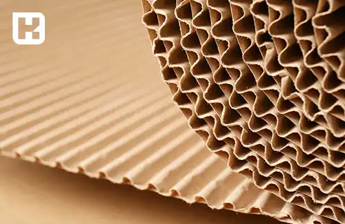

## تفاوت های کارتن فلکسویی و کارتن لمینتی در چیست؟

در <a href="https://www.hooshkar.com/Wiki/Business/CartonIndustry" target="_blank">صنعت کارتن سازی</a>، دو نوع کارتن رایج است که شامل کارتن فلکسویی و کارتن لمینتی می‌شود. این دو نوع کارتن دارای ویژگی‌ها و کاربردهای مختلفی هستند. 

### 1. کارتن فلکسویی (Fluted Carton):

کارتن فلکسویی یا همان کارتن ممبرانی، شامل لایه‌هایی از کاغذ با سلول‌های خالی در وسط آن است. این سلول‌ها باعث افزایش مقاومت و سبکی کارتن می‌شوند. 
لایه‌های کاغذی در دو طرف سلول‌ها (یک لایه کاغذی در بالا و یک لایه کاغذی در پایین) قرار می‌گیرند. 

این نوع کارتن به دلیل وزن سبک، مقاومت به خمش و قابلیت قابل بازیافت در بسته‌بندی محصولات مختلف استفاده می‌شود. کارتن فلکسویی برای ساخت جعبه‌ها، ظروف و سازه‌های بسته‌بندی استفاده می‌شود.

<blockquote style="background-color:#f5f5f5; padding:0.5rem">

<strong>آشنایی با <a href="https://www.hooshkar.com/Software/PrintingAndPackaging/Package/Carton" target="_blank">نرم افزار حسابداری چاپخانه</a> سایان
</strong></blockquote>

### 2. کارتن لمینتی (Duplex Carton):

کارتن لمینتی دارای دو لایه کاغذی متصل به یکدیگر است. این نوع کارتن معمولاً دارای لایه‌هایی از کاغذ سفید در بالا و پایین است که به صورت لمینیت (پوشش) روی کارتن قرار می‌گیرند. 

لایه‌های کاغذی لمینت شده باعث افزایش مقاومت، صلابت و زیبایی کارتن می‌شوند. کارتن لمینتی به دلیل ظاهر زیبا و قابلیت چاپ بالا، در بسته‌بندی محصولات با ارزش مانند لوازم آرایشی، الکترونیکی، کتاب‌ها، جواهرات و سایر محصولات لوکس استفاده می‌شود.

همچنین، علاوه بر این دو نوع کارتن، نوع‌های دیگری نیز در صنعت کارتن سازی وجود دارند، از جمله کارتن همراه با روکش پلاستیکی (به عنوان مثال کارتن پلاست)، کارتن میکروفلوت (Microflute) که دارای سلول‌هایی با اندازه کوچکتر است و برای بسته‌بندی محصولات حساس استفاده می‌شود
