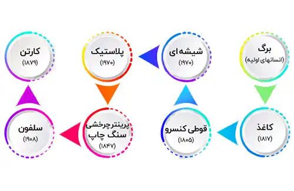

## تاریخچه بسته بندی در ایران

تاریخچه صنعت بسته بندی در ایران، در مقایسه با تاریخچه اروپا، به دوران نیم قرن پیش باز می‌گردد. در اروپا، شروع این صنعت نزدیک به دو قرن می رسد، اما در ایران، این رشته فعالیت به نیم قرن قبل برمی گردد.

صنعت بسته بندی در ایران در سال 1309 با تولید اولین قوطی‌های فلزی در یک کارخانه شخصی به نام "درخشان" آغاز شد. از آن پس، شرایط مناسب برای تأسیس کارخانه‌های دیگر در این زمینه در ایران فراهم شد.

<blockquote style="background-color:#f5f5f5; padding:0.5rem">
مطلب پیشنهادی: <a href="https://www.hooshkar.com/Wiki/Business/CartonIndustry" target="_blank"> صنعت کارتن سازی و راهنمای کامل برای ورود به آن
</a></blockquote>

در سال 1328، کارخانه کاغذ سازی کهریزک تأسیس شد و تولید مقوا و کاغذ در ایران آغاز شد. این کارخانه از کاغذهای باطله بهره‌برد و رشد چشمگیری را تجربه کرد.

سال 1330 شاهد تولید اولین قوطی‌های فلزی برای بسته بندی و نگهداری روغن‌های نباتی جامد در شرایط محیطی متفاوت بودیم. این قوطی‌ها در حال حاضر همچنان برای بسته بندی روغن‌های جامد استفاده می‌شوند، اما با استفاده از مواد بهتر و فناوری‌های پیشرفته‌تر ساخته می‌شوند.

در سال 1344، کارخانه کهریزک با بهره‌برداری از سیستم مجهز لاک‌زنی اتوماتیک، کار خود را با سرعت بیشتری انجام داد.

کارخانه هفت تپه در خوزستان هم به عنوان اولین کارخانه مدرن ایران شناخته می‌شود که در سال‌های اخیر توانایی تولید لایه‌های بیرونی کارتن را دارد. همچنین، لایه‌های پلیمری برای بسته بندی محصولات پاستوریزه نیز در حال تولید در ایران هستند.

<blockquote style="background-color:#f5f5f5; padding:0.5rem">
مطلب پیشنهادی: <a href="https://www.hooshkar.com/Software/PrintingAndPackaging" target="_blank">آشنایی با امکانات نرم افزار  صنایع چاپ و بسته بندی
</a></blockquote>