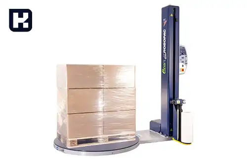
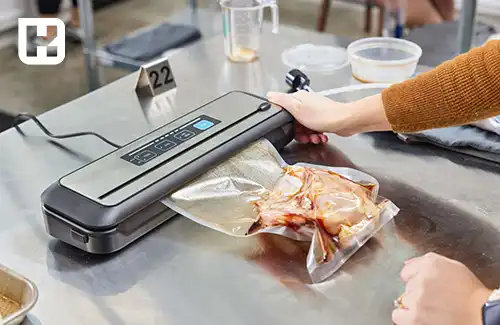
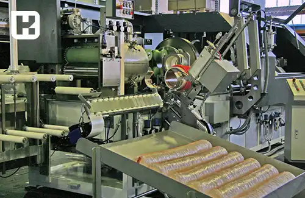

<blockquote style="background-color:#eeeefc; padding:0.5rem">

  
آنچه در این مطلب خواهید خواند:

  <ul>
    <li>تاریخچه بسته بندی در ایران</li>
    <li>تحول و تکامل بسته بندی مدرن</li>
    <li>شرکت های پیشرو در بسته بندی</li>
    <li>آشنایی با دستگاه‌های بسته‌بندی و انواع آن</li>
  </ul>

</blockquote> 

## تاریخچه بسته بندی در ایران

تاریخچه صنعت بسته بندی در ایران، در مقایسه با تاریخچه اروپا، به دوران نیم قرن پیش باز می‌گردد. در اروپا، شروع این صنعت نزدیک به دو قرن می رسد، اما در ایران، این رشته فعالیت به نیم قرن قبل برمی گردد.

صنعت بسته بندی در ایران در سال 1309 با تولید اولین قوطی‌های فلزی در یک کارخانه شخصی به نام "درخشان" آغاز شد. از آن پس، شرایط مناسب برای تأسیس کارخانه‌های دیگر در این زمینه در ایران فراهم شد.

<blockquote style="background-color:#f5f5f5; padding:0.5rem">

<strong>آشنایی با <a href="https://www.hooshkar.com/Software/PrintingAndPackaging" target="_blank">نرم افزار چاپ و بسته بندی</a> سایان
</strong></blockquote>

در سال 1328، کارخانه کاغذ سازی کهریزک تأسیس شد و تولید مقوا و کاغذ در ایران آغاز شد. این کارخانه از کاغذهای باطله بهره‌برد و رشد چشمگیری را تجربه کرد.

سال 1330 شاهد تولید اولین قوطی‌های فلزی برای بسته بندی و نگهداری روغن‌های نباتی جامد در شرایط محیطی متفاوت بودیم. این قوطی‌ها در حال حاضر همچنان برای بسته بندی روغن‌های جامد استفاده می‌شوند، اما با استفاده از مواد بهتر و فناوری‌های پیشرفته‌تر ساخته می‌شوند.

در سال 1344، کارخانه کهریزک با بهره‌برداری از سیستم مجهز لاک‌زنی اتوماتیک، کار خود را با سرعت بیشتری انجام داد.

کارخانه هفت تپه در خوزستان هم به عنوان اولین کارخانه مدرن ایران شناخته می‌شود که در سال‌های اخیر توانایی تولید لایه‌های بیرونی کارتن را دارد. همچنین، لایه‌های پلیمری برای بسته بندی محصولات پاستوریزه نیز در حال تولید در ایران هستند.

<blockquote style="background-color:#f5f5f5; padding:0.5rem">

<strong>بیشتر بخوانید: <a href="https://www.hooshkar.com/Wiki/Business/CartonIndustry" target="_blank">آشنایی با صنعت کارتن سازی</a>
</strong></blockquote>

### تحول و تکامل بسته بندی مدرن

با رواج آموزش‌های نوین در زمینه طراحی بسته‌بندی، افزایش دانش و ساخت دستگاه‌های متنوع، بسته‌بندی از شکل اولیه خود یعنی مقوا و کاغذ، به استفاده از مواد دیگری همچون شیشه، پلاستیک و آهن نیز گسترش یافت. تولید دستگاه‌های مختلف برای لاک، برش و شکل‌دهی به انواع متریال، این امکان را فراهم کرد تا مواد گوناگون به بسته‌بندی‌های متنوع‌تر و جذاب‌تر تبدیل شوند. این جذابیت بیشتر برای مخاطب، منجر به افزایش نرخ فروش محصولات گردید.

شرکت‌های صنایع غذایی، نوشیدنی، دارویی و آرایشی بیش از گذشته به استفاده از فناوری‌های دستگاه‌های چاپ و برش برای بسته‌بندی محصولات خود روی آوردند. بهره‌گیری از تکنولوژی نانو، میکروب‌زدایی، افزودن عطر و استفاده از مواد ضدباکتری در تولید بسته‌بندی‌ها، مسیر تاریخچه بسته‌بندی مدرن را تغییر داد. این پیشرفت‌ها باعث شد تا محصولات مدت زمان بیشتری قابل مصرف باشند، از خراب شدن آن‌ها جلوگیری شود و یا حتی ظاهر و رنگ متفاوتی به خود بگیرند.

شرکت‌های معروفی مانند کوکاکولا و نایک، در مسیر تولید و بسته‌بندی خلاقیت‌های بسیاری را به وجود آورده‌اند. با پیشرفت فناوری، تاریخچه بسته‌بندی در سه بخش مختلف (پلاستیک، شیشه و فلز) با بسته‌بندی‌های مدرن و به‌روز در حال تکامل است. توجه به طراحی‌های به‌روز نیز در رقابت بین برندها حائز اهمیت بوده و خواهد بود.

### شرکت های پیشرو در بسته بندی

در صنعت بسته بندی، رقابت در بین شرکت های غذایی و آشامیدنی بیشترین میزان را دارد. توجه به تغذیه، سود بسیار زیادی را برای تولیدکنندگان به ارمغان آورده است. بعد از آن صنعت دارویی و سپس آرایشی بهداشتی در صدر لیست شرکت های پیشرو بسته بندی فعالیت می کنند. همچنین توجه به محیط زیست، قابلیت بازیافت در کنار تولید مناسب و ایجاد ساختارهایی که جلب توجه مخاطب را داشته باشند، برای تمامی شرکت ها در اولویت است.

مک دونالد، بزرگترین شرکت تولید فست فود به صورت فروشگاه های زنجیره ای در دنیاست که محصولات گوشتی و نوشیدنی را در انواع بسته بندی با رنگ های معروف قرمز و نارنجی تولید می کند. سادگی در طراحی و توجه به کاربردی بودن ابعاد و ساختار برش این محصولات، باعث شده تا استفاده و حمل و نقل محصولات این شرکت براحتی امکان پذیر باشد.

تیفانی، یکی از مطرح ترین برندهای زیورآلات لوکس و طلا جواهر می باشد. محصولات بسته بندی این شرکت به خاطر رنگ یک دست، سادگی در طراحی و فرم منحنی نرم و زیبایی آن بسیار معروفند. شرکت تیفانی در اکثر محصولات خود سعی می کند سادگی را با لوگوی خود همراه سازد و کاربرد رنگ مشکی و بنفش آنها در طراحی محصولات همیشه مورد توجه بوده است.

نایک، یکی از بزرگترین تولیدکنندگان کفش های ورزشی در دنیاست. این شرکت علاوه بر تولید کفش هایی ویژه، در طراحی بسته بندی محصول، سادگی و مقاومت بسته بندی مقوایی در ابعاد درست و دوم کاربرد ساختارهای برش که باعث می شود باز کردن بسته بندی با چالشهایی خلاق همراه باشد در نظر خریدار تعریف شود.

اپل، همواره پیشرو در صنعت محصولات الکترونیک بوده است و از بسته‌بندی‌های ویژه بهره می‌برد. طراحی متمرکز بر آرامش، با درب‌هایی که به آرامی بسته می‌شوند و انتخاب در گوشه‌های نرم بسته، همیشه به عنوان ویژگی‌های اصلی بسته‌بندی این شرکت شناخته می‌شود. استفاده از رنگ خاکستری خاص که با لوگو سیب مشهور این برند همراه است، در نظر خریداران احساس کیفیت و استحکام می‌آورد.

<blockquote style="background-color:#f5f5f5; padding:0.5rem">

<strong>بیشتر بخوانید: <a href="https://www.hooshkar.com/Wiki/Business/CartonIndustryMachinery" target="_blank">راهنمای خرید ماشین آلات کارتن سازی</a>
</strong></blockquote>

### آشنایی با دستگاه‌های بسته‌بندی و انواع آن
در این صنعت، بسته‌بندی هر محصول با توجه به جنس و حجم آن نیازمند استفاده از دستگاه‌های مختلفی است. دستگاه‌های بسته‌بندی به تجهیزاتی گفته می‌شود که برای بسته‌بندی محصولات در انواع مختلف بسته‌ها نظیر کیسه‌ها، جعبه‌ها، بطری‌ها و غیره به کار می‌روند. 

این دستگاه‌ها می‌توانند به صورت خودکار یا نیمه‌خودکار عمل کرده و بسته‌بندی را سریع و دقیق انجام دهند. از دستگاه‌های بسته‌بندی در صنایع متنوعی نظیر صنایع غذایی، داروسازی، لوازم بهداشتی و سایر صنایع استفاده می‌شود. این دستگاه‌ها با توجه به نیازهای مختلف صنایع، انواع گوناگونی دارند. در ادامه به برخی از این دستگاه‌ها اشاره خواهیم کرد:

-	دستگاه استرچ کش

-	دستگاه سیل  وکیوم

-	دستگاه تاریخ زن

-	دستگاه شیرینگ

