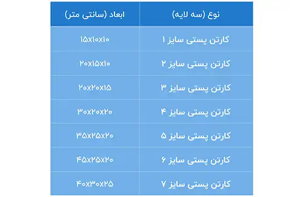

<blockquote style="background-color:#eeeefc; padding:0.5rem">

  
آنچه در این مطلب خواهید خواند:

  <ul>
    <li>تعیین ابعاد کارتن</li>
    <li>انواع کارتن بر اساس ابعاد</li>
    <ul>
     <li>1. ابعاد استاندارد (کارتن پستی)</li>
     <li>2. کارتن مخصوص صادرات</li>
     <li>3. ابعاد سفارشی</li>
    </ul>
  </ul>

</blockquote>

محاسبه ابعاد کارتن یکی از مراحل اساسی است که تاثیر بسزایی بر کیفیت و کارایی بسته‌بندی دارد. این ابعاد به طور مستقیم وابسته به نیازها و مشخصات محصولات و همچنین نیازهای مشتریان است.

در این مقاله، به معرفی روش‌های محاسبه ابعاد کارتن، نقش **<a href="https://www.hooshkar.com/Software/PrintingAndPackaging/Package/Carton" target="_blank"> نرم افزار کارتن سازی سایان</a>** و اهمیت آن در ارتقای کیفیت بسته‌بندی خواهیم پرداخت.

## تعیین ابعاد کارتن
در بازار داخلی، ابعاد محصولات بسته‌بندی کارتنی به شدت وابسته به نوع، وزن و نیازهای مشتریان متفاوت است. بنابراین، هیچ استاندارد یکتا برای تمامی کارتن‌های بسته‌بندی وجود ندارد و ابعاد آنها با توجه به متغیرهای مختلف مشتریان و محصولات متفاوت است. به همین دلیل، امکان دسترسی عموم به ابعاد استاندارد برای تولید کارتن‌ها و جعبه‌های بسته‌بندی وجود ندارد.

برای روشن‌تر شدن این موضوع، می‌توان به یک مثال اشاره کرد. اگر محصولی نظیر مواد غذایی باید درون یک کارتن بسته‌بندی شود، ابعاد آن با کارتنی که برای بسته ‌بندی لوازم استفاده می‌شود، متفاوت است. برای مواد غذایی، استفاده از مقواهای بهداشتی ضروری است، در حالی که برای بسته‌بندی لوازم این نیاز وجود ندارد.

**فرمول محاسبه طول کارتن یا جعبه**

طول کارتن = (طول × 2) + (عرض × 2) + لبه چسب مورد نیاز

**فرمول محاسبه عرض کارتن یا جعبه**

عرض کارتن = عرض + ارتفاع 

### انواع کارتن بر اساس ابعاد

#### 1. ابعاد استاندارد (کارتن پستی)

#### 2. کارتن مخصوص صادرات

اگر شما یک تولید کننده هستید که بخش قابل توجهی از محصولات خود را به خارج از کشور صادر می‌کنید، ضروری است که در مورد ابعاد کارتن‌های خود اطلاعات کاملی داشته باشید. این اطلاعات به شما کمک می‌کند تا محصولاتتان به درستی بسته بندی شده و از برگشت و مرجوعی آنها جلوگیری شود.

در بازارهای صادراتی، ابعاد استاندارد پالت‌ها معمولاً 120 در 80 یا 120 در 100 سانتی‌متر است. به همین دلیل، کارتن‌ها براساس اندازه این پالت‌ها و وزن و حجم محصولات، طراحی و تولید می‌شوند. بسیاری از محصولات صادراتی با استفاده از پالت حمل و جابجا می‌شوند؛ بنابراین، بسته‌بندی محصولاتی که قرار است به خارج از کشور صادر شوند، باید به‌گونه‌ای طراحی و تولید شود که بتوان آنها را روی این پالت‌ها قرار داد.

نکته‌ی دیگری که بسیار حیاتی است، حمل و نقل محصولات درون کارتن ‌های بسته‌بندی شده در کانتینرها است. اندازه طولی این کانتینرها معمولاً حدود 2 متر و 40 سانتی‌متر است، اما بیشتر از 2 متر و 20 سانتی‌متر فضای داخلی آنها برای چیدن محصولات به کار نمی‌رود.

#### 3. ابعاد سفارشی

کارتن‌ هایی که سفارشی تولید می‌شوند، به این معناست که مشتری طرح و رنگ آنها را مشخص می‌کند و ابعاد سفارشی از طریق کارشناسان فروش با توافق مشتریان تایید می‌شود.