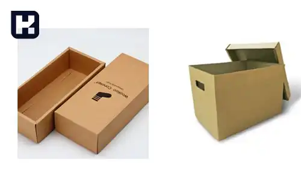
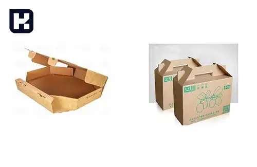
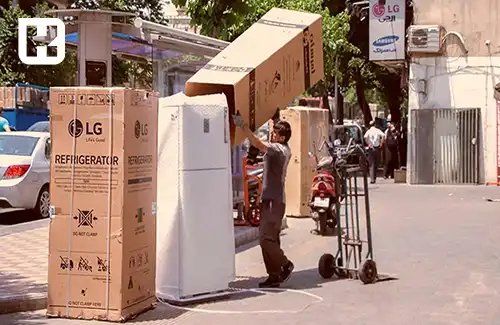
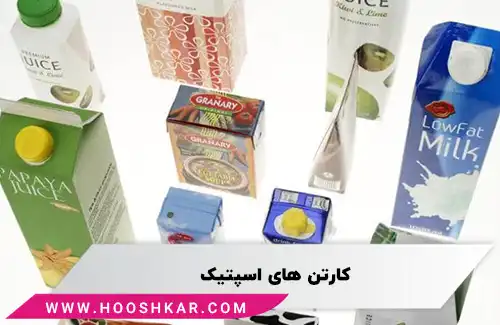

<blockquote style="background-color:#eeeefc; padding:0.5rem">

  
آنچه در این مطلب خواهید خواند

  <ul>
    <li>بررسی انواع کارتن براساس ورق
      <ul>
        <li>ورق دو لایه (یک رو)</li>
        <li>ورق سه لایه</li>
        <li>ورق پنج لایه</li>
        <li>ورق هفت لایه</li>
      </ul>
    </li>
    <li>بررسی انواع کارتن براساس جنس
      <ul>
        <li>کارتن معمولی</li>
        <li>کارتن کرافتی</li>
        <li>کارتن فلکسویی</li>
        <li>کارتن لمینتی</li>
      </ul>
    </li>
    <li>بررسی انواع کارتن براساس شکل ظاهری
      <ul>
        <li>کارتن های قفسه ای شکل</li>
        <li>کارتن مقوایی درپوش مجزا</li>
        <li>کارتن مقوایی پاکتی شکل</li>
      </ul>
    </li>
    <li>بررسی انواع کارتن براساس کاربرد
      <ul>
        <li>کارتن تخم‌مرغ</li>
        <li>کارتن دایکاتی</li>
        <li>کارتن آسپتیک</li>
        <li>کارتن لوازم خانگی سنگین</li>
      </ul>
    </li>
    <li>بررسی انواع کارتن براساس نوع صنعت</li>
    <li> تیپ کارتن
    <ul>
      <li>کارتن مادر (معمولی)
      <li>کارتن لوازم سنگین (کارتن یخچالی)
      <li>کارتن سر پالتی: بسته بندی کالاهای پالت شده
      <li>کارتن دسته دار بزرگ
      <li>انواع کارتن میوه (درب دار، بدون درب)
      <li>کارتن حمل جوجه یک روزه
    </ul>
  </li>

</blockquote> 

## بررسی انواع کارتن براساس ورق

ورق کارتن از یک لایه کاغذ فلوت و یک لایه کاغذ آستر تشکیل شده است. با ترکیب فلوتینگ (فلوت) و آستر می‌توان از کارتن با ویژگی‌های متمایز و قیمت‌های متنوع تولید کرد. ما در ادامه، تمامی مدل‌های رایج را بررسی می‌کنیم.

### ورق دو لایه (یک رو)

این نوع ورق فقط دو لایه دارد، یک لایه آستر و یک لایه کاغذ فلوتینگ. عموماً، لایه آستر اغلب از کاغذ لاینر ساخته می‌شود. ورق دو لایه دارای مقاومت پایینی است و بیشتر برای وسایل سبک و یا در داخل جعبه‌ها جهت افزودن حفاظت بیشتر استفاده می‌شود.

### ورق سه لایه

رایج‌ترین مدل جهت ساخت انواع کارتن این نوع ورق است. عموماً در حالت عادی تمامی جعبه‌های حمل‌و‌نقل و معمولی با این ورق ساخته می‌شوند. این کارتن از یک لایه وسطی و دو لایه آستر خارجی ساخته شده است. به ترتیب، کاغذ لاینر در داخل، سپس کاغذ فلوتینگ و در نهایت لایه آستر بیرونی قرار می‌گیرد. آستر می‌تواند از جنس لاینر، تست لاینر، کاغذ کرافت و... باشد.
### ورق پنج لایه

اگر به دنبال یک کارتن محکم هستید، دیگر نمی‌توانید از کارتن‌های معمولی (ورق سه لایه) استفاده کنید. در چنین شرایطی، بهترین گزینه کارتن پنج لایه است. این کارتن از دو لایه فلوت و سه لایه کاغذ لاینر تشکیل شده است. ترتیب قرارگیری لایه‌ها به شرح زیر است: لاینر، فلوت، لاینر، فلوت، لاینر. کاربرد این نوع ورق جهت بسته بندی محصولات صنعتی و گران می باشد.

### ورق هفت لایه

کارتن‌های با ورق هفت لایه دارای استحکام بسیار بالایی هستند به طوری که می توان از آنها به جای جعبه چوبی استفاده کرد. این کارتن متشکل از سه لایه فلوت و چهار لایه کاغذ لاینر می باشد که انتخابی مطمئن جهت جابجایی اقلام خاص است.این کارتن قادر است مواد شیمیایی و تجهیزات ارزشمند را حمل کند. ترتیب قرارگیری لایه‌ها عبارت است از: لاینر، فلوتینگ، لاینر، فلوتینگ، لاینر، فلوتینگ، لاینر

## بررسی انواع کارتن براساس جنس

### کارتن معمولی

کارتن‌های معمولی اغلب برای بسته‌بندی لوازم کوچک‌تر مانند ظروف پلاستیکی، لوازم آشپزخانه و وسایل الکترونیکی استفاده می‌شوند. این نوع کارتن‌ها دارای ساختار ساده‌ای هستند و به طور رایج با استفاده از فوم یا پلاستیک‌های حبابدار برای جلوگیری از آسیب به محتوا همراهی می‌شوند.

### کارتن کرافتی

کارتن‌های کرافتی به دلیل ظاهر زیبا و مقاومت مناسب در برابر رطوبت، برای بسته‌بندی لوازمی مانند محصولات بهداشتی و مواد غذایی استفاده می‌شوند.

### کارتن فلکسویی

این نوع کارتن، با یک لایه فلکس روی آن پوشیده شده است و قابلیت چاپ رنگی دارد.

### کارتن لمینتی

## بررسی انواع کارتن براساس شکل ظاهری

### کارتن های قفسه ای شکل

از کارتن قفسه ای شکل جهت نگهداری محصولات در فروشگاه ها استفاده می شود. از جمله ویژگی های این محصول: درب کوتاه، قابلیت چاپ، قابلیت نگهداری و ایمنی بالای آن است. ابعاد و مقوای استفاده شده در تولید این قفسه ها بسته به نیاز شما قابل تغییر خواهد بود.

### کارتن مقوایی درپوش مجزا

کارتن درپوش مجزا از نظر شکل ظاهری شباهت زیادی به جعبه های آرشیو بندی دارند که بسته به نوع محصول در ابعاد و اشکال مختلف تولید می شود. هزینه ساخت و خرید این محصولات از جعبه ها کمتر است.

### کارتن مقوایی پاکتی شکل

کارتن پاکتی شکل همان کارتن معمولی است.

## بررسی انواع کارتن براساس کاربرد

### کارتن تخم‌مرغ

این کارتن‌ها از روزنامه‌ها و کاغذهای بازیافت شده، خمیر قالب و پلی استایرن منبسط شده، تهیه می شوند.

### کارتن دایکاتی

کارتن‌های دایکاتی همان کارتن های کرافتی هستند. کارتن سوراخ‌دار، تلسکوپی، دایکات بدون درب و غیره

### کارتن آسپتیک

از کارتن‌های آسپتیک جهت نگهداری مایعات مانند شیر، آب میوه، سوپ، ماست و غیره استفاده می‌شود تا مواد غذایی را در برابر باکتری‌ها، نور خورشید و بخار محافظت کند و عطر و طعم محصول را به خوبی در خود نگه دارد. این کارتن‌ها از ورقه‌های بسته‌بندی مایع، فویل و پلی اتیلن تشکیل شده اند.

### کارتن لوازم خانگی سنگین

به دلیل مقاومت بالای برای بسته‌بندی اقلام سنگین و یا کالاهایی که حساسیت بالایی دارند استفاده می‌شوند.

### بررسی انواع کارتن براساس نوع صنعت

1.	کارتن اسباب بازی
2.	کارتن قطعات صعنتی
3.	کارتن لوازم آرایشی و بهداشتی
4.	کارتن فست فود و رستورانی
5.	کارتن پوشاک و منسوجات
6.	کارتن صیفی جات و میوه
7.	کارتن مواد غذایی و خشکبار
8.	کارتن تجهیزات پزشکی و دارویی
9.	کارتن مواد شیمیایی و شوینده
10.	کارتن لوازم الکتریکی و الکترونیکی
11.	کارتن حمل و نقل و پست

## تیپ کارتن

### کارتن مادر (معمولی)

### کارتن لوازم سنگین (کارتن یخچالی)

### کارتن سر پالتی: بسته بندی کالاهای پالت شده

### کارتن دسته دار بزرگ

### انواع کارتن میوه (درب دار، بدون درب)

### کارتن حمل جوجه یک روزه

## انواع کارتن

### کارتن های تاشو

کارتن‌هایی که به راحتی قابل تا شدن هستند و برای بسته‌بندی محصولات مختلف مانند غلات، خشکبار، حبوبات و غیره استفاده می‌شوند.

### کارتن های تخم مرغ

کارتن‌هایی که برای محافظت از تخم‌مرغ‌ها در زمان حمل و نقل طراحی شده‌اند و معمولاً از خمیر قالب و روزنامه بازیافتی ساخته می‌شوند.

### کارتن های دایکاتی

کارتن‌هایی که با استفاده از قالب‌برش خاص شکل داده می‌شوند و برای بسته‌بندی محصولات با شکل و سایز خاص مناسب هستند.

### کارتن های اسپتیک

کارتن‌هایی که برای بسته‌بندی مواد غذایی مایع یا نیمه جامد مانند شیر، آبمیوه، سس و غیره استفاده می‌شوند و دارای لایه‌های پلاستیک یا فلزی هستند.

### کارتن چند لایه

کارتن‌های سفت و سخت که دارای چندین لایه مقوا و فلوت هستند و برای حمل و نقل اجسام سخت یا تیز مناسب هستند
و...