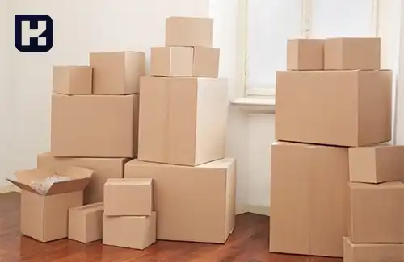
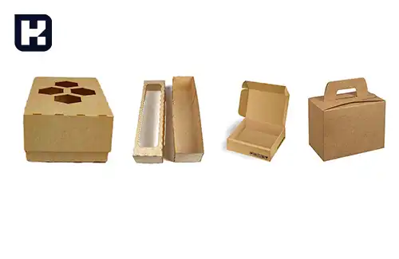
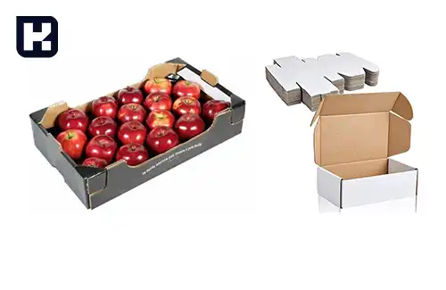
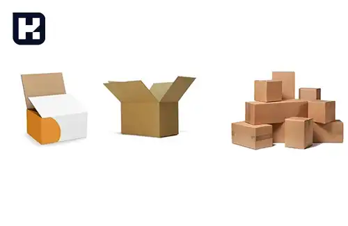
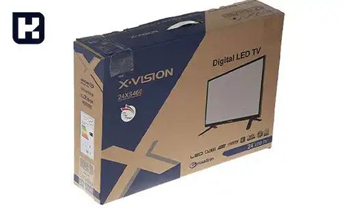

<blockquote style="background-color:#eeeefc; padding:0.5rem">

  
آنچه در این مطلب خواهید خواند:

  <ul>
    <li>براساس ورق</li>
      <ul>
        <li>ورق دو لایه (یک رو)</li>
        <li>ورق سه لایه</li>
        <li>ورق پنج لایه</li>
        <li>ورق هفت لایه</li>
      </ul>
    </li>
    <li>براساس جنس و نوع چاپ</li>
      <ul>
        <li>کارتن معمولی</li>
        <li>کارتن (جعبه) کرافتی</li>
        <li>کارتن (جعبه) فلکسویی</li>
        <li>کارتن (جعبه) لمینتی</li>
      </ul>
    </li>
    <li>براساس شکل ظاهری</li>
      <ul>
       <li>کارتن و مقوای قفسه ای شکل</li>
       <li>کارتن و جعبه درپوش مجزا</li>
       <li>کارتن مقوایی پاکتی شکل</li>
       <li>کارتن دایکاتی</li>
      </ul>
    </li>
    <li>براساس کاربرد</li>
      <ul>
       <li>کارتن تخم‌مرغ</li>
       <li>کارتن آسپتیک</li>
       <li>کارتن یخچالی</li>
       <li>کارتن سر پالتی</li>
       <li>کارتن دسته دار بزرگ</li>
       <li>انواع کارتن میوه (درب دار، بدون درب)</li>
       <li>کارتن حمل جوجه یک روزه</li>
      </ul>
    </li>
    <li>براساس نوع صنعت</li>
  </li>

</blockquote> 

یکی از مهم‌ترین ویژگی‌های کارتن، تیپ یا نوع آن است که تعیین‌کننده استحکام، دوام و کاربرد آن می‌باشد. تیپ کارتن به ساختار لایه‌های تشکیل‌دهنده آن اشاره دارد و انتخاب صحیح آن می‌تواند تأثیر چشمگیری بر محافظت از محتویات، هزینه‌های حمل و نقل و حتی تأثیرات زیست‌محیطی داشته باشد.

در این مقاله، قصد داریم انواع مختلف تیپ کارتن را بررسی کنیم. با درک این تفاوت‌ها، شما قادر خواهید بود بهترین نوع کارتن را برای نیازهای خاص خود انتخاب کنید.

<blockquote style="background-color:#f5f5f5; padding:0.5rem">

<strong>آشنایی با <a href="https://www.hooshkar.com/Software/PrintingAndPackaging/Package/Carton" target="_blank">نرم افزار کارتن سازی</a> سایان
</strong></blockquote>

## براساس ورق

ورق کارتن از یک لایه کاغذ فلوت و یک لایه کاغذ آستر تشکیل شده است. با ترکیب فلوتینگ (فلوت) و آستر می‌توان یک کارتن با ویژگی‌های متمایز و قیمت‌های متنوع تولید کرد.

### 1. ورق دو لایه (یک رو)

این نوع ورق فقط دو لایه دارد، یک لایه آستر و یک لایه کاغذ فلوتینگ. لایه آستر اغلب از کاغذ لاینر ساخته می‌شود. ورق دو لایه دارای مقاومت پایینی است و بیشتر برای وسایل سبک و یا در داخل جعبه‌ها جهت افزودن حفاظت بیشتر استفاده می‌شود.

### 2. ورق سه لایه

رایج‌ترین مدل جهت ساخت انواع کارتن این نوع ورق است. عموماً در حالت عادی تمامی جعبه‌های حمل‌و‌نقل و معمولی با این ورق ساخته می‌شوند. این کارتن از یک لایه وسطی و دو لایه آستر خارجی ساخته شده است. به ترتیب، کاغذ لاینر در داخل، سپس کاغذ فلوتینگ و در نهایت لایه آستر بیرونی قرار می‌گیرد. آستر می‌تواند از جنس لاینر، تست لاینر، کاغذ کرافت و... باشد.
### 3. ورق پنج لایه

اگر به دنبال یک کارتن محکم هستید، دیگر نمی‌توانید از کارتن‌های معمولی (ورق سه لایه) استفاده کنید. در چنین شرایطی، بهترین گزینه کارتن پنج لایه است. این کارتن از دو لایه فلوت و سه لایه کاغذ لاینر تشکیل شده است. ترتیب قرارگیری لایه‌ها به شرح زیر است: لاینر، فلوت، لاینر، فلوت، لاینر. کاربرد این نوع ورق جهت بسته بندی محصولات صنعتی و گران می‌باشد.

### 4. ورق هفت لایه

کارتن‌های با ورق هفت لایه دارای استحکام بسیار بالایی هستند به طوری که می توان از آنها به جای جعبه چوبی استفاده کرد. این کارتن متشکل از سه لایه فلوت و چهار لایه کاغذ لاینر می‌باشد که انتخابی مطمئن جهت جابجایی اقلام خاص است. این کارتن قادر است مواد شیمیایی و تجهیزات ارزشمند را حمل کند. ترتیب قرارگیری لایه‌ها عبارت است از: لاینر، فلوتینگ، لاینر، فلوتینگ، لاینر، فلوتینگ، لاینر

## براساس جنس و نوع چاپ

### 1. کارتن معمولی

کارتن‌های معمولی اغلب برای بسته‌بندی لوازم کوچک‌تر مانند ظروف پلاستیکی، لوازم آشپزخانه و وسایل الکترونیکی استفاده می‌شوند. این نوع کارتن‌ها دارای ساختار ساده‌ای هستند و به طور رایج با استفاده از فوم یا پلاستیک‌های حبابدار برای جلوگیری از آسیب به محتوا همراهی می‌شوند.

### 2. کارتن (جعبه) کرافتی

کارتن‌های کرافتی به دلیل ظاهر زیبا و مقاومت مناسب در برابر رطوبت، برای بسته‌بندی لوازمی مانند محصولات بهداشتی و مواد غذایی استفاده می‌شوند.

### 3. کارتن (جعبه) فلکسویی

این نوع کارتن، با یک لایه فلکس روی آن پوشیده شده است و قابلیت چاپ رنگی دارد.

### 4. کارتن (جعبه) لمینتی
در کارتن لمینتی یک لایه مقوای چاپی روی کارتن را می پوشاند که موجب ایجاد ظاهری زیبا و مقاوم در برابر رطوبت ضربه می شود.

## براساس شکل ظاهری

### 1. کارتن و مقوای قفسه ای شکل

از کارتن قفسه ای شکل جهت نگهداری محصولات در فروشگاه ها استفاده می شود. از جمله ویژگی های این محصول: درب کوتاه، قابلیت چاپ، قابلیت نگهداری و ایمنی بالای آن است. ابعاد و مقوای استفاده شده در تولید این قفسه ها بسته به نیاز شما قابل تغییر خواهد بود.

### 2. کارتن و جعبه درپوش مجزا

کارتن درپوش مجزا از نظر شکل ظاهری شباهت زیادی به جعبه های آرشیو بندی دارند که بسته به نوع محصول در ابعاد و اشکال مختلف تولید می شود. هزینه ساخت و خرید این محصولات از جعبه ها کمتر است.

### 3. کارتن پاکتی شکل

کارتن پاکتی شکل همان کارتن معمولی است.

<blockquote style="background-color:#f5f5f5; padding:0.5rem">

<strong>بیشتر بخوانید: <a href="https://www.hooshkar.com/Wiki/Business/CartonIndustryMachinery" target="_blank">راهنمای خرید ماشین آلات کارتن سازی</a>
</strong></blockquote>
### 4. کارتن دایکاتی

کارتن‌ و جعبه های دایکاتی همان کارتن های کرافتی هستند. کارتن سوراخ‌دار، تلسکوپی، دایکات بدون درب و غیره

## براساس کاربرد

### 1. کارتن تخم‌مرغ

این کارتن‌ها از روزنامه‌ها و کاغذهای بازیافت شده، خمیر قالب و پلی استایرن منبسط شده، تهیه می شوند.

### 2. کارتن آسپتیک

از کارتن‌های آسپتیک جهت نگهداری مایعات مانند شیر، آب میوه، سوپ، ماست و غیره استفاده می‌شود تا مواد غذایی را در برابر باکتری‌ها، نور خورشید و بخار محافظت کند و عطر و طعم محصول را به خوبی در خود نگه دارد. این کارتن‌ها از ورقه‌های بسته‌بندی مایع، فویل و پلی اتیلن تشکیل شده اند.

### 3. کارتن یخچالی

به دلیل مقاومت بالا برای بسته‌بندی اقلام سنگین و یا کالاهایی که حساسیت بالایی دارند استفاده می‌شوند.

### 4. کارتن سر پالتی

برای بسته بندی کالاهای پالت شده کاربرد دارد.

### 5. کارتن دسته دار بزرگ

### 6. انواع کارتن میوه (درب دار، بدون درب)

### 7. کارتن حمل جوجه یک روزه

### براساس نوع صنعت

1.	کارتن و جعبه اسباب بازی
2.	کارتن و جعبه قطعات صعنتی
3.	کارتن و جعبه لوازم آرایشی و بهداشتی
4.	کارتن و جعبه فست فود و رستورانی
5.	کارتن و جعبه پوشاک و منسوجات
6.	کارتن و جعبه صیفی جات و میوه
7.	کارتن و جعبه مواد غذایی و خشکبار
8.	کارتن و جعبه تجهیزات پزشکی و دارویی
9.	کارتن و جعبه مواد شیمیایی و شوینده
10.	کارتن و جعبه لوازم الکتریکی و الکترونیکی
11.	کارتن و جعبه حمل و نقل و پست