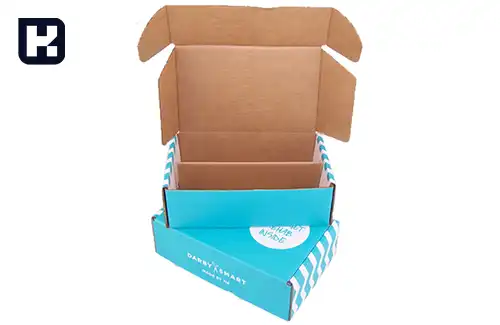

<blockquote style="background-color:#eeeefc; padding:0.5rem">

  
آنچه در این مطلب خواهید خواند:

  <ul>
    <li>جعبه لمینتی چیست؟</li>
    <li>چاپ بر روی لمینت چگونه انجام میشود؟</li>
    <li>مراحل تولید جعبه لمینتی</li>
    <li>مهم‌ترین انواع جعبه‌های لمینتی</li>
    <li>جعبه لمینتی سه لایه</li>
    <li>مقایسه‌ی جعبه لمینتی با کارتن معمولی</li>
    <li>کاربردهای جعبه لمینتی</li>
  </ul>

</blockquote>

قطعاً نام جعبه لمینتی را بارها شنیده‌اید. جعبه لمینتی از جمله انواع محبوب کارتن‌ها در زمینه بسته‌بندی است، به ویژه برای افرادی که اهمیت بسته‌بندی با کیفیت محصولات برای آن‌ها اولویت دارد، توصیه می‌شود.

اگر به دنبال یک بسته‌بندی قوی، مقاوم در برابر آب و با طراحی و چاپ با کیفیت بر روی کارتن خود هستید، ما در این مقاله به شرح جزئیات جعبه لمینتی می‌پردازیم.

<blockquote style="background-color:#f5f5f5; padding:0.5rem">

<strong>آشنایی با <a href="https://www.hooshkar.com/Software/PrintingAndPackaging/Package/Box" target="_blank"> نرم افزار حسابداری جعبه سازی</a> سایان
</strong></blockquote>

## جعبه لمینتی چیست؟

کلمه "لمینت" (Laminate) به معنای چسباندن است. بنابراین، لمینت کردن به چسباندن لایه‌های مختلف بر روی کاغذ، مقوا و... گفته می‌شود. در فرآیند لمینت کردن، معمولاً لایه‌های مختلفی مانند مقوای چاپ‌شده و لایه نایلونی بر روی هم چسبانده می‌شوند. 

جعبه هایی که بر روی آن‌ها یک لایه محافظ چسبانده می‌شود، کارتن لمینتی نام دارند. لمینت پوششی است که بر روی کارتن تولید شده اعمال می‌شود و آن را در برابر نور، آب، رطوبت، پارگی و... محافظت می‌کند. این پوشش‌ها از جنس کاغذ و پلاستیک ساخته می‌شوند که این ترکیب باعث می‌شود تا جنسی مقاوم و با دوام داشته باشند. 

همچنین، طراحی و چاپ انجام‌شده بر روی لایه‌های لمینتی از کیفیت بالایی برخوردار است. بنابراین، جعبه لمینتی به عنوان یک بسته‌بندی مقاوم و بی‌نقص به افرادی که به دنبال کیفیت و دوام هستند، توصیه می‌شود.

### چاپ بر روی لمینت چگونه انجام میشود؟
یکی از محبوب‌ترین روش‌های بسته‌بندی در بازار، استفاده از جعبه‌های لمینتی است. چاپ با کیفیت و مناسب از ویژگی‌های برجسته این نوع بسته‌بندی محسوب می‌شود که با ماشین‌آلات مخصوص انجام می‌گیرد. 

لیتوگرافی بر روی لمینت یک فرآیند چاپ گرافیکی است که بر روی کاغذ انجام می‌شود و نوعی لمینت بسیار ماندگار و زیبا را ایجاد می‌کند. چاپ لیتوگرافی روشی ساده و کاربردی برای چاپ هر لوگو و طرحی بر روی جعبه های ساده و لمینتی است. این نوع چاپ به دلیل داشتن پوشش UV بر روی سطح کاغذ یا مقوا بسیار با کیفیت و ماندگار است.

در این روش، صفحه کاغذ به دو بخش مثبت و منفی تقسیم می‌شود. بخش مثبت جوهر آغشته به روغن را دریافت کرده و آب را دفع می‌کند، در حالی که بخش منفی وظیفه استخراج آب و حذف جوهر از صفحه مثبت را دارد. به این ترتیب، تصاویر از رسانه چاپی به مقوا، کارتن یا هر نوع کاغذ دیگر منتقل می‌شوند. لیتوگرافی بر روی کارتن لمینتی روشی بسیار مقرون‌به‌صرفه برای تولید و بسته‌بندی محسوب می‌شود. 

علاوه بر این، چاپ دیجیتال و دیگر روش‌ها نیز بر روی جعبه لمینتی اعمال می‌شوند که هر کدام مزایا و معایب خاص خود را دارند.

**1. لمینت گرم:**

برای کارت ویزیت، پوسترها، منوی غذا، کارت هدیه و موارد مشابه، اندازه‌های مختلفی از سایز کوچک تا ابعاد بزرگتر در نظر گرفته می‌شود.

**2. لمینت سرد:**

دستگاه لمینت سرد در صنعت جعبه سازی برای سینگل، جعبه های سه‌لایه و پنج‌لایه، با استفاده از چسب سیلیکات تا عرض‌های مختلف به صورت رول و شیت استفاده می‌شود. در بعضی از محصولات بسته‌بندی، به جای چسب سیلیکات از چسب سلفون یا چسب صحافی استفاده می‌شود.

<blockquote style="background-color:#f5f5f5; padding:0.5rem">

<strong>بیشتر بخوانید: <a href="https://www.hooshkar.com/Wiki/Business/CartonIndustryMachinery" target="_blank">راهنمای خرید ماشین آلات کارتن سازی</a>
</strong></blockquote>

### مراحل تولید جعبه لمینتی

1.	طراحی چاپ روی کارتن
2.	طراحی خط برش
3.	ساخت قالب
4.	تهیه زینک
5.	چاپ پوستر
6.	اعمال سلفون روی مقوای چاپ‌شده (در صورت نیاز)
7.	اجرای عملیات لمینت
8.	برش و دایکات
9.	لب چسب یا منگنه
10.	بسته‌بندی
11.	ارسال

## مهم‌ترین انواع جعبه‌های لمینتی

جعبه‌های لمینتی سینگل فیس از سه لایه اصلی تشکیل شده‌اند. این جعبه‌ها شامل یک لایه اولیه از فلوتینگ و فیس هستند و سطح لمینت شده به عنوان سومین لایه اضافه می‌شود. این نوع جعبه ها بدنه محکمی ندارند و برای بسته‌بندی اجسام سبک مناسب هستند.

### جعبه لمینتی سه لایه

نوع دیگری از جعبه‌ها به نام جعبه لمینتی ۳ لایه در بازار شناخته می‌شوند. این جعبه‌ها از دو لایه فیس و یک لایه فلوتینگ ساخته شده‌اند، به گونه‌ای که لایه فلوتینگ در میان دو لایه فیس قرار دارد. سپس لایه لمینت بر روی این سه لایه چسبانده می‌شود. این جعبه‌ها دارای کیفیت و قیمت مناسبی هستند و در صنایع مختلف کاربرد دارند.

### جعبه لمینتی پنج لایه

برای کسانی که به دنبال جعبه‌های بسیار محکم و مقاوم در برابر ضربه و فشار هستند، جعبه لمینتی پنج لایه پیشنهاد می‌شود. این نوع از کارتن‌ها از دو لایه فلوتینگ و سه لایه فیس تشکیل شده‌اند و سپس لایه لمینت به عنوان لایه ششم بر روی آن‌ها قرار می‌گیرد. این جعبه‌ها در مقایسه با نوع قبلی، قیمت بیشتری دارند اما مقاومت و پایداری بیشتری نیز دارند.

## مقایسه‌ی جعبه لمینتی با جعبه معمولی

- تولید کننده کارتن لمینتی باید مراحل چاپ و ساخت کارتن را به صورت جداگانه انجام دهد. ابتدا، طرح مورد نظر را با استفاده از ماشین چاپ افست بر روی مقوا چاپ می‌کند، سپس مقوای چاپ شده را لمینت کرده و بعد از آن وارد مراحل ساخت کارتن می‌شود؛

- در تولید کارتن‌های معمولی، دستگاه چاپ فلکسو همزمان با فرآیند ساخت، طرح مورد نظر را روی ورق کارتن چاپ می‌کند.
این روش باعث کاهش کیفیت طرح چاپی و استحکام جعبه می‌شود، زیرا چاپ آن از کیفیت پایین‌تری برخوردار است و همچنین عملیات لمینت از فرآیند تولید حذف می‌شود و تنها مزیت جعبه معمولی نسبت به کارتن لمینتی، قیمت مناسب‌تر آن است. 
اگر برای شما قیمت کارتن اهمیت زیادی دارد، می‌توانید از کارتن معمولی استفاده کنید.

**از مزایای جعبه لمینتی نسبت به جعبه معمولی (چاپ فلکسو) می‌توان به این موارد اشاره کرد:**

- مقاومت بالاتر
-	کیفیت چاپ بهتر
-	طراحی زیباتر

### کاربردهای جعبه لمینتی

- کارتن و جعبه میوه
- جعبه‌های خرما
- جعبه های کیک و کلوچه
- جعبه‌های لامپ 
- کارتن لوازم برقی و...