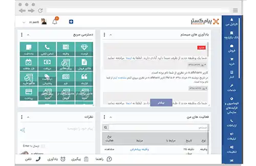

<blockquote style="background-color:#eeeefc; padding:0.5rem">

  
آنچه در این مطلب خواهید خواند:

  <ul>
    <li>چرا به نرم افزار CRM نیاز داریم؟</li>
    <li>مزایای استفاده از CRM</li>
    <li>پارامترهای مهم در انتخاب نرم افزار CRM</li>
    <li>لیست بهترین شرکت های نرم افزار CRM در ایران</li>
    <ul>
      <li>نرم افزار CRM فنک</li>
      <li>نرم افزار CRM پیام گستر</li>
      <li>نرم افزار CRM دیدار</li>
      <li>نرم افزار CRM سرو</li>
    </ul>
    <li>دانلود نرم افزار CRM رایگان</li>
  </ul>

</blockquote>

این مقاله، بر اهمیت نرم افزارهای <a href="https://www.hooshkar.com/Wiki/Business/WhatIsCrm" target="_blank">CRM</a> برای کسب و کارهای ایرانی تأکید می کند و به مقایسه بهترین گزینه های موجود در بازار ایران می پردازد. هدف آن است که به خوانندگان کمک کند تا بهترین راه حل را برای نیازهای خاص خود انتخاب کنند. با بررسی ویژگی ها، امکانات، قیمت گذاری و دیگر جنبه های کلیدی این نرم افزارها، کاربران می توانند بهترین گزینه را جهت پیاده سازی یک استراتژی CRM موفق در کسب و کار خود انتخاب کنند.

## چرا به نرم افزار CRM نیاز داریم؟

بسیاری از شرکت ها و کسب و کارهای ایرانی برای بهبود مدیریت ارتباط با مشتریان خود، به دنبال راه حل های نرم افزاری کارآمد هستند. در این راستا نرم افزارهای CRM می توانند با ارائه ابزارهایی برای پیگیری سوابق مشتری، مدیریت پیشنهادات فروش، بازاریابی هدفمند و پشتیبانی مشتری، به شرکت ها در افزایش فروش و حفظ مشتریان کمک شایانی کنند.

## مزایای استفاده از CRM

**- افزایش فروش و درآمد:** CRM با شناسایی مشتریان بالقوه و هدفمندسازی فعالیت‌های بازاریابی، به افزایش فروش و در نتیجه درآمد کمک می‌کند.

**- بهبود روابط با مشتریان:** CRM با ذخیره‌سازی اطلاعات مشتریان، به ارائه خدمات شخصی‌سازی‌شده و پاسخگویی سریع‌تر کمک می‌کند.

**- تصمیم‌گیری بهتر:** CRM اطلاعاتی را فراهم می‌کند که به تصمیم‌گیری‌های مبتنی بر داده کمک می‌کند.

**- بهبود بازاریابی:** CRM داده‌هایی در اختیار بازاریابان قرار می‌دهد تا بتوانند محصول مناسب را به مشتری مناسب برسانند. 

**- افزایش وفاداری مشتریان:** CRM با شناخت بهتر مشتریان به افزایش وفاداری آنها کمک می‌کند.

در مجموع، CRM ابزاری اساسی برای موفقیت هر سازمانی در عرصه کسب‌وکار است.

## پارامترهای مهم در انتخاب نرم افزار CRM

انتخاب یک نرم‌افزار CRM مناسب نیازمند در نظر گرفتن پارامترها و معیارهای زیر است:

**- ویژگی‌ها و قابلیت‌ها:** نرم‌افزار باید تمام قابلیت‌های مورد نیاز سازمان را پوشش دهد مانند مدیریت فروش، بازاریابی، خدمات مشتری، گزارش‌دهی و غیره.

**- سهولت استفاده:** رابط کاربری ساده، آموزش آسان و وجود مستندات کافی بسیار مهم است. 

**- هزینه:** هزینه‌های پیاده‌سازی، آموزش و نگهداری باید متناسب با بودجه سازمان باشد.

**- سازگاری:** CRM باید با زیرساخت‌های فناوری و فرهنگ سازمان سازگار باشد.

**- پشتیبانی:** ارائه‌دهنده باید پشتیبانی فنی و آموزشی مناسبی فراهم کند.

**- امنیت:** CRM باید از امنیت و حریم خصوصی داده‌ها محافظت کند.

انتخاب CRM بر اساس این معیارها، کلید موفقیت در پیاده‌سازی آن است.

## لیست بهترین شرکت های نرم افزار CRM در ایران

شرکت‌ها و گروه‌های زیادی در ایران اقدام به تولید نرم‌افزارهای مدیریت ارتباط با مشتری کرده‌اند. برخی از محبوب‌ترین آنها عبارتند از:

### 1. <a href="https://www.hooshkar.com/Software/Fennec/Module/CRM" target="_blank">نرم افزار  CRM فنک</a>

این نرم‌افزار توسط شرکت هوشکار پرداز ارائه شده است. برخی از ویژگی‌های کلیدی آن عبارتند از:

-	قابلیت‌های کامل مدیریت فروش و بازاریابی
-	امکان سفارشی‌سازی و تطابق با فرایندهای صنایع مختلف
-	تحلیل آماری و گزارش‌دهی گسترده 
-	رابط کاربری ساده و دوستانه
-	قابلیت اتصال به سایر سیستم‌ها از جمله <a href="https://www.hooshkar.com/Software/Fennec" target="_blank">ERP</a>
-	پشتیبانی فنی دائمی
-	هزینه پایین نسبت به محصولات خارجی

CRM فنک با تمرکز بر خودکارسازی و بهینه‌سازی فرایندها، گزینه مناسبی به شمار می‌رود.

**جهت اطلاعات بیشتر لطفا تماس بگیرید.**

### 2. نرم‌افزار CRM پیام‌گستر
این نرم‌افزار توسط شرکت پیام‌گستر طراحی و توسعه یافته است. از نظر قیمت، پیام‌گستر جزء گران‌قیمت‌ترین نرم‌افزارهای CRM داخلی به‌شمار می‌رود. البته مشتریان می‌توانند به صورت سفارشی امکانات مورد نیاز خود را انتخاب کنند اما این کار باعث می‌شود هزینه‌ی اولیه‌ی استفاده از این نرم‌افزار بالاتر از سایر رقبا باشد.

با وجود قیمت بالاتر،  CRM پیام‌گستر ویژگی‌ها و قابلیت‌های فراوانی دارد که آن را به یک گزینه‌ی رقابتی در بازار تبدیل کرده است. از جمله مزایای این نرم‌افزار می‌توان به 

- امکان ساخت گردش کار به روش Drag & Drop
- وجود اپلیکیشن موبایل
- مناسب کسب‌وکارهای متوسط و بزرگ
- ارائه نسخه آزمایشی 30 روزه رایگان
- بهبود عملکرد با برنامه‌ریزی و سازماندهی مؤثر وظایف
### 3. نرم‌افزار CRM دیدار

نرم‌افزار CRM دیدار، یکی از نرم‌افزارهای ابری مدیریت ارتباط با مشتری، از سال 1393 توسط شرکت دیدار عرضه شده است. از ویژگی‌های برجسته این محصول می‌توان به سهولت استفاده و قیمت مناسب آن اشاره کرد.

از جمله امکانات جذاب این نرم‌افزار می‌توان به موارد زیر اشاره کرد:

- ارائه بصورت ابری
- امکان نظرسنجی از مشتریان
- مناسب کسب‌وکارهای کوچک و متوسط
- فاقد امکان گردش کار و سفارشی‌سازی (کاربران می‌توانند درخواست اضافه کردن ویژگی‌های جدید را ارسال کنند، اما افزودن این امکانات به تعداد درخواست‌های دریافتی بستگی دارد.)
- ارائه نسخه آزمایشی 15 روزه رایگان 
 
به طور کلی، CRM دیدار می‌تواند گزینه مناسبی برای کسب‌وکارهای کوچک باشد که به ابزارهای ساده مدیریت فروش نیاز دارند.

<blockquote style="background-color:#f5f5f5; padding:0.5rem">

<strong>بیشتر بخوانید: <a href="https://www.hooshkar.com/Wiki/Business/CrmAndErpDifferences" target="_blank">تفاوت CRM و ERP چیست؟</a>
</strong></blockquote>

### 4. نرم‌افزار CRM سرو

نرم‌افزار CRM سرو، که توسط گروه همکاران سیستم عرضه شده، به عنوان اولین نرم‌افزار CRM ابری ایرانی از سال 1391 در دسترس است. این محصول بر اساس نسخه‌های اولیه نرم‌افزار متن‌باز SugarCRM توسعه یافته است.
برخی از ویژگی‌های این نرم افزار:

- ارائه به صورت ابری و دسترسی آسان از هر جا 
- قابلیت مدیریت فرایندهای فروش، بازاریابی و خدمات مشتری
- امکان تحلیل آماری و داده‌کاوی 
- گزارش‌دهی دقیق و جامع
- قابلیت سفارشی‌سازی 
- رابط کاربری ساده و دوستانه
- هزینه پایین‌تر نسبت به محصولات خارجی
- امکان یکپارچه‌سازی با سایر سیستم‌ها
- پشتیبانی گسترده
- ارائه نسخه آزمایشی 30 روزه رایگان

سرو با توجه به ویژگی‌ها و قابلیت‌های فراوان و همچنین هزینه مناسب، یکی از گزینه‌های قابل توجه در بازار نرم‌افزارهای مدیریت ارتباط با مشتری است که می‌تواند پاسخگوی نیازهای سازمان‌های ایرانی باشد.

## بررسی و دانلود نرم افزارهای CRM رایگان

علاوه بر نرم‌افزارهای تجاری CRM، گزینه‌های متن‌باز رایگانی نیز وجود دارند که برای سازمان‌های کوچک و استارتاپ‌ها مناسب هستند.

یکی از این موارد **ویتایگر** است که بر پایه نرم‌افزار SugarCRM توسعه یافته و قابلیت‌هایی برای مدیریت بازاریابی، فروش و خدمات پس از فروش دارد. همچنین امکان سفارشی‌سازی آن نیز وجود دارد.

**SuiteCRM، Odoo، Vtiger** از دیگر نرم‌افزارهای CRM متن‌باز هستند که می‌توانند برای سازمان‌های نوپا مناسب باشند.

در مجموع، هر سازمانی با توجه به نیازها، اهداف و بودجه خود می‌تواند گزینه مناسب را انتخاب کند. CRM می‌تواند نقش محوری در موفقیت سازمان‌ها ایفا کند.

---
برای دستیابی به بهترین نرم افزار CRM، می توانید با کارشناسان <a href="https://www.hooshkar.com" target="_blank">هوشکار</a> در ارتباط باشید.