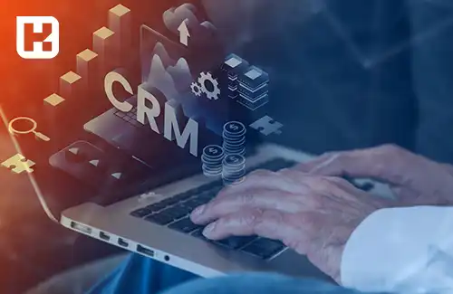
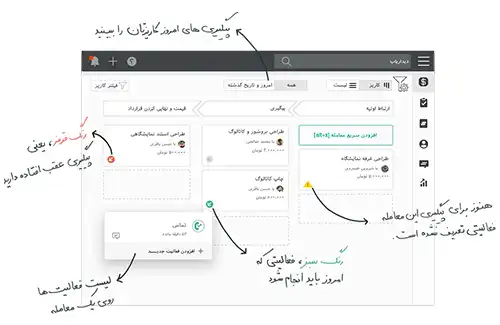

<blockquote style="background-color:#eeeefc; padding:0.5rem">

  
آنچه در این مطلب خواهید خواند

  <ul>
    <li>چرا به نرم افزار CRM نیاز داریم</li>
    <li>استفاده از CRM چه مزایایی دارد</li>
    <li>راهنما و پارامترهای مهم در انتخاب بهترین نرم افزار CRM</li>
    <li>لیست بهترین شرکت های نرم افزار CRM در ایران</li>
    <ul>
      <li>نرم افزار CRM فنک</li>
      <li>نرم افزار CRM پیام گستر</li>
      <li>نرم افزار CRM دیدار</li>
      <li>نرم افزار CRM سرو</li>
    </ul>
    <li>دانلود نرم افزار CRM رایگان</li>
  </ul>

</blockquote>

**مقدمه**

<a href="https://www.hooshkar.com/Wiki/Business/WhatIsCrm" target="_blank">مدیریت ارتباط با مشتری (CRM)</a>، ابزاری ضروری برای موفقیت سازمان‌ها در عرصه کسب‌وکار امروزی است. شرکت‌های داخلی متعددی طی سالیان گذشته اقدام به توسعه نرم‌افزارهای CRM بومی کرده‌اند.

در این مقاله به معرفی و مقایسه 4 مورد از محبوب‌ترین نرم‌افزارهای CRM تولید داخل می‌پردازیم:

## چرا به نرم افزار CRM نیاز داریم

مدیریت ارتباط با مشتری (CRM) با فراهم کردن امکان شناخت عمیق مشتریان و برقراری ارتباطی مستمر و دوطرفه با آنها، نقش محوری در موفقیت سازمان‌ها ایفا می‌کند. 

## استفاده از CRM چه مزایایی دارد

**- افزایش فروش و درآمد:** CRM با شناسایی مشتریان بالقوه و هدفمندسازی فعالیت‌های بازاریابی، به افزایش فروش و در نتیجه درآمد کمک می‌کند.

**- بهبود روابط با مشتریان:** CRM با ذخیره‌سازی اطلاعات مشتریان، به ارائه خدمات شخصی‌سازی‌شده و پاسخگویی سریع‌تر کمک می‌کند.

**- تصمیم‌گیری بهتر:** CRM اطلاعاتی را فراهم می‌کند که به تصمیم‌گیری‌های مبتنی بر داده کمک می‌کند.

**- بهبود بازاریابی:** CRM داده‌هایی در اختیار بازاریابان قرار می‌دهد تا بتوانند محصول مناسب را به مشتری مناسب برسانند. 

**- افزایش وفاداری مشتریان:** CRM با شناخت بهتر مشتریان به افزایش وفاداری آنها کمک می‌کند.

در مجموع، CRM ابزاری اساسی برای موفقیت هر سازمانی در عرصه کسب‌وکار است.

## راهنما و پارامترهای مهم در انتخاب بهترین نرم افزار CRM

انتخاب یک نرم‌افزار CRM مناسب نیازمند در نظر گرفتن پارامترها و معیارهای زیر است:

**- ویژگی‌ها و قابلیت‌ها:** نرم‌افزار باید تمام قابلیت‌های مورد نیاز سازمان را پوشش دهد مانند مدیریت فروش، بازاریابی، خدمات مشتری، گزارش‌دهی و غیره.

**- سهولت استفاده:** رابط کاربری ساده، آموزش آسان و وجود مستندات کافی بسیار مهم است. 

**- هزینه:** هزینه‌های پیاده‌سازی، آموزش و نگهداری باید متناسب با بودجه سازمان باشد.

**- سازگاری:** CRM باید با زیرساخت‌های فناوری و فرهنگ سازمان سازگار باشد.

**- پشتیبانی:** ارائه‌دهنده باید پشتیبانی فنی و آموزشی مناسبی فراهم کند.

**- امنیت:** CRM باید از امنیت و حریم خصوصی داده‌ها محافظت کند.

انتخاب CRM بر اساس این معیارها، کلید موفقیت در پیاده‌سازی آن است.

## لیست بهترین شرکت های نرم افزار CRM در ایران

شرکت‌ها و گروه‌های زیادی در ایران اقدام به تولید نرم‌افزارهای مدیریت ارتباط با مشتری کرده‌اند. برخی از محبوب‌ترین آنها عبارتند از:

### <a href="https://www.hooshkar.com/Software/Fennec/Module/CRM" target="_blank">نرم افزار  CRM فنک</a>

این نرم‌افزار توسط شرکت هوشکار پرداز ارائه شده و ویژگی‌های کلیدی آن عبارتند از:

-	قابلیت‌های کامل مدیریت فروش و بازاریابی
-	امکان سفارشی‌سازی و تطابق با فرایندهای صنایع مختلف
-	تحلیل آماری و گزارش‌دهی گسترده 
-	رابط کاربری ساده و دوستانه
-	قابلیت اتصال به سایر سیستم‌ها از جمله <a href="https://www.hooshkar.com/Software/Fennec" target="_blank">ERP</a>
-	پشتیبانی فنی دائمی
-	هزینه پایین نسبت به محصولات خارجی

CRM <a href="https://www.hooshkar.com/Software/Fennec" target="_blank">فنک</a> با تمرکز بر خودکارسازی و بهینه‌سازی فرایندها، گزینه مناسبی به شمار می‌رود.

### نرم‌افزار CRM پیام‌گستر
نرم‌افزار پیام‌گستر CRM یکی از 5 نرم‌افزار CRM برتر ایرانی است که توسط شرکت پیام‌گستر طراحی و توسعه یافته است. از نظر قیمت، پیام‌گستر جزء گران‌قیمت‌ترین نرم‌افزارهای CRM داخلی به‌شمار می‌رود. البته مشتریان می‌توانند به صورت سفارشی امکانات مورد نیاز خود را انتخاب کنند اما این کار باعث می‌شود هزینه‌ی اولیه‌ی استفاده از این نرم‌افزار بالاتر از سایر رقبا باشد.

با وجود قیمت بالاتر،  CRM پیام‌گستر ویژگی‌ها و قابلیت‌های فراوانی دارد که آن را به یک گزینه‌ی رقابتی در بازار تبدیل کرده است. از جمله مزایای این نرم‌افزار می‌توان به امکان ساخت گردش کار به روش Drag & Drop، وجود اپلیکیشن موبایل، تیم جوان و پویای توسعه‌دهنده و پشتوانه‌ی قدرتمند تجارت الکترونیک اشاره کرد.

در مجموع به نظر می‌رسد CRM پیام‌گستر می‌تواند برای کسب‌وکارهای متوسط و بزرگ که به دنبال امکانات پیشرفته‌ی مدیریت ارتباط با مشتری هستند و محدودیت مالی ندارند، انتخاب مناسبی باشد. البته توصیه می‌شود پیش از تصمیم‌گیری نهایی، نیازها و اهداف سازمان مدنظر قرار گیرد تا مطمئن شوید CRM پیام‌گستر می‌تواند به بهترین شکل نیازها را برآورده کند.

### نرم‌افزار CRM دیدار

نرم‌افزار CRM دیدار یکی از نرم‌افزارهای ابری مدیریت ارتباط با مشتری است که از سال 1393 توسط شرکت دیدار عرضه شده است. از ویژگی‌های بارز این محصول می‌توان به سادگی استفاده و قیمت مناسب آن اشاره کرد. 

نرم‌افزار دیدار بیشتر متمرکز بر نیازهای بخش فروش شرکت‌هاست و ویژگی‌هایی برای مدیریت فرآیندهای این بخش در نظر گرفته شده است. از جمله امکانات جذاب این نرم‌افزار می‌توان به ابزار بازی‌گونه‌سازی برای ایجاد انگیزه در بین کارکنان فروش و امکان نظرسنجی از مشتریان اشاره کرد.

با توجه به ویژگی‌های ذکر شده، به نظر می‌رسد CRM دیدار بیشتر مناسب کسب‌وکارهای کوچک و متوسطی باشد که فقط به ابزاری ساده برای مدیریت فروش نیاز دارند. از آنجا که امکانات پیشرفته‌ای مانند گردش کار و سفارشی‌سازی در این محصول وجود ندارد، برای سازمان‌های بزرگ‌تر گزینه مناسبی به نظر نمی‌رسد. 

البته کاربران می‌توانند درخواست افزودن امکانات جدید را ارسال کنند که البته اضافه شدن آن‌ها بستگی به تعداد درخواست‌ها دارد. نکته مثبت ارائه نسخه آزمایشی 15 روزه رایگان توسط شرکت دیدار است که امکان آزمودن نرم‌افزار را پیش از خرید فراهم می‌کند. در مجموع، CRM دیدار برای کسب‌وکارهای کوچکی که به ابزارهای ساده مدیریت فروش نیاز دارند، می‌تواند گزینه مناسبی باشد.

<blockquote style="background-color:#f5f5f5; padding:0.5rem">

<strong>بیشتر بخوانید: <a href="https://www.hooshkar.com/Wiki/Business/CrmAndErpDifferences" target="_blank">تفاوت CRM و ERP چیست؟</a>
</strong></blockquote>

### نرم‌افزار CRM سرو

نرم‌افزار CRM سرو توسط گروه همکاران سیستم و به عنوان اولین نرم‌افزار CRM ابری ایرانی، از سال 1391 عرضه شده است. این محصول بر پایه نسخه‌های اولیه نرم‌افزار متن‌باز SugarCRM توسعه یافته‌است.  

**ویژگی‌های اصلی سرو CRM:**

- ارائه به صورت ابری و دسترسی آسان از هر جا 
- قابلیت مدیریت فرایندهای فروش، بازاریابی و خدمات مشتری
- امکان تحلیل آماری و داده‌کاوی 
- گزارش‌دهی دقیق و جامع
- قابلیت سفارشی‌سازی 
- رابط کاربری ساده و دوستانه
- هزینه پایین‌تر نسبت به محصولات خارجی
- امکان یکپارچه‌سازی با سایر سیستم‌ها
- پشتیبانی گسترده

سرو با توجه به ویژگی‌ها و قابلیت‌های فراوان و همچنین هزینه مناسب، یکی از گزینه‌های قابل توجه در بازار نرم‌افزارهای مدیریت ارتباط با مشتری است که می‌تواند پاسخگوی نیازهای سازمان‌های ایرانی باشد.

## دانلود نرم افزار CRM رایگان

علاوه بر نرم‌افزارهای تجاری CRM، گزینه‌های متن‌باز رایگانی نیز وجود دارند که برای سازمان‌های کوچک و استارتاپ‌ها مناسب هستند.

یکی از این موارد ویتایگر است که بر پایه نرم‌افزار SugarCRM توسعه یافته و قابلیت‌هایی برای مدیریت بازاریابی، فروش و خدمات پس از فروش دارد. همچنین امکان سفارشی‌سازی آن نیز وجود دارد.

SuiteCRM، Odoo، Vtiger از دیگر نرم‌افزارهای CRM متن‌باز هستند که می‌توانند برای سازمان‌های نوپا مناسب باشند.

در مجموع، هر سازمانی با توجه به نیازها، اهداف و بودجه خود می‌تواند گزینه مناسب CRM را انتخاب کند. CRM می‌تواند نقش محوری در موفقیت سازمان‌ها ایفا کند.

---
برای دستیابی به بهترین نرم افزار CRM، می توانید با کارشناسان <a href="https://www.hooshkar.com" target="_blank">هوشکار</a> در ارتباط باشید.