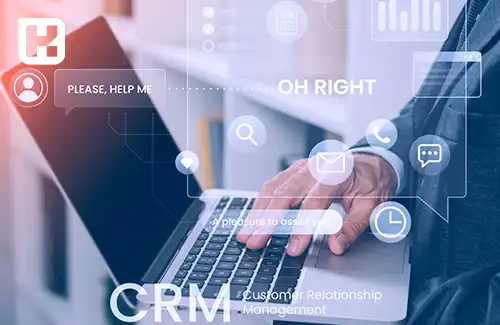

<blockquote class="faq-block">
  

    
آنچه در این مطلب خواهید خواند:

      <li>چرا به نرم افزار CRM نیاز داریم؟</li>
      <li>مزایای استفاده از CRM</li>
      <li>پارامترهای کلیدی در انتخاب نرم افزار CRM</li>
      <li>معرفی بهترین نرم افزارهای CRM خارجی
        <ul>
          <li>Salesforce CRM</li>
          <li>HubSpot CRM</li>
          <li>Microsoft Dynamics 365 CRM</li>
          <li>Zoho CRM</li>
          <li>Pipedrive</li>
        </ul>
      </li>
      <li>معرفی نرم افزار CRM فنک به عنوان جایگزین ایرانی</li>
      <li>بررسی و دانلود نرم افزارهای CRM رایگان و متن‌باز
        <ul>
          <li>Vtiger CRM</li>
          <li>SuiteCRM</li>
          <li>Odoo CRM</li>
          <li>Vtiger CRM</li>
        </ul>
      </li>
      <li>سوالات متداول</li>
      <li>جمع‌بندی</li>
    </ul>
  

</blockquote>
 

امروزه مدیریت موثر ارتباط با مشتریان یکی از عوامل کلیدی موفقیت هر کسب‌وکار به شمار می‌آید. نرم‌افزارهای CRM (مدیریت ارتباط با مشتری) ابزاری قدرتمند برای سازمان‌ها هستند تا بتوانند تعاملات خود با مشتریان را بهینه کرده، فروش را افزایش دهند و خدمات بهتری ارائه کنند. هدف اصلی CRM ایجاد روابط بلندمدت با مشتریان از طریق بهبود فرایندهای فروش، بازاریابی و خدمات پس از فروش است. استفاده از این نرم‌افزارها به کسب‌وکارها کمک می‌کند تا بر اساس داده‌های واقعی تصمیم‌گیری کنند و عملکرد خود را ارتقا دهند.

## چرا به نرم افزار CRM نیاز داریم؟

بسیاری از شرکت ها و کسب و کارها برای بهبود مدیریت ارتباط با مشتریان خود، به دنبال راه حل های نرم افزاری کارآمد هستند. در این راستا نرم افزارهای CRM می توانند با ارائه ابزارهایی برای پیگیری سوابق مشتری، مدیریت پیشنهادات فروش، بازاریابی هدفمند و پشتیبانی مشتری، به شرکت ها در افزایش فروش و حفظ مشتریان کمک شایانی کنند.

### مزایای استفاده از CRM

**- افزایش فروش و درآمد:** CRM با شناسایی مشتریان بالقوه و هدفمندسازی فعالیت‌های بازاریابی، به افزایش فروش و در نتیجه درآمد کمک می‌کند.

**- بهبود روابط با مشتریان:** CRM با ذخیره‌سازی اطلاعات مشتریان، به ارائه خدمات شخصی‌سازی‌شده و پاسخگویی سریع‌تر کمک می‌کند.

**- تصمیم‌گیری بهتر:** CRM اطلاعاتی را فراهم می‌کند که به تصمیم‌گیری‌های مبتنی بر داده کمک می‌کند.

**- بهبود بازاریابی:** CRM داده‌هایی در اختیار بازاریابان قرار می‌دهد تا بتوانند محصول مناسب را به مشتری مناسب برسانند. 

**- افزایش وفاداری مشتریان:** CRM با شناخت بهتر مشتریان به افزایش وفاداری آنها کمک می‌کند.

در مجموع، CRM ابزاری اساسی برای موفقیت هر سازمانی در عرصه کسب‌وکار است.

### پارامترهای مهم در انتخاب نرم افزار CRM

انتخاب یک نرم‌افزار CRM مناسب نیازمند در نظر گرفتن پارامترها و معیارهای زیر است:

**- ویژگی‌ها و قابلیت‌ها:** نرم‌افزار باید تمام قابلیت‌های مورد نیاز سازمان را پوشش دهد مانند مدیریت فروش، بازاریابی، خدمات مشتری، گزارش‌دهی و غیره.

**- سهولت استفاده:** رابط کاربری ساده، آموزش آسان و وجود مستندات کافی بسیار مهم است. 

**- هزینه:** هزینه‌های پیاده‌سازی، آموزش و نگهداری باید متناسب با بودجه سازمان باشد.

**- سازگاری:** CRM باید با زیرساخت‌های فناوری و فرهنگ سازمان سازگار باشد.

**- پشتیبانی:** ارائه‌دهنده باید پشتیبانی فنی و آموزشی مناسبی فراهم کند.

**- امنیت:** CRM باید از امنیت و حریم خصوصی داده‌ها محافظت کند.

انتخاب CRM بر اساس این معیارها، کلید موفقیت در پیاده‌سازی آن است.

## معرفی بهترین نرم افزارهای CRM خارجی

### 1. Salesforce CRM
**معرفی:**
Salesforce به عنوان یکی از بزرگ‌ترین و قدرتمندترین پلتفرم‌های CRM در جهان شناخته می‌شود. این نرم افزار ابری، طیف گسترده‌ای از امکانات من جمله مدیریت فروش، خدمات مشتری، بازاریابی، اتوماسیون فرایندها و تحلیل داده را ارائه می‌دهد.

**ویژگی‌ها و قابلیت‌ها:**

- مدیریت فروش و فرصت‌ها: ردیابی کامل مراحل فروش، پیش‌بینی فروش، مدیریت سرنخ‌ها و فرصت‌ها.

- اتوماسیون بازاریابی: ایجاد کمپین‌های بازاریابی، ایمیل مارکتینگ، مدیریت تبلیغات و تحلیل ROI.

- خدمات مشتری: پشتیبانی از تیکتینگ، پایگاه دانش، چت زنده و خدمات چندکاناله.

- سفارشی‌سازی گسترده: امکان طراحی و پیاده‌سازی فرایندهای اختصاصی کسب و کار بدون نیاز به برنامه‌نویسی سنگین.

- پلتفرم ابری و دسترسی آسان: دسترسی از هر دستگاه با اتصال اینترنت.

- ادغام با نرم افزارهای دیگر: اتصال به ابزارهای متنوع مانند Outlook، Google Apps، و نرم افزارهای مالی و ERP.

- هوش مصنوعی Einstein: تحلیل داده‌ها، پیشنهاد خودکار اقدامات و پیش‌بینی روندها با استفاده از AI.

**مخاطب هدف:**
کسب و کارهای متوسط تا بزرگ، شرکت‌های چندملیتی، سازمان‌هایی که به دنبال راهکارهای کاملاً سفارشی و مقیاس‌پذیر هستند.

**قیمت:**
ساختار قیمت‌گذاری پیچیده و مبتنی بر ماژول‌ها و کاربران، معمولاً هزینه ماهیانه بین 25 تا 300 دلار به ازای هر کاربر دارد.

### 2. HubSpot CRM
**معرفی:**
HubSpot CRM یکی از محبوب‌ترین نرم افزارهای CRM است که به صورت رایگان و با قابلیت ارتقاء به نسخه‌های پولی عرضه می‌شود. این CRM به‌ویژه برای کسب و کارهای کوچک و متوسط طراحی شده است.

**ویژگی‌ها و قابلیت‌ها:**

- رابط کاربری ساده و قابل فهم: یادگیری سریع و آسان برای کاربران تازه‌کار.

- مدیریت تماس‌ها و سرنخ‌ها: ثبت و پیگیری اطلاعات مشتریان، تعاملات و فرصت‌های فروش.

- اتوماسیون بازاریابی: امکانات پایه ایمیل مارکتینگ، ساخت فرم‌ها و مدیریت کمپین‌ها.

- یکپارچگی با سایر ابزارهای HubSpot: مانند بازاریابی محتوا، مدیریت پروژه و خدمات مشتری.

- داشبورد و گزارش‌دهی: ارائه گزارش‌های دقیق و قابل تنظیم در قالب نمودارهای قابل فهم.

- نسخه رایگان: بدون محدودیت زمانی، با امکانات پایه مناسب کسب و کارهای نوپا.

**مخاطب هدف:**
کسب و کارهای کوچک و متوسط که به دنبال یک CRM سبک، آسان و مقرون به صرفه هستند.

**قیمت:**
نسخه پایه رایگان؛ نسخه‌های پولی از 50 دلار ماهیانه شروع می‌شود.

### 3. Microsoft Dynamics 365 CRM
**معرفی:**
Microsoft Dynamics 365 مجموعه‌ای یکپارچه از نرم افزارهای ERP و CRM است که به کسب و کارها امکان می‌دهد تا تمامی فرایندهای سازمانی خود را در یک پلتفرم واحد مدیریت کنند.

**ویژگی‌ها و قابلیت‌ها:**

- مدیریت فروش، بازاریابی و خدمات: امکان مدیریت کامل چرخه عمر مشتری از سرنخ تا خدمات پس از فروش.

- اتصال به Microsoft 365: ادغام کامل با Outlook ،Excel ،Teams و سایر ابزارهای مایکروسافت.

- قابلیت شخصی‌سازی و توسعه: با استفاده از Power Platform و ابزارهای توسعه مایکروسافت.

- هوش مصنوعی و تحلیل داده: ابزارهای تحلیلی پیشرفته و گزارش‌گیری لحظه‌ای.

- پشتیبانی از فرایندهای پیچیده: مناسب کسب و کارهایی با فرایندهای فروش و بازاریابی پیچیده و چندلایه.

**مخاطب هدف:**
کسب و کارهای متوسط تا بزرگ، به ویژه سازمان‌هایی که قبلاً از محصولات مایکروسافت استفاده می‌کنند و به دنبال یکپارچگی کامل سیستم‌ها هستند.

**قیمت:**
ساختار قیمت گذاری بسته به ماژول‌ها و تعداد کاربران متغیر است؛ معمولاً از 65 دلار به ازای هر کاربر در ماه شروع می‌شود.

### 4. Zoho CRM
**معرفی:**
Zoho CRM یکی از نرم افزارهای CRM مقرون‌به‌صرفه و محبوب است که امکانات متنوعی برای مدیریت فروش، بازاریابی و خدمات مشتری ارائه می‌دهد.

**ویژگی‌ها و قابلیت‌ها:**

- مدیریت سرنخ و فروش: پیگیری فرصت‌های فروش و روند تبدیل سرنخ به مشتری.

- اتوماسیون فرایندها: شامل گردش کار خودکار، یادآوری وظایف و هشدارها.

- یکپارچگی گسترده: اتصال با ایمیل، تلفن، شبکه‌های اجتماعی و سایر برنامه‌های Zoho.

- رابط کاربری قابل تنظیم: شخصی‌سازی پنل‌ها، فرم‌ها و گزارش‌ها.

- اپلیکیشن موبایل: دسترسی آسان به اطلاعات مشتریان در هر زمان و مکان.

**مخاطب هدف:**
استارتاپ‌ها، کسب و کارهای کوچک و متوسط که به دنبال CRM ساده، با قیمت مناسب و امکانات قابل توسعه هستند.

**قیمت:**
نسخه رایگان محدود؛ نسخه‌های پولی از 12 دلار به ازای هر کاربر در ماه شروع می‌شود.

### 5. Pipedrive
**معرفی:**
Pipedrive یک CRM فروش محور است که برای تیم‌های فروش طراحی شده و تمرکز اصلی آن بر ساده‌سازی مدیریت فروش و افزایش بهره‌وری تیم فروش است.

**ویژگی‌ها و قابلیت‌ها:**

- مدیریت خط لوله فروش: تصویری و قابل فهم، با امکان کشیدن و رها کردن (drag & drop).

- اتوماسیون فعالیت‌ها: یادآوری تماس‌ها، ارسال ایمیل و پیگیری کارها.

- گزارش‌دهی و تحلیل فروش: گزارش‌های دقیق و نمودارهای عملکرد فروش.

- یکپارچگی با ابزارهای مختلف: از جمله Gmail ،Outlook ،Zapier ،Slack و غیره.

- اپلیکیشن موبایل: همراه با امکانات کامل برای مدیریت فروش در حرکت.

**مخاطب هدف:**
تیم‌های فروش کوچک تا متوسط که به دنبال ابزار ساده و متمرکز بر فروش هستند.

**قیمت:**
از 15 دلار به ازای هر کاربر در ماه شروع می‌شود.

## معرفی نرم افزار CRM فنک (جایگزین ایرانی)

<a href="https://www.hooshkar.com/Software/Fennec/Module/CRM" target="_blank">نرم افزار  CRM فنک</a>، محصولی از شرکت هوشکار پرداز، با تمرکز ویژه بر بهینه‌سازی و خودکارسازی فرایندهای فروش و بازاریابی طراحی شده است. این نرم‌افزار با ارائه قابلیت‌های جامع مدیریت فروش، بازاریابی و پشتیبانی، به سازمان‌ها امکان می‌دهد تا فرآیندهای ارتباط با مشتریان خود را به صورت کاملاً یکپارچه و هوشمند مدیریت کنند.

برخی از ویژگی‌های کلیدی آن عبارتند از:

-	قابلیت‌های کامل مدیریت فروش و بازاریابی
-	امکان سفارشی‌سازی و تطابق با فرایندهای صنایع مختلف
-	تحلیل آماری و گزارش‌دهی گسترده 
-	رابط کاربری ساده و دوستانه
-	قابلیت اتصال به سایر سیستم‌ها از جمله <a href="https://www.hooshkar.com/Software/Fennec" target="_blank">ERP</a>
-	پشتیبانی فنی دائمی
-	هزینه پایین نسبت به محصولات خارجی

CRM فنک با تمرکز بر خودکارسازی و بهینه‌سازی فرایندها، گزینه مناسبی به شمار می‌رود.

**جهت اطلاعات بیشتر لطفا تماس بگیرید.**

## بررسی و دانلود نرم افزارهای CRM رایگان و متن‌باز

نرم افزارهای CRM رایگان و متن‌باز گزینه‌ای بسیار مناسب برای سازمان‌های کوچک، استارتاپ‌ها و کسب و کارهایی هستند که بودجه محدودی دارند و می‌خواهند کنترل کاملی روی سفارشی‌سازی و توسعه نرم افزار خود داشته باشند. در ادامه به معرفی و بررسی چند نرم افزار CRM رایگان و متن‌باز پرکاربرد می‌پردازیم:

### 1. Vtiger CRM
**معرفی:**
Vtiger یکی از شناخته‌شده‌ترین نرم افزارهای CRM متن‌باز است که بر پایه SugarCRM توسعه یافته است و قابلیت‌های کاملی برای مدیریت فروش، بازاریابی و خدمات پس از فروش ارائه می‌دهد.

**ویژگی‌ها:**

- مدیریت کامل چرخه فروش و سرنخ‌ها
- اتوماسیون بازاریابی و ارسال ایمیل
- پیگیری تعاملات و تاریخچه تماس‌ها
- گزارش‌گیری و داشبوردهای قابل تنظیم
- امکان افزودن ماژول‌های اضافی و سفارشی‌سازی بالا
- نسخه ابری و نسخه قابل نصب در سرورهای سازمان

**مناسب برای:**
کسب و کارهای کوچک تا متوسط و استارتاپ‌هایی که به دنبال نرم افزاری قابل انعطاف و توسعه پذیر هستند.

### 2. SuiteCRM
**معرفی:**
SuiteCRM یک نرم افزار CRM متن‌باز کامل و رایگان است که به عنوان جایگزین متن‌باز SugarCRM مطرح شده است و توسط جامعه بزرگی از توسعه‌دهندگان پشتیبانی می‌شود.

**ویژگی‌ها:**

- مدیریت فروش، بازاریابی، خدمات مشتری و پروژه
- امکان سفارشی‌سازی گسترده و افزودن ماژول‌های جدید
- رابط کاربری ساده و کاربرپسند
- امکانات اتوماسیون فرایندها و گردش کار
- قابلیت گزارش‌دهی پیشرفته و داشبوردهای تحلیلی
- پشتیبانی از چند زبان و چند واحد پولی

**مناسب برای:**
سازمان‌های کوچک و متوسط که می‌خواهند نرم افزاری کاملاً رایگان و قابل توسعه داشته باشند و توانایی مدیریت و توسعه داخلی دارند.

### 3. Odoo CRM
**معرفی:**
Odoo یک پلتفرم ERP متن‌باز است که ماژول CRM نیز دارد و قابلیت ادغام با سایر ماژول‌ها مانند فروش، انبارداری، حسابداری و پروژه را دارد.

**ویژگی‌ها:**

- مدیریت سرنخ، فرصت و فعالیت‌های فروش
- اتوماسیون بازاریابی و کمپین‌های ایمیلی
- قابلیت یکپارچگی با ماژول‌های مالی، انبار و پروژه
- رابط کاربری مدرن و قابل تنظیم
- نسخه Community (رایگان) و نسخه Enterprise (پولی)

**مناسب برای:**
کسب و کارهایی که به دنبال یک پلتفرم جامع ERP به همراه CRM هستند و می‌خواهند سیستم‌های مختلف خود را یکپارچه کنند.

### 4. Vtiger CRM
**معرفی:**
ویتایگر نسخه پیشرفته SugarCRM است که امکانات گسترده‌ای در حوزه مدیریت ارتباط با مشتریان، بازاریابی و فروش ارائه می‌دهد.

**ویژگی‌ها:**

- مدیریت پروژه و خدمات پس از فروش
- سیستم تیکتینگ برای پشتیبانی مشتریان
- قابلیت سفارشی‌سازی فرم‌ها و گردش کار
- پشتیبانی از چند زبان و چند واحد پول
- نسخه‌های ابری و نصبی

**مناسب برای:**
کسب و کارهای کوچک تا متوسط و شرکت‌هایی که به دنبال ابزارهای یکپارچه CRM با قابلیت توسعه و تنظیمات بالا هستند.

**نحوه دانلود و نصب**
معمولاً تمامی نرم افزارهای متن‌باز بالا را می‌توانید به صورت رایگان از وب‌سایت رسمی آن‌ها دانلود کنید و بر روی سرورهای خود نصب و راه‌اندازی نمایید. همچنین برخی از آن‌ها نسخه ابری (Cloud) نیز ارائه می‌دهند که نیاز به نصب و نگهداری سرور را کاهش می‌دهد.

### سوالات متداول

<blockquote class="faq-block">
  

    
نرم‌افزار CRM چیست و چه کاربردی دارد؟

    <ul>
      <li>نرم‌افزار CRM ابزاری برای مدیریت ارتباط با مشتریان است که کمک می‌کند تعاملات فروش، بازاریابی و خدمات پس از فروش به صورت سازمان‌یافته و کارآمد انجام شود.</li>
    </ul>
  

</blockquote>
<blockquote class="faq-block">
  

    
چه مزایایی در استفاده از نرم‌افزار CRM وجود دارد؟

    <ul>
      <li>افزایش فروش، بهبود رضایت مشتری، مدیریت بهتر داده‌ها، تحلیل رفتار مشتری و بهینه‌سازی فرآیندهای بازاریابی و فروش از مهم‌ترین مزایای این نرم‌افزار است.</li>
    </ul>
  

</blockquote>
<blockquote class="faq-block">
  

    
آیا نرم‌افزارهای رایگان CRM گزینه مناسبی هستند؟

    <ul>
      <li>برای کسب‌وکارهای کوچک یا استارتاپ‌ها نرم‌افزارهای رایگان می‌توانند گزینه خوبی باشند اما ممکن است محدودیت‌هایی در امکانات و پشتیبانی داشته باشند.</li>
    </ul>
  

</blockquote>
<blockquote class="faq-block">
  

    
نرم‌افزار CRM چگونه به افزایش فروش کمک می‌کند؟

    <ul>
      <li>با ثبت دقیق اطلاعات مشتریان، پیگیری بهتر فرصت‌های فروش و تحلیل داده‌ها، فرایند فروش سازمان‌دهی شده و فروش بهینه‌تر انجام می‌شود.</li>
    </ul>
  

</blockquote>
<blockquote class="faq-block">
  

    
آیا نرم‌افزار CRM فنک، قابلیت سفارشی‌سازی دارد؟

    <ul>
      <li>بله، نرم‌افزار CRM فنک امکان سفارشی‌سازی فرم‌ها، گزارش‌ها و فرایندها را مطابق نیاز کسب‌وکار دارد.</li>
    </ul>
  

</blockquote>
 

### جمع‌بندی

نرم‌افزارهای CRM ابزاری حیاتی برای مدیریت بهتر ارتباط با مشتریان و بهبود عملکرد کسب‌وکارها هستند. با انتخاب نرم‌افزاری متناسب با نیازها و شرایط سازمان، می‌توان فرایندهای فروش، بازاریابی و خدمات پس از فروش را به شکل موثری بهینه کرد. 

گزینه‌های متنوعی در بازار وجود دارد؛ از نرم‌افزارهای پیشرفته و تجاری مانند Salesforce و Microsoft Dynamics گرفته تا نرم‌افزارهای رایگان و متن‌باز مثل Vtiger و SuiteCRM.

نرم‌افزار CRM فنک نیز به عنوان جایگزین ایرانی با امکانات کامل و قیمت مناسب، گزینه‌ای مناسب برای کسب‌وکارهای داخلی به شمار می‌رود.
برای انتخاب بهترین CRM، توجه به پارامترهای کلیدی و دریافت <a href="https://www.hooshkar.com" target="_blank">مشاوره تخصصی</a> اهمیت بالایی دارد تا سرمایه‌گذاری در این حوزه به بهترین نتیجه منجر شود.