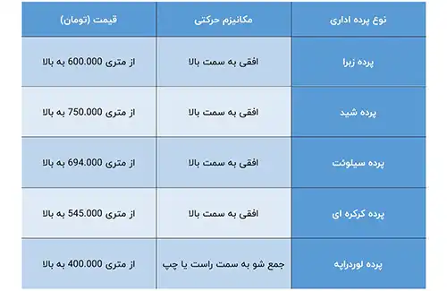

<blockquote style="background-color:#eeeefc; padding:0.5rem">

  
آنچه در این مطلب خواهید خواند:

  <ul>
  <li>انواع پرده های اداری</li>
  <ul>
  <li>پرده اداری زبرا</li>
  <li>پرده اداری شید</li>
  <li>پرده اداری سیلوئت</li>
  <li>پرده اداری کرکره ای</li>
  <li>پرده اداری لوردراپه یا عمودی</li>
  </ul>

</blockquote>

پرده‌های اداری، ابزارهایی کارآمد برای بهینه‌سازی نور و افزایش زیبایی فضاهای کاری هستند. هر نوع پرده دارای ویژگی‌ها و مزایای خاص خود است که می‌تواند محیط‌های اداری را به شکل مطلوب‌تری تنظیم کند. از جمله این پرده‌ها می‌توان به پرده‌های زبرا، شید، سیلوئت، کرکره‌ای و لوردراپه اشاره کرد. هر یک از این انواع پرده، با توجه به طراحی و کارکرد خاص خود، انتخاب مناسبی برای دفاتر و محیط‌های تجاری مختلف هستند. در این مقاله، به بررسی ویژگی‌ها و کاربردهای مختلف این پرده‌ها پرداخته شده است تا بتوانید بهترین گزینه را برای فضای کاری خود انتخاب کنید.

<blockquote style="background-color:#f5f5f5; padding:0.5rem">

<strong>آشنایی با <a href="https://www.hooshkar.com/Software/OfficeCurtains" target="_blank">نرم افزار پرده اداری </a>سایان
</strong></blockquote>

## انواع پرده های اداری

### 1.	پرده اداری زبرا 

یکی از پرده‌های محبوب برای محیط‌های تجاری، اداری است. این نوع پرده از دو لایه پارچه افقی تشکیل شده که با بالا و پایین کردن آن، میزان نوری که وارد محیط می‌شود قابل تنظیم است. این دو لایه پارچه به گونه‌ای قرار می‌گیرند که حالتی از سایه روشن را ایجاد می‌کنند.

با توجه به اینکه محیط‌های کاری نیاز به نور مناسب دارند، پرده زبرا انتخابی عالی برای این فضاها محسوب می‌شود. این پرده‌ها به صورت برقی و دستی عرضه می‌شوند و شما می‌توانید با استفاده از ریموت کنترل، پرده برقی زبرا را به راحتی باز و بسته کنید.

**ویژگی های پرده زبرا:**

-	شستشوی آسان
-	امکان تنظیم نور بدون جمع کردن کامل پرده
-	تنوع بالای آن است

### 2.	 پرده اداری شید

یکی دیگر از انواع پرده اداری که امروزه بسیار مورد توجه قرار گرفته است، پرده‌های شید هستند. این پرده‌ها به دلیل کیفیت بالا و توانایی فیلتر کردن نور به میزان مطلوب، گزینه‌ای ایده‌آل برای محیط‌های اداری محسوب می‌شوند. هرچند پرده‌های شید گزینه‌ای ارزان نیستند، اما ویژگی‌های منحصر به فرد آن‌ها باعث شده تا محبوبیت ویژه‌ای پیدا کنند.

پرده‌های شید بیشتر برای سبک‌های مدرن و فضاهایی که به صورت مونوکروم طراحی شده‌اند، مناسب هستند. زیرا غالباً با طرح‌های ساده عرضه می‌شوند و به این ترتیب با طراحی‌های مدرن و مینیمالیستی هماهنگی بیشتری دارند.

**ویژگی های پرده شید:**

-	طراحی مدرن و شیک پرده
-	هماهنگی و انسجام ظاهری
-	طول عمر و دوام بالا
-	زیبایی و جلوه مدرن

### 3.	پرده اداری سیلوئت

یکی دیگر از بهترین پرده‌های اداری، پرده سیلوئت است که شباهت زیادی به پرده زبرا دارد و گاهی به نام پرده سه‌بعدی نیز شناخته می‌شود. این نوع پرده به صورت عمودی باز و بسته می‌شود و از دو لایه پارچه حریر تشکیل شده است. بین این دو لایه، تکه‌های پارچه ضخیم‌تری با فاصله‌های مساوی قرار گرفته‌اند که به ایجاد جلوه‌ای سه‌بعدی کمک می‌کنند.

**ویژگی های پرده سیلوئت:**

-	تنظیم آسان نور برای محیط کاری
-	پوشش کامل محیط با جلوه‌ای شبیه به کرکره فلزی
-	قابلیت چاپ بر روی پرده
-	الهام گرفته از پرده‌های کرکره فلزی، اما به شکل پارچه‌ای و پرده زبرا
-	ایجاد زیبایی و شکوه در محیط کاری

### 4.	پرده اداری کرکره ای

پرده کرکره اداری، یکی از قدیمی‌ترین انواع پرده‌های اداری است که به دلیل مقاومت بسیار بالا، بسیار مورد توجه قرار گرفته و برای فضاهای بسیار رسمی استفاده می‌شود. یکی از ویژگی‌های برجسته این پرده، همسانی بالا با محیط اداری است که به آن شهرت داده است، همچنین ظاهری رسمی و مدرن به فضای شما می‌بخشد.

**ویژگی های پرده کرکره ای:**

-	تیغه‌های آلومینیومی با انعطاف بالا، ماندگاری و طول عمر بیشتری را فراهم می‌کنند.
-	رنگ‌بندی گسترده: متنوع بودن رنگ‌های آن انتخاب گسترده‌ای را برای شما فراهم می‌کند تا با توجه به سلیقه شخصی و هماهنگی با چیدمان فضایتان رنگ مناسبی انتخاب کنید.
-	پرده کرکره فلزی 16 میلیمتری (پرده ولومی): بهترین گزینه برای پارتیشن‌بندی فضاهای اداری است.

### 5.	پرده اداری لوردراپه یا عمودی

پرده عمودی یکی از قدیمی‌ترین انواع پرده‌های اداری است که به صورت عمودی نصب می‌شود و توسط زنجیره‌های اطرافش به صورت افقی جمع می‌شود. این نوع پرده به صورت ترک‌های جداگانه نصب می‌شود و قابلیت تنظیم نور را دارد. 

از مزایای آن می‌توان به ارزانی قیمت اشاره کرد، اما با توجه به وجود پرده‌های بهتر و مدرن‌تر، اگر به کیفیت و ظاهر مدرن نیاز دارید، توصیه می‌شود که این نوع پرده را به عنوان گزینه‌ی خود در نظر نگیرید.

**ویژگی های پرده لوردراپه:**

-	نصب آسان و قیمت مناسب
-	شستشوی آسان و مقاومت بالا در برابر رطوبت و نور
-	حالت بسته شدن به سمت راست و چپ
-	امکان چاپ عکس بر روی پرده
-	تنوع گسترده در رنگ‌ها

