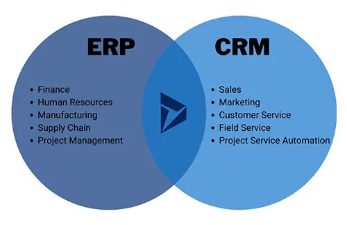

**راهنمای مطالب**
- [ تفاوت CRM و ERP](#تفاوت-crm-و-erp)
- [1. هدف](#1-هدف)
- [2. پوشش](#2-پوشش)
- [3. استفاده از داده ها](#3-استفاده-از-داده-ها)
- [4. ارزش مشتری](#4-ارزش-مشتری)
- [5. محدوده استفاده](#5-محدوده-استفاده)
- [6. پیاده سازی](#6-پیاده-سازی)
- [7. تحلیل داده ها](#7-تحلیل-داده-ها)
- [8. شبکه عرضه](#8-شبکه-عرضه)
- [9. سازگاری](#9-سازگاری)
- [10. هزینه](#10-هزینه)
- [نتیجه گیری](#نتیجه-گیری)

##  تفاوت CRM و ERP
نرم افزار CRM (مدیریت ارتباط با مشتریان) به سازمان‌ها کمک می‌کند تا تعاملات خود با مشتریان (شخصی و سازمانی) را بهبود دهند و اطلاعات مربوط به مشتریان را مدیریت کنند. هدف اصلی CRM بهبود روابط با مشتریان، افزایش رضایت مشتریان و افزایش فروش و در نهایت سود سازمان است.

نرم افزار ERP (برنام ‌ریزی منابع سازمانی) فرآیندهای تجاری مختلف در یک سازمان را یکپارچه و متمرکز می‌کند. این نرم افزارها به مدیران و کارکنان امکان می‌دهند تا به بهترین شکل ممکن منابع مختلفی مانند مواد اولیه، تولید، مالی، منابع انسانی و غیره را مدیریت کنند. هدف ERP افزایش کارایی سازمان، کاهش تکرار و اشتباه در فرآیندها، بهبود تصمیم‌گیری و افزایش کنترل در سطح سازمانی است.

نرم افزار <a href="https://www.hooshkar.com/Software/Fennec/Module/CRM" target="_blank">CRM
</a> و ERP هر دو به منظور بهبود عملکرد شرکت‌ها و افزایش بهره‌وری آن‌ها طراحی شده‌اند، اما تفاوت‌های زیادی بین این دو وجود دارد. 

<blockquote style="background-color:#f5f5f5; padding:0.5rem">
مطلب پیشنهادی: <a href="https://www.hooshkar.com/Software/Fennec" target="_blank">آشنایی با امکانات نرم افزار ERP ایرانی
</a></blockquote>

در اینجا ما به طور خلاصه به بررسی چندین تفاوت مهم بین این دو می‌پردازیم:

### 1. هدف
نرم افزار CRM بهبود ارتباط با مشتریان و افزایش فروش و ارزش مشتری مد نظر دارد، در حالیکه هدف اصلی نرم افزار ERP بهبود فرایندهای داخلی شرکت از جمله مدیریت منابع مالی، زنجیره تامین، پردازش سفارشات و مدیریت انبار است.

### 2. پوشش
نرم افزار CRM تمرکز بیشتری بر روی فعالیت‌های ارتباطی با مشتریان، مانند مدیریت فرآیند فروش، خدمات پس از فروش، بازاریابی و مدیریت تعامل با مشتریان دارد. در حالیکه نرم افزار ERP به تمام فعالیت‌های داخلی شرکت، مانند مدیریت دارایی‌ها، تولید، تامین، حسابداری، مدیریت منابع انسانی و زنجیره تأمین توجه می‌کند.

### 3. استفاده از داده ها
نرم افزار CRM از داده‌های مشتری استفاده می‌کند تا به بهترین شکل ممکن با آن‌ها ارتباط برقرار کرده و خدمات و محصولات را به مشتریان معرفی کند. در حالیکه نرم افزار ERP از داده‌های مربوط به عملکرد داخلی شرکت استفاده می‌کند تا بهبود فرایندهای داخلی را ایجاد کند.

### 4. ارزش مشتری
نرم افزار CRM به بهبود ارزش مشتری می‌پردازد. این نرم‌افزار با ایجاد تعاملات بهتر با مشتریان، ارتباطات قوی‌تر با آن‌ها و بهبود تجربه مشتری در فرآیند خرید و خدمات پس از فروش به منظور افزایش فروش و ارزش مشتری اهمیت می‌دهد. در حالیکه <a href="https://www.hooshkar.com/Software/Fennec" target="_blank">نرم افزار ERP
</a> به بهبود بهره‌وری شرکت و کاهش هزینه‌ها توجه دارد.

### 5. محدوده استفاده
نرم افزار CRM برای شرکت‌هایی مناسب است که در فعالیت‌های خود با مشتریان بسیاری روبرو هستند، مانند شرکت‌هایی در زمینه خدمات مشتریان، فروش و بازاریابی. در حالیکه نرم افزار ERP برای شرکت‌های بزرگ و کوچک مفید است که باید فرایندهای داخلی خود را بهبود بخشند.

### 6. پیاده سازی
نرم افزار CRM در مقیاس کوچکتری نسبت به نرم‌افزار ERP قابل پیاده‌سازی است. همچنین پیاده‌سازی نرم افزار CRM سریعتر و ساده‌تر است.

### 7. تحلیل داده ها
نرم‌افزار CRM برای تحلیل داده‌های مشتریان و تعاملات آن‌ها طراحی شده است. در حالیکه نرم‌افزار ERP برای تحلیل داده‌های داخلی شرکت، مانند داده‌های مالی، تولید و موجودی طراحی شده است.

<blockquote style="background-color:#f5f5f5; padding:0.5rem">
مطلب پیشنهادی: <a href="https://www.hooshkar.com/Software/Fennec/Module/CRM" target="_blank">آشنایی با امکانات نرم افزار مدیریت ارتباط با مشتری
</a></blockquote>

### 8. شبکه عرضه
نرم‌افزار CRM به شبکه عرضه توجه چندانی نمی‌کند و بیشتر در تعامل با مشتریان تمرکز دارد. در حالیکه نرم‌افزار ERP برای بهبود زنجیره تأمین و مدیریت تأمین‌کنندگان طراحی شده است.

### 9. سازگاری
نرم‌افزار CRM به‌طور عمده با نرم‌افزارهای مدیریت ارتباط با مشتریان و فروش مانند ابزارهای بازاریابی، فروش و... سازگار است. در حالیکه نرم‌افزار ERP با سایر نرم‌افزارهای مدیریت داخلی شرکت مانند نرم‌افزارهای مالی، تولید، موجودی، منابع انسانی و زنجیره تأمین سازگار است.

### 10. هزینه
هزینه نرم‌افزار CRM معمولاً کمتر از هزینه نرم‌افزار ERP است، زیرا پیاده‌سازی سریعتر و ساده‌تر است و محدوده استفاده آن نیز کوچکتر است. 
اما هزینه نرم‌افزار ERP می‌تواند به دلیل پیچیدگی بیشتر فرآیندهای داخلی شرکت و نیاز به سازگاری با سایر نرم‌افزارهای داخلی شرکت بالاتر باشد.

## نتیجه گیری
به طور خلاصه، CRM برای بهبود ارتباط با مشتریان و بهبود تجربه مشتریان طراحی شده است، در حالیکه ERP برای بهبود فرایندهای داخلی شرکت و بهبود بهره‌وری آن طراحی شده است. هر دوی این نرم‌افزارها برای شرکت‌هایی که به بهبود کارایی خود علاقه‌مندند، مفید هستند.