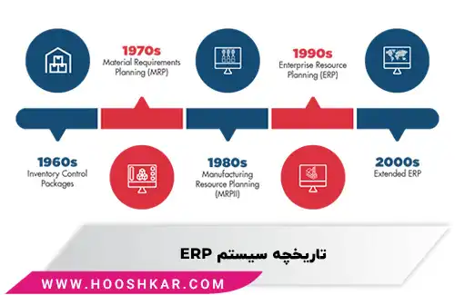

<blockquote style="background-color:#eeeefc; padding:0.5rem">

  
آنچه در این مطلب خواهید خواند:

  <ul>
    <li>تاریخچه ERP</li>
    <li>مخفف ERP چیست؟</li>
    <li>برنامه ریزی منابع سازمانی (ERP) چیست؟</li>
    <li>اجزای سیستم مدیریت منابع سازمانی (ERP)</li>
    <li>چرا ERP مهم است؟</li>
    <li>مزایای استفاده از ERP در سازمان ها</li>
    <li>چرا باید از سیستم ERP در سازمان ها استفاده کنیم؟</li>
  </ul>

</blockquote>

در دنیای پرشتاب و رقابتی امروز، مدیریت کارآمد منابع سازمانی برای موفقیت کسب‌وکارها حیاتی است. سیستم‌های برنامه‌ریزی منابع سازمانی (ERP) به عنوان راهکاری کلیدی در دهه‌های اخیر، توانسته‌اند به سازمان‌ها کمک کنند تا فرآیندهای مختلف خود را یکپارچه و بهینه کنند. 

تاریخچه ERP به دهه 1970 بازمی‌گردد، زمانی که شرکت‌ها از نرم‌افزارهای MRP برای مدیریت تولید و زنجیره تأمین استفاده می‌کردند. با گذر زمان و نیاز به سیستم‌های پیشرفته‌تر، ERP پا به عرصه گذاشت و به ابزاری جامع برای مدیریت همه‌جانبه کسب‌وکار تبدیل شد. 

امروزه ERP‌ها با بهره‌گیری از فناوری‌های نوین همچون هوش مصنوعی و رایانش ابری، به شرکت‌ها در بهبود کارایی، کاهش هزینه‌ها و افزایش شفافیت کمک می‌کنند.

<blockquote style="background-color:#f5f5f5; padding:0.5rem">

<strong>آشنایی با <a href="https://www.hooshkar.com/Software/Fennec" target="_blank">نرم افزار ERP ایرانی</a> فنک
</strong></blockquote>

## تاریخچه ERP

در سال 1975، تقریباً تمام شرکت‌های بزرگ از نرم‌افزار MRP برای مدیریت ارتباطات با مشتری و کنترل فرآیندهای استراتژیک خود استفاده می‌کردند.
با این حال، هزینه عملیاتی این برنامه‌ها فقط برای مشاغل بزرگ مقرون به صرفه بود؛ 

بنابراین برای کاهش این مشکل، در دهه 80 نرم‌افزار MRP II وارد بازار شد. این سیستم راه‌حلی پیشرفته‌تر و البته پیچیده‌تر از نسخه قبلی بود که از کل فرآیند تولید محصول، فراتر از مدیریت موجودی و تهیه مواد خام، پشتیبانی می‌کرد. 
جدیدترین نسخه نرم‌افزار MRP II در بازار توانایی‌های برنامه‌ریزی تولید پیشرفته‌تری را ارائه می‌داد و می‌توانست به راحتی با بخش‌های مختلف کسب‌وکار هماهنگ شود.

سال‌ها بعد، در دهه 1990، نسخه‌های پیشرفته‌تر و توسعه‌یافته MRP و MRP II به بازار عرضه شدند. این سیستم‌ها با نام برنامه‌ریزی منابع سازمانی (ERP) شناخته شدند و قابلیت‌هایی همچون <a href="https://www.hooshkar.com/Software/Fennec/Module/CRM" target="_blank">مدیریت ارتباط با مشتری (CRM)</a>، مدیریت منابع انسانی (HRM)، مدیریت پروژه، <a href="https://www.hooshkar.com/Software/Sayan/Module/Accounting" target="_blank">حسابداری</a> و مهندسی را شامل می‌شدند.

### ERP چیست؟
ERP مخفف Enterprise Resource Planning یا به فارسی برنامه‌ریزی منابع سازمانی است. ساده‌ترین راه برای تعریف ERP این است که در مورد همه فرایندهای کسب و کار اصلی مورد نیاز برای مدیریت یک شرکت فکر کنیم؛ مانند امور مالی، منابع انسانی، تولید، زنجیره تأمین، خدمات مشتریان، تدارکات و... . ERP در ساده‌ترین حالت، به مدیریت بهینه همه این فرایندها در یک سیستم یکپارچه کمک می‌کند.

به زبان ساده، ERP کمک می‌کند تا همه بخش‌ها و عملیات یک شرکت از طریق یک سیستم متحد، به یکدیگر متصل شوند. به این ترتیب اطلاعات به صورت یکپارچه در کل سازمان جریان پیدا می‌کند و همه افراد می‌توانند به اطلاعات مورد نیاز خود دسترسی داشته باشند.

سیستم‌های ERP امروزی چیزی بیشتر از پایه هستند و شباهت کمی به ERP دهه‌های پیش دارند. آنها اکنون از طریق پلتفرم های ابری ارائه می شوند و از جدیدترین فناوری ها مانند <a href="https://www.hooshkar.com/Wiki/InformationTechnology/ArtificialIntelligence" target="_blank">هوش مصنوعی (AI)</a> و یادگیری ماشینی برای ارائه اتوماسیون هوشمند، کارایی بیشتر و بینش فوری در سراسر تجارت استفاده می کنند. 

نرم‌افزار ERP ابری همچنین عملیات داخلی را با شرکای تجاری و شبکه‌های سراسر جهان مرتبط می‌کند و به شرکت‌ها همکاری، چابکی و سرعت لازم برای رقابت امروزی را می‌دهد.

### برنامه ریزی منابع سازمانی (ERP) چیست؟

چگونه راهکارهای ERP می توانند فعالیت های تجاری روزانه سازمان ها مانند حسابداری، امور مالی، تدارکات، مدیریت پروژه، زنجیره تامین و تولید را مدیریت کنند؟

سیستم های برنامه‌ریزی منابع سازمانی، پلتفرم‌های کامل و یکپارچه‌ای هستند، که تمام جنبه‌های یک تجارت مبتنی بر تولید یا توزیع را مدیریت می‌کنند. علاوه بر این، سیستم های ERP از تمامی جنبه‌های مدیریت مالی، منابع انسانی، مدیریت زنجیره تامین و تولید با عملکرد اصلی حسابداری شما، پشتیبانی می‌کنند.

سیستم های ERP همچنین با ردیابی تمام جنبه های تولید، تدارکات و مالی شفافیت کامل را در فرآیند کسب و کار شما فراهم می کنند. این سیستم‌های یکپارچه به‌عنوان هسته اصلی کسب‌وکار برای گردش کار و داده‌ها عمل می‌کنند و به بخش‌های مختلف اجازه دسترسی می‌دهند.

سیستم ها و نرم افزارهای ERP از عملکردهای متعدد در سراسر سازمان، مشاغل بزرگ، متوسط یا کوچک پشتیبانی می‌کنند، از جمله سفارشی‌سازی ها برای صنعت شما.

در واقع ERP (Enterprise Resource Planning) تمام Data ها و فرایندهای یک سازمان را در قالب یک سیستم نرم افزاری بصورت پیوسته و یکپارچه مدیریت می نماید.
هرچه سازمانی گسترده تر شود برنامه ریزی و مدیریت آن سخت تر خواهد شد اینجاست که اهمیت نرم افزارهای ERP مشخص می گردد.

### اجزای سیستم مدیریت منابع سازمانی (ERP)

**1. <a href="https://www.hooshkar.com/Software/Sayan" target="_blank">مدیریت مالی</a> (Financial Management):** این بخش از ERP به مدیریت مالی و حسابداری شرکت می‌پردازد، از جمله مدیریت حسابداری عمومی، مدیریت مالی،  <a href="https://www.hooshkar.com/Software/Sayan/Module/Treasury" target="_blank">دریافت و پرداخت</a>، گزارش‌دهی مالی و پیگیری مالی.

**2. مدیریت ارتباط با مشتری (Customer Relationship Management):** این بخش به شرکت کمک می‌کند تا اطلاعات مشتریان را مدیریت کرده و روابط خود با آنها را بهبود ببخشد. این شامل مدیریت تماس‌ها، فروش، خدمات مشتریان و مدیریت تاریخچه تعاملات با مشتریان می‌شود.

**3. <a href="https://www.hooshkar.com/Software/Fennec/Module/Sale" target="_blank">فروش و بازاریابی</a> (Sales and Marketing):** این قسمت به مدیریت فروش، سفارش‌ها، تخفیف‌ها، بازاریابی و تبلیغات مرتبط با محصولات و خدمات شرکت کمک می‌کند.

**4. مدیریت منابع انسانی (Human Resource Management - HRM):** این بخش به مدیریت اطلاعات پرسنلی شرکت، شامل پرسنل، حقوق و دستمزد، انتخاب و جذب کارکنان، ارزیابی عملکرد و مدیریت زمینه‌های مربوط به منابع انسانی می‌پردازد.

**5. <a href="https://www.hooshkar.com/Software/Fennec/Module/ProductionPlanning" target="_blank">مدیریت تولید</a> (Production Management):** این بخش به برنامه‌ریزی و کنترل تولید، مواد اولیه، تجهیزات و فرآیندهای تولید می‌پردازد.

**6. مدیریت نگهداری و تعمیرات (Maintenance and Repairs Management):** این قسمت به مدیریت نگهداری و تعمیرات تجهیزات و دارایی‌های شرکت کمک می‌کند.

**7. مدیریت زنجیره تأمین (Supply Chain Management - SCM):** این بخش به مدیریت فرآیندها و تأمین کالا و خدمات از تأمین‌کنندگان تا مشتریان می‌پردازد.

**8. <a href="https://www.hooshkar.com/Software/Sayan/Module/Inventory" target="_blank">مدیریت موجودی انبار</a> (Inventory Management):** این قسمت به مدیریت موجودی کالاها و مواد انباری شرکت می‌پردازد تا موجودی بهینه داشته باشند و هدررفت کاهش یابد.

**9. مدیریت خرید (Procurement Management):** این بخش به مدیریت فرآیند خرید کالا و خدمات از تأمین‌کنندگان مختلف می‌پردازد.

این اجزا با یکدیگر ارتباط دارند و اطلاعات را در سیستم مشترک به اشتراک می‌گذارند تا به بهبود کارایی و افزایش تصمیم‌گیری‌های بهتر در سازمان کمک کنند.

<blockquote style="background-color:#f5f5f5; padding:0.5rem">

<strong>بیشتر بخوانید: <a href="https://www.hooshkar.com/Wiki/Business/ERPRoleInOrganizations" target="_blank">نقش ERP در سازمان ها چیست؟</a>
</strong></blockquote>

### چرا ERP مهم است؟

سیستم برنامه ریزی منابع سازمانی (ERP)، یکپارچگی و هوشمندی لازم برای اجرای کارآمد تمامی فرایندهای کسب‌وکار را فراهم می‌کند.

بعنوان مثال امور مالی برای بستن سریع حساب‌ها به ERP نیاز دارد. بخش فروش برای مدیریت سفارشات مشتریان به ERP وابسته است. لجستیک برای ارائه به‌موقع محصولات و خدمات، به ERP نیاز دارد. حسابداری برای پرداخت به‌موقع صورت‌حساب‌ها باید از ERP استفاده کند. مدیران نیز برای تصمیم‌گیری‌های به‌موقع نیازمند دید لحظه‌ای عملکرد سازمان هستند که توسط ERP فراهم می‌شود.

بنابراین اهمیت ERP برای کسب‌وکارها بسیار زیاد است و پیش‌بینی می‌شود بازار جهانی آن تا سال 2026 به 78 میلیارد دلار برسد.

### مزایای استفاده از ERP در سازمان ها

**1. ایجاد یکپارچگی و هماهنگی در سازمان:** ERP به سازمان کمک می‌کند تا تمام بخش‌ها و واحدها با یکدیگر هماهنگ شوند و یک دید کلی از عملکرد سازمان داشته باشند.

**2. کاهش زمان تکمیل و نهایی کردن محصول:** با بهینه‌سازی فرآیندهای سازمانی، زمان تولید و تحویل محصولات کاهش می‌یابد.

**3. تبدیل فرآیندهای سازمانی از حالت ضمنی به صریح:** ERP به سازمان‌ها کمک می‌کند تا فرآیندهای خود را به شکل صریح و قابل اندازه‌گیری تعریف کرده و بهبود دهند.

**4. توسعه زیرساخت‌ها برای ورود به دنیای کسب و کار الکترونیک:** سیستم ERP زیرساخت‌های مورد نیاز برای فعالیت در دنیای کسب و کار آنلاین را فراهم می‌کند.

**5. کاهش هزینه‌های انبار:** با مدیریت بهتر موجودی انبار، هزینه‌های نگهداری کاهش می‌یابد.

**6. کاهش نیاز به آموزش:** ERP با ارائه رابط کاربری یکپارچه، نیاز به آموزش مکرر کارکنان را کاهش می‌دهد.

**7. مدیریت درست تدارکات و سفارشات:** سیستم ERP به بهبود مدیریت تدارکات و سفارشات کمک می‌کند.

**8. امکان استفاده از وب:** ERP امکان دسترسی به اطلاعات از طریق وب را فراهم می‌کند.

**9. کاهش هزینه سفارش‌ها:** با بهبود فرآیندهای سفارش‌دهی، هزینه‌های مرتبط با سفارش‌ها کاهش می‌یابد.

**10. کاهش هزینه‌های ناشی از توقف خط تولید:** ERP به پیش‌بینی و جلوگیری از توقف‌های تولید کمک می‌کند.

**11. قابلیت تطبیق با استانداردهای مدرن و به‌روز دنیا:** سیستم ERP به سازمان امکان می‌دهد تا با استانداردها و تغییرات جدید در صنعت همگام شود.

**12. کاهش هزینه خطاهای ناشی از هماهنگی ضعیف:** با ایجاد هماهنگی بهتر بین واحدهای مختلف سازمان و کسب‌وکارهای دیگر، خطاها کاهش می‌یابند.

**13. افزایش قابلیت متناسب سازی برای مشتری:** سیستم ERP به سازمان امکان می‌دهد تا به بهترین شکل به نیازهای مشتریان پاسخ دهد.

**14. افزایش رضایت مشتری:** با درگیر کردن مشتری در فرآیندهای کاری، از سفارش تا تحویل محصول، رضایت مشتری افزایش می‌یابد.

<blockquote style="background-color:#f5f5f5; padding:0.5rem">

<strong>بیشتر بخوانید: <a href="https://www.hooshkar.com/Software/Fennec/Module/CRM" target="_blank"> با انواع مختلف CRM </a>آشنا شوید
</strong></blockquote>

**15. افزایش فروش و رشد سازمان:** با بهبود فرآیندها و توسعه کسب‌وکار، سازمان می‌تواند فروش خود را افزایش دهد و رشد کند.

**16. افزایش سازگاری در اطلاعات موجود:** ERP به سازمان امکان می‌دهد تا اطلاعات را به صورت مطلوب و سازگاری با یکدیگر نگهداری کند.

**17. کاهش هزینه حمل و نقل:** با بهینه‌سازی زنجیره تأمین و توزیع، هزینه حمل و نقل کاهش می‌یابد.

**18. کاهش زمان تحویل، توزیع کالا و هزینه‌های انبارداری:** ERP به بهبود مدیریت توزیع و انبارداری کمک می‌کند.

**19. کاهش حجم مورد نیاز سرمایه‌گذاری:** با بهره‌گیری از بهینه‌سازی منابع، نیاز به سرمایه‌گذاری بزرگتر کاهش می‌یابد.

**20. افزایش شفافیت و پیگیری و ردیابی فرآیندهای تولید برای مشتری:** ERP  به سازمان امکان می‌دهد تا فرآیندهای تولید را به صورت دقیقتر شفاف کند و مشتریان را در ردیابی و پیگیری سفارش‌های خود شرکت دهد.

**21. امکان استفاده از روش‌های استاندارد و متداول در جهان:** با بهره‌گیری از سیستم ERP، سازمان می‌تواند از روش‌های استاندارد و بین‌المللی در فعالیت‌های خود استفاده کند.

**22. مهندسی مجدد فرآیندهای سازمانی و کاهش زمان انجام آنها:** ERP به سازمان ها کمک می‌کند تا فرآیندهای خود را بازنگری کنند و بهبود دهند، همچنین زمان اجرای تغییرات را کاهش می‌دهد.

**23. امکان نصب و راه‌اندازی سریع‌تر سیستم‌های مرتبط با ERP در سازمان:** با استفاده از سیستم ERP، نصب و راه‌اندازی سیستم‌های متعدد در سازمان به سرعت و با کارایی بالاتر انجام می‌شود.

**24. امکان توسعه سیستم‌ها:** ERP به سازمان امکان می‌دهد تا سیستم‌های مرتبط با آن را بهبود داده و توسعه دهد.

**25. هماهنگی سریع با تغییرات خارج از سازمان:** با استفاده از سیستم ERP، سازمان به راحتی می‌تواند به تغییرات در محیط خارجی و بازار واکنش نشان دهد.

**26. امکان ایجاد همکاری‌های تجاری و سرمایه‌گذاری با هزینه کم، بازدهی بیشتر و نتیجه بهتر:** با دسترسی به اطلاعات دقیق و به موقع، سازمان می‌تواند مشارکت‌های تجاری و سرمایه‌گذاری‌های موفق‌تری را تحت پوشش ERP ایجاد کند.

**27. کاهش هزینه تولید:** با بهره‌گیری از سیستم ERP، سازمان می‌تواند هزینه‌های تولید را به حداقل برساند.

**28. استفاده از فناوری‌های به روز:** سیستم ERP امکان ادغام فناوری‌های جدید و به روز را در سازمان ایجاد می‌کند.

**29. کاهش هزینه عملیات مالی:** ERP به بهینه‌سازی فرآیندهای مالی کمک می‌کند و هزینه‌های مرتبط با آنها را کاهش می‌دهد.

**30. تغییر برنامه‌نویسی کامپیوتری در سازمان برای بهبود فعالیت‌ها:** با استفاده از ERP، سازمان می‌تواند فرآیندهای برنامه‌نویسی را مجدداً برای بهبود عملکرد تطبیق دهد.

**31. فراهم شدن زیرساخت‌های لازم برای SCM و CRM:** سیستمی برای ایجاد زیرساخت‌های مورد نیاز برای مدیریت زنجیره تأمین (SCM) و مدیریت ارتباط با مشتری (CRM) است.

**32. سرعت بخشیدن به روند انجام فعالیت‌ها و کاهش کارهای بیهوده:** با اتخاذ فرآیندهای بهینه و اتوماسیون، سیستم ERP به سازمان امکان می‌دهد تا بی‌موردی‌ها و تاخیرها را کاهش دهد.

**33. ارتقاء کیفیت تصمیم‌گیری:** با ارائه اطلاعات دقیق و به موقع به مدیریت، سیستم ERP به بهبود کیفیت تصمیم‌گیری در سازمان‌ها کمک می‌کند.

### چرا باید از سیستم ERP در سازمان ها استفاده کنیم؟

1.	یکپارچه و هماهنگ نمودن تمامی قسمت های یک سازمان 
2.	جمع آوری دیتاها در یک دیتابیس
3.	گزارش دهی سریع
4.	بهبود چابکی سیستم
5.	بهره وری بالاتر و...

---
برای انتخاب بهترین نرم افزار ERP متناسب با نیازهای سازمانتان، همین الان با کارشناسان <a href="https://www.hooshkar.com" target="_blank">هوشکار</a> تماس بگیرید و از تجربه و دانش آنها بهره‌مند شوید.