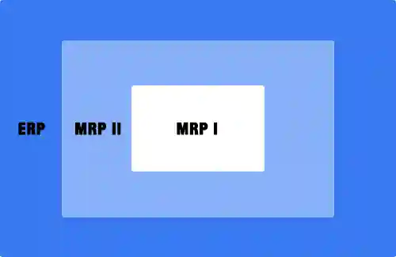

<blockquote style="background-color:#eeeefc; padding:0.5rem">

  
آنچه در این مطلب خواهید خواند

  <ul>
    <li>تفاوت ERP و MRP</li>
    <li>شباهت های بین ERP و MRP در چیست</li>
  </ul>

</blockquote>

**مقدمه**

سیستم های ERP امروزی در واقع شکل توسعه یافته MRP II هستند. 

این دو سیستم در سازمان‌‌ها به جهت توسعه و بهبود عملکرد سازمانی مورد استفاده قرار می‌گیرند و عملکرد منابع سازمانی را مدیریت و کنترل می‌کنند. 

بنابراین درک تفاوت‌های موجود در این دو سیستم در بکارگیری آنها اهمیت ویژه‌ای دارد.

<blockquote style="background-color:#f5f5f5; padding:0.5rem">

<strong>آشنایی با <a href="https://www.hooshkar.com/Software/Fennec" target="_blank">نرم افزار ERP</a> فنک
</strong></blockquote>

## تفاوت ERP و MRP

کاربرد MRP برنامه ریزی می‌باشد که خود در درون سیستم ERP قرار گرفته است. در واقع ERP یک سیستم یکپارچه و جامع جهت مدیریت حجم بالایی از اطلاعات در سازمان‌ها است. کاربرد ERP جهت توسعه و نظارت و حتی تکامل بر روی برنامه‌هایی است که در بخش MRP اجرا شده‌اند.

تمرکز MRP بیشتر بر روی مشتری هدف خود است در صورتی که ERP به سمت دامنه وسیعی تری از کسب و کارهای مشتری حرکت می‌‌کند. MRP دارای مزایایی برای تولید کنندگانی است که دارای کسب و کار کوچکی هستند و تقاضای انها را با در نظر گرفتن مقدار و چشم انداز زمانی لحاظ نماید اما ERP می تواند حتی سازندگان محصول و یا هر نوع کسب و کاری را شامل شود و با الزامات تقاضا یا درخواست‌ها شروع می‌شود نه فقط فروش محصولات و یا پیش بینی‌ها.

<blockquote style="background-color:#f5f5f5; padding:0.5rem">

<strong>بیشتر بخوانید: <a href="https://www.hooshkar.com/Wiki/Business/ERPRoleInOrganizations" target="_blank">نقش ERP در سازمان ها چیست؟</a>
</strong></blockquote>

## شباهت های بین ERP و MRP در چیست

هر دو سیستم با استفاده از DBMS ها (سیستم مدیریت پایگاه داده) بر روی کامپیوترها کار می‌‌کنند. 

هر دو قابلیت اجرا در فضای ابری یا به عنوان مجموعه ابزار درون ‌سازمانی را دارا هستند. 

هر دو برای کمک به کسب و کارها به جهت سود بیشتر و بکارگیری بهبود سرمایه در نظر گرفته شده‌اند تا بتوانند به اهداف خود دست یابند. 

هر دو می‌توانند با سایر نرم افزارهای مورد نیاز با کسب و کار ترکیب شوند.

[مقدمه]: #مقدمه
[تفاوت ERP و MRP]: #تفاوت-erp-و-mrp
[شباهت های بین ERP و MRP در چیست]: #شباهت-های-بین-erp-و-mrp-در-چیست