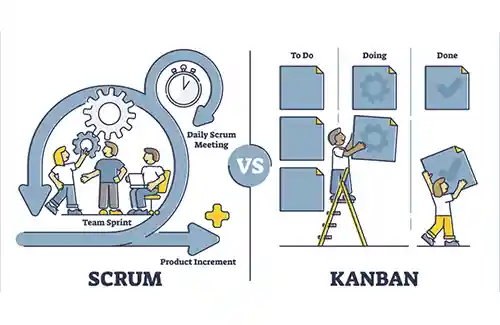

**راهنمای مطالب**
- [مقدمه](#مقدمه)
- [تفاوت در زمان بندی و برنامه ریزی](#تفاوت-در-زمان-بندی-و-برنامه-ریزی)
- [تفاوت در معیارها و ارزش ها](#تفاوت-در-معیارها-و-ارزش-ها)

> [مطلب پیشنهادی: بررسی قابلیت ها و قیمت نرم افزار برنامه ریزی تولید سایان](https://www.hooshkar.com/Software/Fennec/Module/ProductionPlanning)

## مقدمه
کانبان و اسکرام هر دو از فریمورک‌های مدیریت پروژه هستند اما کدام یک کارآمدتر است؟

## تفاوت در زمان بندی و برنامه ریزی
1.	سیستم اسکرام طبق «زمان‌ بندی دقیق» اجرا می‌شود. در حالی که کانبان نسبت به زمان ‌بندی «منعطف» است.

2.	تولید محصول در روش اسکرام، طبق برنامه ثابت و معمولا در پایان اسپرینت صورت می‌گیرد. در صورتی که تولید محصول در روش کانبان با توجه به نیاز کسب و کار، امکان پذیر است.

3.	در اسکرام تسک‌‌های اسپرینت به صورت دسته‌ای به پروسه تولید وارد می‌‌شوند. اما در کانبان هر تسک پس از پایان تسک قبلی و آزاد شدن ظرفیت تیم، وارد فرآیند می‌شود.

4.	در روش اسکرام، امکان تغییر تسک‌‌ها در میانه اسپرینت مجاز نیست، اما روش کانبان نسبت به تغییر برنامه کاملا منعطف عمل می‌کند.

## تفاوت در معیارها و ارزش ها

1.	در اسکرام، اعضای تیم به موفقیت اسپرینت متعهد است، در صورتی که در کانبان، تیم به تکمیل تسک تعهد دارد.
2.	تعامل و ارتباط بین اعضای تیم جز اولویت‌ها در اسکرام است، اما در سیستم کانبان، رسیدن به اهداف در اولویت است.
3.	در روش اسکرام، میزان بهره‌ وری توسط «معیار سرعت تعیین شده برای هر اسپرینت و ظرفیت تیم» تعیین می‌شود. در صورتیکه میزان بهره ‌وری در روش کانبان، به وسیله «معیار زمان مورد نیاز برای تکمیل یک کار منحصر ‌به ‌فرد» محاسبه می‌شود.
4.	سیستم اسکرام برای پروژه‌هایی مناسب تر است که اولویت‌‌های مشخصی دارند و قرار نیست تغییر کنند. اما سیستم کانبان برای پروژه‌هایی که اولویت‌‌های آنها دائم در حال تغییر است، مناسب تر است.

