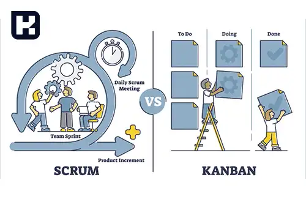

<blockquote style="background-color:#eeeefc; padding:0.5rem">

  
آنچه در این مطلب خواهید خواند

  <ul>
    <li>تفاوت کانبان و اسکرام چیست</li>
    <li>تفاوت در زمان بندی و برنامه ریزی</li>
    <li>تفاوت در معیارها و ارزش ها</li>
  </ul>

</blockquote>

##  تفاوت های بین اسکرام و کانبان چیست

<a href="https://www.hooshkar.com/Wiki/Business/WhatIsKanban" target="_blank">کانبان</a> و اسکرام هر دو از فریمورک‌های مدیریت پروژه هستند اما کدام یک کارآمدتر است؟

**کانبان** بر تصویری کردن جریان کار و مدیریت جریان مداوم کار تمرکز دارد. در کانبان، وظایف به صورت کارت هایی (که به عنوان کارتهای کانبان یا "کانبان کارت" نیز شناخته می‌شوند) نمایش داده می‌شوند که در دسته‌بندی‌های مختلف (که به عنوان "سلول‌ها" یا "ستون‌ها" نیز شناخته می‌شوند) قرار دارند.

**اسکرام** یک چارچوب مدیریت پروژه است که بر تیم‌های کوچک، محدوده‌ی زمانی کوتاه (معمولاً ۲ تا ۴ هفته) به نام "ایتریشن" و تقسیم کار به دوره‌های کوتاه متمرکز است. در اسکرام، نقش‌های مختلف مانند مدیر اسکرام ("اسکرام مستر")، صاحب محصول ("پروداکت اونر") و تیم تعریف می‌شوند و فعالیت‌ها به شکل جلسات روزانه، اجتماعی و برنامه ریزی دوره‌ای انجام می‌شود.

<blockquote style="background-color:#f5f5f5; padding:0.5rem">

<strong>آشنایی با <a href="https://www.hooshkar.com/Software/Sayan/Package/Industrial" target="_blank">نرم افزار کنترل تولید</a> سایان
</strong></blockquote>

### شناخت ستون های اسکرام
اسکرام بر پایه سه ستون اصلی تأسیس می‌شود:

**1. تطبیق (Adaptation):** اسکرام توانایی تطبیق با تغییرات را داراست و خود را با آن‌ها هماهنگ می‌سازد. این چارچوب قابلیت انجام پروژه‌هایی را دارد که به‌طور مداوم از نظر تاکتیکی در حال تغییر باشند.

**2. شفافیت (Transparency):** وظایف افراد در تیم به‌طور شفاف مشخص می‌شود و همه اعضای تیم اطلاعاتی راجع به اینکه چه کاری در حال انجام است و علت انجام آن چیست، دارند.

**3. بازرسی (Inspection):** اعضای تیم و افراد مرتبط به‌طور مداوم پیشرفت پروژه را بررسی کرده و این فرآیند بازخورد مداوم و فرهنگ بهبود را ترویج می‌کند.

####  ارزش‌های اسکرام: بررسی پنج اصل کلیدی آن

در اسکرام، پنج ارزش اساسی به‌کار می‌رود:
- تشویق
- تمرکز
- تعهد
- احترام
- شنوایی

این ارزش‌ها بر ارتباطات صادقانه و شفافیت تاکید دارند و باعث می‌شوند که همه اعضای تیم احساس کنند مالک پروژه هستند.

#### کانبان دارای چهار اصل و شش عمل اصلی است که شامل موارد زیر می‌شوند

**چهار اصل:**

-	شروع به کار با آنچه که در حال حاضر انجام می‌دهید
-	پیگیری تغییرات فزاینده و تکاملی
-	احترام به روند کنونی، نقش‌ها و مسئولیت‌ها
-	تشویق اقدامات رهبری در همه سطوح

**شش عمل اصلی:**

-	تجسم گردش کار
-	محدود کردن کار در حال انجام
-	در نظر گرفتن مدیریت جریان
-	اعلام صریح سیاست‌های فرآیند
-	ایجاد حلقه‌های بازخور
-	ترویج بهبود مشارکت 

## تفاوت در زمان بندی و برنامه ریزی
1.	سیستم اسکرام طبق «زمان‌ بندی دقیق» اجرا می‌شود. در حالی که کانبان نسبت به زمان ‌بندی «منعطف» است.

2.	تولید محصول در روش اسکرام، طبق برنامه ثابت و معمولا در پایان اسپرینت صورت می‌گیرد. در صورتی که تولید محصول در روش کانبان با توجه به نیاز کسب و کار، امکان پذیر است.

3.	در اسکرام تسک‌‌های اسپرینت به صورت دسته‌ای به پروسه تولید وارد می‌‌شوند. اما در کانبان هر تسک پس از پایان تسک قبلی و آزاد شدن ظرفیت تیم، وارد فرآیند می‌شود.

4.	در روش اسکرام، امکان تغییر تسک‌‌ها در میانه اسپرینت مجاز نیست، اما روش کانبان نسبت به تغییر برنامه کاملا منعطف عمل می‌کند.

## تفاوت در معیارها و ارزش ها

1.	در اسکرام، اعضای تیم به موفقیت اسپرینت متعهد است، در صورتی که در کانبان، تیم به تکمیل تسک تعهد دارد.

2.	تعامل و ارتباط بین اعضای تیم جز اولویت‌ها در اسکرام است، اما در سیستم کانبان، رسیدن به اهداف در اولویت است.

3.	در روش اسکرام، میزان بهره‌ وری توسط «معیار سرعت تعیین شده برای هر اسپرینت و ظرفیت تیم» تعیین می‌شود. در صورتیکه میزان بهره ‌وری در روش کانبان، به وسیله «معیار زمان مورد نیاز برای تکمیل یک کار منحصر ‌به ‌فرد» محاسبه می‌شود.

4.	سیستم اسکرام برای پروژه‌هایی مناسب تر است که اولویت‌‌های مشخصی دارند و قرار نیست تغییر کنند. اما سیستم کانبان برای پروژه‌هایی که اولویت‌‌های آنها دائم در حال تغییر است، مناسب تر است.