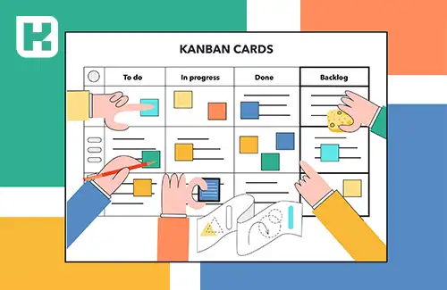

**راهنمای مطالب**
- [مقدمه](#مقدمه)
- [تخته کانبان چیست](#تخته-کانبان-چیست)
    - [مزایای روش استفاده از کانبان](#مزایای-روش-استفاده-از-کانبان)
    - [معایب کانبان](#معایب-کانبان)

## مقدمه
کانبان عبارتی ژاپنی به معنای (نشانه بصری) یا (کارت) است. که نخستین بار توسط تویوتا وارد فضای مدیریت شد. در واقع کانبان شبیه Board عمومی یا تابلویی است که برای همه قابل مشاهده است. 

نگرش رایج قبل از کانبان برای مدیریت خط تولید، سیستمی به نام تزریق یا Push  بود؛ که بزرگترین مشکل این سیستم تولید مازاد و خواب سرمایه بود، از طرفی اگر تقاضای جدیدی از سمت مشتریان در این سیستم دریافت می‌شد بخاطر کمبود مواد اولیه و یا ترافیک گلوگاه‌های تولیدی، آن سفارش قابل عرضه نبود.

سیستم کانبان از روش عرضه کالاهای سوپر مارکتها الگو برداری شده است بدین صورت که سوپر مارکت‌ها موظفند زنجیره تامین را با تقاضای مشتری هماهنگ نمایند و این مشتری‌ها نیستند که باید نگران خالی شدن قفسه‌ها باشند.

<blockquote style="background-color:#f5f5f5; padding:0.5rem">
<a href="https://www.hooshkar.com/Software/Fennec/Module/ProductionPlanning" target="_blank">مطلب پیشنهادی: آشنایی با امکانات نرم افزار برنامه ریزی تولید فنک</a>
</blockquote>

کانبان نشان می‌‌دهد چه محصولی، در چه زمانی و به چه مقدار باید تولید شود. کانبان یک سیستم ساده گردش مواد و اطلاعات است که برای حرکت مواد از یک ایستگاه کاری به سمت ایستگاه کاری دیگر مورد استفاده قرار می‌گیرد.

سیستم کانبان در واقع یک کارت اطلاعاتی است که برای برنامه‌ریزی، پیشبرد فرآیند و زمان ‌بندی عملیات تولید به کار می‌رود. هر چقدر سرعت و دقت در خط تولید یک مجموعه دارای اهمیت بیشتری باشد، جهت تکمیل ابزار کانبان بایستی هزینه بیشتری پرداخت گردد.

## تخته کانبان چیست

تخته کانبان روش اجرای کانبان می‌باشد که می‌تواند بصورت تخته فیزیکی و یا آنلاین بر روی نرم افزارهای مدیریت پروزه پیاده سازی گردد. ساده ترین نوع آن از سه ستون تشکیل شده است:

* ستون To Do (انجام دادن): فعالیتی که هنوز آغاز نشده در این ستون قرار می‌گیرد.
* ستون In Progress (در حال پیشرفت)
* ستون Done (انجام شده)

### مزایای روش استفاده از کانبان

روش کانبان به دلیل تصویری بودن موجب بهبود گردش کار و کاهش زمان چرخه می‌شود. اما از دیگر مزایای این روش می‌توان موارد زیر را نام برد:

1.	روشی شناور: روشی شناور و منعطف که با وارد شدن Task جدیدی می‌توانید اولویت‌ها را مجددا ارزیابی نمایید.
2.	ساده: به دلیل تصویری بودن، به راحتی قابل درک است.
3.	کاهش اتلاف منابع زمانی و مالی
4.	جریان تحویل محصولات و خدمات به مشتری را نظم و بهبود می‌‌بخشد
5.	افزایش سرعت و دقت در فرایند کار به جهت کاهش زمان چرخه

<blockquote style="background-color:#f5f5f5; padding:0.5rem">
<a href="https://www.hooshkar.com/Wiki/Business/KanbanVsScrum" target="_blank">مطلب پیشنهادی:  تفاوت کانبان و اسکرام</a>
</blockquote>

### معایب کانبان

معایبی که برای کانبان بیان می‌شود به دلیل پیاده سازی و مدیریت اشتباه و یا عدم بروزرسانی تخته کانبان می‌باشد.

اما مشکل اصلی مشخص نبودن زمان اجرای فعالیت‌هاست، چراکه ستون‌های در نظر گرفته شده بر اساس فاز فرایندها در نظر گرفته شده که نمی‌توانید بفهمید مثلا فاز To Do چقد زمان جهت اجرا و اتمام نیاز دارد تا فازهای بعدی را برنامه ریزی نمایید.

[مقدمه]: #مقدمه
[تخته کانبان چیست؟]: #تخته-کانبان-چیست؟
[مزایای روش استفاده از کانبان]: #مزایای-روش-استفاده-از-کانبان
[معایب کانبان]: #معایب-کانبان