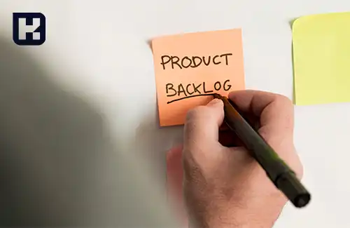

<blockquote style="background-color:#eeeefc; padding:0.5rem">

  
آنچه در این مطلب خواهید خواند

  <ul>
    <li>تعریف اسکرام (Scrum)</li>
    <li>توضیحات شفاف درباره چارچوب اسکرام</li>
    <li>چرا اسکرام را باید انتخاب کنیم؟</li>
    <li>اسپرینت چیست؟</li>
    <li>بک لاگ چیست؟</li>
    <li>وظایف اسکرام مستر در تیم اسکرام</li>
  </ul>

</blockquote>

اسکرام یک چارچوب کاربردی برای مدیریت پروژه‌های نرم‌افزاری و محصولات دیجیتالی است. این روش با تاکید بر تیم‌های کوچک، چرخه‌های کاری کوتاه‌مدت و بازخورد مداوم، امکان انعطاف‌پذیری بالا و سازگاری با تغییرات را فراهم می‌کند. مقاله حاضر به معرفی اجمالی اصول و مفاهیم کلیدی اسکرام از جمله اسپرینت، بک‌لاگ، نقش اسکرام مستر و... می‌پردازد.

<blockquote style="background-color:#f5f5f5; padding:0.5rem">

<strong>آشنایی با <a href="https://www.hooshkar.com/Software/Sayan/Package/Industrial" target="_blank">نرم افزار داشبورد ساز</a> سایان
</strong></blockquote>

## تعریف اسکرام (Scrum)

اسکرام (Scrum) یک چارچوب برای توسعه، تحویل و نگهداری محصولات پیچیده است. به جای اعمال قوانین سخت‌گیرانه که شما را مجبور به رعایت آن‌ها می‌کند، اسکرام در واقع به عنوان یک راهنمایی برای پیشبرد کارها پیش روی ما قرار می‌گیرد.

مسئلۀ پیچیده به مسئله‌ای اطلاق می‌شود که با تغییرات مداومی روبروست، از ابتدا تا انتهای کار مشخص نیست و نمی‌توان تمام جوانب آن را با قطعیت پیش‌بینی کرد. همچنین شرایط کار یا محیط، ثابت و پایدار نیست.

اسکرام به جای اجبار شما بر روی دستورالعمل‌ها و فرآیندهای مشخص، خود را با محیط کسب و کار شما سازگار می‌کند، به نحوی که بتوانید با توجه به نیازها و اهداف خود از آن بهره‌مند شوید.

### توضیحات شفاف درباره چارچوب اسکرام

**درک اشتباه از اسکرام**

اسکرام به حل مشکلات موجود در فرآیند توسعه نرم‌افزارها می‌پردازد.

**درک درست از اسکرام**

به کمک اسکرام می توانیم مشکلات موجود در پروژه‌ها را شناسایی و برای حل آن‌ها اقدام کنیم. اسکرام یک مفهوم و چارچوب گسترده است که در تمامی فرآیندهای ساخت و توسعه محصولات پیچیده و در تمامی کسب و کارهایی که با رویکرد چابک مدیریت می‌شوند، به‌کار می‌رود.

<blockquote style="background-color:#f5f5f5; padding:0.5rem">

<strong>بیشتر بخوانید: <a href="https://www.hooshkar.com/Wiki/Business/KanbanVsScrum" target="_blank">تفاوت کانبان و اسکرام چیست؟</a>
</strong>
</blockquote>

### چرا اسکرام را باید انتخاب کنیم؟

-	انعطاف‌پذیری در برابر تغییرات (Adaptability)
-	تأمین رضایت ذی‌نفعان (Stakeholder Satisfaction)
-	تحویل سریع بخش با ارزش کار در اولویت نخست (Early Delivery of High-Value Product)
-	بازخورد مداوم و ارتقاء پیوسته (Continuous Improvement and Feedback)

احتمالاً مفهوم بهبود مستمر و یا چرخه دمینگ به گوشتان خورده است. در این فرآیند، همواره به بهتر شدن روند انجام کارها فکر می‌کنید. بعد از برنامه‌ریزی و انجام کار، عملکرد خود را بررسی می‌کنید و اگر لازم باشد، اقدام به اصلاح می‌کنید.

این چرخه، که ممکن است به آن به عنوان طرز فکری مداوم در هر کتاب و استاندارد اشاره کنیم، در چارچوب اسکرام نیز مشهود است. در اسکرام، با دریافت بازخوردهای پیوسته و ارائه بخش‌هایی از محصول در هر دوره زمانی که به آن اسپرینت می‌گویند و با دریافت بازخورد از مشتری، روش انجام کارها را بهبود می‌بخشیم.

 **اسکرام از چهار رویداد رسمی تشکیل شده است که بهبود فرآیند کار را تسهیل می‌بخشند**

-	اسکرام روزمره (Daily Scrum)
-	برنامه‌ریزی اسپرینت (Sprint Planning)
-	بررسی اسپرینت (Sprint Review)
-	تجدید نظر اسپرینت (Sprint Retrospective)

## اسپرینت چیست؟

بعد از آشنایی با تعریف اسکرام، به بررسی روش عملکرد و فلسفه آن می‌پردازیم که هسته اصلی اسکرام را sprint تشکیل می‌دهد. **اسپرینت‌ها دوره‌های زمانی متناوبی هستند که در آن‌ها کارها تکرار می‌شوند.** متدولوژی اسکرام بر اساس این تکرارپذیری ساخته شده است. 

در هر دوره تکراری، محصول به تدریج تکمیل می‌شود و در پایان هر دوره زمانی، وضعیت محصول مورد بررسی قرار می‌گیرد. این فرآیند تکراری ادامه پیدا می‌کند تا محصول نهایی تولید شود. در هر اسپرینت، کارهایی قرار است انجام شود، نیازمندی‌ها مشخص می‌شوند و راهکارهای اجرایی برای آنها تدارک دیده می‌شود.

**مواردی که در هر اسپرینت مورد بررسی قرار می‌گیرند:**

**-	شفافیت:** اطمینان از روشن بودن و ابهام‌زدایی در تمامی جنبه‌های فرآیند برای همه اعضای تیم (از مشتریان تا برنامه‌نویسان)

**-	بازبینی:** شناسایی سریع هر گونه انحراف ممکن در هر مرحله از فرآیند

**-	تطبیق:** اصلاح سریع انحراف‌های شناسایی‌شده در کوتاه‌ترین زمان ممکن

## بک لاگ چیست؟

یکی از مفاهیم کارآمد در دنیای اسکرام، بک‌لاگ (Backlog) است. بک‌لاگ به مجموعه‌ای از نیازمندی‌های عملیاتی و غیرعملیاتی اشاره دارد که باید در هر اسپرینت به آنها پرداخته شود و به آن "بک‌لاگ اسپرینت" (Sprint Backlog) نیز گفته می‌شود. هر دوره اسپرینت ادامه پیدا می‌کند تا زمانی که محصول برای انتشار آماده شود و ممکن است صاحب پروژه پس از انتشار، نیازمندی‌های جدیدی را به پروژه اضافه کند که به "بک‌لاگ محصول" (Product Backlog) معروف است.

## وظایف اسکرام مستر در تیم اسکرام

به زبان ساده، اسکرام مستر یک تسهیل‌گر است که تلاش می‌کند موانع پیش روی تیم اسکرام را برطرف نماید. اسکرام مستر از تیم در مسیر رسیدن به اهداف اسپرینت حمایت می‌کند. وظیفه او اطمینان از برگزاری منظم جلسات برنامه‌ریزی و بازبینی تیم اسکرام است و به طور کلی باید مطمئن شود همه چیز در مسیر درست پیش می‌رود.