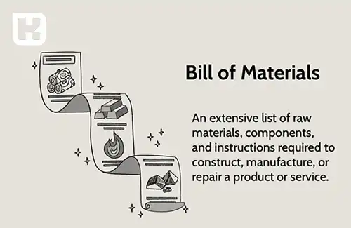

## تعریف BOM

درخت محصول یا BOM، لیست مواد خام، اجزای مونتاژ یا دستور تولید (در فرایند صنایع تولید) برای تولید یک محصول است.  
لیستی که شامل کلیه اقلام مورد نیاز برای تولید یک محصول نهایی لازم است. که کلیه مونتاژها و زیر مونتاژها را نیز نشان می‌دهد. 

این لیست اغلب اوقات بصورت سلسه مراتبی نشان داده می‌شود. مسیرهای این درخت، زیر مونتاژهای لازم برای تولید قطعات در سطوح بالاتر را نشان می‌دهد. همچنین مسیر مونتاژ قطعات برای رسیدن به محصول نهایی نیز نمایش داده می‌شود.

همچنین گاهی اوقات تعداد لازم از هر قطعه برای مونتاژ یک واحد محصول سطح بالاتر نیز در کنار نام قطعه نشان داده می‌شود.

<blockquote style="background-color:#f5f5f5; padding:0.5rem">

<strong>آشنایی با <a href="https://www.hooshkar.com/Software/Fennec/Module/Costing" target="_blank">نرم افزار بهای تمام شده و تولید</a> سایان
</strong></blockquote>

**مثال:** اگر یک سازنده دوچرخه بخواهد 1000 دوچرخه بسازد، صورتحساب مواد شامل تمام قطعات جداگانه مورد نیاز برای ساخت دوچرخه است.

هر قسمت از  (bill of materials) BOM دارای اطلاعاتی در خصوص قیمت، شرح و کد کالا، مقدار، واحد اندازه گیری (unit of measurement)، سایز، طول، وزن و ویژگی‌های دیگری از کالا یا محصول است. که دسترسی به این لیست از درخت محصول سبب کاهش مشکلات و سردرگمی‌ها در زمان تعمیر، جابجایی قطعه، تسهیل در برنامه ریزی تامین کالا و خطاهای ناشی از مقادیر نابجای درخواست‌های تامین می‌شود.

در صورتی که BOM را بر روی یک تقویم با زمانهای سفارش دهی تلفیق کنیم به BOM فاز بندی شده دست می یابیم که زمان تولید یا سفارش هر قطعه را نشان می‌دهد.

هدف رشته صنایع اینست که بهینه سازی انجام دهد. بعنوان کارشناس برنامه ریزی تولید بایستی توانایی بهینه سازی را داشته باشید. 

اگر قصد دارید بعنوان یک کارشناس برنامه ریزی حرفه‌ای فعالیت نمایید باید بر روی برنامه‌های لینگو (Lingo) یا گمز (GAMS) تخصص لازم را به دست آورید.

