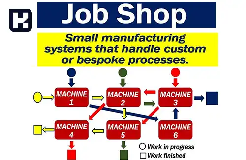

<blockquote style="background-color:#eeeefc; padding:0.5rem">

  
آنچه در این مطلب خواهید خواند

  <ul>
    <li>تعریف تکنولوژی گروهی</li>
    <li>چیدمان فیزیکی</li>
    <li>موانع بر سر راه تکنولوژی گروهی</li>
    <li>از اثرات استفاده از تکنولوژی گروهی</li>
    <li>مراحل عملیاتی کردن تکنولوژی گروهی</li>
  </ul>

</blockquote>

## تعریف تکنولوژی گروهی
در ایده تکنولوژی گروهی برخلاف تولید کارگاهی امکانات و تجهیزات تولیدی به گروه‌ها یا سلول‌های کوچکتری قابل تقسیم است.

سیستم کارگاهی یا job shop کارگاه‌هایی هستند که ماشین آلات موازی رو در آن قرار می‌دهیم. یعنی ماشین آلاتی که می‌توانند بجای همدیگر به خدمت گرفته شوند. 

در سیستم تولید کارگاهی، کارگاه‌های مختلف براساس شباهتی که بین ماشین آلات وجود داره چیده می‌شوند. اما در سیستم تکنولوژی گروهی براساس شباهتی که بین طراحی فرایند محصولات، روالی که بایستی این محصولات بین ماشین‌های مختلف طی نمایند که همان طراحی کالا و فرایند است و فرایند تولید، مونتاژ، کنترل و بررسی تمامی این موارد در این گروه بندی اثر دارد. 

به طور خاص تکنولوژی گروهی مناسب تولید در حجم متوسط با تنوع زیاد است.
کارایی این روش در مواجهه با حجم کم تولید یا مشابهت کم فرایندها کاهش می‌یابد.

<blockquote style="background-color:#f5f5f5; padding:0.5rem">

<strong>آشنایی با <a href="https://www.hooshkar.com/Software/Sayan/Package/Industrial" target="_blank">نرم افزار حسابداری تولیدی</a> سایان
</strong></blockquote>

## چیدمان فیزیکی

* **خط جریان:** هنگامی مورد استفاده قرار می‌گیرد که در آن تمامی قطعات مربوط به گروه به ترتیب ماشین آلات شکل می‌گیرند.

* **سلول گروهی:** قطعات از ماشینی به ماشین دیگر به راحتی حرکت داده می‌شود این حرکت یک طرفه نمی‌باشد.

چیدمان‌های دیگری هم وجود دارد اما در اینجا فقط به این دو مورد اشاره نمودیم.

## موانع بر سر راه تکنولوژی گروهی

*	تشخیص خانواده قطعات تولیدی در کارخانه
*	هزینه بالا برای طبقه بندی و کدگذاری قطعات
*	تغییر در چیدمان ماشین آلات و تبدیل آن به چیدمان گروهی
*	مقاومت در برابر تغییر جهت سیستم

## از اثرات استفاده از تکنولوژی گروهی

* کاهش پیش زمان تولید
* کاهش حجم کار در هنگام عملیات
* کاهش استفاده از ابزارها 
* کاهش موارد دوباره کاری و ضایعات
* بهبود روابط انسانی
* بهبود طراحی محصولات
* تعویض و تنظیم بهتر ابزار
* حمل و نقل بهتر مواد
* کنترل موجودی بهتر
* امکان طراحی فرایند مکانیزه
* رضایت پرسنل و مشتری
* کاهش هزینه‌ها (نیروی انسانی، زمان تولید و...)

## مراحل عملیاتی کردن تکنولوژی گروهی

<a href="https://www.hooshkar.com/Wiki/Production/ProductionPlanning" target="_blank">برنامه ریزی تولید</a> مبحثی است که مدیریت استراتژیک، ارزیابی کار و زمان، موجودی‌ها و... را نیاز دارد. حتی کارشناسانی که به حسابداری صنعتی هم تسلط دارند، به منظور هزینه یابی واحدهای مختلف که بتوانند برنامه ریزی های گوناگون را انجام دهند به حسابداری و هزینه یابی بعنوان ورودی از برنامه ریزی خیلی نیاز دارند.

**1. کد گذاری:**
 منظور از کدگذاری تهیه یک شماره شناسایی برای هریک از محصولات است به نحوی که کد ارائه شده بتواند در شناسایی قطعات مشابه کارایی داشته باشد معمولا یک کد مناسب برای محصول باید شامل چگونگی اجرای فرایندها باشد.

**2. طبقه بندی (شکل گیری گروهی):**
 در طبقه بندی هدف آن است که براساس تشابهات گروه‌هایی برای تشکیل سلول‌های کاری است. مسائل تشکیل سلول یکی از زمینه‌های تحقیقاتی باز در مباحث مرتبط با تکنولوژی گروهی است.

**3. چیدمان فیزیکی:**
پس از تشکیل گروه‌های فرایندی چیدمان داخلی هر سلول نیز از جمله مسائل مهم در طراحی یک سیستم تولید سلولی است.