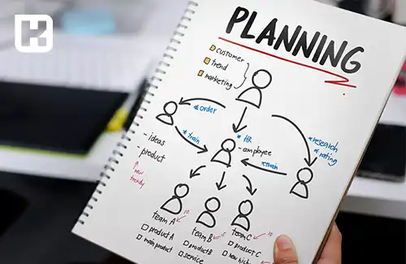

<blockquote style="background-color:#eeeefc; padding:0.5rem">

  
آنچه در این مطلب خواهید خواند

  <ul>
    <li>تعریف برنامه ریزی</li>
    <li>مراحل مختلف برنامه ریزی</li>
    <li>انواع برنامه ریزی</li>
    <li>خصوصیات برنامه‌ریزی چیست؟</li>
    <li>اهداف برنامه ریزی تولید</li>
  </ul>

</blockquote>

## تعریف برنامه ریزی

برنامه ریزی در واقع تنظیم کننده هدف ها و مقاصد سازمانی بوده که می تواند دارای بازه زمانی (کوتاه مدت، میان مدت و بلند مدت) باشد. 

تعیین محور زمانی در برنامه ریزی بسته به حجم تولید و سهم بازار هر سازمانی متفاوت خواهد بود.

بعنوان یه کارشناس برنامه ریزی، باید تفاوت بین Planning ،Programming ،Scheduling و Controlling & Monitoring را بدانید.

* برنامه ریزی کردن: Planning
* برنامه نویسی کردن: Programming
* زمان بندی کردن: Scheduling
* کنترل و مانیتور کردن فرآیند اجرایی و انجام اقدامات لازم: Controlling & Monitoring

<blockquote style="background-color:#f5f5f5; padding:0.5rem">

<strong>آشنایی با <a href="https://www.hooshkar.com/Software/Fennec/Module/ProductionPlanning" target="_blank">نرم افزار برنامه ریزی و کنترل تولید</a> سایان
</strong></blockquote>

## مراحل مختلف برنامه ریزی

در راستای افزایش قدرت رقابت پذیری، هر سازمان باید مراحل مختلف برنامه ریزی را به صورت سلسه مراتبی انجام دهد.

**1. تعیین هدف:**
 * هدف دارای تصویر ملموس و شفاف باشد.
 * هدف قابلیت اندازه گیری داشته باشد. (اگر نتوانیم نتایج فعلی را با نتایج برنامه ریزی مقایسه نماییم ارزیابی موفقیت یا شکست وجود ندارد)
 * هدف باید قابل دستیابی و عملیاتی باشد.
 * هدف باید واقع گرایانه باشد. (متناسب با توانمندی و استراتژی های سازمان باشد) هدف نباید وضعیت موجود باشد باید یک level بالاتر از سطح فعلی باشد. در واقع هدف باید چالش برانگیز باشد.
 * بازه زمانی دستیابی به هدف مشخص شود.

**2. استراتژی ها:**
 * طرح هایی که برای رسیدن به اهداف در سازمان بیان می شوند. 
 * بسته به هدف و نوع سازمان مشخص می شوند.
 * باید در برگیرنده اهداف سازمانی باشند.
 * می توانند بلند مدت، میان مدت و کوتاه مدت باشند.

**3. انواع راهبردها:**
 * سازمانی: مربوط به کل سازمان و مسیر حرکتی آن است.
 * عملیاتی: مربوط به هر عملکرد سازمانی و باید پیرو مسیر راهبردهای سازمانی باشند.

<blockquote style="background-color:#f5f5f5; padding:0.5rem">

<strong>بیشتر بخوانید: <a href="https://www.hooshkar.com/Wiki/Production/ProductionSystems" target="_blank">انواع سیستم های تولیدی
</a>
</strong></blockquote>

**4. راهکارها و تاکتیک ها:**
روش و برنامه هایی که برای اجرایی کردن استراتژی ها به کار می بریم.

**5. بیانیه ماموریت:**
یک کار تیمی و مشارکتی است، اگر ماموریت یک سازمان (علت یا فلسفه وجودی سازمان) را مکتوب نموده و به اطلاع ذینفعان برسانیم و سپس آنها را در مسیر و جریان فعالیتهای سازمان قرار دهیم. بیانیه ماموریت را اجرا کرده ایم.

 _ویژگی های متن بیانیه ماموریت:_

    *	چه خدمات یا کالایی ارائه می دهیم؟
    *	مشتریان محصول یا خدمات چه کسانی هستند؟
    *	مشخص نمودن بازار هدف
    *	استفاده از بهترین تکنولوژی ها جهت تولید محصول یا ارائه خدمات
    *	تداوم رشد بقا و سودآوری: هر فعالیتی که انجام می دهیم به سودآوری بیانجامد.
    *	اشاره به باورها و ارزش های سازمان
    *	مزیت رقابتی و برتری نسبت به رقبا چیست؟
    *	ایجاد یک تصویر ذهنی عمومی از سازمان در ذهن مشتریان و رقبا
    *	توجه به کارکنان: مهمترین منابع هر سازمانی نیروی انسانی آن می باشد.

**6. چشم انداز:** بیان آرمان ها و ارزشهای سازمان

<blockquote style="background-color:#f5f5f5; padding:0.5rem">

<strong>بیشتر بخوانید: <a href="https://www.hooshkar.com/Wiki/Production/MasterScheduling" target="_blank">زمان بندی اصلی چیست؟</a>
</strong></blockquote>

## انواع برنامه ریزی

* برنامه ‌ریزی احتیاجات مواد
* برنامه ‌ریزی تولید
* برنامه ‌ریزی تأمین منابع مالی
* برنامه ‌ریزی منابع انسانی شامل برنامه جذب، حفظ نیروی انسانی و...
* برنامه‌ ریزی فروش
* برنامه ‌ریزی تقاضا
* برنامه‌ ریزی پروژه
* برنامه ‌ریزی حمل و نقل

### خصوصیات برنامه‌ریزی چیست؟

- برنامه‌ریزی، نگاهی به آینده دارد
- برنامه‌ریزی شامل یک خط‌مشی عملی از پیش تعیین‌شده است
- برنامه‌ریزی بهترین گزینه را از میان گزینه‌های موجود انتخاب می‌کند
- برنامه‌ریزی در تمامی سطوح مدیریتی الزامی است
- برنامه‌ریزی فرایندی وابسته برای هماهنگی فعالیت‌های مختلف تجاری است
- برنامه‌ریزی اعضای سازمان را هدایت می‌کند
- رشد و شکوفایی سازمان به برنامه‌ریزی متکی است

<blockquote style="background-color:#f5f5f5; padding:0.5rem">

<strong>بیشتر بخوانید: <a href="https://www.hooshkar.com/Wiki/Production/ProductionPlanning" target="_blank">برنامه ریزی تولید چیست؟</a>
</strong></blockquote>

### اهداف برنامه ریزی تولید
*	رضایت مندی مشتری
*	کمک به مدیران جهت تصمیم گیری بهتر
*	استفاده مناسب از منابع
*	 کاهش هزینه‌های تولیدی از طریق مدیریت اضافه‌کاری
*	کاهش هزینه های تولیدی ناشی از قرارداد جانبی
*	کاهش هزینه های نگهداری
*	ایجاد یک بانک اطلاعاتی مناسب