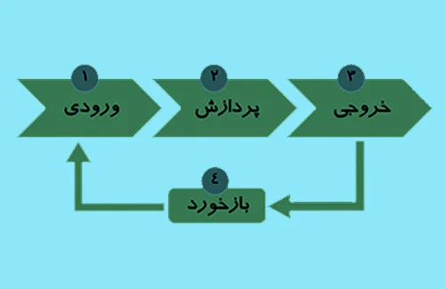
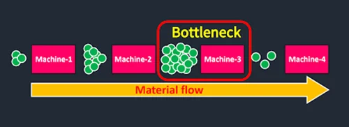

**راهنمای مطالب**
- [اجزای سیستم تولید](#اجزای-سیستم-تولید)
- [انواع سیستم های تولیدی](#انواع-سیستم-های-تولیدی)
    - [1. محصولی (خط تولید = انبوه سازی)](#1-محصولی-خط-تولید--انبوه-سازی)
    - [2. کارگاهی (فرایندی = عملکردی)](#2-کارگاهی-فرایندی--عملکردی)
    - [3. سفارشی (متمرکز = پروژه ای = تکی)](#3-سفارشی-متمرکز--پروژه-ای--تکی)
    - [4. گروهی (سلولی)](#4-گروهی-سلولی)
    - [5. زنجیری](#5-زنجیری)
- [تعریف یکسری مفاهیم کاربردی](#تعریف-یکسری-مفاهیم-کاربردی)
    - [ارزش افزوده](#ارزش-افزوده)
    - [رقابت پذیری](#رقابت-پذیری)
    - [کارایی](#کارایی)
    - [اثربخشی](#اثربخشی)
    - [بهره وری](#بهره-وری)
- [ظرفیت و نکات](#ظرفیت-و-نکات)
- [ایستگاه گلوگاه تولیدی](#ایستگاه-گلوگاه-تولیدی)
    - [معایب گلوگاه](#معایب-گلوگاه)
    - [راه حل کاهش زمان ایستگاه گلوگاه](#راه-حل-کاهش-زمان-ایستگاه-گلوگاه)
- [برونسپاری](#برونسپاری)
    - [عوامل برونسپاری](#عوامل-برونسپاری)
- [دسته بندی سازمانها (نوع فعالیت)](#دسته-بندی-سازمانها-نوع-فعالیت)
- [دسته بندی سازمانها (ماهیت محصول)](#دسته-بندی-سازمانها-ماهیت-محصول)

## اجزای سیستم تولید

**فیدبک + خروجی + پردازش + ورودی = سیستم تولید**

**1. ورودی:** متریال، ماشین ها، کارگران، رویکردها، روش ها و مدیریت

**2. پردازش:** تغییراتی که بر روی ورودی ها انجام می شود 

**3. خروجی:** در نهایت خروجی لازم میتونه کالاها و خدمات باشه.

**4. فیدبک:** یکسری از تجربیات و دانش هایی هستند در جهت ارتقای کیفیت فرایند پردازش و ورودی ها که ما از خروجی استخراج کرده ایم

<blockquote style="background-color:#f5f5f5; padding:0.5rem">
<a href="https://www.hooshkar.com/Software/Sayan/Package/Industrial" target="_blank">مطلب پیشنهادی: آشنایی با امکانات نرم افزار حسابداری تولیدی سایان
</a></blockquote>

## انواع سیستم های تولیدی

### 1. محصولی (خط تولید = انبوه سازی)
تنوع محصولات و انعطاف پذیری کم، مقدار تولید زیاد، گردش مواد پیوسته، تولید محصولات به صورت دسته ای است.
### 2. کارگاهی (فرایندی = عملکردی)
تنوع محصولات و انعطاف پذیری زیاد، تعداد تولید کم، گردش مواد ناپیوسته، محصولات به صورت کالای نیمه ساخته می باشد.
### 3. سفارشی (متمرکز = پروژه ای = تکی)
ساخت محصولات بصورت تکی می باشد (مانند: هواپیما سازی، کشتی سازی، خانه سازی)، مواد اولیه و نیروی کار و تجهیزات و ماشین آلات در محل ساخت محصول مستقر می شوند، معمولاً تولیدات به صورت مواد و امکانات اولیه می باشد.
### 4. گروهی (سلولی)
این مدل، ترکیبی از دو سیستم محصولی و کارگاهی می باشد، در کادر استقرار فرایندی یا همان کارگاهی خواص استقرار محصول را پیاده می نماییم، قطعات مشابه را در یک گروه قرار می دهیم که هر گروه سیستم کارگاهی برای مونتاژ کل سیستم محصولی بکار می رود، زمان تولید محصولات کم و قطعات از نظر طراحی و ساخت مشابه می باشند.
### 5. زنجیری
تعداد محصولات و ماشین آلات بسیار می باشد که اولین گام در آن طراحی و بکارگیری جداول شدت ترافیک است، اما طراحی سیستم حمل و نقل بسیار ساده است.

<blockquote style="background-color:#f5f5f5; padding:0.5rem">
<a href="https://www.hooshkar.com/Wiki/Production/ProductionPlanning" target="_blank">مطلب پیشنهادی: برنامه ریزی تولید چیست؟
</a></blockquote>

## تعریف یکسری مفاهیم کاربردی

### ارزش افزوده
به ارزشی گفته می شود که در فرایند تولید به ارزش کالاها افزوده می شود. دقت کنید که ارزش افزوده را با سود خالص و ناخالص را اشتباه نگیریم.

قیمت تولید = مواد اولیه برای تولید محصول + ارزش افزوده
سود ناخالص = قیمت فروش – قیمت تولید
سود خالص = سود ناخالص – هزینه های بالاسری و غیرمستقیم

### رقابت پذیری
اینکه یک سازمان در برآورده کردن خوسته ها و نیازهای مشتریان نسبت به سایر رقبا که محصول مشابه را تولید می کنند بهتر عمل نماید.

**روش افزایش رقابت پذیری:**
*	شناخت مشتری، خواسته ها و نیازهای او
*	تعیین قیمت مناسب با توجه به سطوح کیفی مختلف
*	تبلیغات و اقدامات ترویجی

### کارایی
مقدار منابعی که برای تولید یک محصول به مصرف رسیده است.
اگر سازمانی بتواند در مقایسه با سازمان دیگر با صرف مقدار کمتری از منابع به هدف مشخص برسد می گویند کارایی بهتری را داشته است. مانند: کارایی انرژی، کارایی نیروی کار، کارایی هزینه ماشین آلات

### اثربخشی
درجه یا میزانی که سازمان به هدف های مورد نظر خود نائل می آید. مانند: میزان رضایت مشتری، میزان قابلیت اطمینان، میزان رضایت کارکنان.
کارایی بر فرایند و اثربخشی بر پایان کار تمرکز دارد.

### بهره وری
چنان چه سازمانی هم کارا و هم اثربخش باشد می گوییم آن سازمان بهره ور است.

## ظرفیت و نکات

**1. ظرفیت طراحی:** 
حداکثر نرخ خروجی یا ظرفیت خدمت رسانی یک سازمان یا فرآیند تولیدی است که در مرحله طراحی در نظر گرفته شده است.  

**2. ظرفیت موثر:**
 ظرفیت طراحی منهای زمانهای پرت. مانند رسیدگی به امور شخصی کارگران، نگهداری و تعمیرات و...

**3. عوامل تعیین کننده ظرفیت موثر:**
    تسهیلات، طراحی محصولات و خدمات، عوامل خارجی، عوامل انسانی و...

**4. سیاست ها و استراتژی های افزایش ظرفیت:**
    سیاست راهبری و دنباله روی

<blockquote style="background-color:#f5f5f5; padding:0.5rem">
<a href="https://www.hooshkar.com/Wiki/Production/GroupTechnology" target="_blank">مطلب پیشنهادی: تکنولوژی گروهی چیست؟
</a></blockquote>

## ایستگاه گلوگاه تولیدی

ایستگاهی که بیشترین زمان در خط تولید و کندترین ایستگاه است

**مثال:** نمایش گلوگاه تولیدی در واحد انبارداری

* مرحله اول: شناسایی گلوگاه، تجمع بار در کامیون و انتظار در تخلیه بار (ماشین های بارگیری بیش از حد انتظار باید برای بارگیری زمان صرف نمایند.)
* مرحله دوم: پرس و جو به منظور شناسایی علت ایجاد گلوگاه موجود (نیروی انسانی که بارگیری کامیون ها را برنامه ریزی میکرده از مجموعه منفک شده و همین امر 
موجب ایجاد این گلوگاه شده است.)
* مرحله سوم: ارائه راه حل، اقدام در جهت حذف گلوگاه (تایم لیفتراک چی ها در حین نزدیک شدن به زمان بارگیری، آزاد شود.)

### معایب گلوگاه
1. گلوگاه باعث بیکاری و پرکاری در ایستگاه ها می شود که همین موضوع باعث عدم توازن در تولید خواهد شد.
2. گلوگاه باعث دپو یا تجمع قطعات نیمه ساخته می شود.

### راه حل کاهش زمان ایستگاه گلوگاه
1. اضافه کردن نیروی کار به ایستگاه
2. اضافه کاری یا شیفت اضافه
3. ارتقا سطح اتوماسیون و...

## برونسپاری
واگذاری فرایندها یا فعالیت های داخلی یک سازمان یا یک کسب و کار به یک تامین کننده خارجی تحت قرارداد مشخص را برونسپاری گویند.

### عوامل برونسپاری
*	ظرفیت در دسترس
*	خبرگی
*	مسائل کیفیتی
*	تقاضا
*	هزینه

## دسته بندی سازمانها (نوع فعالیت)
*	استراتژی
*	ساخت و تولید
*	خدمات

## دسته بندی سازمانها (ماهیت محصول)
* **صنایع تولید پیوسته:** مثل پتروشیمی
* **صنایع تولید گسسته:** مثل خودرو سازی
* **صنایع تولید پروژه ای:** مثل ساخت سد، ساختمان
* **صنایع موجودی خالص:** مثل شرکتهای پخش

[اجزای سیستم تولید]: #اجزای-سیستم-تولید
[انواع سیستم های تولیدی]: #انواع-سیستم-های-تولیدی
[1. محصولی (خط تولید = انبوه سازی)]: #1-محصولی-خط-تولید--انبوه-سازی
[2. کارگاهی  (فرایندی = عملکردی)]: #2-کارگاهی-فرایندی--عملکردی
[3. سفارشی (متمرکز = پروژه ای = تکی)]: #3-سفارشی-متمرکز--پروژه-ای--تکی
[4. گروهی (سلولی)]: #4-گروهی-سلولی
[5. زنجیری]: #5-زنجیری
[تعریف یکسری مفاهیم کاربردی]: #تعریف-یکسری-مفاهیم-کاربردی
[ارزش افزوده]: #ارزش-افزوده
[رقابت پذیری]: #رقابت-پذیری
[کارایی]: #کارایی
[اثربخشی]: #اثربخشی
[بهره وری]: #بهره-وری
[ظرفیت و نکات]: #ظرفیت-و-نکات
[ایستگاه گلوگاه تولیدی]: #ایستگاه-گلوگاه-تولیدی
[معایب گلوگاه]: #معایب-گلوگاه
[راه حل کاهش زمان ایستگاه گلوگاه]: #راه-حل-کاهش-زمان-ایستگاه-گلوگاه
[برونسپاری]: #برونسپاری
[عوامل برونسپاری]: #عوامل-برونسپاری
[دسته بندی سازمانها (نوع فعالیت)]: #دسته-بندی-سازمانها-نوع-فعالیت
[دسته بندی سازمانها (ماهیت محصول)]: #دسته-بندی-سازمانها-ماهیت-محصول