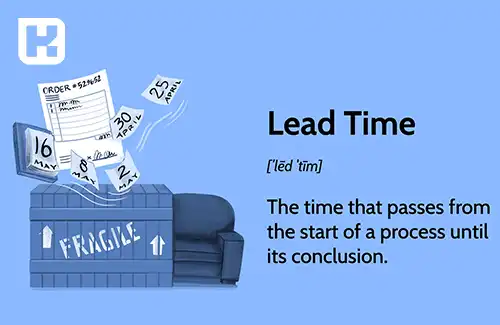

## تعریف lead time
زمان انجام یا lead time به مدت زمانی اشاره دارد که از زمان درخواست یک محصول یا خدمت توسط مشتری تا زمان تحویل نهایی آن به مشتری می‌گذرد. 

به عبارت دیگر، این مفهوم نشان‌دهنده زمان لازم برای پردازش، تولید، حمل و نقل و تحویل یک سفارش به مشتری نهایی است.

<blockquote style="background-color:#f5f5f5; padding:0.5rem">

<strong>آشنایی با <a href="https://www.hooshkar.com/Software/Fennec/Module/ProductionPlanning" target="_blank">نرم افزار برنامه ریزی تولید</a> سایان
</strong></blockquote>

**زمان انجام یا Lead time در صنایع مختلف بدین صورت است:**

**تولیدی:** در صنایع تولیدی،"lead time"  ممکن است شامل مدت زمانی باشد که از شروع تولید محصول تا زمانی که آماده‌سازی و تولید تمام شده و محصول آماده به فروش شود. این شامل زمان تولید، اجزای مورد نیاز، تست کیفیت و مراحل دیگر تولید می‌شود.

**زنجیره تأمین:** در زمینه زنجیره تأمین،"lead time"  به مدت زمانی اشاره دارد که از زمان سفارش دادن مواد یا قطعات تا زمانی که آنها به شرکت تحویل داده شده و آماده استفاده در تولید یا تجمیع می‌شوند.

**فروش و خدمات:** در صنایع مرتبط با خدمات یا فروش،"lead time"  به مدت زمانی اشاره دارد که از زمان درخواست مشتری تا زمانی که محصول یا خدمت به مشتری ارائه می‌شود. مثلاً در این حوزه ممکن است به زمان تحویل یک محصول سفارشی یا زمان انجام یک خدمت تعمیری اشاره داشته باشد.

مدیریت مناسب "lead time" موجب بهینه‌سازی عملیات تولید، مدیریت موجودی، پیش‌بینی تقاضا و بهبود سیستم زنجیره تأمین می شود. افزایش بهبود "lead time" می‌تواند به افزایش رضایت مشتریان، کاهش هزینه‌ها و افزایش کارایی منجر شود.

<blockquote style="background-color:#f5f5f5; padding:0.5rem">

<strong>بیشتر بخوانید: <a href="https://www.hooshkar.com/Wiki/Business/TaktTime" target="_blank">زمان تکت (Takt Time) چیست؟</a>
</strong></blockquote>