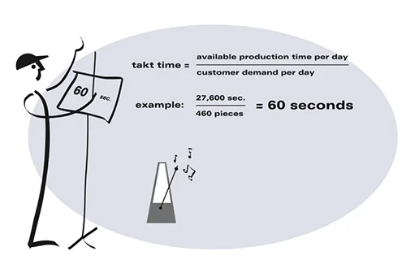
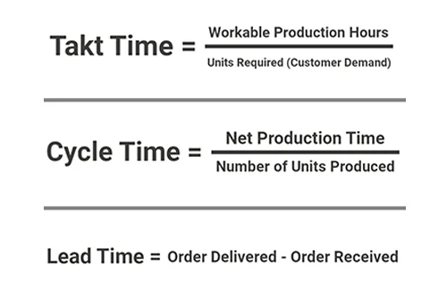
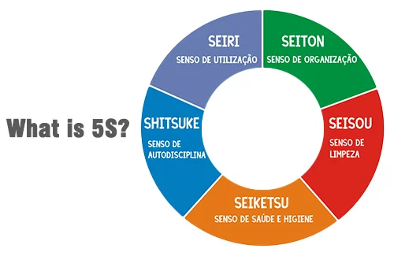

**راهنمای مطالب**
- [مقدمه](#مقدمه)
- [فرمول زمان تکت](#فرمول-زمان-تکت)
- [مزایای Takt Time](#مزایای-takt-time)
- [محدودیت های Takt Time](#محدودیت-های-takt-time)
- [تفاوت Takt Time و Cycle Time و Lead Time](#تفاوت-takt-time-و-cycle-time-و-lead-time)
- [چرا استفاده از Takt Time اهمیت دارد](#چرا-استفاده-از-takt-time-اهمیت-دارد)
- [روش های همسو نمودن زمان تکت با سرعت تولید](#روش-های-همسو-نمودن-زمان-تکت-با-سرعت-تولید)

## مقدمه
زمان تکت فرمولی در ساخت و تولید می باشد، جهت شرح زمان مورد نیاز تولید یک محصول به گونه ای که با تقاضا همخوانی داشته باشد. در واقع مدیریت فرایندهای تولید به صورت موثر و بدون اتلاف زمان و هزینه انجام می شود. زمان تکت شامل زمان کار بدون نظارت مانند استراحت‌های ناهار یا تعمیر و نگهداری برنامه‌ریزی‌شده، نمی‌شود. 

> [مطلب پیشنهادی: بررسی قابلیت ها و قیمت نرم افزار برنامه ریزی تولید سایان](https://www.hooshkar.com/Software/Fennec/Module/ProductionPlanning)

واژه زمان تکت، برگرفته از واژه ژاپنی takuto taimu است که خود این واژه از کلمه آلمانی Taktzeit «زمان چرخه» گرفته شده است. این کلمه احتمالاً توسط مهندسان آلمانی در دهه ۱۹۳۰ به ژاپن وارد شده ‌است.
Takt Time ابزاری بسیار قدرتمند برای مدیران پروژه ای است که به دنبال یک استراتژی سازنده هستند. به دست آوردن میزان دقیق تولید یک پروژه باعث می شود تا از کسری منابع و زمان جلوگیری نموده که خود این عامل موجب افزایش سود و شناسایی بهتر نیازهای مشتریان می گردد. 

## فرمول زمان تکت

_**زمان تکت = تعداد کل ساعات کاری پروژه تقسیم بر مقدار تقاضای مشتری**_

به دست آوردن زمان لازم جهت پاسخگویی به درخواست مشتری، چندان دشوار نیست. این داده ‌ها را می توان از گزارشات ابزار مدیریت پروژه استخراج نمود تا به شما در تصمیم گیری آگاهانه در رابطه با نحوه مدیریت بارهای کاری تیم خود در کل مجموعه پروژه ‌های فعال کمک کند.

**1 مثال:**
با فرض هشت ساعت کار در روز مشتریان یک محصول را درخواست می‌کنند که ساخت آن هشت ساعت زمان می برد. بنابراین زمان تکت برابر با یک روز کاری است.
برخی نیز این هشت ساعت را به دقیقه تقسیم کرده سپس دقیقه‌ ها را برای تولید هر محصول محاسبه می‌ کنند. در این مثال، زمان تکت ۴۸۰ دقیقه خواهد بود.
اگر جلسات، وقفه‌ها، وظایف اداری یا کاری غیرمرتبط با نتیجه مستقیم پروژه در آن دوره هشت ساعته وجود داشته باشد، باید برای محاسبه زمان تکت میانگین دقیقه ‌ها را از کل آن کم کنید.

**2 مثال:**
یک شرکت تولید خودرو را در نظر بگیرید، ابتدا مشتری سفارش خود را ثبت نموده این سفارش به کارخانه ارسال و فرایند تولید آن برنامه ریزی می شود سرانجام خودرو تولید و به دست مشتری می رسد. در طول این بازه آماده سازی تقاضا، مشتری زمان زیادی را منتظر خواهد ماند که این امر یک مودا است.
چرا مشتری در همان لحظه سفارش امکان تحویل خودرو را ندارد؟ چون زمان تکت کارخانه با بخش فروش آن هماهنگ نیست. در واقع زمان تکت مشخص می کند که واحد تولید با میزان تقاضای مشتری چقدر همخوانی دارد و این همخوانی قلب تپنده یک سیستم تولیدی ناب است. 

## مزایای Takt Time

**1.	ایجاد فرایند بهره ور (کارآمد):** با محاسبه درست زمان تکت می توان زمان دقیق برای انجام تمام بخش های تولید را بررسی و اندازه گیری نمود.

**2.	کاهش ضایعات:** استفاده از تکت تایم سبب کاهش و یا حتی حذف ضایعات گردیده که این امر موجب استفاده بهینه و درست از منابع را به دنبال دارد.

**3.	مدیریت استراتژیک موجودی:** هر کدام از صنایع سفارشات متفاوتی را در طول سال دارند بعضی صنایع در برخی از ماه ها سفارشات بیشتر و یا کمتری دارند که با استفاده از تکت تایم می توان پیش بینی نمود که در چه ماهی از سال به چه مقدار تولید آن محصول و همچنین زمان جهت تولید آن نیاز است.

**4.	مدیریت هوشمندانه و مناسب زمان:** برخی مشکلات در فرایند تولید سبب می شود که دیگر بخش ها نیز تحت تاثیر قرار بگیرند و کار آن بخش ها با اختلال همراه شود. با شناسایی گلوگاه ها می توان اقدامات مناسبی جهت رفع مشکلات آن بخش انجام داد.

**5.	ثبات تولید:** ایجاد ثبات در فرایند تولید باعث می شود تا به میزان مشخصی هر ماه محصول تولید شود. در واقع تکت تایم به مدیران کمک می کند تا سرعت پروژه های متعدد در حال اجرا را تنظیم نمایند اینکه کدام پروژه نیاز به سرعت بیشتر یا بالعکس جهت تولید دارد.

## محدودیت های Takt Time

تکت تایم مشکلات نیروی انسانی یا خرابی و نقص به وجود آمده در خط تولید را که در طی فرآیندهای خاصی اتفاق می‌افتد، در نظر نمی‌گیرد، یعنی اگر یک نیروی انسانی نیاز به یک نهار طولانی‌تر یا مرخصی با حقوق داشته باشد آن را لحاظ نمی کند. 
از محدودیت های دیگر جهت کارآمدتر شدن فرآیندها سطح‌ بندی تقاضا است.

## تفاوت Takt Time و Cycle Time و Lead Time
*	زمان تکت (Takt Time)= چه مدت زمان می برد تا تقاضای مشتری برآورده شود.
*	زمان انجام (Lead Time)= چه مدت زمان می برد تا سفارش یک مشتری انجام شود.
*	زمان چرخه (Cycle Time)= چه مدت زمان می برد تا تیم یک سفارش یا پروژه را تکمیل نماید.

## چرا استفاده از Takt Time اهمیت دارد

*	**مشاهده تغییر عملکرد نسبت به برنامه در روزهای گوناگون**

در صورتی که در روزهایی خاص، عملکرد نسبت به برنامه مشخص شده کمتر یا بیشتر باشد، می‌توان به راحتی آن را متوجه شد و اقدامات لازم برای عدم برخورد با مشکلات در آینده را انجام داد.

*	**شناسایی ضعف در روند**

گاهی ممکن است فقط اندکی از روند مشخص شده کند باشد که این موضوع طی یکی دو روز اول قابل توجه نباشد اما بعد با بررسی آن روند می توان به این نکته پی برد. شناسایی این موضوع در زمان مشخص باعث می شود سرعت انجام روند کنترل شود تا در زمان تحویل کالا تاخیر و مشکلی به وجود نیاید

*	**کاهش یا افزایش مناسب اضافه کاری**

برای تولید و تحویل به موقع کالاها در برخی مواقع نیاز به زمان کاری (ساعت اضافه کاری) بیشتری است. این امر سبب می شود تا روند به درستی پیش رود و یا حتی بالعکس در برخی مواقع تولید از زمان بندی جلوتر است پس باید میزان اضافه کاری را کاهش داد تا جلوی هزینه های اضافی گرفته شود. 

*	**آگاهی از محدودیت‌های مجموعه**

وقتی مجموعه ای قرار است به طور فشرده و در زمانی محدود پروژه ای را تحویل دهد در این میان قبول نمودن پروژه جدید کاری اشتباه است چرا که زمان اضافه ای جهت انجام آن پروژه جدید ندارید و این امر سبب ایجاد دردسرهایی برای شما خواهد شد

## روش های همسو نمودن زمان تکت با سرعت تولید

**1.	بهینه‌سازی فرایند**

با بررسی دقیق روند تولید فرایندهای اضافی را حذف نمایید با این کار زمان تولید کالاها به زمان پیش بینی شده نزدیک تر خواهد شد.

**2.	توجه به اصل  (5S)**

توجه و رعایت اصول 5S یکی دیگر از کارهایی است که باعث نزدیک شدن سرعت تولید به زمان پیش‌بینی شده می‌شود. این اصول شامل موارد زیر می‌شوند.

   *  نظم دهی (Seiri): حذف یا کنار گذاشتن بخش‌هایی که غیر ضروری هستند.
   *	مرتب سازی (Seiton): مرتب سازی و شناسایی دقیق قطعات و ابزار جهت سهولت استفاده از آنها در زمان مناسب.
   *	نظافت (Seiso): ایجاد یک پویش برای کار پاکسازی در واحد یا فضای کاری. زمان ‌بندی و تعیین وظایف هر یک از کارکنان آن بخش در این قسمت نهفته است.
   *	استاندارد سازی (Seiketsu): برنامه‌ریزی و زمان‌بندی به منظور انجام روزانه seiri ،seiton و seiso جهت حفظ و نگهداری مجموعه در شرایط عالی.
   *	نهادینه سازی (Shitsuke): نهادینه نمودن مراحل قبلی جهت ایجاد یک عادت روزانه در مجموعه.

توجه به این موارد توان عملیاتی هر مجموعه‌ای را افزایش خواهد داد.

**3.	انعطاف پذیری در تولید**

از دیگر عواملی که سبب افزایش بهره وری و توان تولید محصولات و کالاهای متنوع در زمان کوتاه می‌شود، انعطاف‌پذیری بالای آن است. استفاده از مواردی همچون افزایش ساعت کاری، کارکنان موقت، توان تغییر سریع کالای تولیدی و بسیاری موارد دیگر باعث می‌شوند تا بتوانید سرعت تولید را به میزان مناسبی افزایش دهید.

[مقدمه]: #مقدمه
[فرمول زمان تکت]: #فرمول-زمان-تکت
[مزایای Takt Time]: #مزایای-takt-time
[محدودیت های Takt Time]: #محدودیت-های-takt-time
[تفاوت Takt Time ،Cycle Time و Lead Time]: #تفاوت-takt-time-،cycle-time-و-lead-time
[چرا استفاده از Takt Time اهمیت دارد]: #چرا-استفاده-از-takt-time-اهمیت-دارد
[روش های همسو نمودن زمان تکت با سرعت تولید]: #روش-های-همسو-نمودن-زمان-تکت-با-سرعت-تولید