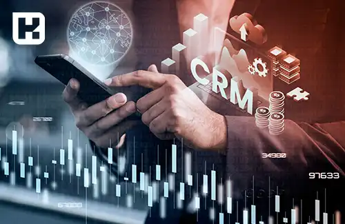
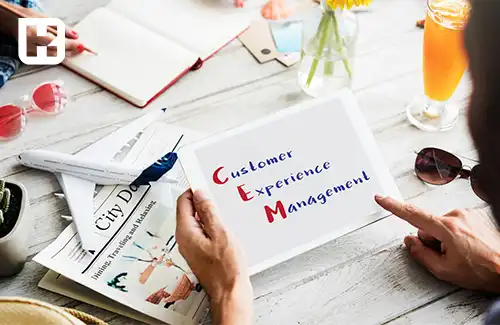
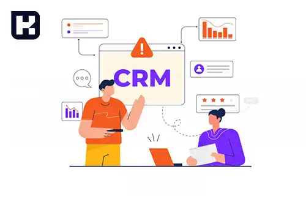

**راهنمای مطالب**
- [مقدمه](#مقدمه)
- [هدف CRM چیست](#هدف-crm-چیست)
- [مزایای CRM چیست](#مزایای-crm-چیست)
- [انواع سیستم های CRM](#انواع-سیستم-های-crm)
- [ECRM چیست و چه تفاوتی با CRM دارد](#ecrm-چیست-و-چه-تفاوتی-با-crm-دارد)
- [مدیریت تجربه مشتری (CEM) چیست و چه تفاوتی با  CRM دارد](#مدیریت-تجربه-مشتری-cem-چیست-و-چه-تفاوتی-با-crm-دارد)
- [تفاوت‌ های نرم افزار CRM و PM](#تفاوت-های-نرم-افزار-crm-و-pm)
- [دلایل شکست پروژه CRM](#دلایل-شکست-پروژه-crm)
- [معرفی محبوب ترین مدل های CRM](#معرفی-محبوب-ترین-مدل-های-crm)
- [چطور یک سیستم CRM ایده آل انتخاب کنیم](#چطور-یک-سیستم-crm-ایده-آل-انتخاب-کنیم)

## مقدمه
مدیریت ارتباط با مشتری یا <a href="https://www.hooshkar.com/Wiki/Business/WhatIsCrm" target="_blank">CRM</a> امروزه به یکی از مهمترین ابزارهای موفقیت و بقای سازمانها تبدیل شده است.

مدیریت ارتباط با مشتری با فراهم کردن شناخت عمیق نسبت به مشتریان، کمک به برقراری ارتباطی مستمر و دوسویه با آنها و در نهایت جلب رضایت و وفاداری مشتریان، نقشی کلیدی در موفقیت سازمان ایفا می‌کند. 

در این مقاله به بررسی جامعی از مفهوم CRM، انواع و کاربردهای آن، مزایا و نکات مهم در انتخاب و پیاده‌سازی سیستم CRM می‌پردازیم. امید است مطالعه این متن به درک بهتری از این موضوع مهم کمک کند.

## هدف CRM چیست
مخفف Customer Relationship Management در معنای لغوی یعنی مدیریت ارتباط با مشتری است. هدف اصلی CRM ایجاد ارتباطی نزدیک، مستمر و دوطرفه با مشتریان به منظور شناسایی بهتر نیازها و خواسته‌های آن‌هاست. 

با استفاده از CRM، شرکت‌ها می‌توانند رفتار مشتریان خود را رصد کرده و بر اساس آن، محصولات و خدماتی را ارائه دهند که نیازهای مشتریان را برآورده می‌کند. همچنین CRM به شرکت‌ها کمک می‌کند تا مشتریان وفادار خود را حفظ کنند. در یک جمله، هدف CRM ارتقای سطح رضایت و وفاداری مشتریان از طریق شناخت و پاسخگویی به نیازهای آنهاست.

<blockquote style="background-color:#f5f5f5; padding:0.5rem">
مطلب پیشنهادی: <a href="https://www.hooshkar.com/Wiki/Business/CrmAndErpDifferences" target="_blank">تفاوت CRM و  ERP چیست؟
</a></blockquote>

## مزایای CRM چیست

**افزایش درآمد:** CRM  با شناسایی مشتریان بالقوه و هدفمند کردن فعالیت‌های بازاریابی، به افزایش فروش و در نتیجه درآمد کمک می‌کند.

**بهبود روابط مشتری:** CRM با ذخیره‌سازی اطلاعات مشتریان، به ارائه خدمات شخصی‌سازی شده و رسیدگی سریع به درخواست‌ها کمک می‌کند.

**بهینه‌سازی هزینه‌ها:** CRM با خودکارسازی فرآیندها، هزینه‌های عملیاتی را کاهش می‌دهد.

**تصمیم‌گیری بهتر:** CRM اطلاعاتی را فراهم می‌کند که به تصمیم‌گیری‌های مبتنی بر داده کمک می‌کند.

**بهبود بازاریابی:** CRM داده‌هایی را در اختیار بازاریابان قرار می‌دهد تا بتوانند بهترین محصول را به مشتری مناسب برسانند.

**افزایش بهره‌وری:** CRM با خودکارسازی فرآیندها، بهره‌وری کارکنان را افزایش می‌دهد.

## انواع سیستم های CRM

سیستم‌های CRM را می‌توان بر اساس کارکردشان به سه دسته تقسیم کرد:

**عملیاتی:** برای مدیریت بر عملیات و فرآیندهایی مثل فروش، بازاریابی، خدمات مشتری و پشتیبانی استفاده می‌شود.

**تحلیلی:** برای تحلیل داده‌های مشتریان و شناسایی الگوهای رفتاری آنها به کار می‌رود تا بتوان بهترین خدمات را ارائه داد.

**تعاملی:** برقراری ارتباط دوطرفه با مشتری از طریق کانال‌های مختلف مثل تلفن، ایمیل، شبکه‌های اجتماعی و غیره

انتخاب نوع CRM بستگی به اهداف و نیاز سازمان دارد. اغلب سازمان‌ها از ترکیب این سه نوع استفاده می‌کنند.

<blockquote style="background-color:#f5f5f5; padding:0.5rem">
مطلب پیشنهادی: <a href="https://www.hooshkar.com/Wiki/Business/WhatIsBpms" target="_blank">مدیریت فرآیند (BPMS) چیست</a></blockquote>

## ECRM چیست و چه تفاوتی با CRM دارد

ECRM مخفف Electronic Customer Relationship Management به معنای مدیریت ارتباط الکترونیکی با مشتری است. در ECRM از فناوری‌های دیجیتال و وب برای ارتباط با مشتریان استفاده می‌شود.

ECRM یک زیرمجموعه از CRM محسوب می‌شود که تنها بر ابزارهای دیجیتال تمرکز دارد در حالی که CRM شامل همه کانال‌های ارتباطی اعم از دیجیتال و غیردیجیتال است. 
 
به عبارت دیگر ECRM یک نوع خاص از CRM است که از فناوری‌های نوین بهره می‌برد.

## مدیریت تجربه مشتری (CEM) چیست و چه تفاوتی با  CRM دارد

CEM مخفف Customer Experience Management به معنای مدیریت تجربه مشتری است.

CEM دربرگیرنده تمام تعاملات و تجارب مشتری با برند در تمامی نقاط تماس است. از آنجا که مشتریان امروزی انتظار دارند در هر برخورد با برند تجربه‌ای مثبت داشته باشند،CEM  اهمیت ویژه‌ای پیدا کرده است.

تفاوت اصلی CEM و CRM در این است که CRM بر برقراری ارتباط با مشتری تمرکز دارد در حالی که CEM بر کیفیت تجربه مشتری تاکید می‌کند.

 CRM ابزاری برای شناخت مشتری است در حالی که CEM راهی برای خلق تجربه‌ای به یادماندنی برای مشتری است. البته این دو حوزه تا حد زیادی به هم وابسته هستند.

<blockquote style="background-color:#f5f5f5; padding:0.5rem">
مطلب پیشنهادی: <a href="https://www.hooshkar.com/Wiki/Business/WhatIsBpmn" target="_blank">BPMN یا مدلسازی فرآیند کسب و کار چیست<a></blockquote>

## تفاوت های نرم افزار CRM و PM

نرم‌افزارهای PM (Project Management) برای مدیریت پروژه‌ها به کار می‌روند. در حالی که نرم‌افزارهای CRM برای مدیریت ارتباط با مشتریان طراحی شده‌اند. 

PM بر روی اهداف پروژه، زمان‌بندی، منابع و بودجه تمرکز دارد در حالی که CRM بر فروش، بازاریابی و ارائه خدمات به مشتری تمرکز می‌کند. البته می‌توان از ترکیب PM و CRM برای مدیریت بهتر پروژه‌های مرتبط با مشتریان بهره برد.

## دلایل شکست پروژه CRM

برخی پروژه‌های CRM با شکست مواجه می‌شوند. دلایل اصلی عبارتند از:

- عدم حمایت مدیران ارشد از پروژه
- مقاومت کارکنان در برابر تغییر فرآیندها  
- عدم تطابق CRM با فرآیندها و نیازهای سازمان
- انتظارات غیرواقع بینانه از پروژه
- عدم آموزش کاربران در استفاده از  CRM
- مشکلات فنی و ضعف پشتیبانی
- هزینه‌های اضافی غیرمنتظره

برای موفقیت پروژه‌های CRM باید این موانع را شناسایی و مدیریت کرد.

<blockquote style="background-color:#f5f5f5; padding:0.5rem">
<a href="https://www.hooshkar.com/Software/Fennec/Module/CRM" target="_blank">نرم افزار CRM فِنِک</a>: 

نرم‌افزار CRM فنک، راهکار هوشمند مدیریت ارتباط با مشتری است که به شما کمک می‌کند تا بهترین تجربه را برای مشتریانتان فراهم کنید.

این نرم‌افزار با قابلیت‌هایی نظیر پیگیری خودکار فروش، برنامه‌ریزی فعالیت‌های فروش، ثبت اتوماتیک فرایندها، تحلیل داده‌ها و گزارش‌دهی، به شما کمک می‌کند تا بهره‌وری و سرعت کار را افزایش دهید و روابطتان را با مشتریان مدیریت کنید.

برای دیدن جزئیات بیشتر درباره نرم‌افزار CRM فنک با ما تماس بگیرید.

</blockquote>

## معرفی محبوب ترین مدل های CRM 

Salesforce، Microsoft Dynamics 365، SAP CRM، Oracle CRM، SugarCRM، Zoho CRM و HubSpot از محبوب‌ترین سیستم‌های CRM هستند که هر کدام ویژگی‌های خاص خود را دارند. 

برخی از عواملی که در انتخاب مدل CRM تاثیرگذار هستند عبارتند از:

- ویژگی‌ها و قابلیت‌ها  
- سهولت استفاده و یادگیری
- هزینه‌های پیاده‌سازی و نگهداری
- قابلیت اتصال و یکپارچگی با سیستم‌های دیگر
- قابلیت شخصی‌سازی
- میزان پشتیبانی فنی

انتخاب CRM مناسب نیازمند بررسی دقیق نیازها و اهداف سازمان است.

## چطور یک سیستم CRM ایده آل انتخاب کنیم

برای انتخاب سیستم CRM باید نیازهای شرکت، اهداف و بودجه را در نظر گرفت. همچنین باید قابلیت‌های CRM از جمله گزارش‌دهی، تحلیل داده، مدیریت فروش و بازاریابی، پشتیبانی و امنیت را بررسی کرد. آسانی استفاده، انعطاف‌پذیری و توانایی ادغام با سایر سیستم‌ها نیز حائز اهمیت است. مشورت با کارشناسان و تحقیق درباره تجربه سایر شرکت‌ها توصیه می‌شود.

در مجموع، CRM  یک ابزار بسیار مفید برای مدیریت ارتباط با مشتری و افزایش فروش و سودآوری شرکت است. با انتخاب صحیح سیستم CRM متناسب با نیازها و اجرای موفق آن می‌توان بهره‌وری شرکت را به طور چشمگیری افزایش داد.

-----
اگر می‌خواهید سازمان خود را برای موفقیت در عرصه رقابت امروزی آماده کنید، نمی‌توانید نقش محوری CRM را در این مسیر نادیده بگیرید. همین حالا اقدام کنید:

- با تحلیل دقیق نیازهای سازمان، اهداف CRM خود را مشخص نمایید
- بهترین سیستم CRM را بر اساس اهدافتان انتخاب کنید
- فرایند پیاده‌سازی موفق CRM را با حمایت مدیران ارشد آغاز نمایید
- از مزایای آن برای تقویت روابط با مشتریانتان بهره بگیرید

اقدام سریع و به موقع شما در این زمینه، کلید مزیت رقابتی و ماندگاریتان خواهد بود.