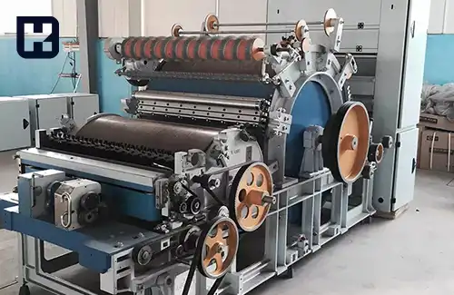

<blockquote style="background-color:#eeeefc; padding:0.5rem">

  
آنچه در این مطلب خواهید خواند:

  <ul>
   <li>آشنایی با دستگاه کاردینگ</li>
   <li>اهداف عملیات کاردینگ</li>
   <li>بخش‌های کلیدی ماشین کاردینگ</li>
   <li>معایب کاردینگ</li>
   <li>دلایل ایجاد بافت مشبک</li>
  </ul>

</blockquote>

کاردینگ یکی از مراحل اساسی در فرآیند ریسندگی است که با استفاده از دستگاه‌های تخصصی، الیاف را برای تبدیل به نخ آماده می‌کند. این دستگاه‌ها به تفکیک و تمیز کردن الیاف از ناخالصی‌ها پرداخته و آنها را به شکل منظمی مرتب می‌کنند. 

عملکرد بهینه این دستگاه‌ها نه تنها بر کیفیت نخ تولیدی تأثیر می‌گذارد، بلکه می‌تواند بهبود کارایی کلی فرآیند تولید را نیز به همراه داشته باشد. در ادامه این مقاله، با جزئیات بیشتری درباره اصول کاردینگ، بخش‌های مختلف دستگاه کاردینگ و چگونگی بهبود کارایی آن آشنا خواهید شد. 

## آشنایی با دستگاه کاردینگ

**واژه کارد**

کارد از واژه کاردوس مشتق شده است که به معنای نوعی خار می‌باشد؛ این خار در گذشته برای باز کردن پنبه مورد استفاده قرار می‌گرفته است.

کاردینگ یک فرآیند مکانیکی است که طی آن الیاف از هم جدا می‌شوند و به گونه‌ای منظم‌تر و موازی با یکدیگر قرار می‌گیرند. این فرآیند نه تنها برای جدا کردن الیاف، بلکه برای ایجاد مخلوط‌هایی از الیاف مختلف یا رنگ‌های متنوع نیز به کار می‌رود.

در ریسندگی، کاردینگ به منظور حذف ناخالصی‌های باقی‌مانده از مرحله حلاجی انجام می‌شود. پس از عملیات کاردینگ، محصول خروجی به دستگاه‌های کشش منتقل می‌گردد تا مراحل بعدی فرآوری را طی کند.

### اهداف عملیات کاردینگ

- جداسازی و تفکیک الیاف
- حذف ناخالصی‌های باقی‌مانده از فرآیند حلاجی
- جداسازی الیاف کوتاه و مواد خارجی مانند گرد و غبار و تخم پنبه و باز کردن توده‌های چسبیده در الیاف مصنوعی
-	 حذف نپ‌های (گره خوردگی) موجود در الیاف
-  صاف و موازی کردن الیاف

-  ترکیب الیاف مختلف
-  تشکیل فتیله (تبدیل الیاف نامنظم به فتیله‌ای مداوم با نمره معین برای استفاده در ماشین‌های بعدی)
### بخش‌های کلیدی ماشین کاردینگ

- قسمت تغذیه  (Feeder)
-	تیکرین  (Taker-in)
-	سیلندر اصلی  (Main Sylinder)
-	 کلاهک  (Flat)
-	دافر  (Doffer)
-	کالندر  (Calender)
-	کویلر  (Coiler)

### معایب کاردینگ

- تغییرات زیاد در فتیله‌های نخ
- تشکیل بافت مشبک
- دلایل ایجاد سوراخ‌ها یا وصله‌ها در تار کارد
- تفاوت در نخ‌کشی بین کاردها که باعث تغییر در فتیله‌ها می‌شود
- ساییدگی کارد و یاتاقان تغذیه‌کننده غلتک که منجر به تغییر در فتیله کارد می‌شود
- عدم عملکرد صحیح ترازکننده خودکار که باعث تغییرات زیاد در فتیله می‌شود. در صورتی که ترازکننده خودکار غیرفعال باشد، هر نیم ساعت پوشش کاردینگ را بررسی کنید.

### دلایل ایجاد بافت مشبک

تعمیرات جامع دستگاه باید به‌طور منظم و به‌موقع انجام شود. در حین تعمیرات کلی، تنظیمات تمامی بخش‌های دستگاه باید به دقت بررسی و تنظیم شوند. تنظیمات فلت نقش کلیدی در کاهش تشکیل بافت مشبک دارند و بنابراین باید به‌درستی تنظیم شوند تا ناهمواری نداشته باشند.

نقطه مکش ضایعات نیز باید به‌درستی عمل کند و نباید مسدود شود. وجود هرگونه انسداد می‌تواند منجر به تشکیل بافت مشبک شود. بررسی دستی نقطه مکش ضایعات نیز می‌تواند به شناسایی مشکلات کمک کند.
علاوه بر این، مسئله نگهداری اهمیت زیادی دارد. تعمیرات کلی باید در زمان‌های معین انجام شود و سیم‌های فلت و سیلندرها نیز دارای عمر مفید محدودی هستند. پس از اتمام این دوره زمانی، باید آن‌ها را تعویض کرد تا از لحاظ کیفیت عملکرد مناسب را حفظ کرد.
