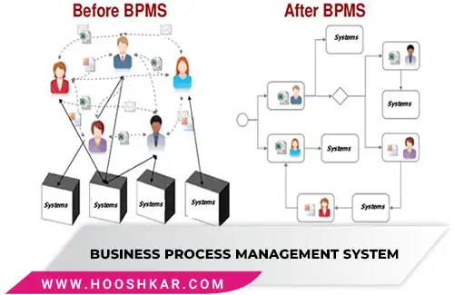

<blockquote style="background-color:#eeeefc; padding:0.5rem">

  
آنچه در این مطلب خواهید خواند

  <ul>
    <li>نرم افزار BPMS چیست</li>
    <li>مزایای نرم افزار BPMS</li>
  </ul>

</blockquote>

##  نرم افزار BPMS چیست

<a href="https://www.hooshkar.com/Software/Fennec/Module/BPMS" target="_blank">نرم افزار BPMS
</a> یکی از ابزارهای مدیریت فرایند کسب و کار است که به شما کمک می‌کند تا فرایندهای سازمان خود را از طریق اتوماسیون و بهینه‌سازی بهبود ببخشید.

این ابزار شامل مجموعه‌ای از ابزارها و سرویس‌ها است که به شما کمک می‌کند تا فرایندهای سازمانی خود را از طریق مانیتورینگ، اتوماسیون، اجرا و بهینه‌سازی بهبود بخشید.

<blockquote style="background-color:#f5f5f5; padding:0.5rem">

<strong>آشنایی با <a href="https://www.hooshkar.com/Software/Fennec/Module/BPMS" target="_blank">نرم افزار BPMS ایرانی 
</a>فِنِک
</strong></blockquote>

## مزایای نرم افزار BPMS

**1. کاهش هزینه‌ها:** با استفاده از اتوماسیون و بهینه‌سازی فرایندهای کسب و کار، هزینه‌های سازمان شما کاهش می‌یابد.

**2. افزایش کارایی:** با بهینه‌سازی فرایندهای کسب و کار، زمان و هزینه‌هایی که برای اجرای آن‌ها صرف می‌شود، کاهش می‌یابد و به همین دلیل کارایی سازمان شما افزایش می‌یابد.

**3. بهبود کیفیت:** با مانیتورینگ و کنترل فرایندهای کسب و کار، کیفیت محصولات و خدمات سازمان شما بهبود می‌یابد.

**4. سازگاری با تغییرات:** با استفاده از نرم افزار BPMS، شما قادر خواهید بود فرایندهای سازمانی خود را با تغییراتی که در محیط کسب و کار رخ می‌دهند، سازگار کنید.

**5. بهبود شفافیت:** با استفاده از مانیتورینگ و گزارش‌دهی فرایندهای کسب و کار، شفافیت سازمان شما افزایش می‌یابد و شما بهترین تصمیم‌گیری‌ها را برای آینده سازمان خود می‌توانید بگیرید.