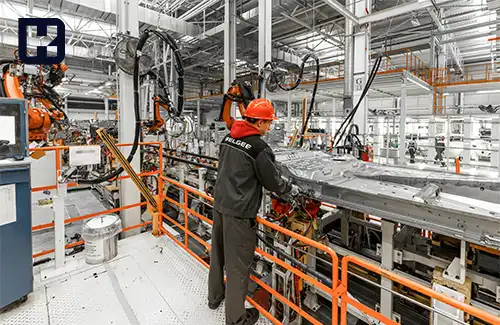

<blockquote class="faq-block">

  
آنچه در این مطلب خواهید خواند

  <ul>
    <li>اتوماسیون چیست؟</li>
    <li>اجزای کلیدی اتوماسیون</li>
    <li>اتوماسیون صنعتی (Industrial Automation) چیست؟</li>
    <li>انواع اتوماسیون‌های صنعتی</li>
    <li>مزایا و معایب اتوماسیون صنعتی</li>
    <li>هدف از اتوماسیون صنعتی</li>
    <li>ابزارها و فناوری‌های اتوماسیون در صنایع</li>
  </ul>

</blockquote>

### اتوماسیون چیست؟
اتوماسیون به فرآیندهای فناورانه و نوآورانه‌ای اطلاق می‌شود که در آن‌ها دخالت انسانی به حداقل کاهش می‌یابد. این مفهوم شامل حوزه‌های مختلفی مانند اتوماسیون فناوری اطلاعات، اتوماسیون فرآیندهای کسب‌وکار (BPA)، رباتیک صنعتی و حتی کاربردهای شخصی مانند اتوماسیون خانگی است.

به بیان ساده، اتوماسیون به استفاده از تجهیزات و سیستم‌های کنترلی اشاره دارد که می‌توانند فرآیندهای مختلفی مانند تولیدات کارخانه‌ای، عملکرد ماشین‌آلات، کنترل دیگ‌های بخار و اجاق‌های عملیات حرارتی را به‌طور خودکار انجام دهند. از ترموستات‌های خانگی گرفته تا سیستم‌های کنترلی صنایع بزرگ، وسایل نقلیه خودران و ربات‌های انبارداری، همگی نمونه‌هایی از کاربردهای اتوماسیون هستند.

### اجزای کلیدی اتوماسیون

- **سیستم‌های کنترلی:**

 سیستم‌های کنترلی به عنوان بخش اصلی اتوماسیون، وظیفه تعیین وظایف و نظارت بر اجرای آن‌ها را بر عهده دارند. نمونه‌ای از این سیستم‌ها، پی‌ال‌سی‌ها (PLC) هستند.

- **حسگرها:** 

حسگرها اطلاعات لازم برای مدیریت دقیق فرآیندها را جمع‌آوری کرده و به سیستم‌های کنترلی ارسال می‌کنند.

- **عملگرها:**

 عملگرها شامل دستگاه‌های فیزیکی مانند ربات‌ها هستند که برای انجام وظایف مختلف در اتوماسیون به کار گرفته می‌شوند.

- **شبکه‌ها:**

 شبکه‌ها امکان اتصال بخش‌های مختلف سیستم اتوماسیون به یکدیگر را فراهم می‌کنند و داده‌های مورد نیاز را بین آن‌ها منتقل می‌کنند.

## اتوماسیون صنعتی (Industrial Automation) چیست؟

هنگامی که از اتوماسیون در صنایع مختلف یا فرآیندهای تولید استفاده می‌شود، به آن اتوماسیون صنعتی  گفته می‌شود.

به بیان ساده، اتوماسیون صنعتی به معنای استفاده از تجهیزات اتوماسیون، سیستم‌های کنترلی، ربات‌ها، ماشین‌آلات و نرم‌افزارهای کامپیوتری برای انجام وظایف با حداقل دخالت انسانی است. اتوماسیون صنعتی نقش کلیدی در بهبود کیفیت، افزایش بهره‌وری و ارتقای ایمنی در انبارها، کارخانه‌ها، تولیدات صنعتی و دیگر فرآیندها دارد.

### انواع اتوماسیون‌های صنعتی

سیستم‌های اتوماسیون صنعتی به چهار دسته اصلی تقسیم می‌شوند که هر کدام برای کاربردهای ویژه در مراحل مختلف فرآیند تولید طراحی شده‌اند:

**سیستم‌های اتوماسیون ثابت** 

این سیستم‌ها دارای برنامه‌ریزی و عملکردی ثابت و بدون تغییرات مکرر هستند. این نوع اتوماسیون برای فرآیندهایی با جریان مداوم، مانند نوار نقاله‌ها و تولیدات انبوه، ایده‌آل است.

**سیستم‌های اتوماسیون قابل برنامه‌ریزی** 

در این سیستم‌ها، امکان تغییر توالی عملیات و تنظیمات ماشین‌آلات از طریق کنترل‌های الکترونیکی وجود دارد. با این حال، برنامه‌ریزی مجدد سیستم به زمان و تلاش قابل‌توجهی نیاز دارد.

**سیستم‌های اتوماسیون انعطاف‌پذیر**  

این سیستم‌ها توسط کامپیوترها کنترل می‌شوند و برای تولیدات با محصولات و خروجی‌های متغیر مناسب هستند. برای مثال، دستگاه‌های CNC با استفاده از کدهای خاصی که اپراتور وارد می‌کند، ابزار و تجهیزات لازم برای تولید را انتخاب می‌کنند.

**سیستم‌های اتوماسیون تجمیع شده و یکپارچه**

این سیستم‌ها ترکیبی از ماشین‌آلات، فرآیندها و داده‌های مستقل را در یک سامانه یکپارچه مدیریت می‌کنند. طراحی‌های مبتنی بر کامپیوتر، تولید رایانه‌ای، ابزارهای کنترل‌شده با کامپیوتر، ربات‌ها، جرثقیل‌ها و نوار نقاله‌ها، همگی به شکل هماهنگ و پیچیده در این سیستم ادغام شده‌اند.

### مزایا و معایب اتوماسیون صنعتی

هر سیستمی که در حوزه‌های مختلف طراحی و پیاده‌سازی می‌شود، دارای مزایا و معایب خاص خود در اجرای فرآیندهاست. با این حال، برخی از فناوری‌های جدید چنان مزایای برجسته‌ای دارند که معایب آن‌ها تا حد زیادی نادیده گرفته می‌شود.

**مزایا:**

- کاهش هزینه‌ها، به‌ویژه هزینه‌های نیروی انسانی

- کاهش خطاهای انسانی در فرآیند تولید

- تسریع ورود به بازار و کاهش زمان تولید

- بهبود عملکرد کلی سیستم

- رفع مشکل کمبود نیروی متخصص

- ارتقای کیفیت محصولات

- کنترل دقیق‌تر فرآیندها

- افزایش ایمنی کارکنان

- کاهش ساعت کاری نیروی انسانی

- کاهش مصرف انرژی

- امکان نظارت و کنترل از راه دور

**معایب:**

- هزینه بالای نصب و راه‌اندازی

- نیاز مستمر به نیروی متخصص

- محدودیت استفاده در فرآیندهای با حجم تولید بالا و محصولات تکراری

### هدف از اتوماسیون صنعتی

هدف اصلی اتوماسیون صنعتی کاهش نیاز به دخالت مستقیم انسان در فرآیندهای تولید است. این مفهوم یک گام فراتر از مکانیزه کردن است، که در آن به جای اینکه انسان‌ها با ابزارها و دستگاه‌هایی برای انجام بهتر کارشان کمک شوند، فرآیندها به طور کامل توسط ماشین‌ها و سیستم‌های خودکار انجام می‌شود. یکی از برجسته‌ترین نمونه‌های اتوماسیون صنعتی، ربات‌های صنعتی هستند.

اتوماسیون نقش فزاینده‌ای در اقتصاد جهانی و زندگی روزمره ایفا می‌کند. مهندسان با ترکیب دستگاه‌های خودکار با ابزارهای ریاضی و سازمانی، در تلاش هستند تا سیستم‌های پیچیده‌ای ایجاد کنند که بتوانند به سرعت به نیازهای در حال تغییر و گسترش پاسخ دهند.

### ابزارها و فناوری‌های اتوماسیون در صنایع

یکی از مهم‌ترین پیشرفت‌های اخیر در حوزه اتوماسیون، توسعه فناوری کنترل عددی کامپیوتری (CNC) است. این سیستم‌های کامپیوتری امکان دقت و پیچیدگی را در سطوحی که قبلاً در سیستم‌های خودکار قابل دستیابی نبود، فراهم می‌کنند. برخی از نمونه‌های برجسته فناوری CNC شامل موارد زیر هستند:

- **سیستم‌های طراحی به کمک کامپیوتر (CAD)**
- **سیستم‌های تولید به کمک کامپیوتر (CAM)**
- **کنترل‌کننده‌های منطقی قابل برنامه‌ریزی (PLC)**
- **سیستم‌های کنترل متناسب-انتگرال-مشتق (PID)**