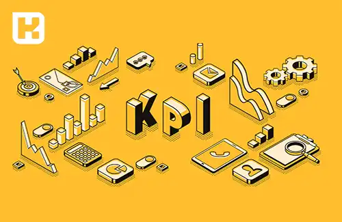

<blockquote class="faq-block">

  
آنچه در این مطلب خواهید خواند

  <ul>
    <li>تعریف KPI</li>
    <li>مزایای استفاده از شاخص‌های ارزیابی عملکرد</li>
    <li>تفاوت بین KPI، تارگت و هدف چیست</li>
  </ul>

</blockquote>

هر سازمان برای ارزیابی پیشرفت و اندازه‌گیری عملکرد بخشهای خود، نیاز دارد که مفهوم شاخص‌های کلیدی عملکرد یا KPI را درک کند و بداند چگونه می‌توان آن را به کار گرفت؟

توسعه و استفاده از KPIها در حوزه‌های مختلف، به بهبود عملکرد کلی سازمان کمک می‌کند و مدیریت را در انجام وظایف مختلف بسیار ساده‌تر می‌سازد.

این مقاله به شما کمک می‌کند تا فرآیند تخصیص و اعتباردهی صحیح KPIها را درک کنید.

<blockquote class="faq-block">

<strong>آشنایی با <a href="https://www.hooshkar.com/Software/Fennec/Module/Dashboard" target="_blank">نرم افزار داشبورد مدیریت
</a>فنک
</strong></blockquote>

## تعریف KPI

عبارت "شاخص کلیدی عملکرد" یا به اختصار KPI از اصطلاح انگلیسی "Key Performance Indicator" ترجمه می‌شود. در واقع KPI نشان می دهد که یک کسب و کار چقدر در رسیدن به اهداف موفق یا ناموفق بوده است.

این مفهوم تأکید دارد که KPIها نقش مهم و کلیدی در ارتقاء عملکرد و دستیابی به اهداف دارند.

شاخص کلیدی عملکرد باید به گونه‌ای تعریف شود که قابل اندازه‌گیری، محدود، مرتبط با اهداف سازمان و قابل فهم برای تمام کارکنان باشد، معمولاً به‌صورت عددی یا درصدی تعریف می‌شود. این شاخص‌ها با ارائه داده‌های دقیق و زمان‌بندی شده، به مدیریت و فرآیند تصمیم‌گیری سازمان کمک می‌کنند.

### مزایای استفاده از شاخص های ارزیابی عملکرد

#### 1. تمرکز بر روی اهداف
این امکان را می دهد تا بر روی اهداف مشخص متمرکز شوید و از شاخه به شاخه شدن و تغییر مداوم اهداف جلوگیری می کند.

#### 2. شناسایی و حل مشکلات
مدیران می‌توانند از این شاخص ها برای ارائه آموزش و راهنمایی بیشتر به کسانی که عملکرد خوب و مناسبی ندارند، استفاده کنند.

#### 3. ارتقای انگیزه کارکنان
شاخص‌های کلیدی عملکرد قادرند پیشرفت کار را به صورت فردی برای هر پرسنل پیگیری نمایند. به عنوان مثال، یکی از KPIها در واحد فروش ممکن است تعداد فروش ماهانه به ازای هر کارشناس فروش باشد. این معیار نشان می‌دهد که هر فرد چقدر در موفقیت سازمان سهیم است.

#### 4. اطمینان از هماهنگی میان کارکنان
با تنوع نظرات درباره معنای موفقیت میان افراد مختلف، شاخص‌های کلیدی عملکرد اهداف مشترکی را برای تمامی کارکنان ایجاد می‌کنند تا در جهت دستیابی به آن تلاش کنند. این اهمیت دارد که بتوان ایده‌ها و انگیزه‌های مختلف را در یک جهت هماهنگ کرد. اتوماسیون اداری نیز با ارائه زیرسیستم مدیریت وظایف تیمی، مدیران را در نظارت مدیریت بهینه وظایف عملکرد تیم‌ها و اعضای آن‌ها یاری می‌کند.

#### 5. ارزیابی میزان سلامت سازمان
بعنوان مثال از شاخص‌های کلیدی ارزیابی عملکرد مالی می‌توان برای نمایش میزان سودآوری کسب و کار استفاده نمود. همچنین می‌توانید از شاخص‌های فروش و سایر KPIها برای کنترل روند صعودی یا نزولی آن‌ها در طول زمان استفاده کنید.

## تفاوت بین KPI، تارگت و هدف چیست؟

### 1. تعریف هدف (Goal)
هدف چیزی است که شما می‌خواهید به آن برسید. می‌تواند معیار کمی یا کیفی باشد.

بعنوان مثال: میانگین سن ورودی ها، بهبود رضایت مشتریان، توسعه بازار در یک منطقه خاص.

### 2. تعریف شاخص عملکرد (KPI)
یک شاخص مهم است که برای رسیدن به هدف به آن نیاز دارید و قابل اندازه‌گیری است.

بعنوان مثال: درصد رشد فروش، نرخ حفظ مشتریان، میزان تولید بهینه، یا سطح رضایت کارکنان.

### 3. تعریف تارگت (Target)
تارگت یک عدد مشخص است که می‌خواهید به آن برسید.

بعنوان مثال: دستیابی به 20% افزایش فروش در ماه جاری، بهبود نمره رضایت مشتری به 90، یا کاهش هزینه تولید به 5%.

   - هدف یک جهت کلی برای رسیدن به نتایج مورد انتظار است.
   - شاخص عملکرد یک شاخص قابل اندازه‌گیری‌ است که به هدف کمک می‌کند و نشان‌دهنده عملکرد و پیشرفت است.
   - تارگت یک مقدار مشخص است که به عنوان نقطه مقصود برای رسیدن به هدف و استفاده از KPI تعیین می‌شود.

---
برای دریافت اطلاعات بیشتر در مورد نرم افزار داشبوردساز، به <a href="https://www.hooshkar.com" target="_blank">سایت هوشکار</a> سر بزنید.