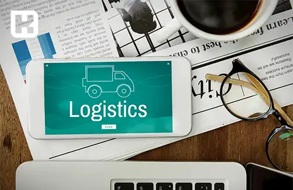

<blockquote style="background-color:#eeeefc; padding:0.5rem">

  
آنچه در این مطلب خواهید خواند:

  <ul>
    <li>لجستیک چیست؟</li>
    <li>دسته بندی‌های مختلف لجستیک</li>
    <li>مزایای کلیدی خدمات لجستیک کدامند؟</li>
    <li>عناصر اصلی لجستیک</li>
  </ul>

</blockquote>

لجستیک یکی از ارکان حیاتی در مدیریت زنجیره تأمین است که به صورت مستقیم بر کارایی و سودآوری کسب‌وکارها تأثیر می‌گذارد. این مفهوم فراتر از انتقال ساده کالاها بوده و شامل تمامی مراحل از تأمین مواد اولیه تا تحویل محصولات نهایی به دست مشتریان می‌شود.

مدیریت لجستیک به کسب‌وکارها کمک می‌کند تا با بهینه‌سازی فرآیندها، هزینه‌ها را کاهش دهند، رضایت مشتریان را افزایش دهند و در نهایت، مزیت رقابتی خود را در بازار حفظ کنند. در این مقاله به بررسی جنبه‌های مختلف لجستیک و تأثیرات آن بر توسعه کسب‌وکارها پرداخته می‌شود.

## لجستیک چیست؟

لجستیک به فرآیند جامع مدیریت کسب، ذخیره‌سازی و انتقال منابع از مبدأ به مقصد نهایی اطلاق می‌شود. مدیریت لجستیک شامل شناسایی و ارزیابی اثربخشی توزیع‌کنندگان و تأمین‌کنندگان بالقوه است. مدیران لجستیک که به آن‌ها تدارکات نیز گفته می‌شود، نقش حیاتی در این فرآیند ایفا می‌کنند.

این واژه در ابتدا به عنوان یک اصطلاح نظامی برای توصیف نحوه تهیه، ذخیره و جابجایی تجهیزات و تدارکات توسط پرسنل نظامی به کار می‌رفت. امروزه، این مفهوم به طور گسترده در کسب‌وکارها، به ویژه در شرکت‌های تولیدی، برای مدیریت و جابجایی منابع در زنجیره تأمین استفاده می‌شود.

### دسته بندی‌های مختلف لجستیک

**لجستیک تأمین (Procurement Logistics)**

لجستیک تأمین شامل شناسایی و ارتباط با تأمین‌کنندگان برای تهیه مواد اولیه و دیگر منابع مورد نیاز جهت آغاز فرآیند تولید است. در این مرحله، انتخاب مقدار مناسب مواد و اطمینان از تحویل به موقع آن‌ها از اهمیت بالایی برخوردار است.

**لجستیک تولید و ساخت (Logistics of Production and Manufacturing)**

این نوع لجستیک شامل چندین فرآیند است، از جمله تولید، حمل‌ونقل داخلی، ذخیره‌سازی محصولات جدید و تلاش برای بهینه‌سازی این فرآیندها. هدف این نوع لجستیک، کاهش زمان و هزینه‌های مرتبط با تکمیل سفارش‌های مصرف‌کنندگان است.

**لجستیک توزیع (Distribution Logistics)** 

تحویل محصولات به مصرف‌کنندگان می‌تواند به صورت مستقیم یا غیرمستقیم انجام شود. در روش مستقیم، تولیدکننده مسئولیت تحویل محصول به کاربر نهایی را دارد، در حالی که در روش غیرمستقیم، خرده‌فروش یا عمده‌فروش این وظیفه را بر عهده می‌گیرد. لجستیک توزیع همچنین بر بهینه‌سازی فرآیندهای بسته‌بندی و حمل‌ونقل تمرکز دارد.

**لجستیک دفع (Disposal Logistics)** 

این نوع لجستیک تمامی مراحل زنجیره تأمین را شامل می‌شود و به لجستیک معکوس شباهت دارد، با این تفاوت که فرآیندهای دفع را نیز در بر می‌گیرد. مواد باقی‌مانده ممکن است بازیافت شوند تا کارایی افزایش یابد، در حالی که مواد غیرقابل استفاده به درستی دور ریخته می‌شوند.

### مزایای کلیدی خدمات لجستیک کدامند؟

- **بهبود تجربه مشتری:**

 تجربه رضایت‌بخش مشتریان، محرکی برای خریدهای مکرر و جذب مشتریان جدید است. با استفاده از لجستیک می‌توانید سفارشات را سریع‌تر و بدون تأخیر به دست مشتریان برسانید، که این امر منجر به افزایش رضایت، وفاداری به برند و در نهایت، افزایش فروش می‌شود.

- **کاهش هزینه‌های سربار:**

 یکی دیگر از مزایای کلیدی لجستیک، کاهش هزینه‌های سربار است. با مدیریت بهینه لجستیک، می‌توانید به طور مستمر موجودی را کنترل کرده و هزینه‌های اضافی حمل و نقل را کاهش دهید، که در نهایت به کاهش هزینه‌های کلی کسب و کار منجر می‌شود.

- **افزایش شفافیت در زنجیره تأمین:**

 با مدیریت بهتر لجستیک، می‌توان از طریق کنترل دقیق‌تر هزینه‌ها، کاهش ناکارآمدی‌ها، شناسایی مشکلات و برنامه‌ریزی مناسب برای تقاضا، شفافیت بیشتری در زنجیره تأمین ایجاد کرد و بینش‌های دقیق‌تری نسبت به بازار به دست آورد.

- **حفظ مزیت رقابتی:**

 مدیریت لجستیک به شما کمک می‌کند تا با تحویل دقیق و به موقع سفارشات، تجربه‌ای رضایت‌بخش برای مشتریان ایجاد کنید. این تجربه مثبت نه تنها باعث وفاداری به برند و خریدهای مکرر می‌شود، بلکه کسب و کار شما را نیز به دیگران معرفی می‌کند و به حفظ و تقویت مزیت رقابتی شما کمک می‌کند.

- **حمایت از گسترش و توسعه کسب‌وکار:**

 لجستیک نقشی مهم در توسعه کسب و کار دارد. با بهره‌گیری از آن، می‌توانید نیازهای موجودی و سفارشات را به دقت محاسبه کرده و تقاضا را پیش‌بینی کنید، که این امر به توسعه پایدار کسب و کار شما کمک می‌کند.

### عناصر اصلی لجستیک

**حمل و نقل ورودی (Inbound Transportation)**

حمل و نقل ورودی به فرآیند انتقال کالاها و مواد از تأمین‌کننده به شرکت اشاره دارد. این فرآیند شامل فعالیت‌هایی مانند حمل و نقل، ذخیره‌سازی و توزیع قطعات یا مواد خامی است که در تولید استفاده می‌شوند. همچنین، می‌تواند شامل مدیریت موجودی، تأمین مواد و بهینه‌سازی جریان کالا از تأمین‌کننده به انبار، فروشگاه یا کارخانه تولیدی نیز باشد.

**حمل و نقل خروجی (Outbound Transportation)**

حمل و نقل خروجی به جریان محصولات نهایی از شرکت به سمت مشتریان یا کاربران نهایی اشاره دارد. این فرآیند شامل فعالیت‌هایی مانند خدمات مشتری و مدیریت کانال‌های توزیع است. برای مثال، وقتی بخش فروش یک شرکت سفارشی را از مشتری دریافت می‌کند، موجودی کالا بررسی شده و در صورت موجود بودن، سفارش به انبار ارسال می‌شود تا برای بسته‌بندی و تحویل به مشتری آماده شود.

**انبارداری (Warehousing)**

انبارداری به نگهداری ایمن کالاها، موجودی یا اطلاعات در یک مکان مشخص اشاره دارد. برای بسیاری از شرکت‌هایی که در زمینه تولید، صادرات، واردات یا حمل و نقل فعالیت دارند، انبارداری ضروری است. انبارها به شکلی سازمان‌یافته و ایمن محصولات را ذخیره می‌کنند، به‌طوری که شرکت‌ها بتوانند محل قرارگیری، مدت زمان ذخیره‌سازی، زمان ورود و میزان موجودی را پیگیری کنند.

در تجارت الکترونیک، کالاها تا زمانی که مشتری سفارشی را از طریق وب‌سایت شرکت ثبت کند، در انبار نگهداری می‌شوند. در خرده‌فروشی سنتی، شرکت‌ها ممکن است قبل از ارسال اقلام به فروشگاه‌های فیزیکی، آن‌ها را در انبار ذخیره کنند.

**مدیریت ناوگان (Fleet Management)**

مدیریت ناوگان در لجستیک به فرآیند نظارت و کنترل وسایل نقلیه موتوری تجاری و شخصی، هواپیماها، کشتی‌ها و واگن‌های ریلی اشاره دارد. این مدیریت می‌تواند شامل طیف وسیعی از وظایف مانند تأمین مالی و اجاره وسایل نقلیه، صدور مجوز و انطباق با مقررات، تعمیر و نگهداری خودروها، مدیریت حوادث و مدیریت زنجیره تأمین باشد.

مدیریت مؤثر ناوگان به شرکت‌های متکی بر حمل و نقل کمک می‌کند تا خطرات ناشی از سرمایه‌گذاری روی وسایل نقلیه را کاهش داده یا از بین ببرند. این کار باعث افزایش کارایی و بهره‌وری، کاهش هزینه‌های کلی حمل و نقل و کارکنان و تضمین انطباق با مقررات دولتی می‌شود.

**انجام سفارش (Order Fulfillment)**

انجام سفارش به فرآیند ذخیره‌سازی کالاها، بسته‌بندی سفارش‌ها و تحویل محصولات به مشتریان اطلاق می‌شود. در یک دیدگاه کلی، این فرآیند شامل تمام فعالیت‌هایی است که از لحظه ثبت سفارش توسط مشتری تا زمان دریافت آن توسط مشتری انجام می‌شود. شرکت‌ها می‌توانند انجام سفارش را به صورت داخلی مدیریت کنند یا آن را به یک شرکت ثالث برون‌سپاری نمایند.

مدیریت داخلی انجام سفارش به معنای مدیریت انبار و عملیات حمل و نقل توسط خود شرکت با استفاده از کارکنان، تجهیزات و تأسیسات اختصاصی است. این روش برای شرکت‌هایی که خواهان کنترل کامل بر عملیات تجاری خود هستند، مناسب است.

از سوی دیگر، برون‌سپاری این وظیفه به یک شرکت ثالث به شرکت‌هایی کمک می‌کند که می‌خواهند با صرفه‌جویی در زمان و تمرکز بر دیگر فعالیت‌ها، از انجام این وظایف صرف‌نظر کنند، که می‌تواند راهکاری مؤثر و بهینه باشد.