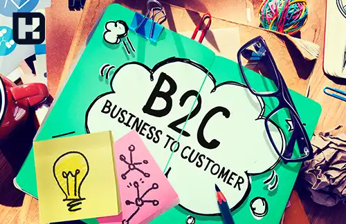

<blockquote style="background-color:#eeeefc; padding:0.5rem">

  
آنچه در این مطلب خواهید خواند:

  <ul>
  <li>بازاریابی B2C چیست؟</li>
  <li>مقایسه تفاوت‌های کلیدی بین بازاریابی B2B و B2C</li>
    <ul>
  <li>1. مخاطب هدف</li>
  <li>2. مختصر نویسی در مقابل بیان جزئیات</li>
  <li>3. چرخه فروش</li>
  <li>4. وفاداری برند در مقابل رابطه برند</li>
  <li>5. روابط با مشتریان</li>
  <li>6. حجم و ارزش معاملات</li>
  <li>7. کانال‌های بازاریابی</li>
  <li>8. تأثیر تخفیف</li>
  <li>9. روابط یکبار مصرف در مقابل روابط بلندمدت</li>
  <li>10. تعداد سرنخ‌ها به ازای هر فروشنده</li>
    </ul>
  </ul>

</blockquote>

بازاریابی B2C به معنای بازاریابی کسب‌وکارها به مصرف‌کنندگان نهایی است. این نوع بازاریابی بر ایجاد تعاملات سریع و جذاب با مشتریان فردی تمرکز دارد تا آن‌ها را به خرید محصولات یا خدمات ترغیب کند. برخلاف بازاریابی B2B که نیازمند روابط بلندمدت و تحقیقات عمیق‌تر است، در بازاریابی B2C، مشتریان معمولاً با دیدن تبلیغات جذاب و پیام‌های ساده تصمیم به خرید می‌گیرند.

این نوع بازاریابی برای کسب‌وکارهای مختلف از فروشگاه‌های خرده‌فروشی گرفته تا رستوران‌ها، اهمیت بالایی دارد و به‌ویژه در دنیای دیجیتال و شبکه‌های اجتماعی بسیار مؤثر است.

## بازاریابی B2C چیست؟
بازاریابی کسب‌وکار به مصرف‌کننده (B2C)، که به عنوان بازاریابی B2C شناخته می‌شود، مجموعه‌ای از استراتژی‌ها، روش‌ها و تاکتیک‌هایی است که یک شرکت برای عرضه محصولات یا خدمات خود به مشتریان به کار می‌گیرد. در کمپین‌های B2C، نه تنها به مزایا و ارزش‌های محصول توجه می‌شود، بلکه ایجاد یک واکنش احساسی در مشتری نیز اهمیت دارد.

بازاریابی B2C بر این فرض استوار است که مشتریان به دنبال برطرف کردن نیازهای فوری خود هستند و به همین دلیل، تمایل دارند بدون تحقیقات گسترده، تصمیم به خرید بگیرند. در خریدهای B2C، مشتریان معمولاً پس از آگاهی از محصول به سرعت اقدام به خرید می‌کنند. برای موفقیت در کمپین‌های B2C، آشنایی با عادات خرید مشتریان و ترندهای بازار ضروری است. تبلیغات باید شفاف و متمرکز بر رفع نیازهای مشتری باشد. 

بازاریابی B2C برای تمامی کسب‌وکارهای مصرفی مانند رستوران‌ها، شرکت‌های خودروسازی و فروشگاه‌ها حیاتی است. اینترنت نیز به اصلی‌ترین کانال تبلیغاتی و تحقیقاتی برای برندهای B2C تبدیل شده است.

### مقایسه تفاوت‌های کلیدی بین بازاریابی B2B و B2C

**1.	مخاطب هدف:**

**B2C:** مصرف‌کنندگان نهایی و افراد حقیقی  
**B2B:** کسب‌وکارها و سازمان‌ها  

**2.	مختصر نویسی در مقابل بیان جزئیات**

مشتریان به دنبال محتوایی هستند که هم سرگرم‌کننده باشد و هم به راحتی قابل درک. آن‌ها بیشتر به اطلاعات مفید و قابل اشتراک‌گذاری توجه می‌کنند و به جای محتوای پر از جزئیات، ترجیح می‌دهند پیام‌های بازاریابی B2C مختصر و مبتنی بر مزیت باشد.

از سوی دیگر، مخاطبان B2B به طور معمول با فروشندگان و متخصصان بازاریابی آشنا هستند و انتظار دارند اطلاعات دقیق‌تری درباره محصولات و خدمات دریافت کنند. این افراد به جزئیات، مانند مشخصات و ویژگی‌ها، توجه ویژه‌ای دارند. بنابراین، برای بازاریابان B2B مهم است که این اطلاعات را در ارتباطات خود ارائه دهند تا مخاطبان بتوانند تصمیمات آگاهانه‌تری بگیرند.

**3.	چرخه فروش**

مصرف‌کنندگان B2C ممکن است برای خرید به نظرات کاربران یا بررسی‌ها توجه کنند، اما معمولاً خریدهایشان به‌سرعت و به‌صورت آنی انجام می‌شود. این ویژگی به‌ویژه در صنعت خرده‌فروشی برجسته است.
در مقابل، سفر خریدار B2B از یک فرآیند بازاریابی طولانی‌مدت‌تر عبور می‌کند. 

تجربه نشان می‌دهد که یک چرخه فروش B2B معمولی شامل تعاملاتی مانند همایش‌ها، نمایش محصولات و... است. این در حالی است که باید تحقیقات گسترده‌ای که قبل از این مراحل انجام می‌شود را نیز در نظر بگیریم

**4.	وفاداری برند در مقابل رابطه برند**

مخاطبان وفادار در بازاریابی B2C لزوماً نیازی به ارتباط نزدیک با برند ندارند. آن‌ها می‌توانند به‌سادگی برند را دنبال کرده، محتوا را به اشتراک بگذارند و گهگاهی خرید کنند. در مقابل، بازاریابان B2B باید روابط نزدیک‌تری با خریداران مختلف در سازمان‌ها برقرار کنند. این روابط باید از طریق ایجاد ارزش و حفظ ارتباطات مستمر شکل بگیرد تا بتوانند اعتماد خریداران را جلب کنند.

**5.	روابط با مشتریان**

در بازاریابی B2B، روابط با مشتریان معمولاً به‌طور بلندمدت و مبتنی بر اعتماد شکل می‌گیرد، به‌طوری که کسب‌وکارها تلاش می‌کنند ارتباطاتی پایدار و مستمر با مشتریان خود برقرار کنند تا بتوانند از این طریق نیازهای آن‌ها را بهتر درک کرده و ارزش بیشتری برایشان ایجاد کنند.

در حالی که در بازاریابی B2C، روابط با مشتریان بیشتر به‌صورت کوتاه‌مدت و معاملاتی است، به‌این‌معنا که مشتریان معمولاً به‌سرعت تصمیم به خرید می‌گیرند و پس از انجام معامله، ارتباطشان با برند ممکن است کاهش یابد یا به حداقل برسد، بنابراین این نوع روابط بیشتر بر اساس تبادل فوری و کوتاه‌مدت استوار است.

**6.	حجم و ارزش معاملات** 

در حوزه B2B، معاملات معمولاً شامل حجم بالاتر و ارزش بیشتری هستند، به‌گونه‌ای که شرکت‌ها برای تأمین نیازهای خود، به خرید و فروش محصولات و خدمات با مقادیر عمده و ارزش‌های مالی بالاتر می‌پردازند. این نوع معاملات معمولاً به دلیل نیاز به تأمین مداوم و قراردادهای بلندمدت بین کسب‌وکارها انجام می‌شود، که به آن‌ها این امکان را می‌دهد تا با صرفه‌جویی در هزینه‌ها و مدیریت منابع بهتر، از مزایای بیشتری برخوردار شوند.  

در مقابل، در بازاریابی B2C، حجم معاملات معمولاً پایین‌تر و ارزش‌های مالی کمتر هستند، زیرا مشتریان به‌صورت فردی و در مقادیر کم به خرید محصولات و خدمات می‌پردازند. این نوع معاملات بیشتر بر اساس نیازهای روزمره و مصرف شخصی انجام می‌شود، که باعث می‌شود ارزش مالی هر معامله در مقایسه با B2B کمتر باشد و عموماً در معاملات فردی و سریع انجام گیرد.

**7.	کانال‌های بازاریابی**

در بازاریابی B2B، کسب‌وکارها معمولاً از کانال‌های متمرکزی مانند نمایشگاه‌ها، وبینارها و بازاریابی محتوا استفاده می‌کنند. نمایشگاه‌ها به شرکت‌ها این امکان را می‌دهند که به‌صورت حضوری با مشتریان و شرکای تجاری بالقوه ارتباط برقرار کنند، در حالی که وبینارها فرصتی را برای به اشتراک‌گذاری دانش و تخصص فراهم می‌کنند. همچنین، بازاریابی محتوا نقش مهمی در ارائه اطلاعات ارزشمند و جلب اعتماد مشتریان دارد.

در مقابل، در بازاریابی B2C، برندها به کانال‌های تبلیغاتی گسترده‌تری مانند تبلیغات در رسانه‌ها، شبکه‌های اجتماعی و ایمیل مارکتینگ روی می‌آورند. این کانال‌ها به کسب‌وکارها این امکان را می‌دهند که به‌طور مؤثر به مخاطبان وسیع‌تری دسترسی پیدا کنند و با ارائه تبلیغات جذاب، مشتریان را ترغیب به خرید کنند. شبکه‌های اجتماعی به ایجاد ارتباط نزدیک‌تر با مشتریان و ایمیل مارکتینگ نیز ابزاری مؤثر برای برقراری ارتباط مستقیم با آن‌ها به شمار می‌آید.

**8.	تأثیر تخفیف**

خریداران B2B معمولاً خریدهای خود را به نمایندگی از شرکت‌هایشان انجام می‌دهند و به همین دلیل معمولاً با بودجه‌های بالایی سر و کار دارند. این موضوع ممکن است باعث شود که زمان برگزاری ملاقات‌ها کمی طولانی‌تر شود، اما به طور همزمان، تأثیر کمتری از تخفیف‌ها بپذیرند. به‌طور کلی، آن‌ها بیشتر به کیفیت و کارایی بلندمدت محصولات توجه می‌کنند و نه به قیمت پایین آن‌ها.

از سوی دیگر، در زمینه فروش B2C، مصرف‌کنندگان معمولاً با بودجه شخصی خود خرید می‌کنند و در نتیجه، تمایل بیشتری به بهره‌مندی از تخفیف‌ها و پیشنهادات ویژه دارند. این تخفیف‌ها می‌تواند به عنوان یک عامل تحریک‌کننده برای جذب خریداران عمل کند و آن‌ها را به خرید ترغیب کند.

**9.	روابط یکبار مصرف در مقابل روابط بلندمدت**

برخلاف خریدهای محصولات مصرفی که معمولاً یکباره انجام می‌شوند، خریدهای B2B اغلب به صورت قراردادی صورت می‌گیرد. این روابط معمولاً می‌توانند چند ماهه یا حتی چند ساله باشند و به همین دلیل، تصمیمات مربوط به خرید در این حوزه اهمیت بیشتری پیدا می‌کند.

 در حالی که بازاریابان B2C زمان و تلاش بیشتری را صرف شناسایی بازارهای جدید و کانال‌های توزیع می‌کنند، بازاریابان B2B تمرکز خود را بر روی ایجاد و حفظ روابط بلندمدت قرار می‌دهند. این رویکرد باعث می‌شود که تجدید قراردادها آسان‌تر شود و حجم خریدها نیز افزایش یابد.

**10.	تعداد سرنخ‌ها به ازای هر فروشنده**

در فروش B2C، تعداد مشتریان بالقوه ممکن است به میلیون‌ها نفر برسد و حجم فروش و سرنخ‌ها به طور قابل توجهی بالا باشد اما باید توجه داشت که تمام سرنخ‌ها واجد شرایط خرید نیستند. بنابراین، در این نوع فروش همواره باید به دنبال شناسایی و جذب سرنخ‌های مناسب باشید. در مقابل، در فروش B2B، معمولاً تعداد کمتری از سرنخ‌ها یا مشتریان بالقوه وجود دارد و فروشنده به هر کدام از آن‌ها زمان و توجه بیشتری اختصاص می‌دهد.
