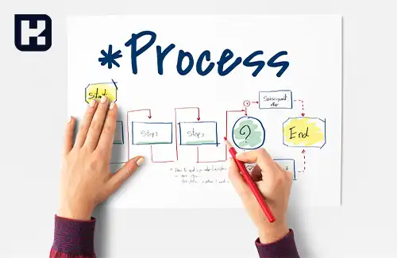
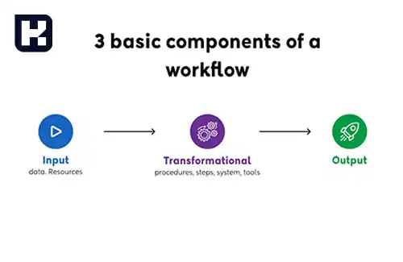

<blockquote style="background-color:#eeeefc; padding:0.5rem">

  
آنچه در این مطلب خواهید خواند

  <ul>
    <li>گردش کار (Workflow) در سازمان ها</li>
    <li>چهار مزیت طراحی جریان کار دیجیتال</li>
    <li>انواع گردش کار</li>
    <li>گردش کار فرایندی</li>
    <li>گردش کار موردی</li>
    <li>گردش کار پروژه‌ای</li>
    <li>اجزای کلیدی گردش کار چیست</li>
    <li>مفهوم مدیریت گردش کار چیست</li>
    <li>پایان‌بندی</li>
  </ul>

</blockquote>

 
**مقدمه**

گردش کار (Workflow) یکی از مفاهیم اساسی در مدیریت فرایندها و عملیات سازمان‌ها است که در دنیای کسب و کار اهمیت بسیاری دارد.  با توجه به اینکه سازمان‌ها با چالش‌های مختلفی در مدیریت عملیات و هماهنگی بین افراد و سیستم‌ها روبه‌رو هستند، استفاده از گردش کار به منظور بهبود بهره‌وری، شفافیت، کاهش زمان واکنش و بهبود پاسخگویی، امری ضروری به نظر می‌رسد.

در این مقاله، به بررسی انواع گردش کار، اجزای آن و مفهوم مدیریت گردش کار می‌پردازیم. سپس به بررسی تأثیرات مثبتی که این رویکرد در بهبود عملکرد و سودآوری سازمان‌ها دارد، می‌پردازیم.

## گردش کار (Workflow) در سازمان ها

گردش کار به معنای، اجرا و اتوماسیون فرایندهای تجاری است که در آن، مجموعه‌ای از وظایف، اطلاعات یا اسناد طبق قوانین خاصی از یک نفر به نفر دیگر برای انجام اقدامات خاصی منتقل می‌شوند.

سازمان‌ها از گردش کار به منظور هماهنگی کارهای بین افراد و همگام‌سازی داده‌ها بین سیستم‌ها به منظور بهبود بهره‌وری سازمانی، پاسخگویی بهتر و افزایش سودآوری استفاده می‌کنند.

### چهار مزیت طراحی جریان کار دیجیتال

1. بهبود بهره‌وری
2. شفافیت فرآیند
3. کاهش زمان واکنش
4. بهبود پاسخگویی

### انواع گردش کار
1.	گردش کار فرایندی (Process Workflow)
2.	گردش کار موردی (Case Workflow)
3.	گردش کار پروژه‌ای (Project Workflow) 

#### گردش کار فرایندی

 زمانی ایجاد می‌شود که مجموعه‌ای از وظایف، قابل پیش‌بینی و تکراری باشند. در این نوع گردش کار، پیش از آغاز آن، مسیر وظایف کاملاً مشخص و قابل پیگیری است.
در میان انواع مختلف گردش کار، گردش کار فرایندی به منظور مدیریت تعداد زیادی از وظایف در کسب و کارها به کار است. به عنوان مثال، برای یک فروشگاه آنلاین، فرآیند تأیید سفارشات به صورت روزانه و مکرر انجام می‌شود. این نیاز به یک گردش کار فرایندی با سرعت و کارایی بالا برای پردازش بهینه و سریع وظایف می‌آید.

#### گردش کار موردی

در گردش کار موردی، در زمان شروع، مسیر دقیق برای تکمیل وظیفه مشخص نیست و با پیشروی در کار و جمع‌آوری اطلاعات بیشتر، مسیر به طور خودکار تشکیل می‌شود. به عبارت دیگر، در این نوع گردش کار، مسیر انجام وظیفه در ابتدا مشخص نیست و با پیشرفت فرآیند کار و جمع‌آوری اطلاعات بیشتر، مسیر مورد نیاز خود را نشان می‌دهد.

به عنوان مثال، موارد مربوط به بیمه که بسته به شرایط و درخواست‌ها متفاوت هستند، ممکن است به عنوان نمونه‌های خوبی از گردش کار موردی مطرح شوند.

#### گردش کار پروژه‌ای
گردش کار پروژه‌ای، همانند فرایندها، دارای یک مسیر ساختاریافته است، اما در طول انجام پروژه، معمولاً انعطاف بیشتری وجود دارد.

به عنوان مثال، فرض کنید که به تولید یک نسخه جدید از وب‌سایت خود فکر می‌کنید. ابتدا ممکن است بتوانید ترتیب و وظایف مورد نیاز برای تکمیل پروژه را به خوبی پیش‌بینی کنید. اما در طول انجام پروژه، ممکن است به ایده‌های جدیدی دست یابید یا مسئولیت‌ها تغییر کند.

گردش کار پروژه‌ای معمولاً فقط برای یک پروژه مناسب است. به عنوان مثال، ساخت یک وب‌سایت دیگر ممکن است نیازمند مراحل بیشتر و زمان بیشتری باشد و همینطور مسیر دقیقاً همانند پروژه قبلی نباشد.

### اجزای کلیدی گردش کار چیست

**1. ورودی:** شامل تمامی اطلاعات، منابع و مواد لازم برای شروع هر مرحله از کار است. این عنصر معمولاً به عنوان نقطه شروع یا ماشه نیز شناخته می‌شود.

**2. تحول:** این بخش به اقداماتی اشاره دارد که برای انجام هر مرحله از کار انجام می‌شود. این اقدامات می‌توانند به صورت موازی یا متوالی انجام شوند و به عنوان کار یا فعالیت شناخته می‌شوند.

**3. خروجی:** نتیجه هر مرحله از کار که به عنوان ورودی برای مراحل بعدی در گردش کار مورد استفاده قرار می‌گیرد.

**4. عملگرها:** شامل افراد یا فناوری‌هایی که مسئولیت انجام کار را بر عهده دارند. این افراد و فناوری‌ها به عنوان عملگرها شناخته می‌شوند.

### مفهوم مدیریت گردش کار چیست؟

مدیریت گردش کار، ایجاد، مستندسازی، نظارت و بهبود گردش کار را شامل می‌شود. این رویکرد به سازمان‌ها کمک می‌کند تا عملیات خود را بهینه‌سازی کرده و اطمینان حاصل کنند که همه مراحل به‌درستی انجام شده و پیوستگی لازم در مراحل وجود دارد. با استفاده از مدیریت گردش کار، می‌توان خطاها و مشکلات را شناسایی و رفع کرد. 

آمارها نشان می‌دهند که تقاضا برای ابزارهای مدیریت گردش کار در حال افزایش است، با بازار جهانی این ابزارها که در سال ۲۰۲۰ به ۴.۱ میلیارد دلار بوده، که به ۱۷.۵ میلیارد دلار تا سال ۲۰۲۶ افزایش پیدا خواهد کرد.

#### پایان‌بندی

در نگاه کلی، گردش کار (Workflow) به‌عنوان یکی از مهم‌ترین مفاهیم در مدیریت فرایندها و عملیات سازمان‌ها، نقش بسیار مهمی را ایفا می‌کند. این مفهوم با تمرکز بر تعریف، اجرا و اتوماسیون فرایندهای تجاری، به سازمان‌ها کمک می‌کند تا هماهنگی کارها، همگام‌سازی داده‌ها و بهبود بهره‌وری را تسهیل کند.

 با توجه به تأثیرات مثبتی که گردش کار در افزایش سودآوری و بهبود عملکرد سازمان‌ها دارد، استفاده از این رویکرد به‌عنوان یکی از ابزارهای اساسی مدیریتی، امری ضروری به نظر می‌رسد. از طرفی، با رشد روزافزون تقاضا برای ابزارهای مدیریت گردش کار، مشخص است که این مفهوم همچنان در آینده نزدیک نقش مهمی در بهبود عملکرد و کارایی سازمان‌ها خواهد داشت.
