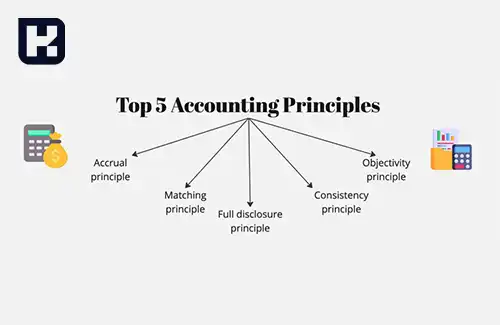
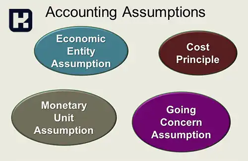

<blockquote class="faq-block">

  
آنچه در این مطلب خواهید خواند:

  <ul>
    <li>تعریف اصول حسابداری</li>
    <li>انواع اصول حسابداری</li>
    <li>اصل افشای کامل اطلاعات + مثال </li>
    <li>اصل بهای تمام‌شده + مثال </li>
    <li>اصل تحقق درآمد + مثال </li>
    <li>اصل تطابق یا مقابله هزینه و درآمد + مثال</li>
    <li>یادآوری سریع اصول حسابداری</li>
    <li>مفروضات حسابداری</li>
    <li>سؤالات متداول</li>
    <li>جمع‌بندی</li>
  </ul>

</blockquote> 

آیا تا به حال فکر کرده‌اید چرا صورت‌های مالی بعضی شرکت‌ها کاملاً شفاف و دقیق به نظر می‌رسند؟
راز این دقت در چیزی نهفته است که به آن "اصول حسابداری" می‌گویند.
اصولی که بدون آن‌ها، حتی بهترین نرم‌افزارهای مالی هم نمی‌توانند تصویری واقعی از عملکرد یک سازمان ارائه دهند.

تصور کنید مدیر یک فروشگاه بزرگ هستید و می‌خواهید بفهمید سود واقعی ماه گذشته چقدر بوده. بدون رعایت اصول حسابداری، احتمال دارد اعداد واقعی با چیزی که در ذهن دارید فاصله زیادی داشته باشد. اصول حسابداری مانند نقشه راه، شما را از خطاهای مالی محافظت می‌کند.

## تعریف اصول حسابداری

اصول حسابداری مجموعه‌ای از مبانی و استانداردهای پذیرفته‌شده‌اند که نحوه ثبت، طبقه‌بندی و گزارش‌دهی معاملات مالی را مشخص می‌کنند. رعایت این اصول باعث می‌شود صورت‌های مالی شفاف، قابل مقایسه و قابل اعتماد باشند.

در سطح بین‌المللی، این اصول معمولاً بر اساس دو چارچوب تدوین می‌شوند:

- **استانداردهای بین‌المللی گزارشگری مالی (IFRS)**
- **اصول پذیرفته‌شده حسابداری (GAAP)**

هر شرکت بسته به حوزه فعالیت خود باید از یکی از این چارچوب‌ها تبعیت کند تا بتواند گزارش‌های مالی خود را به شکل استاندارد منتشر کند.

برای اجرای دقیق این اصول، آشنایی با <a href="https://www.hooshkar.com/Software/Sayan/Module/Accounting" target="_blank">نرم‌افزار حسابداری سایان</a> نیز می‌تواند به کسب‌وکارها در ثبت خودکار و دقیق اطلاعات مالی کمک کند.

## انواع اصول حسابداری

اصول حسابداری شامل چهار رکن اصلی است:

1. اصل افشای کامل اطلاعات  
2. اصل بهای تمام‌شده  
3. اصل تحقق درآمد  
4. اصل تطابق یا مقابله هزینه و درآمد  

برای درک بهتر اهمیت این اصول، پیشنهاد می‌کنیم مقاله <a href="https://www.hooshkar.com/Wiki/Financial/AccountingJobMarketInIran" target="_blank">بازار کار حسابداری در ایران</a> را نیز مطالعه کنید تا با کاربرد عملی آن‌ها در محیط شغلی آشنا شوید.

<blockquote class="faq-block">
  
<strong>خلاصه اصول حسابداری</strong>

  <table>
    <thead>
      <tr>
        <th>اصل</th>
        <th>هدف</th>
        <th>مثال کاربردی</th>
      </tr>
    </thead>
    <tbody>
      <tr>
        <td>افشای کامل اطلاعات</td>
        <td>شفافیت در گزارش مالی</td>
        <td>ذکر بدهی‌های پنهان در یادداشت‌ها</td>
      </tr>
      <tr>
        <td>بهای تمام‌شده</td>
        <td>پایداری در ثبت دارایی‌ها</td>
        <td>ثبت ملک به قیمت خرید، نه قیمت روز</td>
      </tr>
      <tr>
        <td>تحقق درآمد</td>
        <td>ثبت درآمد فقط در زمان تحقق</td>
        <td>ثبت فروش پس از تحویل کالا</td>
      </tr>
    </tbody>
  </table>
</blockquote>

---

### اصل افشای کامل اطلاعات

در این اصل، تمامی رویدادهای مالی که بر تصمیم‌گیری ذی‌نفعان تأثیرگذار هستند، باید در گزارش‌های مالی به‌صورت شفاف بیان شوند. این افشا می‌تواند از طریق یادداشت‌های توضیحی، پیوست‌ها یا صورت‌های مالی انجام گیرد تا تصویر دقیقی از وضعیت مالی سازمان ارائه شود.  

هدف نهایی، شفافیت و جلوگیری از ابهام در تصمیم‌گیری‌های مالی است. البته لازم است هزینه افشا با منافع حاصل از آن متناسب باشد.

مثال واقعی: شرکت X در گزارش سالانه خود بدهی‌های مربوط به وام کوتاه‌مدت را در یادداشت‌های توضیحی افشا کرده تا سهامداران بتوانند ریسک نقدینگی را بسنجند.

<blockquote style="background-color:#f9f9ff; padding:1rem; border-right:4px solid #7066f1; margin-top:1rem;">
  
<strong>نکته:</strong> رعایت اصول حسابداری فقط مخصوص حسابداران نیست. مدیران، سرمایه‌گذاران و حتی کارآفرینان هم باید این اصول را بدانند تا تصمیم‌های مالی درستی بگیرند.

</blockquote>

---

### اصل بهای تمام‌شده

اصل بهای تمام‌شده تأکید می‌کند که دارایی‌ها باید بر اساس بهای واقعی خرید در دفاتر ثبت شوند، نه ارزش فعلی آن‌ها.  
این اصل، مبنای قابل‌اتکایی برای ارزیابی مالی شرکت‌ها فراهم می‌کند. با وجود آنکه نوسانات ارزش پول یا تورم در نظر گرفته نمی‌شود، اما ثبت دارایی بر اساس بهای واقعی خرید، دقت و قابلیت استناد اطلاعات مالی را افزایش می‌دهد.

درک مفهوم بهای تمام‌شده برای محاسبه قیمت تولید نیز اهمیت دارد. برای آشنایی بیشتر پیشنهاد می‌کنیم مقاله <a href="https://www.hooshkar.com/Wiki/Financial/CostAccounting" target="_blank">حسابداری صنعتی چیست؟</a> را بخوانید.

مثال واقعی: اگر یک شرکت دستگاهی را ۱۰۰ میلیون خریده، حتی اگر ارزش آن الان ۲۰۰ میلیون باشد، همچنان باید در دفاتر همان ۱۰۰ میلیون ثبت شود.

---

### اصل تحقق درآمد

بر اساس این اصل، درآمد تنها زمانی شناسایی و ثبت می‌شود که به‌طور واقعی تحقق یافته باشد؛ یعنی زمانی که خدمات ارائه شده و وجه آن قابل وصول است.  

سه شرط لازم برای شناسایی درآمد عبارت‌اند از:  

1. مبلغ درآمد باید به‌طور منطقی قابل اندازه‌گیری باشد.  
2. اطمینان از وصول درآمد وجود داشته باشد.  
3. فعالیت‌های لازم برای کسب آن به اتمام رسیده باشند.  

مثال واقعی: اگر شرکتی خدمات مشاوره‌ای را ارائه داده اما هنوز پول را دریافت نکرده، نمی‌تواند آن درآمد را در دفاتر ثبت کند — چون هنوز تحقق نیافته است.

---

### اصل تطابق یا مقابله هزینه و درآمد

در این اصل، هزینه‌ها باید در همان دوره‌ای شناسایی شوند که درآمد مربوط به آن‌ها تحقق یافته است.  
این کار باعث می‌شود سود هر دوره به شکل واقعی و منصفانه محاسبه شود.  

اصل تطابق از اصول کلیدی در <a href="https://www.hooshkar.com/Wiki/Financial/ComparisonFinancialSoftware" target="_blank">نرم‌افزارهای حسابداری</a> است و نقش مهمی در تحلیل عملکرد مالی شرکت‌ها دارد.

مثال واقعی: شرکت تبلیغاتی هزینه کمپین تبلیغاتی خود را در همان دوره‌ای ثبت می‌کند که درآمد ناشی از فروش مرتبط حاصل می‌شود، نه دوره‌های بعد.

<blockquote style="background-color:#e0f7fa; padding:1rem; border-left:4px solid #00acc1; margin-top:1rem;">
    

        <strong>یادآوری سریع:</strong> اصول حسابداری مثل چراغ راهنما هستند:
         🔹 افشا = شفافیت
         🔹 بهای تمام‌شده = ثبت واقعی
         🔹 تحقق درآمد = فقط وقتی پول رسید
         🔹 تطابق = هزینه با درآمد مرتبط
    

</blockquote>

## مفروضات حسابداری

مفروضات حسابداری پایه و اساس اصول حسابداری هستند و بدون آن‌ها نمی‌توان صورت‌های مالی را به شکل منسجم تنظیم کرد. مهم‌ترین مفروضات عبارت‌اند از:

- فرض عینیت  
- فرض هزینه تاریخی  
- فرض تداوم فعالیت  
- فرض تفکیک شخصیت  
- فرض واحد اندازه‌گیری  

---

### سؤالات متداول

<blockquote class="faq-block">
  

    
اصول حسابداری چند مورد هستند و مهم‌ترین آن‌ها کدام‌اند؟
 
    اصول حسابداری به‌طور کلی شامل چهار رکن اصلی است: اصل افشای کامل اطلاعات، اصل بهای تمام‌شده، اصل تحقق درآمد و اصل تطابق هزینه با درآمد. این اصول مبنای ثبت و گزارش مالی شرکت‌ها هستند.
  

</blockquote>

<blockquote class="faq-block">
  

    
تفاوت بین اصول حسابداری و مفروضات حسابداری چیست؟
 
    مفروضات حسابداری، پایه فکری و فلسفی اصول هستند و چارچوب کلی تهیه صورت‌های مالی را مشخص می‌کنند، در حالی‌که اصول حسابداری قواعد اجرایی برای ثبت و گزارش اطلاعات مالی محسوب می‌شوند.
  

</blockquote>

<blockquote class="faq-block">
  

    
چرا آشنایی با اصول حسابداری برای مدیران مهم است؟
 
    مدیران با درک صحیح اصول حسابداری می‌توانند گزارش‌های مالی را بهتر تحلیل کنند، تصمیم‌های اقتصادی دقیق‌تری بگیرند و از بروز اشتباه یا تخلفات مالی جلوگیری نمایند.
  

</blockquote>

---

### جمع‌بندی

اصول حسابداری پایه‌ای‌ترین قوانین برای تهیه و تحلیل صورت‌های مالی هستند. رعایت این اصول موجب می‌شود گزارش‌های مالی سازمان‌ها معتبر، قابل مقایسه و شفاف باشند. مدیران و حسابداران حرفه‌ای با درک صحیح این اصول، می‌توانند تصمیم‌های مالی دقیق‌تری بگیرند و از بروز اشتباه در گزارش‌گیری جلوگیری کنند.  

اگر به یادگیری بیشتر در زمینه حسابداری علاقه‌مند هستید، ویدیوهای آموزشی در <a href="https://www.aparat.com/Hooshkar_Pardaz" target="_blank">کانال آپارات هوشکار</a> می‌تواند منبعی عالی برای شما باشد.