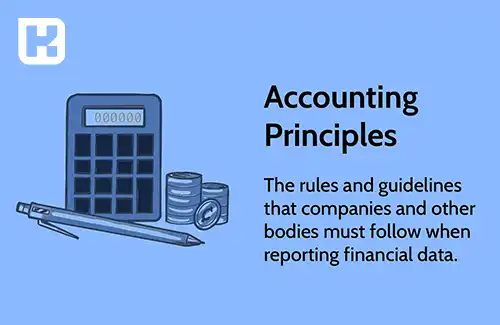

<blockquote style="background-color:#eeeefc; padding:0.5rem">

  
آنچه در این مطلب خواهید خواند:

  <ul>
    <li>تعریف اصول حسابداری</li>
    <li>انواع اصول حسابداری و کاربردهای آن‌ها</li>
    <li>تعریف دو روش حسابداری شناور و ثابت</li>
    <li>کاربردهای اصول حسابداری در سازمان‌ها</li>
  </ul>

</blockquote>

اصول حسابداری یکی از مهمترین موضوعات در زمینه <a href="https://www.hooshkar.com/Wiki/Financial/WhatIsAccounting" target="_blank">حسابداری
</a> است که برای هر سازمان و شرکتی ضروری است. 
هدف این مقاله آشنایی شما با اصول حسابداری، انواع و نحوه استفاده از آن‌ها است.

<blockquote style="background-color:#f5f5f5; padding:0.5rem">

<strong>آشنایی با <a href="https://www.hooshkar.com/Software/Sayan/Module/Accounting" target="_blank">نرم افزار حسابداری</a> سایان</strong>
</blockquote>

## تعریف اصول حسابداری
اصول حسابداری به مبانی، قواعد، طبقه بندی و گزارش نتایج و معاملات، عملیات مالی و رویدادهای دارای اثر مالی بر یک موسسه می پردازد.
این اصول نحوه تعیین سود را مشخص و چگونگی گزارش وضعیت مالی یک موسسه را روشن می کنند.

## انواع اصول حسابداری

<blockquote style="background-color:#f5f5f5; padding:0.5rem">

<strong>بیشتر بخوانید: <a href="https://www.hooshkar.com/Wiki/Financial/AccountingJobMarketInIran" target="_blank">بازار کار حسابداری در ایران
</a>
</strong></blockquote>

**1.	اصل همانی:**
اصل همانی به معنای تشخیص و شناسایی تمامی معاملات و رویدادها است که برای یک شرکت یا سازمانی به وجود می‌آید. 
بدین منظور، همه معاملات و رویدادها باید در حسابداری سیستماتیک شده و به صورت مستند ذخیره شوند.

**2.	اصل کفایت:**
اصل کفایت به معنای اطمینان از این است که تمامی اطلاعات مالی در دفاتر حسابداری دقیق و کامل ثبت شده‌اند. به عبارت دیگر، تمامی موارد مالی باید به صورت کامل و بدون اشتباه در دفاتر حسابداری ثبت شود.

**3.	اصل پیوستگی:**
اصل پیوستگی به معنای پیوستگی حسابداری است. این اصل به این معناست که اگر یک حسابی در دفتر حسابداری بسته شده است، بعدها در صورت اعمال تغییراتی، آن حساب باید باز شود.

**4.	اصل انطباق:**
اصل انطباق به معنای تطابق اطلاعات مالی با واقعیت است. به عبارت دیگر، اطلاعات مالی باید با موارد واقعی سازمان هماهنگ شوند.

**5.	اصل فرصت‌طلبی:**
اصل فرصت‌طلبی به معنای این است که در صورت وجود چندین روش برای حساب کردن مقادیر مالی، روشی انتخاب شود که بیشترین منفعت را برای سازمان به همراه داشته باشد.

**6.	اصل هزینه:**
اصل هزینه به معنای ثبت هزینه‌ها در دفاتر حسابداری است. به عبارت دیگر، تمامی هزینه‌های مربوط به فعالیت‌های سازمان باید به صورت مستند در دفاتر حسابداری ثبت شوند.

**7.	اصل تمیزی:**
اصل تمیزی به معنای آن است که دفاتر حسابداری باید به صورت تمیز و خوانا باشند. این اصل به دلیل آن است که دفاتر حسابداری برای افراد دیگر باید قابل فهم و خواندن باشند.

<blockquote style="background-color:#f5f5f5; padding:0.5rem">

<strong>بیشتر بخوانید: <a href="https://www.hooshkar.com/Wiki/Financial/ComparisonFinancialSoftware" target="_blank">مقایسه نرم افزار های حسابداری
</a>
</strong></blockquote>

## تعریف دو روش حسابداری شناور و ثابت

**1. حسابداری شناور:**
در روش حسابداری شناور، ارزش دارایی‌ها و بدهی‌ها بر اساس بازار و شرایط جاری به روز می‌شود. این روش در شرکت‌های بزرگ و تغییرات مداوم قیمت‌ها مناسب است. 

**2. حسابداری ثابت:**
در روش حسابداری ثابت، ارزش دارایی‌ها و بدهی‌ها بر اساس ارزش آن‌ها در زمان تهیه دفاتر حسابداری مشخص می‌شود. این روش در شرکت‌های کوچک و پایدار مناسب است.

## کاربردهای اصول حسابداری در سازمانها
اصول حسابداری در سازمان‌ها برای مدیریت مالی و ارزیابی عملکرد مالی استفاده می‌شود. به طور کلی، این اصول به شرکت‌ها کمک می‌کنند تا تعادل بین درآمد و هزینه‌های خود را بدست آورند و بهترین تصمیمات مالی را بگیرند.

همچنین، اصول حسابداری به شرکت‌ها کمک می‌کند تا برای مواجه شدن با مشکلات مالی، مانند کاهش درآمد، افزایش هزینه‌ها و یا افزایش بدهی‌ها، آماده باشند. با رعایت اصول حسابداری، شرکت‌ها به راحتی می‌توانند میزان درآمد و هزینه‌های خود را محاسبه کنند و برنامه‌ریزی‌های لازم را انجام دهند.

اگر می‌خواهید در مورد حسابداری بیشتر بدانید، پیشنهاد می‌کنیم فیلم های آموزشی "<a href="https://www.aparat.com/Hooshkar_Pardaz" target="_blank">کانال آپارات هوشکار</a>" را دنبال کنید.