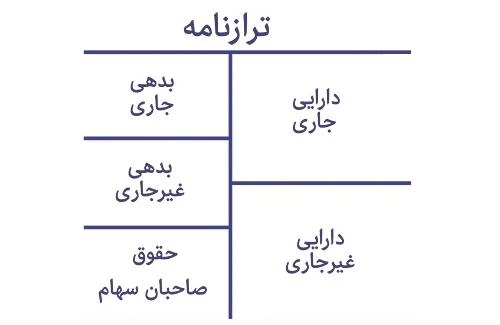

<blockquote style="background-color:#eeeefc; padding:0.5rem">
آنچه در این مطلب خواهید خواند:

- [تعریف حسابداری مالی و اهمیت آن](#تعریف-حسابداری-مالی-و-اهمیت-آن)
- [مفاهیم اساسی حسابداری مالی](#مفاهیم-اساسی-حسابداری-مالی)
    - [دوره مالی](#دوره-مالی)
    - [دوره حسابرسی](#دوره-حسابرسی)
    - [دارایی ها](#دارایی-ها)
    - [بدهی ها](#بدهی-ها)
    - [حساب ترازنامه](#حساب-ترازنامه)
    - [گزارش سود و زیان](#گزارش-سود-و-زیان)
- [نتیجه گیری](#نتیجه-گیری)

</blockquote>

## تعریف حسابداری مالی و اهمیت آن
مبانی حسابداری مالی یکی از مفاهیم اساسی در علم حسابداری است که به بررسی روش‌های ثبت و تجزیه و تحلیل اطلاعات مالی یک شرکت می‌پردازد. 

در این مطلب، به بررسی مفاهیم اساسی حسابداری مالی پرداخته خواهد شد.

<blockquote style="background-color:#f5f5f5; padding:0.5rem">

<strong>آشنایی با <a href="https://www.hooshkar.com/Software/Sayan/Module/Application" target="_blank">برنامه حسابداری</a> سایان</strong>
</blockquote>

## مفاهیم اساسی حسابداری مالی
### دوره مالی
دوره مالی به مدت زمان مشخصی اشاره دارد که در طی آن تراکنش‌های مالی یک شرکت ثبت می‌شوند. معمولاً دوره مالی شرکت‌ها به مدت یک سال است، اما این مدت می‌تواند کمتر یا بیشتر باشد.

### دوره حسابرسی
دوره حسابرسی به مدت زمانی اشاره دارد که در طی آن حسابرسان برای بررسی صحت و صداقت گزارش‌های مالی شرکت، به شرکت مراجعه می‌کنند. معمولاً دوره حسابرسی به صورت سالانه برگزار می‌شود و باید توسط یک حسابرس مستقل انجام شود.

<blockquote style="background-color:#f5f5f5; padding:0.5rem">

<strong>بیشتر بخوانید: <a href="https://www.hooshkar.com/Wiki/Financial/TypesOfAudits" target="_blank">حسابرسی چیست و انواع حسابرسی کدام است؟
</a>
</strong></blockquote>

### دارایی ها
دارایی‌ها شامل هرگونه منبع مالی یا اموالی هستند که یک شرکت در اختیار دارد و برای تولید درآمد استفاده می‌کند. دارایی‌ها می‌توانند شامل مواردی مانند نقد، حساب‌های بانکی، موجودی کالا، دارایی‌های ثابت (مانند ساختمان‌ها و تجهیزات) و دارایی‌های نامشهود (مانند حقوق تکنولوژی) باشند.

<blockquote style="background-color:#f5f5f5; padding:0.5rem">

<strong>آشنایی با <a href="https://www.hooshkar.com/Software/Sayan/Module/Application" target="_blank">نرم افزار اموال و دارائی ثابت
</a> سایان</strong>
</blockquote>

### بدهی ها
بدهی‌ها شامل هرگونه بدهی یا مطالبه مالی هستند که یک شرکت به سایر اشخاص یا شرکت‌ها دارد. بدهی‌ها می‌توانند شامل مواردی مانند وام‌های بانکی، پرداخت حقوق و... باشند.

**1. افزایش پایداری مالی شرکت:**
در برخی موارد، استفاده از بدهی‌ها می‌تواند به شرکت کمک کند تا سرمایه گذاری بیشتری داشته باشد و از پایداری مالی بیشتری برخوردار شود.

**2. حفاظت از جریان نقدی:**
در برخی موارد، استفاده از بدهی‌ها می‌تواند به شرکت کمک کند تا جریان نقدی خود را حفظ کند. به عنوان مثال، اگر شرکت بخواهد یک ساختمان جدید را ساخته و تجهیزاتی را خریداری کند، احتمالاً به بدهی‌ها نیاز خواهد داشت تا جریان نقدی خود را حفظ کند.

### حساب ترازنامه
حساب ترازنامه یکی از اصلی‌ترین ابزارهای حسابداری مالی است که برای نمایش دارایی‌ها، بدهی‌ها و حقوق صاحبان سهام شرکت به کار می‌رود. در حساب ترازنامه، دارایی‌ها در یک سمت قرار دارند و بدهی‌ها و حقوق صاحبان سهام در سمت دیگر قرار دارند. هدف اصلی حساب ترازنامه، بررسی وضعیت مالی شرکت و برآوردن ارزش شرکت است.

### گزارش سود و زیان
گزارش سود و زیان شامل گزارشی از درآمدها، هزینه‌ها، سود و زیان یک شرکت است. این گزارش به عنوان ابزاری برای ارزیابی عملکرد مالی شرکت استفاده می‌شود. 

در صورتی که سود شرکت بیشتر از زیان باشد، به معنی این است که شرکت در یک دوره مالی به سود رسیده است. این گزارش برای مدیران، سهامداران و بورسیه‌ها بسیار مهم است.

#### نتیجه گیری

در کل، مبانی حسابداری مالی یکی از مهم‌ترین موضوعات در حوزه مدیریت و اقتصاد است. 

هدف اصلی حسابداری مالی، ارائه اطلاعات مالی دقیق و موثق به مدیران، سهامداران و سایر علاقه‌مندان است تا بتوانند در مورد عملکرد مالی شرکت تصمیمات بهتری بگیرند.

با استفاده از ابزارهایی مانند صورت‌های مالی، ترازنامه و گزارش سود و زیان، می‌توان درباره وضعیت مالی شرکت اطلاعاتی کسب کرد و به صورت دقیق، تصمیماتی را برای بهبود وضعیت مالی شرکت اتخاذ کرد.

در پایان، با توجه به اهمیت حسابداری مالی در مدیریت شرکت‌ها، توصیه می‌شود که هر شخصی که در این حوزه فعالیت می‌کند، با مبانی و اصول حسابداری مالی آشنا باشد و برای بهبود وضعیت مالی شرکت‌ها، از ابزارهای حسابداری مالی بهره‌برداری کند.

[دوره مالی]: #دوره-مالی
[دوره حسابرسی]: #دوره-حسابرسی
[دارایی-ها]: #دارایی-ها
[بدهی-ها]: #بدهی-ها
[مزایای ادامه بدهی-ها عبارتند از]: #مزایای-ادامه-بدهی-ها-عبارتند-از
[حساب ترازنامه]: #حساب-ترازنامه
[گزارش سود و زیان]: #گزارش-سود-و-زیان
[نتیجه گیری]: #نتیجه-گیری