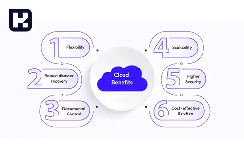

<blockquote class="faq-block">

  
آنچه در این مطلب خواهید خواند:

  <ul>
    <li>مزایای نرم‌افزارهای مالی ابری و تحت وب</li>
    <ul>
      <li>امنیت در ذخیره‌سازی داده‌ها</li>
      <li>دسترسی آسان</li>
      <li>کاهش هزینه‌ها</li>
      <li>به‌روزرسانی اتوماتیک</li>
      <li>تمرکز و یکپارچگی فرآیندها</li>
      <li>قابلیت مقیاس‌پذیری و انعطاف‌پذیری</li>
      <li>تجزیه‌وتحلیل و گزارش‌گیری سریع</li>
    </ul>
    <li>سؤالات متداول</li>
    <li>جمع‌بندی</li>
  </ul>

</blockquote> 

در دنیای امروز، مدیریت امور مالی کسب‌وکارها بدون استفاده از ابزارهای دیجیتال تقریباً غیرممکن شده است. نرم‌افزارهای مالی مبتنی بر فضای ابری و تحت وب، با ارائه دسترسی آسان، امنیت بالا و امکانات یکپارچه، به کسب‌وکارها کمک می‌کنند تا فرآیندهای مالی خود را سریع‌تر، دقیق‌تر و کم‌هزینه‌تر انجام دهند. در این مقاله با مزایای اصلی این نرم‌افزارها آشنا می‌شویم و نشان می‌دهیم چگونه می‌توانند عملکرد مالی سازمان‌ها را بهبود بخشند.

## مزایای نرم‌افزارهای مالی ابری و تحت وب

### 1. امنیت در ذخیره‌سازی داده‌ها

نرم‌افزارهای مالی ابری نسبت به سیستم‌های سنتی مبتنی بر ویندوز یا کاغذ، امنیت بسیار بالاتری دارند. ارائه‌دهندگان این خدمات داده‌ها را در سرورهای متعدد و پراکنده ذخیره می‌کنند، بنابراین احتمال از دست رفتن اطلاعات یا حملات سایبری به شدت کاهش می‌یابد. استفاده از این فناوری همچنین از آسیب‌های ناشی از بلایای طبیعی محافظت می‌کند و امکان بازیابی سریع اطلاعات را فراهم می‌سازد.

### 2. دسترسی آسان

با استفاده از نرم‌افزارهای حسابداری ابری، کاربران می‌توانند از هر مکان و در هر زمان به اطلاعات مالی دسترسی داشته باشند. این قابلیت برای شرکت‌های چندمکانه یا کارکنانی که به صورت دورکاری فعالیت می‌کنند، بسیار ارزشمند است و باعث افزایش انعطاف‌پذیری و بهره‌وری می‌شود.

### 3. کاهش هزینه‌ها

استفاده از نرم‌افزارهای مالی ابری و تحت وب باعث کاهش هزینه‌های خرید، نصب و نگهداری نرم‌افزار می‌شود. هزینه‌های مرتبط با به‌روزرسانی و پشتیبانی نیز به طور چشمگیری کاهش پیدا می‌کند، زیرا این فرآیندها به صورت مرکزی و خودکار توسط ارائه‌دهنده خدمات مدیریت می‌شوند.

### 4. به‌روزرسانی خودکار

نرم‌افزارهای ابری معمولاً دارای به‌روزرسانی خودکار هستند، بنابراین کاربران همواره از آخرین نسخه نرم‌افزار و امکانات جدید بهره‌مند می‌شوند. این ویژگی موجب کاهش خطاهای نرم‌افزاری و افزایش کارایی در مدیریت امور مالی می‌شود.

### 5. تمرکز و یکپارچگی فرآیندها

این نرم‌افزارها مجموعه‌ای کامل از امکانات حسابداری مانند مدیریت تراکنش‌ها، پردازش فاکتورها، مدیریت حقوق و دستمزد و تأیید گردش کاری ارائه می‌دهند. این تمرکز باعث می‌شود که تمامی فرآیندهای مالی در یک پلتفرم واحد و یکپارچه انجام شود و نیاز به استفاده از ابزارهای جداگانه کاهش یابد.

### 6. قابلیت مقیاس‌پذیری و انعطاف‌پذیری

یکی از مزایای کلیدی نرم‌افزارهای ابری، امکان مقیاس‌پذیری است. شرکت‌ها می‌توانند به راحتی تعداد کاربران یا حجم داده‌ها را افزایش دهند بدون اینکه نیاز به تغییر سخت‌افزار یا نصب نرم‌افزار جدید باشد. این ویژگی برای کسب‌وکارهای در حال رشد بسیار حیاتی است.

### 7. تجزیه‌وتحلیل و گزارش‌گیری سریع

نرم‌افزارهای مالی ابری امکانات گزارش‌گیری پیشرفته و تجزیه‌وتحلیل داده‌ها را فراهم می‌کنند. با استفاده از داشبوردهای مدیریتی و گزارش‌های تحلیلی، مدیران می‌توانند عملکرد مالی شرکت را به صورت دقیق بررسی کرده و تصمیمات بهتری اتخاذ کنند.

---

### سؤالات متداول

<blockquote class="faq-block">
  

    
چرا نرم‌افزارهای مالی ابری برای کسب‌وکارها مناسب هستند؟
 
    این نرم‌افزارها امکان دسترسی از هر مکان، امنیت بالا و کاهش هزینه‌های نگهداری را فراهم می‌کنند و مدیریت فرآیندهای مالی را ساده‌تر و سریع‌تر می‌کنند.
  

</blockquote>

<blockquote class="faq-block">
  

    
آیا استفاده از نرم‌افزارهای ابری امنیت اطلاعات را تضمین می‌کند؟
 
    ارائه‌دهندگان خدمات ابری از چندین سرور پراکنده و سیستم‌های رمزنگاری برای حفاظت از اطلاعات استفاده می‌کنند، بنابراین امنیت داده‌ها به شکل قابل توجهی افزایش می‌یابد.
  

</blockquote>

<blockquote class="faq-block">
  

    
آیا نرم‌افزارهای مالی ابری مناسب کسب‌وکارهای کوچک هم هستند؟
 
    بله، این نرم‌افزارها با هزینه کمتر، نصب سریع و قابلیت مقیاس‌پذیری، گزینه‌ای مناسب برای کسب‌وکارهای کوچک و متوسط هستند.
  

</blockquote>

---

### جمع‌بندی

نرم‌افزارهای مالی ابری و تحت وب با ارائه امنیت بالا، دسترسی آسان، کاهش هزینه‌ها و امکانات یکپارچه، ابزار قدرتمندی برای مدیریت مالی کسب‌وکارها هستند. استفاده از این فناوری نه تنها باعث افزایش بهره‌وری و دقت در مدیریت امور مالی می‌شود، بلکه امکان مقیاس‌پذیری و تحلیل سریع داده‌ها را نیز فراهم می‌کند.