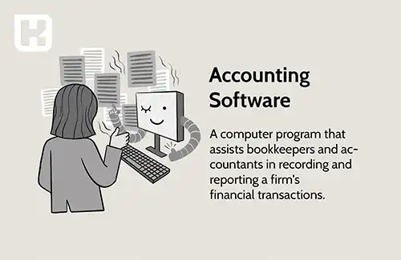

<blockquote style="background-color:#eeeefc; padding:0.5rem">

  
آنچه در این مطلب خواهید خواند:

  <ul>
    <li>تفاوت نرم‌افزارهای حسابداری</li>
    <ul>
     <li>براساس دانش حسابداری طبق بازار هدف</li>
     <li>براساس ویژگی‌ها و قابلیت‌های کلیدی هر نرم‌افزار</li>
     <li>براساس تجربه کاربری و رابط کاربری هر نرم‌افزار</li>
    </ul>
    <li>نتیجه‌گیری</li>
  </ul>

</blockquote>

در دنیای امروز، استفاده از نرم افزارهای حسابداری برای مدیریت مالی و حسابداری کسب و کارها امری ضروری و اساسی شده است. با وجود تنوع گسترده این نرم افزارها، پیش آمده است که چگونه می‌توانیم بین آنها تفاوت‌ها و ویژگی‌های منحصر به فرد را شناسایی کنیم.

- امروز می‌خواهیم با موضوع جذاب  مقایسه 3 تا از بهترین نرم افزار های حسابداری مطرح در خدمتتون باشیم.

- بارها این سوال پیش آمده که نرم افزارهای حسابداری با همدیگر چه فرقی دارند؟

- آیا نیاز است که تمام نرم افزارهای حسابداری را یاد بگیریم؟

- آیا با قابلیت‌های یکی از آنها آشنا باشیم می‌توانیم با بقیه نرم افزارهای حسابداری هم کار کنیم؟

- آیا این نرم افزارها خیلی بهم شبیه هستند یا نه تفاوت زیادی باهم دارند؟

 این مقاله به معرفی و مقایسه‌ی سه نرم افزار حسابداری برتر پرداخته و تفاوت‌ها، ویژگی‌ها و تجربه کاربری آنها را بررسی می‌کند.

<blockquote style="background-color:#f5f5f5; padding:0.5rem">

<strong>آشنایی با <a href="https://www.hooshkar.com/Software/Sayan/Module/Accounting" target="_blank">نرم افزار حسابداری</a> سایان</strong>
</blockquote>

## تفاوت نرم افزار های حسابداری

### 1. براساس دانش حسابداری طبق بازار هدف

**- نرم افزار هلو** نیازمند سطح پایینی از دانش حسابداری می‌باشد حتی بدون نیاز به دانش حسابداری هم می‌توان با این نرم افزار کار کرد. در واقع کدینگ ها بصورت پیش فرض در این نرم افزار تعریف شده است.

**- نرم افزار سپیدار** سطح متوسطه از دانش حسابداری را می‌طلبد. در نرم افزار سپیدار باید بصورت دستی کدینگ متناسب با فعالیت شرکتتان را تعریف نمایید.

**- <a href="https://www.hooshkar.com/Software/Sayan" target="_blank">نرم افزار سایان</a>** علاوه بر قابلیت انعطاف پذیری دارای رابط کاربری ساده‌ای است که جهت استفاده از آن نیازمند دانش حسابداری متوسطه رو به بالا می‌باشد.
در این نرم افزار باید به ترتیب گروه حساب‌ها، کل، معین و تفصیل را تعریف نموده و سپس ارتباط تفصیل با معین را تعریف کنید.

### 2. براساس ویژگی ها و قابلیت های کلیدی هر نرم افزار

- در **نرم افزار هلو** امکاناتی نظیر صدور سند، صدور فاکتور و گزارشات مختلفی در آن گنجانده شده است. اما این امکانات به صورت جامع وجود ندارد.

- در حالیکه در **نرم افزار سپیدار** ماژول‌هایی در نظر گرفته شده تا کاربری راحت تری برای شما داشته باشد.

به فرض در بخش حسابداری، امور حسابداری خودتان را از مرحله کدینگ حسابداری تا عملیات صدور سند افتتاحیه و اختتامیه بصورت کامل می‌توانید انجام دهید. 

ماژول‌های دیگری نظیر مشتریان و فروش، دریافت پرداخت و حقوق دستمزد که اهمیت آن بر همگان مشخص است که چنین ماژول‌هایی را در سیستم هلو مشاهده نخواهیم کرد. 

تمام این موارد به بازار هدفی که آن شرکت‌ها برای تولید نرم افزارهای مالی شان در نظر گرفته‌اند بر می‌گردد.

- در **نرم افزار سایان**، ماژول‌های حسابداری و امور مالی بصورت جامع ارائه شده است که با توجه به نیاز کسب و کارهای مختلف امکان سفارشی سازی در آن وجود دارد. 

در این نرم افزار علاوه بر امکاناتی نظیر کدینگ‌های خاص، سفارشی سازی نرم افزار، امکان دریافت خروجی‌هایی مانند گزارشات بیمه، خرید و فروش فصلی، مالیات، صورت‌های مالی را نیز می‌توانیم داشته باشیم.

### 3. براساس تجربه کاربری و رابط کاربری هر نرم افزار

- در **نرم افزار هلو** سطح تفصیلی یک سطحی آنهم از نوع ثابت می‌باشد.

- در **نرم افزار سپیدار** سطح تفصیلی از نوع شناور است اما یک سطح تفصیل با کد یونیک داریم

- در **نرم افزار سایان** سطح تفصیلی شناور با سطوح نامحدود می‌باشد.

#### نتیجه گیری
بنابراین برای انتخاب بهترین نرم افزار حسابداری
فرقی ندارد که اندازه کسب و کار شما چقدر است؟ 
کوچک یا بزرگ، هر یک از این نرم افزارها در انواع مختلف و با توجه به مشاغل گوناگون در دسترس هستند. 

بنابراین با توجه به صنف کاری، امکاناتی که از برنامه انتظار دارید، اهداف و محدوده قیمتی مدنظرتان، دامنه انتخابی متنوعی در هر سه کمپانی برای شما فراهم شده است.